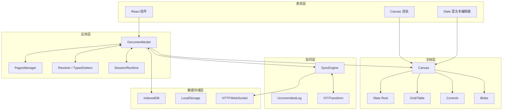
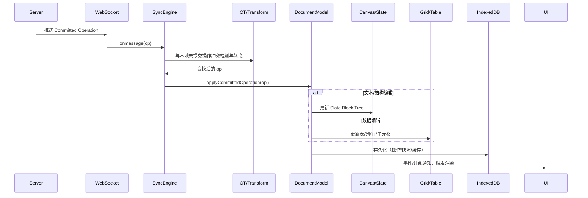
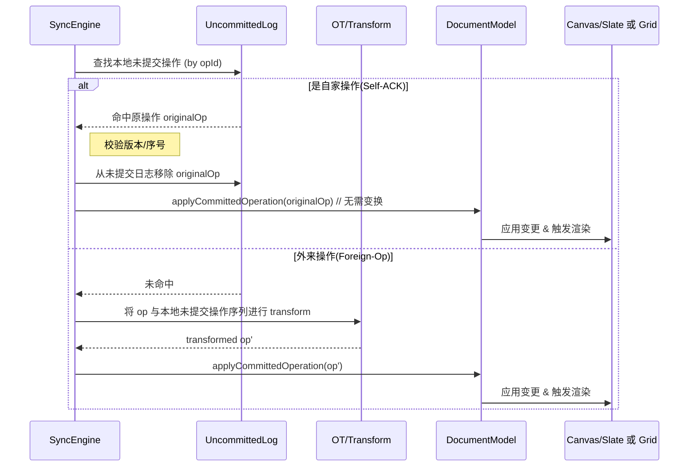
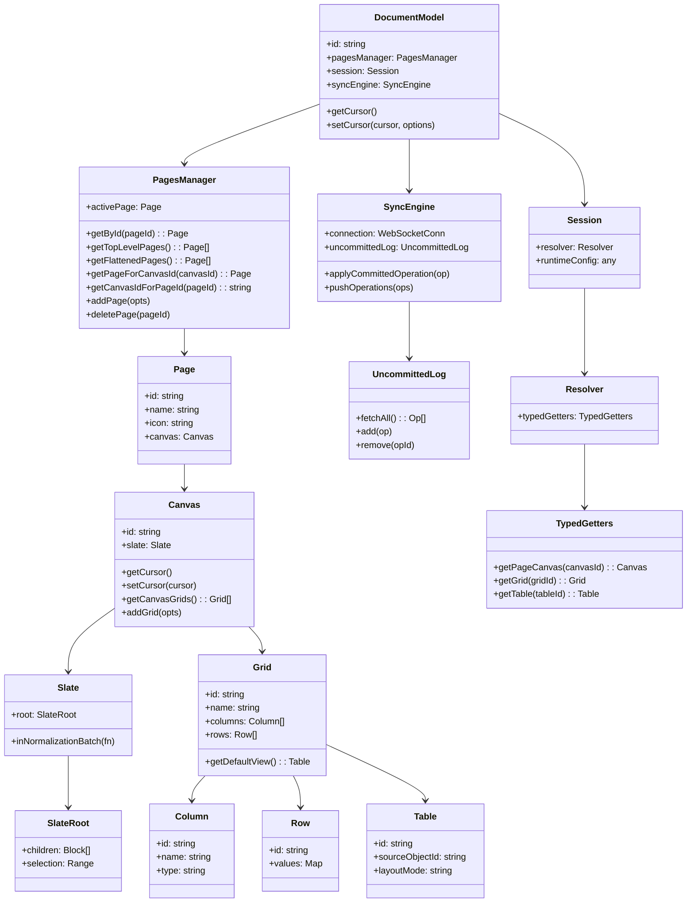

## Coda 架构与数据模型概览

本文面向开发者，系统性介绍 Coda 的整体架构、数据模型、协同消息应用流程，并附带可运行于文档内的 Mermaid UML/流程图，帮助快速理解从服务器到本地 `documentModel` 的全链路机制。

### 目录
- 架构总览（分层说明 + 架构图）
- 数据模型（Canvas、Slate、Grid/Table 等）
- 协同消息如何应用到 `documentModel`（步骤 + 时序图）
- `documentModel` UML 类图
- 调试与开发建议

---

## 架构总览

### 分层模型



架构要点：
- 表现层通过编辑器与渲染器直接驱动 Canvas/Slate。
- 应用层的 `documentModel` 作为中心模型，统一协调页面、解析器、会话状态。
- 协同层处理远端操作的接收、转换（OT）与提交，确保并发一致。
- 文档层封装了实际内容载体：页面画布（PageCanvas）、单元格画布（CellCanvas）、表格（Grid/Table）、控件（Control）、二进制（Blob）。
- 存储层以 IndexedDB 为主，落地未提交操作、快照、缓存等。

---

## 数据模型

### 关键实体
- DocumentModel：文档全局模型，统一管理页面、同步、解析器与游标。
- PagesManager：页面树与当前活动页面的管理；页面与画布（PageCanvas）一一对应。
- Canvas：内容容器，分为 PageCanvas 与 CellCanvas；每个 Canvas 拥有一个 Slate 文档（富文本树）。
- Slate：富文本/对象树（Block Tree），包含段落、标题、列表、表格占位、内联协作对象等节点。
- Grid/Table：数据表及其视图；列（Column）、行（Row）、单元格（CellStorage）等。
- Control/Blob：控件与二进制对象（图片、附件等），可内联或块级展示。

### 典型 JSON 示例（精简）

```json
{
  "documentModel": {
    "id": "doc-001",
    "pagesManager": {
      "activePage": {
        "id": "page-001",
        "name": "简介",
        "canvas": {
          "id": "canvas-001",
          "slate": {
            "root": {
              "children": [
                {
                  "type": "paragraph",
                  "id": "node-p1",
                  "children": [{ "text": "欢迎使用 Coda。" }]
                },
                {
                  "type": "heading",
                  "level": 2,
                  "id": "node-h1",
                  "children": [{ "text": "数据表示例" }]
                },
                {
                  "type": "table",
                  "id": "grid-123",
                  "gridId": "grid-123",
                  "children": []
                },
                {
                  "type": "InlineCollaborativeObject",
                  "id": "ctrl-formula-456",
                  "children": [{ "text": "" }]
                }
              ],
              "selection": {
                "anchor": { "path": [0, 0], "offset": 0 },
                "focus": { "path": [0, 0], "offset": 5 }
              }
            }
          }
        }
      }
    },
    "session": {
      "resolver": {
        "typedGetters": {
          "getPageCanvas": "fn(canvasId) => PageCanvas",
          "getGrid": "fn(gridId) => Grid",
          "getTable": "fn(tableId) => Table"
        }
      }
    },
    "syncEngine": {
      "uncommittedLog": { "size": 0 },
      "connection": { "state": "open" }
    }
  },
  "grids": {
    "grid-123": {
      "name": "Tasks",
      "columns": [
        { "id": "col-title", "name": "Title", "type": "Text" },
        { "id": "col-done", "name": "Done", "type": "Checkbox" }
      ],
      "rows": [
        { "id": "row-1", "values": { "col-title": "Set up", "col-done": false } },
        { "id": "row-2", "values": { "col-title": "Build",  "col-done": false } }
      ]
    }
  }
}
```

说明：
- Slate 的 `root.children` 是 Block Tree 的直接体现；`paragraph`、`heading`、`table`、`InlineCollaborativeObject` 等为节点类型。
- `table` 节点通过 `gridId` 关联到结构化数据层（Grid）。
- `InlineCollaborativeObject` 是可交互的内联对象（如按钮、公式、图片等），以 `id` 引用实际对象模型。

---

## 协同消息如何应用到 documentModel

### 核心流程（概要）
1. 远端服务通过 WebSocket 下发已提交的操作（committed operation）。
2. 客户端 SyncEngine 收到操作，按版本与来源分类；若与本地未提交操作冲突，先经 OT/Transform 转换。
3. 将转换后的操作传递给 `documentModel.applyCommittedOperation`（或等价内部流程）。
4. `documentModel` 更新对应模型：
   - 若是文本/结构操作：通过 Canvas/Slate 应用到 Block Tree。
   - 若是数据操作：更新 Grid/Table/Row/CellStorage。
5. 写入本地存储（IndexedDB）用于恢复与离线；触发变更事件驱动 UI 重新渲染。

### 时序图



### 关键点
- OT 确保并发下的最终一致性；自己的操作被服务端回执时，走自确认（Self-ACK）路径从本地未提交日志移除。
- Slate 修改需在 normalization 批次内执行，避免中间态破坏树的不变量。
- Grid/Table 更新与视图联动：源 Grid 的更改会反映到各视图（Table）。

### 自确认（Self-ACK）与外来操作（Foreign-Op）细化



伪代码示例（简化）：

```ts
function onRemoteCommittedOp(op: Operation) {
  const original = uncommittedLog.findByOpId(op.opId);
  if (original) {
    uncommittedLog.remove(op.opId);
    documentModel.applyCommittedOperation(original);
    return;
  }
  const transformed = transformAgainstUncommitted(op, uncommittedLog.all());
  documentModel.applyCommittedOperation(transformed);
}
```

---

## documentModel UML 类图



说明：
- `DocumentModel` 是中心；`PagesManager` 组织页面，`Session.Resolver` 提供强类型访问器以按 ID 获取对象。
- `Canvas` 同时承载富文本（Slate）与对象占位（表、控件、图片等）。
- `SyncEngine` 负责与网络交互与本地未提交日志管理。

---

## Operation 数据结构（示例）

```json
{
  "opId": "op-2b1d",
  "version": 12346,
  "appInstanceId": "client-xyz",
  "type": "SLATE_INSERT_NODE",
  "timestamp": 1710000000123,
  "data": {
    "path": [2],
    "node": {
      "type": "paragraph",
      "id": "node-new",
      "children": [{ "text": "Hello" }]
    }
  }
}
```

常见操作类别：
- Slate 文本/结构：`SLATE_INSERT_NODE`、`SLATE_REMOVE_NODE`、`INSERT_TEXT`、`REMOVE_TEXT` 等。
- 表格数据：`BULK_ADD_ROWS`、`BULK_MODIFY_ROW_VALUE`、`DELETE_ROWS` 等。
- 控件/对象：创建、变更属性、移动、删除等。

应用映射：
- Slate 类操作 → `canvas.slate.inNormalizationBatch` 包裹修改 `root`。
- 表格类操作 → 修改 `Grid.rows/columns/cellStorage`，并同步到相关视图（`Table`）。

---

## Block 类型速查表（精要）

| 类别 | 代表类型 | 说明 |
|---|---|---|
| 容器 | CodeBlock, Table, ColumnGroup | 可包含子节点，承载特定语义（代码、表格、列组） |
| 行级 | Paragraph, Heading1/2/3, BulletedList, NumberedList, CheckboxList, BlockQuote | 文本行与列表行 |
| 内联 | InlineStructuredValue, InlineCollaborativeObject, Image, Text | 行内对象与文本 |

提示：`InlineCollaborativeObject` 表示内联的可交互协作对象（按钮、公式、图片等），`InlineStructuredValue` 表示内联的结构化值（@人员、链接、对象引用等）。

---

## InlineCollaborativeObject vs InlineStructuredValue

| 项 | InlineCollaborativeObject | InlineStructuredValue |
|---|---|---|
| 定位 | 内联可交互对象 | 内联静态结构化值 |
| 典型 | 按钮、公式、图片 | @人员、超链接、对象引用 |
| 数据 | 通过 id 引用对象模型 | 值内包含结构化数据 |
| 行为 | 可点击/编辑/运行 | 只读展示（通常） |

示例（插入一个按钮控件到当前光标）：

```js
const canvas = window.coda.documentModel.pagesManager.activePage.canvas;
const buttonId = "ctrl-button-123"; // 假定已创建
canvas.slate.inNormalizationBatch((editor) => {
  const nodes = [
    Slate.ib.createEmptyTextNode(),
    Slate.ib.createInlineCollaborativeObjectNode(buttonId),
    Slate.ib.createEmptyTextNode()
  ];
  Slate.ib.insertInlineNodesAtCursor(editor, nodes, editor.root.selection);
});
```

---

## 存储与恢复（概要）

- IndexedDB：
  - 未提交操作（UncommittedLog）
  - 运行时缓存/片段/快照（视具体实现与版本）
- LocalStorage：轻量配置、开关位、最近访问等
- 恢复流程：
  1) 读取 IndexedDB 中的未提交操作与必要缓存
  2) 初始化 `documentModel` 与页面结构
  3) 建立连接后回放/对齐远端版本（必要时进行 transform）

---

## 控制台调试脚本（合集）

列出页面内所有内联协作对象：

```js
const dm = window.coda.documentModel;
const canvas = dm.pagesManager.activePage.canvas;
const root = canvas.slate.root;
const hits = [];
for (const [node, path] of Slate.ib.filterNodesInDocument(root, Slate.ib.nodeIsInlineCollaborativeObject)) {
  const model = dm.session.resolver.tryGetModel(node.id);
  hits.push({ id: node.id, path, type: model?.type, name: model?.name });
}
console.table(hits);
``;

插入一个段落：

```js
const c = window.coda.documentModel.pagesManager.activePage.canvas;
c.slate.inNormalizationBatch((editor) => {
  const p = Slate.ib.createLineNode(Slate.Uj.Paragraph, { children: [ Slate.ib.createTextNode({ text: "Hello Coda" }) ] });
  Slate.ib.insertBlockElementsAtPath(editor, [p], editor.root.children.length);
});
```

---

## 一致性约束与最佳实践

- 一切 Slate 结构性修改使用 `inNormalizationBatch` 包裹。
- 处理远端操作前，先与本地未提交操作做 transform；自确认操作要及时从未提交日志移除。
- 表格数据修改优先通过模型 API（如 `bulkModifyRows`），避免直接越层操作存储。
- 大块导入/粘贴应分批次提交，减小渲染与同步压力。


## 调试与开发建议

### 在浏览器控制台探索
```js
// 当前文档模型
window.coda?.documentModel

// 当前页面画布与其 Slate 根
const canvas = window.coda?.documentModel?.pagesManager?.activePage?.canvas;
canvas?.slate?.root

// 列出画布上的表格(Grid)
canvas?.getCanvasGrids?.()

// 通过 Resolver 获取对象
const grid = window.coda?.documentModel?.session?.resolver?.typedGetters?.getGrid('<gridId>');
```

### 编辑器内的安全修改
- 对 Slate 的任何批量结构变更，使用 `slate.inNormalizationBatch(fn)` 包裹，避免中间态破坏树结构。
- 表格/行/列的修改通过对应模型 API 进行，确保视图（Table）正确联动。

---

## 附录：名词对照
- PageCanvas：页面级画布；CellCanvas：表格单元格内的画布。
- InlineCollaborativeObject：内联协作对象（按钮、公式、图片等）。
- OT（Operational Transformation）：并发编辑冲突转换算法。

