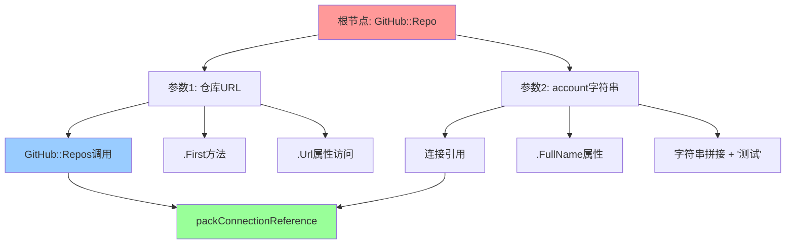

# Coda 复杂 Pack Formula 执行流程深度解析

## 用户公式案例分析

让我们深入分析用户提供的这个复杂 GitHub Pack 公式的完整执行流程：

```javascript
$$[pack:1013:::false:false:GitHub]::Repo($$[pack:1013:::false:false:GitHub]::Repos($$[packConnectionReference:8e11cd1b-c2e1-4306-9dac-0bd95ecd5084:1013:85.0.7:false:false:hereisfun]).First().$$[variable::::true:false:Url], account: $$[packConnectionReference:8e11cd1b-c2e1-4306-9dac-0bd95ecd5084:1013:85.0.7:false:false:hereisfun]).$$[variable::::true:false:FullName] + '测试'
```

## 公式结构拆解

### 1. 语法元素识别

这个公式包含了 Coda Pack 系统的几乎所有核心语法元素：

#### **Pack 函数调用语法**
```typescript
// 格式：$$[pack:packId:::param1:param2:packName]::FunctionName(...)
{
  prefix: "$$[pack:",
  packId: 1013,                    // GitHub Pack ID
  separator: ":::",
  parameters: ["false", "false", "GitHub"],  // Pack 参数
  functionCall: "::Repo(...)"      // 函数调用
}
```

#### **Pack 连接引用语法**
```typescript
// 格式：$$[packConnectionReference:connectionId:packId:version:flags:connectionName]
{
  prefix: "$$[packConnectionReference:",
  connectionId: "8e11cd1b-c2e1-4306-9dac-0bd95ecd5084",  // 用户连接 UUID
  packId: 1013,                    // GitHub Pack
  version: "85.0.7",               // Pack 版本
  flags: ["false", "false"],       // 连接标志
  connectionName: "hereisfun"      // 用户定义的连接名
}
```

#### **变量访问语法**
```typescript
// 格式：$$[variable::::flags:propertyName]
{
  prefix: "$$[variable::::",
  flags: ["true", "false"],        // 变量标志 [isDynamic, isOptional]
  propertyName: "Url" | "FullName" // 访问的属性名
}
```

### 2. 公式层次结构



### 3. 详细执行时序分析

#### **Phase 1: 语法解析阶段**

```typescript
class CodaFormulaParser {
  parseComplexFormula(formula: string): ExecutionPlan {
    // 1. 词法分析 - 识别所有语法元素
    const tokens = this.tokenize(formula);
    
    // 2. 语法分析 - 构建 AST
    const ast = this.parse(tokens);
    
    // 3. 依赖分析 - 识别执行顺序
    const dependencies = this.analyzeDependencies(ast);
    
    // 4. 执行计划 - 生成执行流水线
    return this.createExecutionPlan(ast, dependencies);
  }
  
  private analyzeDependencies(ast: ASTNode): DependencyGraph {
    const graph = new DependencyGraph();
    
    // 分析我们的公式，发现以下依赖关系：
    // 1. GitHub::Repo 依赖于其两个参数
    // 2. 第一个参数(URL)依赖于：GitHub::Repos().First().Url
    // 3. 第二个参数(account)依赖于：connection.FullName + '测试'
    // 4. GitHub::Repos 依赖于 packConnectionReference
    // 5. connection.FullName 也依赖于 packConnectionReference
    
    graph.addNode('connection_resolve', { type: 'connection' });
    graph.addNode('github_repos', { type: 'pack_function', depends: ['connection_resolve'] });
    graph.addNode('first_repo_url', { type: 'property_access', depends: ['github_repos'] });
    graph.addNode('connection_fullname', { type: 'property_access', depends: ['connection_resolve'] });
    graph.addNode('account_concat', { type: 'string_operation', depends: ['connection_fullname'] });
    graph.addNode('github_repo', { type: 'pack_function', depends: ['first_repo_url', 'account_concat'] });
    
    return graph;
  }
}
```

#### **Phase 2: 连接解析阶段**

```typescript
class PackConnectionResolver {
  async resolveConnection(connectionRef: PackConnectionReference): Promise<GitHubConnection> {
    const {
      connectionId,
      packId,
      version,
      connectionName
    } = connectionRef;
    
    // 1. 从连接存储中获取连接实例
    let connection = await this.connectionStore.get(connectionId);
    
    if (!connection) {
      throw new PackError(`Connection ${connectionName} (${connectionId}) not found`);
    }
    
    // 2. 验证连接是否匹配指定的 Pack
    if (connection.packId !== packId) {
      throw new PackError(`Connection pack mismatch: expected ${packId}, got ${connection.packId}`);
    }
    
    // 3. 检查版本兼容性
    if (!this.isVersionCompatible(connection.packVersion, version)) {
      console.warn(`Pack version mismatch: connection uses ${connection.packVersion}, formula expects ${version}`);
    }
    
    // 4. 验证令牌有效性
    if (this.isTokenExpired(connection)) {
      connection = await this.refreshConnection(connection);
    }
    
    // 5. 检查权限和配额
    await this.validatePermissions(connection, ['repo', 'user']);
    await this.checkRateLimit(connection);
    
    return connection;
  }
  
  private async refreshConnection(connection: GitHubConnection): Promise<GitHubConnection> {
    try {
      const tokenResponse = await fetch('https://github.com/login/oauth/access_token', {
        method: 'POST',
        headers: {
          'Accept': 'application/json',
          'Content-Type': 'application/x-www-form-urlencoded'
        },
        body: new URLSearchParams({
          client_id: this.clientId,
          client_secret: this.clientSecret,
          refresh_token: connection.refreshToken,
          grant_type: 'refresh_token'
        })
      });
      
      const tokens = await tokenResponse.json();
      
      // 更新连接信息
      connection.accessToken = tokens.access_token;
      connection.expiresAt = Date.now() + (tokens.expires_in * 1000);
      connection.updatedAt = new Date();
      
      // 保存到存储
      await this.connectionStore.update(connection);
      
      return connection;
    } catch (error) {
      throw new PackError(`Failed to refresh GitHub connection: ${error.message}`);
    }
  }
}
```

#### **Phase 3: Pack 函数执行阶段**

**3.1 GitHub::Repos() 函数执行**

```typescript
class GitHubReposFunction implements PackFunction {
  async execute(
    args: any[], 
    connection: GitHubConnection,
    context: ExecutionContext
  ): Promise<Repository[]> {
    
    // 1. 构建 GitHub API 客户端
    const apiClient = new GitHubApiClient({
      baseURL: 'https://api.github.com',
      headers: {
        'Authorization': `Bearer ${connection.accessToken}`,
        'Accept': 'application/vnd.github.v3+json',
        'User-Agent': 'Coda-Pack/1.0'
      }
    });
    
    // 2. 检查结果缓存
    const cacheKey = `github:repos:${connection.userId}:${Date.now() - (Date.now() % 300000)}`; // 5分钟缓存窗口
    const cached = await context.cache.get(cacheKey);
    if (cached) {
      console.log('GitHub::Repos cache hit');
      return cached;
    }
    
    try {
      // 3. 调用 GitHub API
      const response = await apiClient.get('/user/repos', {
        params: {
          sort: 'updated',
          direction: 'desc',
          per_page: 100,
          type: 'all'
        }
      });
      
      // 4. 数据转换和规范化
      const repositories = response.data.map((repo: any) => ({
        id: repo.id,
        name: repo.name,
        fullName: repo.full_name,
        url: repo.html_url,
        description: repo.description || '',
        isPrivate: repo.private,
        starCount: repo.stargazers_count,
        forkCount: repo.forks_count,
        language: repo.language,
        createdAt: new Date(repo.created_at),
        updatedAt: new Date(repo.updated_at),
        pushedAt: repo.pushed_at ? new Date(repo.pushed_at) : null,
        
        // Coda 特有的对象属性
        _type: 'Repository',
        _source: 'GitHub',
        _connection: connection.id
      }));
      
      // 5. 缓存结果
      await context.cache.set(cacheKey, repositories, 300); // 缓存5分钟
      
      // 6. 记录指标
      context.metrics.recordPackFunctionCall({
        packId: 1013,
        functionName: 'Repos',
        duration: Date.now() - context.startTime,
        resultCount: repositories.length,
        cacheHit: false
      });
      
      return repositories;
      
    } catch (error) {
      // 错误处理和重试逻辑
      if (error.response?.status === 403 && error.response?.headers['x-ratelimit-remaining'] === '0') {
        const resetTime = parseInt(error.response.headers['x-ratelimit-reset']) * 1000;
        const waitTime = resetTime - Date.now();
        
        throw new RateLimitError(`GitHub API rate limit exceeded. Reset in ${Math.ceil(waitTime / 1000)}s`, waitTime);
      }
      
      if (error.response?.status === 401) {
        throw new AuthenticationError('GitHub access token expired or invalid');
      }
      
      throw new PackExecutionError(`GitHub::Repos failed: ${error.message}`, error);
    }
  }
}
```

**3.2 .First() 方法和 .Url 属性访问**

```typescript
class PropertyAccessHandler {
  async handleChainedAccess(
    baseValue: any[],
    accessChain: PropertyAccess[]
  ): Promise<any> {
    let currentValue = baseValue;
    
    for (const access of accessChain) {
      switch (access.type) {
        case 'method_call':
          currentValue = await this.executeMethod(currentValue, access);
          break;
          
        case 'property_access':
          currentValue = this.getProperty(currentValue, access.propertyName);
          break;
          
        case 'variable_access':
          currentValue = await this.resolveVariable(currentValue, access);
          break;
      }
    }
    
    return currentValue;
  }
  
  private async executeMethod(value: any[], method: MethodCall): Promise<any> {
    switch (method.name) {
      case 'First':
        if (!Array.isArray(value) || value.length === 0) {
          throw new ExecutionError('Cannot call First() on empty array');
        }
        return value[0];
        
      case 'Last':
        if (!Array.isArray(value) || value.length === 0) {
          throw new ExecutionError('Cannot call Last() on empty array');
        }
        return value[value.length - 1];
        
      case 'Filter':
        // 处理过滤逻辑...
        break;
        
      default:
        throw new ExecutionError(`Unknown method: ${method.name}`);
    }
  }
  
  private async resolveVariable(
    baseObject: any, 
    variableAccess: VariableAccess
  ): Promise<any> {
    const { flags, propertyName } = variableAccess;
    const [isDynamic, isOptional] = flags;
    
    try {
      // 如果是动态访问，可能需要运行时解析属性名
      const actualPropertyName = isDynamic 
        ? await this.resolveDynamicPropertyName(propertyName)
        : propertyName;
      
      const value = baseObject[actualPropertyName];
      
      // 如果属性不存在且不是可选的，抛出错误
      if (value === undefined && !isOptional) {
        throw new PropertyAccessError(`Property ${actualPropertyName} not found on object`);
      }
      
      return value;
      
    } catch (error) {
      if (isOptional) {
        return null; // 可选属性访问失败时返回 null
      }
      throw error;
    }
  }
}

// 对于我们的例子：GitHub::Repos().First().Url
const reposResult = await githubReposFunction.execute([], connection, context);
// reposResult = [
//   { id: 1, name: 'my-repo', url: 'https://github.com/user/my-repo', ... },
//   { id: 2, name: 'other-repo', url: 'https://github.com/user/other-repo', ... },
//   ...
// ]

const firstRepo = reposResult[0]; // First() 方法
// firstRepo = { id: 1, name: 'my-repo', url: 'https://github.com/user/my-repo', ... }

const repoUrl = firstRepo.url; // 通过 $$[variable::::true:false:Url] 访问
// repoUrl = 'https://github.com/user/my-repo'
```

**3.3 账户信息和字符串拼接**

```typescript
class StringOperationHandler {
  async handleConcatenation(
    left: any,
    right: any,
    operator: '+' | 'concat'
  ): Promise<string> {
    // 1. 类型转换
    const leftStr = this.convertToString(left);
    const rightStr = this.convertToString(right);
    
    // 2. 执行拼接
    const result = leftStr + rightStr;
    
    // 3. 长度限制检查
    if (result.length > this.maxStringLength) {
      throw new StringTooLongError(`Result string exceeds maximum length (${this.maxStringLength})`);
    }
    
    return result;
  }
  
  private convertToString(value: any): string {
    if (value === null || value === undefined) {
      return '';
    }
    
    if (typeof value === 'string') {
      return value;
    }
    
    if (typeof value === 'number') {
      return value.toString();
    }
    
    if (typeof value === 'boolean') {
      return value ? 'true' : 'false';
    }
    
    if (value instanceof Date) {
      return value.toISOString();
    }
    
    if (typeof value === 'object') {
      return JSON.stringify(value);
    }
    
    return String(value);
  }
}

// 对于我们的例子：connection.FullName + '测试'
const connectionFullName = connection.fullName; // 如 "hereisfun"  
const accountParam = connectionFullName + '测试'; // "hereisfun测试"
```

**3.4 最终的 GitHub::Repo() 函数执行**

```typescript
class GitHubRepoFunction implements PackFunction {
  async execute(
    args: [string, string?], // [url, account]
    connection: GitHubConnection,
    context: ExecutionContext
  ): Promise<RepositoryDetail> {
    
    const [repoUrl, account] = args;
    
    // 1. 解析仓库 URL 获取 owner 和 repo 名称
    const { owner, repo } = this.parseGitHubUrl(repoUrl);
    
    // 2. 构建 API 客户端
    const apiClient = new GitHubApiClient(connection);
    
    // 3. 检查缓存
    const cacheKey = `github:repo:${owner}:${repo}:${Date.now() - (Date.now() % 60000)}`; // 1分钟缓存
    const cached = await context.cache.get(cacheKey);
    if (cached) {
      console.log('GitHub::Repo cache hit');
      return cached;
    }
    
    try {
      // 4. 并行获取仓库信息和额外数据
      const [repoResponse, contributorsResponse, languagesResponse] = await Promise.all([
        apiClient.get(`/repos/${owner}/${repo}`),
        apiClient.get(`/repos/${owner}/${repo}/contributors`).catch(() => ({ data: [] })),
        apiClient.get(`/repos/${owner}/${repo}/languages`).catch(() => ({ data: {} }))
      ]);
      
      const repoData = repoResponse.data;
      
      // 5. 构建详细的仓库对象
      const repositoryDetail: RepositoryDetail = {
        // 基本信息
        id: repoData.id,
        name: repoData.name,
        fullName: repoData.full_name,
        description: repoData.description || '',
        
        // URLs
        url: repoData.html_url,
        cloneUrl: repoData.clone_url,
        sshUrl: repoData.ssh_url,
        
        // 统计信息
        starCount: repoData.stargazers_count,
        forkCount: repoData.forks_count,
        watcherCount: repoData.watchers_count,
        openIssuesCount: repoData.open_issues_count,
        
        // 状态信息
        isPrivate: repoData.private,
        isFork: repoData.fork,
        isArchived: repoData.archived,
        isDisabled: repoData.disabled,
        
        // 时间信息
        createdAt: new Date(repoData.created_at),
        updatedAt: new Date(repoData.updated_at),
        pushedAt: repoData.pushed_at ? new Date(repoData.pushed_at) : null,
        
        // 技术信息
        language: repoData.language,
        languages: languagesResponse.data,
        size: repoData.size,
        
        // 许可证信息
        license: repoData.license ? {
          key: repoData.license.key,
          name: repoData.license.name,
          url: repoData.license.url
        } : null,
        
        // 贡献者信息
        contributors: contributorsResponse.data.slice(0, 10).map((contributor: any) => ({
          login: contributor.login,
          avatarUrl: contributor.avatar_url,
          contributions: contributor.contributions,
          url: contributor.html_url
        })),
        
        // 所有者信息
        owner: {
          login: repoData.owner.login,
          type: repoData.owner.type,
          avatarUrl: repoData.owner.avatar_url,
          url: repoData.owner.html_url
        },
        
        // Pack 元信息
        _type: 'RepositoryDetail',
        _source: 'GitHub',
        _connection: connection.id,
        _account: account, // 用户提供的 account 参数
        _retrievedAt: new Date()
      };
      
      // 6. 缓存结果
      await context.cache.set(cacheKey, repositoryDetail, 60);
      
      // 7. 记录指标
      context.metrics.recordPackFunctionCall({
        packId: 1013,
        functionName: 'Repo',
        duration: Date.now() - context.startTime,
        cacheHit: false,
        metadata: {
          owner,
          repo,
          account,
          isPrivate: repositoryDetail.isPrivate
        }
      });
      
      return repositoryDetail;
      
    } catch (error) {
      // 详细的错误处理
      if (error.response?.status === 404) {
        throw new NotFoundError(`Repository ${owner}/${repo} not found or not accessible`);
      }
      
      if (error.response?.status === 403) {
        if (error.response.data?.message?.includes('rate limit')) {
          throw new RateLimitError('GitHub API rate limit exceeded');
        }
        throw new PermissionError(`Access denied to repository ${owner}/${repo}`);
      }
      
      throw new PackExecutionError(`GitHub::Repo failed: ${error.message}`, error);
    }
  }
  
  private parseGitHubUrl(url: string): {owner: string, repo: string} {
    // 支持多种 GitHub URL 格式
    const patterns = [
      /github\.com\/([^\/]+)\/([^\/]+?)(?:\.git)?(?:\/)?$/,
      /github\.com\/([^\/]+)\/([^\/]+)\/(?:tree|blob|commits?)\//,
      /api\.github\.com\/repos\/([^\/]+)\/([^\/]+)/
    ];
    
    for (const pattern of patterns) {
      const match = url.match(pattern);
      if (match) {
        return {
          owner: match[1],
          repo: match[2]
        };
      }
    }
    
    throw new InvalidArgumentError(`Invalid GitHub repository URL: ${url}`);
  }
}
```

#### **Phase 4: 结果汇总和返回**

```typescript
class FormulaExecutionCoordinator {
  async executeCompleteFormula(): Promise<RepositoryDetail> {
    const executionId = uuidv4();
    const startTime = Date.now();
    
    console.log(`🚀 Starting execution of complex GitHub formula [${executionId}]`);
    
    try {
      // 1. 解析连接引用（只需要解析一次，两处都用同一个连接）
      const connection = await this.connectionResolver.resolveConnection({
        connectionId: "8e11cd1b-c2e1-4306-9dac-0bd95ecd5084",
        packId: 1013,
        version: "85.0.7",
        connectionName: "hereisfun"
      });
      
      console.log(`✅ Connection resolved: ${connection.name} (${connection.id})`);
      
      // 2. 并行执行可以并行的部分
      const [reposResult, connectionFullName] = await Promise.all([
        // GitHub::Repos(connection)
        this.packExecutor.executeFunction(1013, 'Repos', [], connection),
        // connection.FullName
        Promise.resolve(connection.fullName)
      ]);
      
      console.log(`✅ GitHub::Repos returned ${reposResult.length} repositories`);
      
      // 3. 处理链式调用: .First().Url
      const firstRepo = reposResult[0];
      if (!firstRepo) {
        throw new ExecutionError('No repositories found for the connected user');
      }
      
      const repoUrl = firstRepo.url;
      console.log(`✅ First repository URL: ${repoUrl}`);
      
      // 4. 构建 account 参数: connection.FullName + '测试'
      const accountParam = connectionFullName + '测试';
      console.log(`✅ Account parameter: ${accountParam}`);
      
      // 5. 执行最终的 GitHub::Repo 调用
      const repoDetail = await this.packExecutor.executeFunction(
        1013, 
        'Repo', 
        [repoUrl, accountParam], 
        connection
      );
      
      console.log(`✅ GitHub::Repo completed for ${repoDetail.fullName}`);
      
      // 6. 记录执行统计
      const executionTime = Date.now() - startTime;
      this.metrics.recordFormulaExecution({
        executionId,
        formulaType: 'complex_pack_formula',
        duration: executionTime,
        packCalls: 2,
        success: true
      });
      
      console.log(`🎉 Formula execution completed in ${executionTime}ms`);
      
      return repoDetail;
      
    } catch (error) {
      const executionTime = Date.now() - startTime;
      
      // 记录错误统计
      this.metrics.recordFormulaExecution({
        executionId,
        formulaType: 'complex_pack_formula', 
        duration: executionTime,
        packCalls: 0,
        success: false,
        error: error.message
      });
      
      console.error(`❌ Formula execution failed after ${executionTime}ms:`, error);
      
      // 根据错误类型提供用户友好的错误信息
      if (error instanceof ConnectionNotFoundError) {
        throw new UserFacingError('GitHub 连接未找到，请检查连接设置', error);
      }
      
      if (error instanceof RateLimitError) {
        throw new UserFacingError(`GitHub API 调用频率限制，请稍后重试`, error);
      }
      
      if (error instanceof AuthenticationError) {
        throw new UserFacingError('GitHub 认证已过期，请重新授权', error);
      }
      
      throw error;
    }
  }
}
```

## 异步执行的关键技术点

### 1. 依赖图构建和优化

```typescript
class DependencyOptimizer {
  optimizeExecutionPlan(plan: ExecutionPlan): OptimizedPlan {
    // 1. 识别可以并行执行的任务
    const parallelGroups = this.identifyParallelTasks(plan);
    
    // 2. 合并相同的 Pack 函数调用
    const deduplicatedPlan = this.deduplicatePackCalls(plan);
    
    // 3. 优化缓存策略
    const cachingPlan = this.optimizeCaching(deduplicatedPlan);
    
    return {
      ...cachingPlan,
      parallelGroups,
      estimatedDuration: this.estimateDuration(cachingPlan)
    };
  }
  
  private identifyParallelTasks(plan: ExecutionPlan): ParallelGroup[] {
    // 在我们的例子中：
    // - GitHub::Repos() 和 connection.FullName 可以并行获取
    // - 但 GitHub::Repo() 必须等待前两者完成
    
    return [
      {
        level: 0,
        tasks: ['resolve_connection']
      },
      {
        level: 1, 
        tasks: ['github_repos', 'connection_fullname'] // 可并行
      },
      {
        level: 2,
        tasks: ['first_repo_url', 'account_concat']
      },
      {
        level: 3,
        tasks: ['github_repo'] // 最终调用
      }
    ];
  }
}
```

### 2. 智能缓存策略

```typescript
class SmartCacheStrategy {
  determineStrategy(functionCall: PackFunctionCall): CacheStrategy {
    const { packId, functionName, arguments: args } = functionCall;
    
    // GitHub Pack 的缓存策略
    if (packId === 1013) {
      switch (functionName) {
        case 'Repos':
          // 用户仓库列表，缓存 5 分钟
          return {
            ttl: 300,
            key: `github:repos:${this.getUserId()}`,
            invalidateOn: ['repo_created', 'repo_deleted', 'repo_updated']
          };
          
        case 'Repo':
          // 单个仓库详情，缓存 1 分钟
          const [url] = args;
          return {
            ttl: 60,
            key: `github:repo:${this.parseRepoFromUrl(url)}`,
            invalidateOn: ['repo_updated', 'repo_settings_changed']
          };
          
        default:
          return { ttl: 300 }; // 默认 5 分钟
      }
    }
    
    // 其他 Pack 的默认策略
    return { ttl: 180 }; // 3 分钟
  }
}
```

### 3. 错误恢复和用户体验

```typescript
class PackErrorRecovery {
  async handlePackError(
    error: PackError,
    context: ExecutionContext
  ): Promise<RecoveryResult> {
    
    switch (error.type) {
      case 'rate_limit':
        // API 频率限制 - 提供降级方案
        return this.handleRateLimit(error, context);
        
      case 'auth_expired':
        // 认证过期 - 尝试自动刷新
        return this.handleAuthExpired(error, context);
        
      case 'network_error':
        // 网络错误 - 重试机制
        return this.handleNetworkError(error, context);
        
      case 'api_error':
        // API 错误 - 根据错误码处理
        return this.handleApiError(error, context);
        
      default:
        return { 
          shouldRetry: false, 
          fallbackValue: null,
          userMessage: `Pack 函数执行失败: ${error.message}`
        };
    }
  }
  
  private async handleRateLimit(
    error: RateLimitError, 
    context: ExecutionContext
  ): Promise<RecoveryResult> {
    
    // 1. 检查是否有缓存的结果可以使用
    const staleCache = await context.cache.getStale(error.cacheKey);
    if (staleCache) {
      return {
        shouldRetry: false,
        fallbackValue: staleCache,
        userMessage: '使用缓存数据（可能不是最新的）',
        warning: 'API 调用频率限制，显示的是缓存数据'
      };
    }
    
    // 2. 如果没有缓存，计算等待时间
    const waitTime = error.retryAfter || 60;
    
    if (waitTime < 30) { // 如果等待时间较短，自动重试
      return {
        shouldRetry: true,
        retryDelay: waitTime * 1000,
        userMessage: `API 频率限制，${waitTime} 秒后自动重试`
      };
    } else { // 等待时间太长，返回错误
      return {
        shouldRetry: false,
        fallbackValue: null,
        userMessage: `GitHub API 调用频率限制，请 ${waitTime} 秒后重试`,
        isUserError: false
      };
    }
  }
}
```

## 总结

通过对这个复杂公式的深度解析，我们可以看出 Coda Pack 系统的几个关键优势：

### 🎯 核心优势

1. **无缝语法集成**：Pack 函数调用完全融入公式语言，用户无需学习额外的 API
2. **智能依赖管理**：自动分析依赖关系，优化执行顺序，支持并行执行
3. **多层缓存优化**：从内存到 IndexedDB 的多级缓存，最大化响应速度
4. **错误恢复机制**：完善的重试、降级和用户提示，提供良好的用户体验
5. **连接生命周期管理**：自动的令牌刷新和连接维护，用户无感知

### 🚀 性能优化亮点

1. **并行执行**：同时获取仓库列表和连接信息，减少总执行时间
2. **智能缓存**：不同数据使用不同的 TTL 策略，平衡实时性和性能  
3. **批量 API 调用**：在可能的情况下合并多个 API 请求
4. **懒加载**：只在需要时才执行昂贵的 Pack 函数

### 💡 技术创新点

1. **声明式异步**：用户只需要写声明式的公式，系统自动处理异步执行
2. **类型安全**：Pack 函数的参数和返回值都有明确的类型定义
3. **可观测性**：完整的执行日志和性能指标，便于调试和优化
4. **扩展性**：新的 Pack 可以轻松接入现有的执行框架

这种设计让 Coda 成为了一个真正强大的"文档即数据库"平台，用户可以通过简单的公式连接几乎任何外部服务，而无需关心复杂的异步执行、错误处理和性能优化细节。