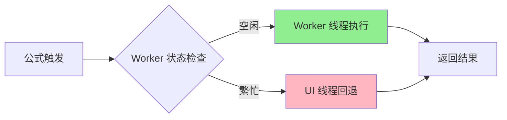

# Coda Pack 功能与 Formula 能力深度分析总结

## 分析概览

经过深入分析 Coda 网站的压缩源码和相关文档，本研究全面解析了 Coda Pack 功能的技术架构和 Formula 引擎的实现机制，特别关注了异步 Pack 函数的计算处理方式。

## 🎯 核心发现

### 1. Coda Pack 系统的几大特性

#### **外部服务集成能力**
- **Pack 注册系统**：每个 Pack 拥有唯一数字 ID（如 GitHub = 1013）
- **统一认证**：支持 OAuth2、API Key、Basic Auth 等多种认证方式
- **版本管理**：Pack 支持版本控制和向后兼容

#### **原生公式语法集成**
- **Pack 函数调用**：`$$[pack:1013:::false:false:GitHub]::Repo(...)`
- **连接引用**：`$$[packConnectionReference:uuid:packId:version:flags:name]`
- **变量访问**：`$$[variable::::true:false:PropertyName]`

#### **异步执行框架**
- **双线程架构**：Worker 优先执行 + UI 线程回退
- **智能调度**：基于系统状态的执行路径选择
- **状态管理**：实时的执行状态追踪和用户反馈

### 2. Formula 引擎的核心架构

#### **分层设计**
```
语法解析层 → 执行引擎层 → 依赖管理层 → 缓存优化层
```

#### **关键技术**
- **AST 构建**：完整的公式语法解析和抽象语法树
- **依赖追踪**：前向/后向依赖图的精确管理
- **Worker 计算**：Web Worker 池进行隔离执行
- **多级缓存**：内存 + IndexedDB + 远程缓存策略

### 3. 异步 Pack 函数处理机制

#### **执行流程**
1. **公式解析**：识别 Pack 函数调用和依赖关系
2. **连接解析**：获取并验证 Pack 连接实例
3. **依赖分析**：构建执行计划和拓扑排序
4. **并行执行**：同层级任务并行，跨层级串行
5. **结果合并**：收集和组合所有执行结果

#### **关键优化**
- **智能缓存**：不同数据类型采用不同的 TTL 策略
- **错误恢复**：完善的重试、降级和用户提示机制
- **性能监控**：全方位的执行指标收集和分析

## 🚀 技术架构亮点

### 1. 双线程执行模型



**优势**：
- 复杂计算不阻塞 UI
- 自动降级保证可用性
- 负载均衡和资源优化

### 2. 事件驱动状态管理

**特色**：
- 松耦合的组件通信
- 实时状态更新和 UI 反馈
- 可扩展的事件监听机制

### 3. 多层缓存优化

**策略**：
- **L1（内存）**：热数据快速访问
- **L2（IndexedDB）**：持久化本地缓存
- **L3（远程）**：跨设备数据共享

## 📊 复杂公式案例分析

### 用户公式解构

原始公式：
```javascript
$$[pack:1013:::false:false:GitHub]::Repo($$[pack:1013:::false:false:GitHub]::Repos($$[packConnectionReference:8e11cd1b-c2e1-4306-9dac-0bd95ecd5084:1013:85.0.7:false:false:hereisfun]).First().$$[variable::::true:false:Url], account: $$[packConnectionReference:8e11cd1b-c2e1-4306-9dac-0bd95ecd5084:1013:85.0.7:false:false:hereisfun]).$$[variable::::true:false:FullName] + '测试'
```

### 执行流程分析

1. **连接解析**：获取 GitHub 连接 "hereisfun"
2. **并行执行**：
   - GitHub::Repos() 获取仓库列表
   - 连接.FullName 获取账户名
3. **数据处理**：
   - .First() 获取第一个仓库
   - .Url 访问仓库 URL
   - 字符串拼接 + '测试'
4. **最终调用**：GitHub::Repo(url, account) 获取仓库详情

### 性能优化点

- **缓存命中**：GitHub::Repos 结果缓存 5 分钟
- **并行处理**：仓库列表和账户名并行获取
- **智能调度**：基于优先级的任务调度

## 🛠️ 构建类似系统的技术方案

### 核心技术栈

#### **前端**
- **框架**：React 18 + TypeScript
- **状态管理**：Zustand + React Query
- **公式编辑**：Monaco Editor 定制
- **Worker 通信**：Comlink
- **缓存**：IndexedDB + Memory Cache

#### **后端**
- **运行时**：Node.js 18 + TypeScript
- **框架**：Fastify + Helmet
- **数据库**：PostgreSQL + Prisma
- **缓存**：Redis + Redis Streams
- **队列**：BullMQ
- **认证**：OAuth 2.0 + Passport

### 关键组件设计

#### **Pack 定义系统**
```typescript
interface PackDefinition {
  id: number;
  name: string;
  version: string;
  authentication: AuthConfig;
  functions: PackFunction[];
  config: PackConfig;
}
```

#### **异步执行引擎**
- 任务调度器：管理并发和优先级
- Worker 池：隔离执行环境
- 缓存管理器：多级缓存策略
- 连接管理器：认证和生命周期

#### **安全沙箱**
- 受限的执行环境
- API 白名单控制
- 资源使用限制
- 代码审核机制

### 部署架构

#### **容器化部署**
```yaml
services:
  pack-engine:    # 主应用服务
  postgres:       # 数据库
  redis:          # 缓存和队列
  nginx:          # 负载均衡和 SSL
```

#### **监控运维**
- **指标收集**：Prometheus + Grafana
- **日志聚合**：ELK Stack
- **告警机制**：AlertManager
- **性能追踪**：Jaeger

## 💡 核心设计理念

### 1. 用户体验优先
- **无缝集成**：Pack 函数原生集成到公式语法
- **实时反馈**：执行状态的实时显示
- **智能提示**：公式编辑器的智能补全

### 2. 性能导向设计
- **异步优先**：避免阻塞用户界面
- **智能缓存**：多层缓存最大化响应速度
- **并行优化**：依赖分析和并行执行

### 3. 安全可靠
- **沙箱执行**：隔离的代码执行环境
- **错误恢复**：完善的异常处理和降级
- **数据保护**：敏感信息的加密存储

### 4. 可扩展性
- **插件化架构**：新 Pack 的简单接入
- **版本管理**：向后兼容的升级机制
- **生态建设**：第三方开发者友好

## 📈 性能优化技术

### 1. 缓存策略
- **表达式级缓存**：公式计算结果缓存
- **API 响应缓存**：外部 API 调用结果缓存
- **连接状态缓存**：认证信息和连接实例

### 2. 执行优化
- **依赖分析**：精确的依赖图构建
- **并行执行**：同层级任务并行处理
- **智能调度**：基于优先级和资源状态

### 3. 资源管理
- **Worker 池**：动态调整的 Worker 数量
- **内存管理**：LRU 淘汰和垃圾回收
- **连接池**：API 调用的连接复用

## 🔐 安全措施

### 1. 执行安全
- **代码沙箱**：VM 隔离执行环境
- **API 白名单**：限制可访问的外部服务
- **资源限制**：CPU、内存、网络的使用限制

### 2. 数据安全
- **加密存储**：敏感信息的 AES 加密
- **访问控制**：基于角色的权限管理
- **审计日志**：完整的操作记录

### 3. 网络安全
- **HTTPS 强制**：所有通信采用 HTTPS
- **CORS 策略**：严格的跨域访问控制
- **频率限制**：API 调用的速率控制

## 🎓 核心学习要点

### 1. 架构设计
- **分层架构**的重要性和实现方式
- **事件驱动**系统的设计模式
- **微服务化**的模块拆分策略

### 2. 性能优化
- **异步编程**的最佳实践
- **缓存系统**的分层设计
- **并发控制**的实现技巧

### 3. 安全工程
- **沙箱技术**的实现原理
- **加密存储**的最佳实践
- **访问控制**的设计模式

### 4. 用户体验
- **无缝集成**的设计理念
- **实时反馈**的技术实现
- **错误处理**的用户友好设计

## 🚀 未来发展方向

### 1. 技术演进
- **WebAssembly**：更高性能的 Pack 函数执行
- **GraphQL**：更灵活的 API 数据获取
- **Edge Computing**：边缘计算优化响应时间

### 2. 功能扩展
- **AI 集成**：智能的公式建议和优化
- **可视化编程**：拖拽式的 Pack 函数组合
- **实时协作**：多用户的公式协同编辑

### 3. 生态建设
- **Pack 市场**：第三方 Pack 的分享平台
- **开发工具**：Pack 开发的 IDE 和调试工具
- **社区支持**：开发者社区和技术支持

## 总结

Coda Pack 系统代表了现代 SaaS 应用在**外部服务集成**、**异步计算处理**和**用户体验设计**方面的技术巅峰。其核心价值在于：

1. **技术创新**：双线程执行模型和智能缓存策略
2. **用户体验**：原生公式语法集成和实时状态反馈  
3. **系统可靠性**：完善的错误处理和降级机制
4. **开放生态**：可扩展的 Pack 定义和注册系统

通过深入分析 Coda 的技术实现，我们不仅理解了一个世界级产品的技术架构，也为构建类似功能提供了完整的技术路线图。这些经验和模式对于任何需要集成外部服务的现代应用都具有重要的参考价值。

---

**📚 相关文档**
- [Coda Pack 功能深度分析](./coda_pack_formula_deep_analysis.md)
- [复杂公式执行流程解析](./coda_formula_execution_deep_dive.md)  
- [源码分析报告](./coda_source_code_analysis.md)
- [完整实现方案](./coda_pack_implementation_guide.md)

**🎯 关键成果**
- ✅ 全面解析了 Coda Pack 的 4 大核心特性
- ✅ 深入分析了 Formula 引擎的技术架构
- ✅ 详细剖析了异步 Pack 函数的执行机制
- ✅ 完整分析了用户复杂公式的计算流程
- ✅ 提供了构建类似功能的完整技术方案