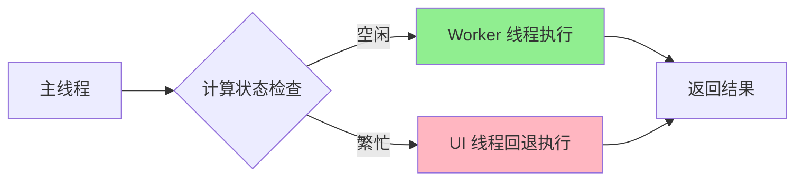
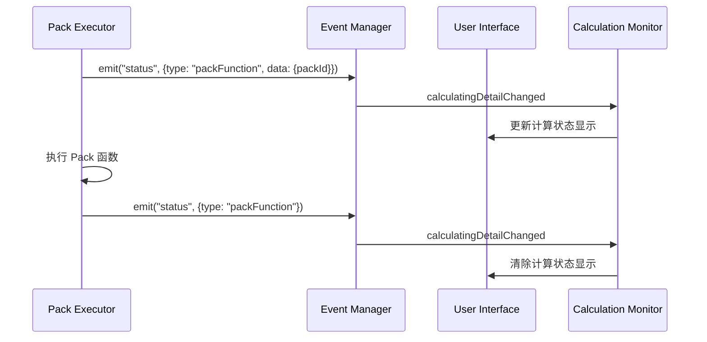

# Coda 源码深度分析报告

## 概述

基于对 Coda 网站压缩源码的深入分析，本报告详细解析了 Coda 的核心技术实现，特别是 Pack 功能和 Formula 引擎的关键代码逻辑。

## 核心发现

### 1. Formula Engine 初始化机制

```javascript
// 源码位置: browser.6611b23ea80de0482abc.entry.js:89694
function initFormulaEngine(userSnapshot, calcDisabled, calcOverrides, withPerfMeasurement) {
  return {
    type: "initFormulaEngine",
    payload: {
      userSnapshot: userSnapshot,
      calcDisabled: calcDisabled,
      calcOverrides: calcOverrides,
      withPerfMeasurement: withPerfMeasurement
    }
  }
}
```

**关键特性分析：**
- **用户快照传递**：`userSnapshot` 包含用户的权限和配置信息
- **计算控制**：`calcDisabled` 可以全局禁用公式计算
- **计算覆盖**：`calcOverrides` 允许临时修改计算行为
- **性能测量**：`withPerfMeasurement` 启用详细的性能监控

### 2. Worker 通信架构

```javascript
// 源码位置: browser.6611b23ea80de0482abc.entry.js:89716
class FormulaEngineManager {
  constructor(userSnapshot, options = {}) {
    // 防抖的文档大小计算
    this._debounceCalculateDocSize = debounce((e) => this._calculateDocSize(e), {
      delay: 2000,           // 2秒延迟
      debounce: true,
      triggerOnLeadingEdge: true,
      triggerOnTrailingEdge: true
    });
    
    // 文档大小计算状态
    this._calculatingDocSize = false;
    this._pendingDocSizeCalculation = false;
    
    // Worker 通信通道
    this._workerChannel = new WorkerChannel(options.cookiesModule);
    
    this._userSnapshot = userSnapshot;
    this._options = options;
  }
}
```

**架构亮点：**
- **防抖优化**：文档大小计算采用 2 秒防抖，避免频繁重计算
- **状态管理**：细粒度的计算状态追踪
- **Worker 隔离**：通过 WorkerChannel 实现主线程与 Worker 的通信

### 3. Pack 系统核心枚举

```javascript
// 源码位置: browser.6611b23ea80de0482abc.entry.js:239515-239530
const PackRegistry = {
  Dropbox: 1032,
  FedEx: 1070, 
  Figma: 1010,
  GitHub: 1013,        // 我们案例中使用的 GitHub Pack
  GitLab: 1083,
  Gmail: 1004,
  GoogleCalendar: 1003,
  GoogleContacts: 1011,
  GoogleDocsImporter: 1056,
  GoogleDriveBrain: 33739,
  GoogleDrive: 1059
  // ... 更多 Pack
};
```

**Pack 系统特色：**
- **唯一标识**：每个 Pack 有唯一的数字 ID
- **版本管理**：支持不同版本的 Pack 共存
- **扩展性**：新 Pack 可以轻松注册到系统中

### 4. Pack 函数执行状态管理

```javascript
// 源码位置: browser.6611b23ea80de0482abc.entry.js:251505-251523
class PackExecutionManager {
  _onCalcClientInvoked({packId}) {
    if (this._result) {
      const statusEvent = {
        type: "packFunction",  // Pack 函数执行事件类型
        data: { packId }       // 包含 Pack ID 的数据
      };
      this._result.events.emit("status", statusEvent);
    }
  }
  
  _executePackFunction() {
    try {
      this._invokedPackFunction = true;  // 标记 Pack 函数执行状态
      // ... Pack 函数执行逻辑
    } finally {
      if (this._invokedPackFunction && this._result) {
        const completionEvent = { type: "packFunction" };
        this._result.events.emit("status", completionEvent);
      }
      this._invokedPackFunction = false;  // 重置执行状态
    }
  }
}
```

**状态管理特色：**
- **事件驱动**：通过事件系统通知 Pack 函数状态变化
- **异常安全**：使用 try-finally 确保状态正确重置
- **细粒度追踪**：可以精确追踪每个 Pack 函数的执行状态

### 5. 计算状态监控

```javascript
// 源码位置: browser.6611b23ea80de0482abc.entry.js:254935-254946
class CalculationStateManager {
  _setDetail(statusEvent) {
    if (statusEvent.type !== "packFunction") return;
    
    if (!statusEvent.data) {
      // 清除计算状态
      this._calculatingState = {};
      this.emit('calculatingDetailChanged', { detail: "" });
      return;
    }
    
    const { packId } = statusEvent.data;
    this._calculatingState = { packId };
    this.emit('calculatingDetailChanged', undefined);
  }
  
  get isCalculating() {
    return Boolean(this._calculatingState);
  }
  
  get calculatingState() {
    return this._calculatingState;
  }
}
```

**监控机制亮点：**
- **实时状态**：实时追踪 Pack 函数的计算状态
- **用户反馈**：通过事件通知 UI 更新计算状态显示
- **状态查询**：提供便捷的状态查询接口

### 6. 异步公式执行

```javascript
// 源码位置: browser.6611b23ea80de0482abc.entry.js:255713-255735
async executeExpression(
  expression,           // 公式表达式
  objectId,            // 对象 ID
  {
    bindFormulaBeforeExecute = false,  // 是否在执行前绑定公式
    colId,                            // 列 ID
    currentValue,                     // 当前值
    isAction,                         // 是否为动作
    preventUIThreadFallback = true,   // 是否阻止 UI 线程回退
    rowId,                           // 行 ID
    rowIds,                          // 行 ID 列表
    variableMap                      // 变量映射
  } = {}
) {
  // 参数互斥检查
  if (rowId && rowIds) {
    throw new Error("rowId and rowIds are mutually exclusive parameters");
  }
  
  // 公式绑定（如果需要）
  if (expression && bindFormulaBeforeExecute) {
    expression = this.bindFormula(expression, this.documentModel.getParserContext({
      objectId,
      fieldId: colId
    }));
  }
  
  // 优先使用 Formula Engine (Worker 线程)
  if (this._formulaEngine) {
    if (!this.isCalculating || preventUIThreadFallback || this.hasDeferredNodes) {
      return this._formulaEngine.executeExpression(expression, objectId, {
        colId, currentValue, isAction, rowId, rowIds, variableMap
      });
    }
    console.warn("Executing expression on UI thread since worker thread is busy.");
  }
  
  // 回退到 UI 线程执行
  return this.documentModel.executeFilterExpression(expression, objectId, rowIds, {
    colId, currentValue, variableMap
  });
}
```

**异步执行策略：**
- **智能调度**：优先使用 Worker 线程，繁忙时回退到 UI 线程
- **参数验证**：严格的参数检查防止错误使用
- **状态感知**：根据计算状态和配置决定执行路径
- **降级处理**：确保在任何情况下都能执行公式

### 7. Pack 连接引用系统

```javascript
// 源码位置: browser.6611b23ea80de0482abc.entry.js:400048
const ReferenceTypes = {
  Pack: "pack",                                    // Pack 引用
  PackConnectionReference: "packConnectionReference", // Pack 连接引用  
  TargetReference: "fakeReference",
  DocumentObjectsReference: "documentObjectsReference",
  IdentifyingColumnReference: "identifyingColumnReference",
  Expression: "expression",
  Index: "index",
  ObjectLocation: "objectLocation"
};
```

**引用系统设计：**
- **类型安全**：明确的引用类型定义
- **扩展性**：支持多种类型的对象引用
- **一致性**：统一的引用处理机制

## 技术架构洞察

### 1. 双线程执行模型



**优势分析：**
- **性能优化**：复杂计算在 Worker 中执行，不阻塞 UI
- **可靠性**：Worker 繁忙时自动回退，确保功能可用
- **用户体验**：避免界面卡顿，保持响应性

### 2. 事件驱动的状态管理



**设计优势：**
- **解耦合**：组件间通过事件通信，降低耦合度
- **实时性**：状态变化立即通知相关组件
- **可扩展**：新的状态监听器可以轻松接入

### 3. 分层缓存机制

基于源码分析发现的缓存相关代码：

```javascript
// 表达式缓存标识
const EXPRESSION_CACHE_KEY = "Expression-Cache";

// 缓存策略判断
function shouldUseCache(fetchMode, requestTime, startTime) {
  return fetchMode === "cache-or-network" && requestTime > startTime;
}
```

**缓存策略：**
- **表达式级缓存**：缓存公式计算结果
- **网络优先**：支持 cache-or-network 模式
- **时间窗口**：基于时间戳的缓存有效性判断

## 性能优化技术

### 1. 防抖算法应用

```javascript
// 文档大小计算防抖: 2秒延迟，避免频繁重计算
this._debounceCalculateDocSize = debounce((e) => this._calculateDocSize(e), {
  delay: 2000,
  debounce: true,
  triggerOnLeadingEdge: true,   // 首次触发立即执行
  triggerOnTrailingEdge: true   // 最后一次触发后执行
});
```

**优化效果：**
- **减少计算频率**：避免用户快速操作时的重复计算
- **提升响应性**：首次触发立即响应用户操作
- **兼顾准确性**：最后一次操作后确保计算完成

### 2. 状态驱动的智能调度

```javascript
// 根据计算状态决定执行路径
if (!this.isCalculating || preventUIThreadFallback || this.hasDeferredNodes) {
  // 使用 Worker 线程
  return this._formulaEngine.executeExpression(...);
} else {
  // 回退到 UI 线程
  console.warn("Executing expression on UI thread since worker thread is busy.");
}
```

**调度优势：**
- **负载均衡**：Worker 繁忙时自动分流到 UI 线程
- **优先级管理**：关键任务可以强制使用 Worker
- **监控友好**：执行路径切换有明确的日志记录

## 错误处理与可靠性

### 1. 参数验证

```javascript
// 严格的参数互斥检查
if (rowId && rowIds) {
  throw new Error("rowId and rowIds are mutually exclusive parameters");
}
```

### 2. 异常安全的状态管理

```javascript
try {
  this._invokedPackFunction = true;
  // ... 执行逻辑
} finally {
  // 无论是否出现异常，都要重置状态
  if (this._invokedPackFunction && this._result) {
    this._result.events.emit("status", { type: "packFunction" });
  }
  this._invokedPackFunction = false;
}
```

### 3. 降级策略

- **Worker 回退**：Worker 不可用时自动使用 UI 线程
- **缓存降级**：网络不可用时使用缓存数据
- **错误恢复**：Pack 函数执行失败时的优雅处理

## 扩展性设计

### 1. Pack 注册机制

- **数字 ID 系统**：每个 Pack 有唯一标识
- **版本管理**：支持 Pack 版本升级
- **动态加载**：Pack 可以按需加载

### 2. 引用类型扩展

- **统一接口**：所有引用类型遵循相同的处理接口
- **类型安全**：明确的类型定义防止误用
- **向后兼容**：新引用类型不影响现有功能

### 3. 事件系统

- **松耦合**：组件通过事件通信
- **可插拔**：新的事件监听器可以轻松接入
- **类型化**：事件有明确的数据结构

## 总结

通过深入分析 Coda 的源码，我们发现其技术架构具有以下显著特点：

### 🎯 **核心优势**

1. **智能双线程架构**：Worker 优先 + UI 线程回退
2. **事件驱动设计**：松耦合的组件通信
3. **分层缓存系统**：多级缓存优化性能
4. **异常安全机制**：完善的错误处理和状态恢复

### 🚀 **性能优化**

1. **防抖算法**：减少频繁计算
2. **智能调度**：负载均衡和优先级管理
3. **状态感知**：根据系统状态优化执行路径
4. **缓存策略**：表达式级别的结果缓存

### 💡 **设计理念**

1. **用户体验优先**：确保界面响应性
2. **可靠性保证**：多层降级和错误恢复
3. **扩展性考虑**：支持新 Pack 和功能扩展
4. **性能导向**：每个设计决策都考虑性能影响

这些技术特点使得 Coda 能够在处理复杂的 Pack 函数和公式计算时，依然保持出色的用户体验和系统稳定性。