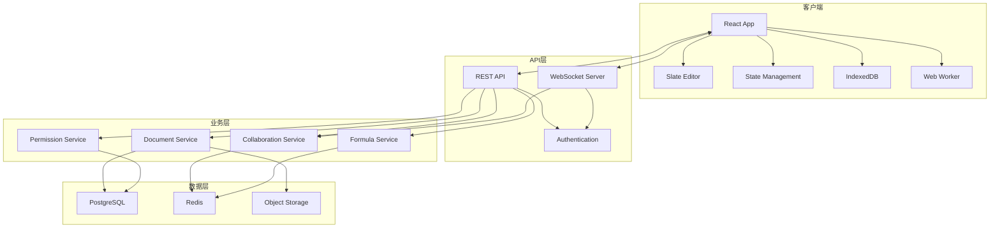

# 如何构建一个类 Coda 产品 - 完整架构指南

## 目录
- [1. 产品定位与技术选型](#1-产品定位与技术选型)
- [2. 分层架构设计](#2-分层架构设计)
- [3. 渲染层实现方案](#3-渲染层实现方案)
- [4. 数据层实现方案](#4-数据层实现方案)
- [5. 协同层实现方案](#5-协同层实现方案)
- [6. 公式层实现方案](#6-公式层实现方案)
- [7. 开发路线图](#7-开发路线图)
- [8. 技术难点与解决方案](#8-技术难点与解决方案)

---

## 1. 产品定位与技术选型

### 1.1 产品定位

**核心能力**：
- 📝 富文本编辑器（文档、表格、代码块等）
- 📊 强大的表格系统（类似 Airtable）
- 🔢 公式引擎（类似 Excel）
- 🤝 实时协同编辑
- 🔌 API 和集成能力

**目标用户**：
- 团队协作场景
- 知识管理和文档编写
- 数据管理和分析
- 工作流自动化

### 1.2 技术选型

| 层次 | 技术栈 | 理由 |
|------|--------|------|
| **前端框架** | React 18+ | 成熟稳定，生态丰富，Hooks 简化状态管理 |
| **富文本引擎** | Slate.js | 可定制性强，适合复杂文档编辑 |
| **状态管理** | Zustand / Jotai | 轻量级，适合大规模应用 |
| **样式方案** | Tailwind CSS + CSS Modules | 快速开发，样式隔离 |
| **构建工具** | Vite | 快速冷启动，HMR 体验好 |
| **类型检查** | TypeScript | 类型安全，减少运行时错误 |
| **后端框架** | Node.js + Fastify / Go | 高性能，支持 WebSocket |
| **数据库** | PostgreSQL + Redis | 关系数据 + 缓存 |
| **实时通信** | WebSocket (Socket.io) | 双向通信，自动重连 |
| **存储** | IndexedDB (Dexie.js) | 浏览器本地存储 |
| **公式引擎** | 自研 + Math.js | 灵活扩展，支持自定义函数 |
| **部署** | Docker + Kubernetes | 容器化，易于扩展 |

### 1.3 整体架构图



---

## 2. 分层架构设计

### 2.1 前端分层

```
src/
├── presentation/          # 表现层
│   ├── components/        # React 组件
│   │   ├── editor/       # 编辑器组件
│   │   ├── table/        # 表格组件
│   │   ├── formula/      # 公式组件
│   │   └── common/       # 通用组件
│   ├── hooks/            # 自定义 Hooks
│   └── pages/            # 页面组件
│
├── application/          # 应用层
│   ├── stores/          # 状态管理
│   ├── services/        # 业务服务
│   └── commands/        # 命令模式
│
├── domain/              # 领域层
│   ├── models/         # 领域模型
│   │   ├── document.ts
│   │   ├── grid.ts
│   │   ├── formula.ts
│   │   └── operation.ts
│   ├── repositories/   # 仓储接口
│   └── events/         # 领域事件
│
├── infrastructure/      # 基础设施层
│   ├── api/           # API 客户端
│   ├── storage/       # 本地存储
│   ├── websocket/     # WebSocket 客户端
│   └── workers/       # Web Workers
│
└── shared/             # 共享层
    ├── types/         # 类型定义
    ├── utils/         # 工具函数
    └── constants/     # 常量
```

### 2.2 后端分层

```
server/
├── api/                # API 层
│   ├── rest/          # REST API
│   ├── websocket/     # WebSocket
│   └── graphql/       # GraphQL (可选)
│
├── application/        # 应用层
│   ├── services/      # 应用服务
│   ├── dtos/          # 数据传输对象
│   └── mappers/       # 对象映射器
│
├── domain/            # 领域层
│   ├── entities/     # 实体
│   ├── aggregates/   # 聚合根
│   ├── value-objects/ # 值对象
│   └── events/       # 领域事件
│
├── infrastructure/    # 基础设施层
│   ├── database/     # 数据库
│   ├── cache/        # 缓存
│   ├── storage/      # 对象存储
│   └── messaging/    # 消息队列
│
└── shared/           # 共享层
    ├── errors/       # 错误处理
    ├── logger/       # 日志
    └── config/       # 配置
```

---

## 3. 渲染层实现方案

### 3.1 Slate 集成

#### Step 1: 安装依赖

```bash
npm install slate slate-react slate-history
npm install @types/slate @types/slate-react -D
```

#### Step 2: 创建 Slate 编辑器

```typescript
// src/domain/models/editor.ts
import { createEditor, Descendant } from 'slate';
import { withReact } from 'slate-react';
import { withHistory } from 'slate-history';

/**
 * 创建编辑器实例
 */
export function createSlateEditor() {
  return withHistory(withReact(createEditor()));
}

/**
 * 初始值
 */
export const initialValue: Descendant[] = [
  {
    type: 'paragraph',
    children: [{ text: '' }]
  }
];
```

#### Step 3: 编辑器组件

```typescript
// src/presentation/components/editor/SlateEditor.tsx
import React, { useMemo, useCallback } from 'react';
import { Slate, Editable, RenderElementProps, RenderLeafProps } from 'slate-react';
import { createSlateEditor } from '@/domain/models/editor';

export function SlateEditor({ value, onChange }) {
  const editor = useMemo(() => createSlateEditor(), []);
  
  const renderElement = useCallback((props: RenderElementProps) => {
    switch (props.element.type) {
      case 'paragraph':
        return <p {...props.attributes}>{props.children}</p>;
      case 'heading1':
        return <h1 {...props.attributes}>{props.children}</h1>;
      case 'table':
        return <TableBlock {...props} />;
      default:
        return <div {...props.attributes}>{props.children}</div>;
    }
  }, []);
  
  const renderLeaf = useCallback((props: RenderLeafProps) => {
    let { children } = props;
    
    if (props.leaf.bold) {
      children = <strong>{children}</strong>;
    }
    
    if (props.leaf.italic) {
      children = <em>{children}</em>;
    }
    
    return <span {...props.attributes}>{children}</span>;
  }, []);
  
  return (
    <Slate editor={editor} value={value} onChange={onChange}>
      <Editable
        renderElement={renderElement}
        renderLeaf={renderLeaf}
        placeholder="开始输入..."
      />
    </Slate>
  );
}
```

### 3.2 虚拟化实现

```bash
npm install react-window react-window-infinite-loader
```

```typescript
// src/presentation/components/table/VirtualizedTable.tsx
import React from 'react';
import { FixedSizeGrid } from 'react-window';

interface VirtualizedTableProps {
  rows: Row[];
  columns: Column[];
  rowHeight: number;
  columnWidth: number;
}

export function VirtualizedTable({
  rows,
  columns,
  rowHeight,
  columnWidth
}: VirtualizedTableProps) {
  const Cell = ({ columnIndex, rowIndex, style }) => {
    const row = rows[rowIndex];
    const column = columns[columnIndex];
    const value = row.values.get(column.id);
    
    return (
      <div style={style} className="table-cell">
        {value?.displayValue}
      </div>
    );
  };
  
  return (
    <FixedSizeGrid
      columnCount={columns.length}
      columnWidth={columnWidth}
      height={600}
      rowCount={rows.length}
      rowHeight={rowHeight}
      width={1000}
    >
      {Cell}
    </FixedSizeGrid>
  );
}
```

### 3.3 性能优化

```typescript
// src/shared/utils/performance.ts

/**
 * 防抖
 */
export function debounce<T extends (...args: any[]) => any>(
  fn: T,
  delay: number
): (...args: Parameters<T>) => void {
  let timer: number | null = null;
  
  return (...args) => {
    if (timer) clearTimeout(timer);
    
    timer = window.setTimeout(() => {
      fn(...args);
    }, delay);
  };
}

/**
 * 节流
 */
export function throttle<T extends (...args: any[]) => any>(
  fn: T,
  delay: number
): (...args: Parameters<T>) => void {
  let lastCall = 0;
  
  return (...args) => {
    const now = Date.now();
    
    if (now - lastCall >= delay) {
      lastCall = now;
      fn(...args);
    }
  };
}

/**
 * RAF 批处理
 */
export class RAFBatcher {
  private pending = new Set<() => void>();
  private scheduled = false;
  
  add(fn: () => void): void {
    this.pending.add(fn);
    
    if (!this.scheduled) {
      this.scheduled = true;
      requestAnimationFrame(() => this.flush());
    }
  }
  
  private flush(): void {
    for (const fn of this.pending) {
      fn();
    }
    
    this.pending.clear();
    this.scheduled = false;
  }
}
```

---

## 4. 数据层实现方案

### 4.1 领域模型设计

```typescript
// src/domain/models/document.ts

export class DocumentModel {
  id: string;
  version: number;
  title: string;
  pages: Page[];
  grids: Map<string, Grid>;
  
  constructor(data: DocumentData) {
    this.id = data.id;
    this.version = data.version;
    this.title = data.title;
    this.pages = data.pages.map(p => new Page(p));
    this.grids = new Map();
  }
  
  /**
   * 应用操作
   */
  applyOperation(operation: Operation): void {
    switch (operation.type) {
      case 'SLATE_INSERT_TEXT':
        this.applySlateInsertText(operation);
        break;
      case 'BULK_MODIFY_ROW_VALUE':
        this.applyBulkModifyRowValue(operation);
        break;
      // ... 其他操作类型
    }
    
    this.version = operation.version;
  }
  
  private applySlateInsertText(operation: InsertTextOperation): void {
    const page = this.pages.find(p => p.canvasId === operation.canvasId);
    if (!page) return;
    
    // 应用到 Slate
    page.canvas.applyOperation(operation);
  }
}

// src/domain/models/grid.ts

export class Grid {
  id: string;
  name: string;
  columns: ColumnCollection;
  rows: RowCollection;
  cellStorage: CellStorage;
  
  constructor(data: GridData) {
    this.id = data.id;
    this.name = data.name;
    this.columns = new ColumnCollection(data.columns);
    this.rows = new RowCollection(data.rows);
    this.cellStorage = new CellStorage(this);
  }
  
  /**
   * 获取单元格值
   */
  getCellValue(rowId: string, columnId: string): CellValue | null {
    return this.cellStorage.getValue(rowId, columnId);
  }
  
  /**
   * 设置单元格值
   */
  setCellValue(rowId: string, columnId: string, value: any): void {
    this.cellStorage.setValue(rowId, columnId, value);
  }
}
```

### 4.2 IndexedDB 存储

```bash
npm install dexie
```

```typescript
// src/infrastructure/storage/database.ts
import Dexie, { Table } from 'dexie';

interface DocumentRecord {
  id: string;
  version: number;
  data: any;
  updatedAt: number;
}

interface OperationRecord {
  opId: string;
  documentId: string;
  operation: Operation;
  timestamp: number;
}

class CodaDatabase extends Dexie {
  documents!: Table<DocumentRecord, string>;
  operations!: Table<OperationRecord, string>;
  
  constructor() {
    super('CodaDB');
    
    this.version(1).stores({
      documents: 'id, version, updatedAt',
      operations: 'opId, documentId, timestamp'
    });
  }
}

export const db = new CodaDatabase();

/**
 * 文档仓储
 */
export class DocumentRepository {
  /**
   * 保存文档
   */
  async save(document: DocumentModel): Promise<void> {
    await db.documents.put({
      id: document.id,
      version: document.version,
      data: this.serialize(document),
      updatedAt: Date.now()
    });
  }
  
  /**
   * 加载文档
   */
  async load(documentId: string): Promise<DocumentModel | null> {
    const record = await db.documents.get(documentId);
    
    if (!record) return null;
    
    return this.deserialize(record.data);
  }
  
  /**
   * 序列化
   */
  private serialize(document: DocumentModel): any {
    return {
      id: document.id,
      version: document.version,
      title: document.title,
      pages: document.pages.map(p => ({
        id: p.id,
        name: p.name,
        canvas: this.serializeCanvas(p.canvas)
      }))
      // ... 更多字段
    };
  }
  
  /**
   * 反序列化
   */
  private deserialize(data: any): DocumentModel {
    return new DocumentModel(data);
  }
}
```

### 4.3 状态管理

```bash
npm install zustand immer
```

```typescript
// src/application/stores/documentStore.ts
import create from 'zustand';
import { immer } from 'zustand/middleware/immer';

interface DocumentState {
  document: DocumentModel | null;
  isLoading: boolean;
  error: Error | null;
  
  // Actions
  loadDocument: (id: string) => Promise<void>;
  applyOperation: (operation: Operation) => void;
  updateCellValue: (gridId: string, rowId: string, columnId: string, value: any) => void;
}

export const useDocumentStore = create<DocumentState>()(
  immer((set, get) => ({
    document: null,
    isLoading: false,
    error: null,
    
    loadDocument: async (id: string) => {
      set({ isLoading: true, error: null });
      
      try {
        // 从仓储加载
        const repository = new DocumentRepository();
        const document = await repository.load(id);
        
        if (!document) {
          throw new Error('Document not found');
        }
        
        set({ document, isLoading: false });
      } catch (error) {
        set({ error: error as Error, isLoading: false });
      }
    },
    
    applyOperation: (operation: Operation) => {
      set((state) => {
        if (!state.document) return;
        
        state.document.applyOperation(operation);
      });
    },
    
    updateCellValue: (gridId, rowId, columnId, value) => {
      set((state) => {
        if (!state.document) return;
        
        const grid = state.document.grids.get(gridId);
        if (!grid) return;
        
        grid.setCellValue(rowId, columnId, value);
      });
    }
  }))
);
```

---

## 5. 协同层实现方案

### 5.1 WebSocket 客户端

```bash
npm install socket.io-client
```

```typescript
// src/infrastructure/websocket/client.ts
import { io, Socket } from 'socket.io-client';

export class WebSocketClient {
  private socket: Socket;
  private reconnectAttempts = 0;
  private maxReconnectAttempts = 10;
  
  constructor(private url: string) {
    this.socket = io(url, {
      transports: ['websocket'],
      reconnection: true,
      reconnectionDelay: 1000,
      reconnectionDelayMax: 5000,
      reconnectionAttempts: this.maxReconnectAttempts
    });
    
    this.setupEventListeners();
  }
  
  private setupEventListeners(): void {
    this.socket.on('connect', () => {
      console.log('✅ Connected to server');
      this.reconnectAttempts = 0;
    });
    
    this.socket.on('disconnect', (reason) => {
      console.log('🔌 Disconnected:', reason);
    });
    
    this.socket.on('reconnect_attempt', () => {
      this.reconnectAttempts++;
      console.log(`🔄 Reconnect attempt ${this.reconnectAttempts}`);
    });
    
    this.socket.on('error', (error) => {
      console.error('❌ Socket error:', error);
    });
  }
  
  /**
   * 订阅文档
   */
  async subscribe(documentId: string): Promise<void> {
    return new Promise((resolve, reject) => {
      this.socket.emit('subscribe', { documentId }, (ack) => {
        if (ack.success) {
          resolve();
        } else {
          reject(new Error(ack.error));
        }
      });
    });
  }
  
  /**
   * 发送操作
   */
  async sendOperation(operation: Operation): Promise<void> {
    return new Promise((resolve, reject) => {
      this.socket.emit('operation', operation, (ack) => {
        if (ack.success) {
          resolve();
        } else {
          reject(new Error(ack.error));
        }
      });
    });
  }
  
  /**
   * 监听操作
   */
  onOperation(handler: (operation: Operation) => void): void {
    this.socket.on('operation', handler);
  }
  
  /**
   * 断开连接
   */
  disconnect(): void {
    this.socket.disconnect();
  }
}
```

### 5.2 OT 算法实现

```typescript
// src/domain/models/ot.ts

/**
 * OT 转换引擎
 */
export class OTEngine {
  /**
   * 转换两个操作
   */
  transform(
    clientOp: Operation,
    serverOp: Operation
  ): [Operation, Operation] {
    if (clientOp.type === 'INSERT_TEXT' && serverOp.type === 'INSERT_TEXT') {
      return this.transformInsertVsInsert(
        clientOp as InsertTextOp,
        serverOp as InsertTextOp
      );
    }
    
    if (clientOp.type === 'INSERT_TEXT' && serverOp.type === 'REMOVE_TEXT') {
      return this.transformInsertVsRemove(
        clientOp as InsertTextOp,
        serverOp as RemoveTextOp
      );
    }
    
    // ... 其他组合
    
    return [clientOp, serverOp];
  }
  
  /**
   * 插入 vs 插入
   */
  private transformInsertVsInsert(
    clientOp: InsertTextOp,
    serverOp: InsertTextOp
  ): [InsertTextOp, InsertTextOp] {
    const { offset: clientOffset, text: clientText } = clientOp;
    const { offset: serverOffset, text: serverText } = serverOp;
    
    if (clientOffset < serverOffset) {
      return [
        clientOp,
        { ...serverOp, offset: serverOffset + clientText.length }
      ];
    } else if (clientOffset > serverOffset) {
      return [
        { ...clientOp, offset: clientOffset + serverText.length },
        serverOp
      ];
    } else {
      // 同位置：按 userId 排序
      if (clientOp.userId < serverOp.userId) {
        return [
          clientOp,
          { ...serverOp, offset: serverOffset + clientText.length }
        ];
      } else {
        return [
          { ...clientOp, offset: clientOffset + serverText.length },
          serverOp
        ];
      }
    }
  }
  
  /**
   * 插入 vs 删除
   */
  private transformInsertVsRemove(
    clientOp: InsertTextOp,
    serverOp: RemoveTextOp
  ): [InsertTextOp, RemoveTextOp] {
    const { offset: insertOffset, text } = clientOp;
    const { offset: removeOffset, length } = serverOp;
    const removeEnd = removeOffset + length;
    
    if (insertOffset <= removeOffset) {
      return [
        clientOp,
        { ...serverOp, offset: removeOffset + text.length }
      ];
    } else if (insertOffset >= removeEnd) {
      return [
        { ...clientOp, offset: insertOffset - length },
        serverOp
      ];
    } else {
      return [
        { ...clientOp, offset: removeOffset },
        serverOp
      ];
    }
  }
}
```

### 5.3 协同服务

```typescript
// src/application/services/collaborationService.ts

export class CollaborationService {
  private wsClient: WebSocketClient;
  private uncommittedLog: UncommittedLog;
  private otEngine: OTEngine;
  
  constructor(
    private documentStore: DocumentStore
  ) {
    this.wsClient = new WebSocketClient(WS_URL);
    this.uncommittedLog = new UncommittedLog();
    this.otEngine = new OTEngine();
    
    this.setupListeners();
  }
  
  private setupListeners(): void {
    this.wsClient.onOperation((operation) => {
      this.handleRemoteOperation(operation);
    });
  }
  
  /**
   * 发送本地操作
   */
  async sendOperation(operation: Operation): Promise<void> {
    // 添加到未提交日志
    this.uncommittedLog.add(operation);
    
    // 乐观应用到本地
    this.documentStore.applyOperation(operation);
    
    // 发送到服务器
    try {
      await this.wsClient.sendOperation(operation);
    } catch (error) {
      console.error('Failed to send operation:', error);
      // 操作留在未提交日志，稍后重试
    }
  }
  
  /**
   * 处理远程操作
   */
  private async handleRemoteOperation(operation: Operation): Promise<void> {
    // 检查是否是自己的操作（Self-ACK）
    const localOp = this.uncommittedLog.findByOpId(operation.opId);
    
    if (localOp) {
      // 从未提交日志移除
      this.uncommittedLog.remove(operation.opId);
      return;
    }
    
    // 他人的操作：OT 转换
    const uncommitted = this.uncommittedLog.getAll();
    
    let transformedOp = operation;
    
    for (const uncommittedOp of uncommitted) {
      const [transformedUncommitted, transformedRemote] = 
        this.otEngine.transform(uncommittedOp, transformedOp);
      
      // 更新未提交操作
      this.uncommittedLog.update(uncommittedOp.opId, transformedUncommitted);
      
      transformedOp = transformedRemote;
    }
    
    // 应用转换后的操作
    this.documentStore.applyOperation(transformedOp);
  }
}
```

---

## 6. 公式层实现方案

### 6.1 公式解析器

```bash
npm install mathjs
```

```typescript
// src/domain/models/formula/parser.ts
import { parse as mathParse } from 'mathjs';

export class FormulaParser {
  /**
   * 解析公式
   */
  parse(formula: string): FormulaAST {
    // 去掉开头的 =
    const expression = formula.startsWith('=') 
      ? formula.slice(1) 
      : formula;
    
    try {
      // 使用 math.js 解析
      const mathAST = mathParse(expression);
      
      // 转换为我们的 AST 格式
      return this.convertAST(mathAST);
    } catch (error) {
      throw new FormulaParseError(`Invalid formula: ${error.message}`);
    }
  }
  
  /**
   * 转换 AST
   */
  private convertAST(mathAST: any): FormulaAST {
    switch (mathAST.type) {
      case 'FunctionNode':
        return {
          type: 'function',
          name: mathAST.fn.name,
          args: mathAST.args.map(arg => this.convertAST(arg))
        };
        
      case 'SymbolNode':
        return {
          type: 'symbol',
          name: mathAST.name
        };
        
      case 'ConstantNode':
        return {
          type: 'constant',
          value: mathAST.value
        };
        
      case 'OperatorNode':
        return {
          type: 'operator',
          operator: mathAST.fn,
          args: mathAST.args.map(arg => this.convertAST(arg))
        };
        
      default:
        throw new Error(`Unsupported node type: ${mathAST.type}`);
    }
  }
  
  /**
   * 提取依赖
   */
  extractDependencies(ast: FormulaAST): CellReference[] {
    const deps: CellReference[] = [];
    
    this.traverse(ast, (node) => {
      if (node.type === 'symbol') {
        // 解析单元格引用，如 A1, Sheet1.A1
        const ref = this.parseCellReference(node.name);
        if (ref) {
          deps.push(ref);
        }
      }
    });
    
    return deps;
  }
  
  /**
   * 遍历 AST
   */
  private traverse(ast: FormulaAST, visitor: (node: FormulaAST) => void): void {
    visitor(ast);
    
    if ('args' in ast) {
      for (const arg of ast.args) {
        this.traverse(arg, visitor);
      }
    }
  }
}
```

### 6.2 公式引擎（Web Worker）

```typescript
// src/infrastructure/workers/formula.worker.ts

import { create, all } from 'mathjs';

const math = create(all);

// 自定义函数
math.import({
  // 文本函数
  CONCATENATE: (...args: any[]) => args.join(''),
  LEFT: (text: string, n: number) => text.slice(0, n),
  RIGHT: (text: string, n: number) => text.slice(-n),
  
  // 逻辑函数
  IF: (condition: boolean, trueValue: any, falseValue: any) => 
    condition ? trueValue : falseValue,
  
  // 聚合函数
  SUM: (...args: number[]) => args.reduce((sum, n) => sum + n, 0),
  AVERAGE: (...args: number[]) => {
    const sum = args.reduce((s, n) => s + n, 0);
    return sum / args.length;
  },
  
  // ... 更多函数
});

/**
 * 计算公式
 */
self.addEventListener('message', async (event) => {
  const { id, type, ast, context } = event.data;
  
  if (type !== 'calculate') return;
  
  try {
    // 构建作用域
    const scope = buildScope(context);
    
    // 执行公式
    const result = math.evaluate(astToExpression(ast), scope);
    
    // 返回结果
    self.postMessage({
      id,
      result: {
        value: result,
        error: null
      }
    });
  } catch (error) {
    // 返回错误
    self.postMessage({
      id,
      result: {
        value: null,
        error: error.message
      }
    });
  }
});

/**
 * 构建作用域（变量上下文）
 */
function buildScope(context: FormulaContext): Record<string, any> {
  const scope: Record<string, any> = {};
  
  // 添加单元格引用
  for (const [name, value] of Object.entries(context.cells)) {
    scope[name] = value;
  }
  
  // 添加特殊变量
  scope.thisRow = context.thisRow;
  scope.thisTable = context.thisTable;
  
  return scope;
}

/**
 * AST 转表达式字符串
 */
function astToExpression(ast: FormulaAST): string {
  switch (ast.type) {
    case 'function':
      const args = ast.args.map(astToExpression).join(', ');
      return `${ast.name}(${args})`;
      
    case 'symbol':
      return ast.name;
      
    case 'constant':
      return typeof ast.value === 'string' 
        ? `"${ast.value}"` 
        : String(ast.value);
      
    case 'operator':
      const [left, right] = ast.args.map(astToExpression);
      return `(${left} ${ast.operator} ${right})`;
      
    default:
      throw new Error(`Unknown AST type: ${ast.type}`);
  }
}
```

### 6.3 依赖图管理

```typescript
// src/domain/models/formula/dependencyGraph.ts

export class DependencyGraph {
  // 前向依赖：A 依赖谁
  private forwardDeps = new Map<string, Set<string>>();
  
  // 后向依赖：谁依赖 A
  private backDeps = new Map<string, Set<string>>();
  
  /**
   * 添加依赖：from 依赖 to
   */
  addDependency(from: CellReference, to: CellReference): void {
    const fromKey = this.refToKey(from);
    const toKey = this.refToKey(to);
    
    // 前向依赖
    if (!this.forwardDeps.has(fromKey)) {
      this.forwardDeps.set(fromKey, new Set());
    }
    this.forwardDeps.get(fromKey)!.add(toKey);
    
    // 后向依赖
    if (!this.backDeps.has(toKey)) {
      this.backDeps.set(toKey, new Set());
    }
    this.backDeps.get(toKey)!.add(fromKey);
  }
  
  /**
   * 移除依赖
   */
  removeDependency(from: CellReference, to: CellReference): void {
    const fromKey = this.refToKey(from);
    const toKey = this.refToKey(to);
    
    this.forwardDeps.get(fromKey)?.delete(toKey);
    this.backDeps.get(toKey)?.delete(fromKey);
  }
  
  /**
   * 获取依赖者（谁依赖这个单元格）
   */
  getDependents(ref: CellReference): CellReference[] {
    const key = this.refToKey(ref);
    const dependentKeys = this.backDeps.get(key) || new Set();
    
    return Array.from(dependentKeys).map(k => this.keyToRef(k));
  }
  
  /**
   * 获取依赖项（这个单元格依赖谁）
   */
  getDependencies(ref: CellReference): CellReference[] {
    const key = this.refToKey(ref);
    const dependencyKeys = this.forwardDeps.get(key) || new Set();
    
    return Array.from(dependencyKeys).map(k => this.keyToRef(k));
  }
  
  /**
   * 检测循环依赖
   */
  hasCycle(ref: CellReference): boolean {
    const visited = new Set<string>();
    const stack = new Set<string>();
    
    const dfs = (key: string): boolean => {
      if (stack.has(key)) return true; // 发现环
      if (visited.has(key)) return false;
      
      visited.add(key);
      stack.add(key);
      
      const deps = this.forwardDeps.get(key) || new Set();
      for (const dep of deps) {
        if (dfs(dep)) return true;
      }
      
      stack.delete(key);
      return false;
    };
    
    return dfs(this.refToKey(ref));
  }
  
  private refToKey(ref: CellReference): string {
    return `${ref.gridId}:${ref.columnId}:${ref.rowId || '*'}`;
  }
  
  private keyToRef(key: string): CellReference {
    const [gridId, columnId, rowId] = key.split(':');
    return {
      gridId,
      columnId,
      rowId: rowId === '*' ? undefined : rowId
    };
  }
}
```

---

## 7. 开发路线图

### Phase 1: MVP（3-4 个月）

**目标**：单人使用的文档编辑器

- ✅ Week 1-2: 项目搭建、基础架构
  - 技术选型确定
  - 开发环境配置
  - CI/CD 流程
  
- ✅ Week 3-6: 富文本编辑器
  - Slate 集成
  - 基础 Block 类型（段落、标题、列表）
  - 文本格式化（粗体、斜体、下划线）
  - 键盘快捷键
  
- ✅ Week 7-10: 表格系统
  - Grid 数据模型
  - 列类型（文本、数字、日期、选择）
  - 行操作（添加、删除、排序）
  - 列操作（添加、删除、调整宽度）
  
- ✅ Week 11-14: 本地存储
  - IndexedDB 集成
  - 数据序列化/反序列化
  - 自动保存
  - 版本历史
  
- ✅ Week 15-16: 优化与测试
  - 性能优化
  - Bug 修复
  - 用户测试

### Phase 2: 协同编辑（2-3 个月）

**目标**：多人实时协作

- ✅ Week 1-3: 后端服务
  - WebSocket 服务器
  - 用户认证
  - 文档持久化
  
- ✅ Week 4-6: OT 算法
  - OT 引擎实现
  - 操作转换逻辑
  - 冲突解决
  
- ✅ Week 7-9: 协同功能
  - 实时光标显示
  - 用户在线状态
  - 操作同步
  
- ✅ Week 10-12: 离线支持
  - 未提交操作管理
  - 自动重连
  - 版本对齐

### Phase 3: 公式引擎（2-3 个月）

**目标**：强大的计算能力

- ✅ Week 1-3: 公式解析
  - 词法分析
  - 语法分析
  - AST 生成
  
- ✅ Week 4-6: 公式执行
  - Web Worker 集成
  - 内置函数库
  - 自定义函数
  
- ✅ Week 7-9: 依赖追踪
  - 依赖图构建
  - 失效传播
  - 增量重算
  
- ✅ Week 10-12: 高级特性
  - 循环依赖检测
  - 公式调试
  - 性能优化

### Phase 4: 高级功能（3-4 个月）

**目标**：丰富的生产力工具

- 视图系统（卡片视图、看板视图、日历视图）
- 自动化（触发器、工作流）
- 集成（API、Webhook、第三方服务）
- 移动端适配
- 权限管理

---

## 8. 技术难点与解决方案

### 8.1 富文本编辑一致性

**难点**：Slate 的 normalization 可能导致选区跳跃

**解决方案**：
```typescript
// 使用 withoutNormalizing 暂停归一化
Editor.withoutNormalizing(editor, () => {
  // 批量操作
  Transforms.insertNodes(editor, nodes);
  Transforms.setNodes(editor, props);
});
// 批量完成后一次性归一化
```

### 8.2 大表格性能

**难点**：万行级别的表格渲染卡顿

**解决方案**：
1. 虚拟化渲染（react-window）
2. 懒加载数据（分页请求）
3. 单元格值缓存
4. debounce 输入事件

### 8.3 OT 冲突复杂

**难点**：多用户并发编辑的操作转换

**解决方案**：
1. 明确定义所有操作类型
2. 为每对操作类型实现转换函数
3. 单元测试覆盖所有组合
4. 服务端最终裁决（LWW）

### 8.4 公式循环依赖

**难点**：检测和处理循环引用

**解决方案**：
```typescript
// DFS 检测环
function hasCycle(startRef: CellReference): boolean {
  const visited = new Set();
  const stack = new Set();
  
  function dfs(ref: string): boolean {
    if (stack.has(ref)) return true;
    if (visited.has(ref)) return false;
    
    stack.add(ref);
    visited.add(ref);
    
    const deps = dependencyGraph.getDependencies(ref);
    for (const dep of deps) {
      if (dfs(dep)) return true;
    }
    
    stack.delete(ref);
    return false;
  }
  
  return dfs(refToKey(startRef));
}
```

### 8.5 离线同步冲突

**难点**：长时间离线后的数据合并

**解决方案**：
1. 使用操作日志而非状态快照
2. 版本向量追踪分支
3. 三向合并算法
4. 冲突标记和人工解决

---

## 总结

构建一个类 Coda 的产品是一个复杂的系统工程，需要：

1. **扎实的前端基础**：React、TypeScript、Slate.js
2. **分布式系统知识**：OT、CRDT、最终一致性
3. **性能优化经验**：虚拟化、缓存、Web Workers
4. **后端开发能力**：WebSocket、数据库、API 设计
5. **产品思维**：用户体验、功能优先级、迭代策略

**建议的起步方式**：

1. **从小做起**：先做一个单人文档编辑器
2. **迭代开发**：逐步添加协同、公式等高级功能
3. **测试驱动**：TDD 保证质量，特别是 OT 算法
4. **参考开源**：学习 Slate、Yjs、Automerge 等项目
5. **持续优化**：性能和用户体验永远有提升空间

Good luck with your Coda-like product! 🚀
