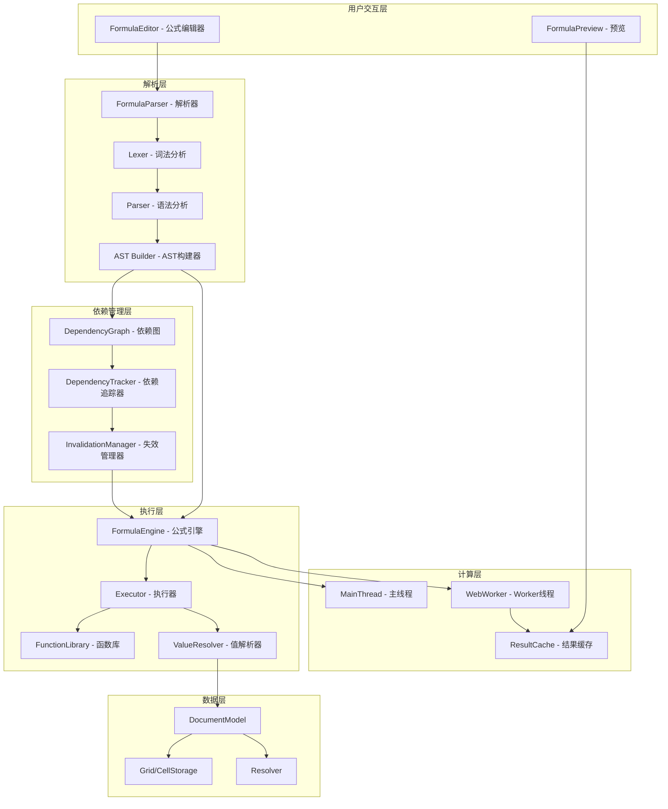
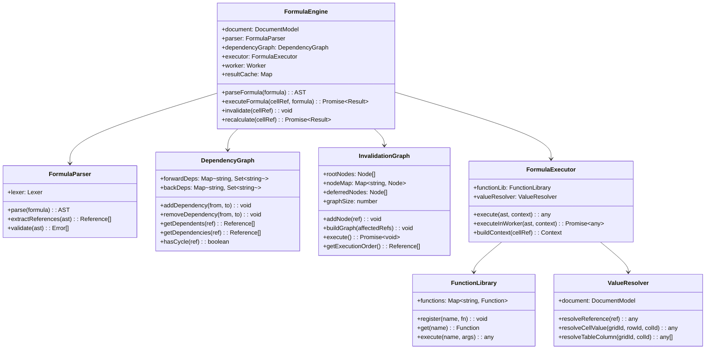
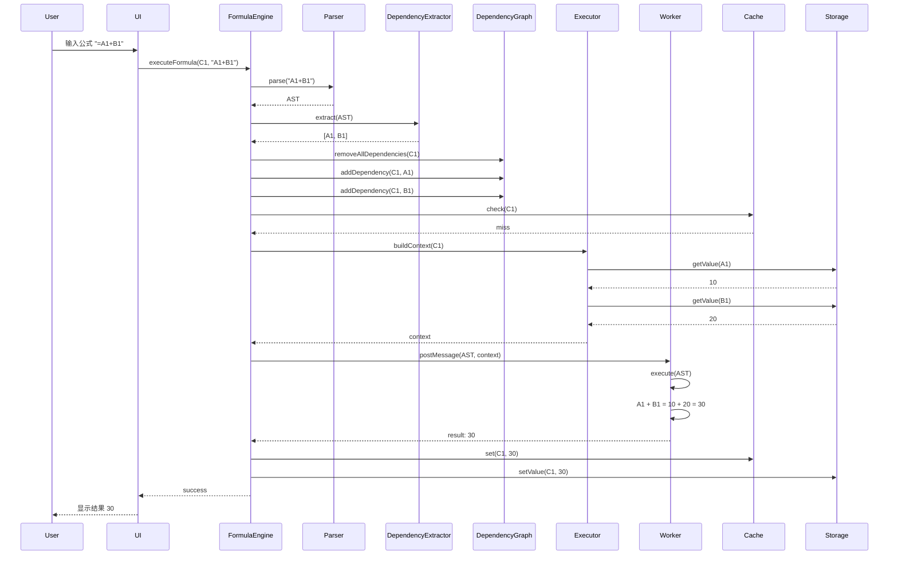
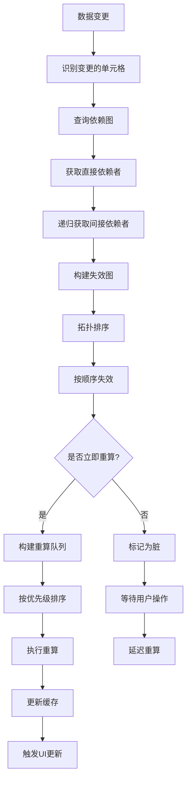

# Coda 公式引擎深入分析

## 目录
- [1. 公式引擎架构总览](#1-公式引擎架构总览)
- [2. 公式解析与 AST](#2-公式解析与-ast)
- [3. 依赖图系统](#3-依赖图系统)
- [4. 公式计算流程](#4-公式计算流程)
- [5. 依赖失效与重算](#5-依赖失效与重算)
- [6. Web Worker 异步计算](#6-web-worker-异步计算)
- [7. 性能优化策略](#7-性能优化策略)
- [8. 实战案例分析](#8-实战案例分析)

---

## 1. 公式引擎架构总览

### 1.1 整体架构



### 1.2 核心组件类图



---

## 2. 公式解析与 AST

### 2.1 词法分析（Lexer）

```typescript
/**
 * 词法分析器 - 将公式文本转换为 Token 流
 */
class FormulaLexer {
  private input: string;
  private position: number = 0;
  private currentChar: string | null;
  
  constructor(input: string) {
    // 去掉开头的 =
    this.input = input.startsWith('=') ? input.slice(1) : input;
    this.currentChar = this.input[0] || null;
  }
  
  /**
   * 获取下一个 Token
   */
  nextToken(): Token {
    while (this.currentChar !== null) {
      // 跳过空白
      if (this.isWhitespace(this.currentChar)) {
        this.skipWhitespace();
        continue;
      }
      
      // 数字
      if (this.isDigit(this.currentChar)) {
        return this.readNumber();
      }
      
      // 标识符或函数名
      if (this.isLetter(this.currentChar)) {
        return this.readIdentifier();
      }
      
      // 字符串
      if (this.currentChar === '"') {
        return this.readString();
      }
      
      // 单元格引用（如 A1, Sheet1.A1）
      if (this.isCellReference()) {
        return this.readCellReference();
      }
      
      // 操作符
      if (this.isOperator(this.currentChar)) {
        return this.readOperator();
      }
      
      // 括号
      if (this.currentChar === '(') {
        this.advance();
        return { type: 'LPAREN', value: '(' };
      }
      
      if (this.currentChar === ')') {
        this.advance();
        return { type: 'RPAREN', value: ')' };
      }
      
      // 逗号
      if (this.currentChar === ',') {
        this.advance();
        return { type: 'COMMA', value: ',' };
      }
      
      // 点（用于对象访问）
      if (this.currentChar === '.') {
        this.advance();
        return { type: 'DOT', value: '.' };
      }
      
      throw new Error(`Unexpected character: ${this.currentChar}`);
    }
    
    return { type: 'EOF', value: null };
  }
  
  /**
   * 读取数字
   */
  private readNumber(): Token {
    let num = '';
    
    while (this.currentChar !== null && (this.isDigit(this.currentChar) || this.currentChar === '.')) {
      num += this.currentChar;
      this.advance();
    }
    
    return {
      type: 'NUMBER',
      value: parseFloat(num)
    };
  }
  
  /**
   * 读取标识符（变量名、函数名）
   */
  private readIdentifier(): Token {
    let id = '';
    
    while (this.currentChar !== null && (this.isLetter(this.currentChar) || this.isDigit(this.currentChar) || this.currentChar === '_')) {
      id += this.currentChar;
      this.advance();
    }
    
    // 检查是否是关键字
    const keywords = ['true', 'false', 'null', 'undefined'];
    if (keywords.includes(id.toLowerCase())) {
      return { type: 'KEYWORD', value: id };
    }
    
    return { type: 'IDENTIFIER', value: id };
  }
  
  /**
   * 读取字符串
   */
  private readString(): Token {
    this.advance(); // 跳过开头的 "
    
    let str = '';
    
    while (this.currentChar !== null && this.currentChar !== '"') {
      if (this.currentChar === '\\') {
        this.advance();
        // 转义字符
        if (this.currentChar === 'n') str += '\n';
        else if (this.currentChar === 't') str += '\t';
        else if (this.currentChar === '"') str += '"';
        else str += this.currentChar;
      } else {
        str += this.currentChar;
      }
      this.advance();
    }
    
    this.advance(); // 跳过结尾的 "
    
    return { type: 'STRING', value: str };
  }
  
  /**
   * 读取单元格引用
   * 支持格式：A1, Sheet1.A1, Table1[Column1]
   */
  private readCellReference(): Token {
    let ref = '';
    
    // 读取表名（如果有）
    if (this.isLetter(this.currentChar)) {
      while (this.currentChar !== null && (this.isLetter(this.currentChar) || this.isDigit(this.currentChar))) {
        ref += this.currentChar;
        this.advance();
      }
      
      // 如果后面是点，说明是表名.单元格
      if (this.currentChar === '.') {
        ref += this.currentChar;
        this.advance();
      }
    }
    
    // 读取列标识（A-Z）
    while (this.currentChar !== null && this.isLetter(this.currentChar)) {
      ref += this.currentChar;
      this.advance();
    }
    
    // 读取行号
    while (this.currentChar !== null && this.isDigit(this.currentChar)) {
      ref += this.currentChar;
      this.advance();
    }
    
    return { type: 'CELL_REF', value: ref };
  }
  
  /**
   * 读取操作符
   */
  private readOperator(): Token {
    const char = this.currentChar!;
    this.advance();
    
    // 检查双字符操作符
    if (this.currentChar !== null) {
      const doubleOp = char + this.currentChar;
      if (['==', '!=', '<=', '>=', '&&', '||'].includes(doubleOp)) {
        this.advance();
        return { type: 'OPERATOR', value: doubleOp };
      }
    }
    
    return { type: 'OPERATOR', value: char };
  }
  
  private advance(): void {
    this.position++;
    this.currentChar = this.position < this.input.length ? this.input[this.position] : null;
  }
  
  private isWhitespace(char: string): boolean {
    return /\s/.test(char);
  }
  
  private isDigit(char: string): boolean {
    return /\d/.test(char);
  }
  
  private isLetter(char: string): boolean {
    return /[a-zA-Z]/.test(char);
  }
  
  private isOperator(char: string): boolean {
    return '+-*/<>=!&|'.includes(char);
  }
  
  private skipWhitespace(): void {
    while (this.currentChar !== null && this.isWhitespace(this.currentChar)) {
      this.advance();
    }
  }
  
  private isCellReference(): boolean {
    // 简化判断：字母开头
    return this.isLetter(this.currentChar!);
  }
}

/**
 * Token 类型定义
 */
interface Token {
  type: TokenType;
  value: any;
}

type TokenType = 
  | 'NUMBER'
  | 'STRING'
  | 'IDENTIFIER'
  | 'CELL_REF'
  | 'OPERATOR'
  | 'LPAREN'
  | 'RPAREN'
  | 'COMMA'
  | 'DOT'
  | 'KEYWORD'
  | 'EOF';
```

### 2.2 语法分析（Parser）

```typescript
/**
 * 语法分析器 - 将 Token 流转换为 AST
 */
class FormulaParser {
  private lexer: FormulaLexer;
  private currentToken: Token;
  
  constructor(formula: string) {
    this.lexer = new FormulaLexer(formula);
    this.currentToken = this.lexer.nextToken();
  }
  
  /**
   * 解析公式，返回 AST
   */
  parse(): FormulaAST {
    return this.parseExpression();
  }
  
  /**
   * 解析表达式（最低优先级）
   */
  private parseExpression(): FormulaAST {
    return this.parseLogicalOr();
  }
  
  /**
   * 解析逻辑或（||）
   */
  private parseLogicalOr(): FormulaAST {
    let left = this.parseLogicalAnd();
    
    while (this.currentToken.type === 'OPERATOR' && this.currentToken.value === '||') {
      const operator = this.currentToken.value;
      this.advance();
      const right = this.parseLogicalAnd();
      
      left = {
        type: 'BinaryExpression',
        operator,
        left,
        right
      };
    }
    
    return left;
  }
  
  /**
   * 解析逻辑与（&&）
   */
  private parseLogicalAnd(): FormulaAST {
    let left = this.parseEquality();
    
    while (this.currentToken.type === 'OPERATOR' && this.currentToken.value === '&&') {
      const operator = this.currentToken.value;
      this.advance();
      const right = this.parseEquality();
      
      left = {
        type: 'BinaryExpression',
        operator,
        left,
        right
      };
    }
    
    return left;
  }
  
  /**
   * 解析相等性（==, !=）
   */
  private parseEquality(): FormulaAST {
    let left = this.parseComparison();
    
    while (this.currentToken.type === 'OPERATOR' && ['==', '!='].includes(this.currentToken.value)) {
      const operator = this.currentToken.value;
      this.advance();
      const right = this.parseComparison();
      
      left = {
        type: 'BinaryExpression',
        operator,
        left,
        right
      };
    }
    
    return left;
  }
  
  /**
   * 解析比较（<, >, <=, >=）
   */
  private parseComparison(): FormulaAST {
    let left = this.parseAdditive();
    
    while (this.currentToken.type === 'OPERATOR' && ['<', '>', '<=', '>='].includes(this.currentToken.value)) {
      const operator = this.currentToken.value;
      this.advance();
      const right = this.parseAdditive();
      
      left = {
        type: 'BinaryExpression',
        operator,
        left,
        right
      };
    }
    
    return left;
  }
  
  /**
   * 解析加减法
   */
  private parseAdditive(): FormulaAST {
    let left = this.parseMultiplicative();
    
    while (this.currentToken.type === 'OPERATOR' && ['+', '-'].includes(this.currentToken.value)) {
      const operator = this.currentToken.value;
      this.advance();
      const right = this.parseMultiplicative();
      
      left = {
        type: 'BinaryExpression',
        operator,
        left,
        right
      };
    }
    
    return left;
  }
  
  /**
   * 解析乘除法
   */
  private parseMultiplicative(): FormulaAST {
    let left = this.parsePower();
    
    while (this.currentToken.type === 'OPERATOR' && ['*', '/'].includes(this.currentToken.value)) {
      const operator = this.currentToken.value;
      this.advance();
      const right = this.parsePower();
      
      left = {
        type: 'BinaryExpression',
        operator,
        left,
        right
      };
    }
    
    return left;
  }
  
  /**
   * 解析幂运算（^）
   */
  private parsePower(): FormulaAST {
    let left = this.parseUnary();
    
    while (this.currentToken.type === 'OPERATOR' && this.currentToken.value === '^') {
      const operator = this.currentToken.value;
      this.advance();
      const right = this.parseUnary();
      
      left = {
        type: 'BinaryExpression',
        operator,
        left,
        right
      };
    }
    
    return left;
  }
  
  /**
   * 解析一元运算符（+, -, !）
   */
  private parseUnary(): FormulaAST {
    if (this.currentToken.type === 'OPERATOR' && ['+', '-', '!'].includes(this.currentToken.value)) {
      const operator = this.currentToken.value;
      this.advance();
      const argument = this.parseUnary();
      
      return {
        type: 'UnaryExpression',
        operator,
        argument
      };
    }
    
    return this.parsePostfix();
  }
  
  /**
   * 解析后缀表达式（函数调用、属性访问）
   */
  private parsePostfix(): FormulaAST {
    let expr = this.parsePrimary();
    
    while (true) {
      // 函数调用
      if (this.currentToken.type === 'LPAREN') {
        expr = this.parseFunctionCall(expr);
      }
      // 属性访问
      else if (this.currentToken.type === 'DOT') {
        this.advance();
        const property = this.expect('IDENTIFIER');
        
        expr = {
          type: 'MemberExpression',
          object: expr,
          property: property.value
        };
      }
      // 数组索引
      else if (this.currentToken.type === 'OPERATOR' && this.currentToken.value === '[') {
        this.advance();
        const index = this.parseExpression();
        this.expect('OPERATOR', ']');
        
        expr = {
          type: 'IndexExpression',
          object: expr,
          index
        };
      }
      else {
        break;
      }
    }
    
    return expr;
  }
  
  /**
   * 解析函数调用
   */
  private parseFunctionCall(callee: FormulaAST): FormulaAST {
    this.expect('LPAREN');
    
    const args: FormulaAST[] = [];
    
    // 解析参数列表
    if (this.currentToken.type !== 'RPAREN') {
      args.push(this.parseExpression());
      
      while (this.currentToken.type === 'COMMA') {
        this.advance();
        args.push(this.parseExpression());
      }
    }
    
    this.expect('RPAREN');
    
    return {
      type: 'CallExpression',
      callee,
      arguments: args
    };
  }
  
  /**
   * 解析基本表达式
   */
  private parsePrimary(): FormulaAST {
    // 数字
    if (this.currentToken.type === 'NUMBER') {
      const value = this.currentToken.value;
      this.advance();
      return { type: 'Literal', value };
    }
    
    // 字符串
    if (this.currentToken.type === 'STRING') {
      const value = this.currentToken.value;
      this.advance();
      return { type: 'Literal', value };
    }
    
    // 标识符（变量或函数名）
    if (this.currentToken.type === 'IDENTIFIER') {
      const name = this.currentToken.value;
      this.advance();
      return { type: 'Identifier', name };
    }
    
    // 单元格引用
    if (this.currentToken.type === 'CELL_REF') {
      const reference = this.currentToken.value;
      this.advance();
      return { type: 'CellReference', reference };
    }
    
    // 括号表达式
    if (this.currentToken.type === 'LPAREN') {
      this.advance();
      const expr = this.parseExpression();
      this.expect('RPAREN');
      return expr;
    }
    
    throw new Error(`Unexpected token: ${this.currentToken.type}`);
  }
  
  /**
   * 前进到下一个 Token
   */
  private advance(): void {
    this.currentToken = this.lexer.nextToken();
  }
  
  /**
   * 期望特定类型的 Token
   */
  private expect(type: TokenType, value?: any): Token {
    if (this.currentToken.type !== type) {
      throw new Error(`Expected ${type}, got ${this.currentToken.type}`);
    }
    
    if (value !== undefined && this.currentToken.value !== value) {
      throw new Error(`Expected value ${value}, got ${this.currentToken.value}`);
    }
    
    const token = this.currentToken;
    this.advance();
    return token;
  }
}

/**
 * AST 节点类型
 */
type FormulaAST = 
  | LiteralNode
  | IdentifierNode
  | CellReferenceNode
  | BinaryExpressionNode
  | UnaryExpressionNode
  | CallExpressionNode
  | MemberExpressionNode
  | IndexExpressionNode;

interface LiteralNode {
  type: 'Literal';
  value: number | string | boolean | null;
}

interface IdentifierNode {
  type: 'Identifier';
  name: string;
}

interface CellReferenceNode {
  type: 'CellReference';
  reference: string; // "A1", "Sheet1.A1", "Table1[Column1]"
}

interface BinaryExpressionNode {
  type: 'BinaryExpression';
  operator: string;
  left: FormulaAST;
  right: FormulaAST;
}

interface UnaryExpressionNode {
  type: 'UnaryExpression';
  operator: string;
  argument: FormulaAST;
}

interface CallExpressionNode {
  type: 'CallExpression';
  callee: FormulaAST;
  arguments: FormulaAST[];
}

interface MemberExpressionNode {
  type: 'MemberExpression';
  object: FormulaAST;
  property: string;
}

interface IndexExpressionNode {
  type: 'IndexExpression';
  object: FormulaAST;
  index: FormulaAST;
}
```

### 2.3 公式示例解析

```typescript
/**
 * 示例 1: 简单算术公式
 * 
 * 公式: =A1 + B1 * 2
 */
const formula1 = "A1 + B1 * 2";
const ast1 = new FormulaParser(formula1).parse();

// AST 结构：
const expectedAST1 = {
  type: 'BinaryExpression',
  operator: '+',
  left: {
    type: 'CellReference',
    reference: 'A1'
  },
  right: {
    type: 'BinaryExpression',
    operator: '*',
    left: {
      type: 'CellReference',
      reference: 'B1'
    },
    right: {
      type: 'Literal',
      value: 2
    }
  }
};

/**
 * 示例 2: 函数调用
 * 
 * 公式: =SUM(A1:A10)
 */
const formula2 = "SUM(A1:A10)";
const ast2 = new FormulaParser(formula2).parse();

// AST 结构：
const expectedAST2 = {
  type: 'CallExpression',
  callee: {
    type: 'Identifier',
    name: 'SUM'
  },
  arguments: [
    {
      type: 'CellReference',
      reference: 'A1:A10'
    }
  ]
};

/**
 * 示例 3: 嵌套函数和条件
 * 
 * 公式: =IF(A1 > 10, SUM(B1:B10), AVERAGE(C1:C10))
 */
const formula3 = "IF(A1 > 10, SUM(B1:B10), AVERAGE(C1:C10))";
const ast3 = new FormulaParser(formula3).parse();

// AST 结构：
const expectedAST3 = {
  type: 'CallExpression',
  callee: {
    type: 'Identifier',
    name: 'IF'
  },
  arguments: [
    {
      type: 'BinaryExpression',
      operator: '>',
      left: {
        type: 'CellReference',
        reference: 'A1'
      },
      right: {
        type: 'Literal',
        value: 10
      }
    },
    {
      type: 'CallExpression',
      callee: {
        type: 'Identifier',
        name: 'SUM'
      },
      arguments: [
        {
          type: 'CellReference',
          reference: 'B1:B10'
        }
      ]
    },
    {
      type: 'CallExpression',
      callee: {
        type: 'Identifier',
        name: 'AVERAGE'
      },
      arguments: [
        {
          type: 'CellReference',
          reference: 'C1:C10'
        }
      ]
    }
  ]
};
```

---

## 3. 依赖图系统

### 3.1 依赖图数据结构

```typescript
/**
 * 依赖图管理器
 * 
 * 职责：
 * 1. 维护公式之间的依赖关系
 * 2. 支持依赖查询（谁依赖我？我依赖谁？）
 * 3. 检测循环依赖
 * 4. 提供拓扑排序
 */
class DependencyGraph {
  // 前向依赖：from -> Set<to>
  // 表示：from 依赖 to（from 公式中引用了 to）
  private forwardDeps: Map<string, Set<string>> = new Map();
  
  // 后向依赖：to -> Set<from>
  // 表示：to 被 from 依赖（from 引用了 to）
  private backDeps: Map<string, Set<string>> = new Map();
  
  // 依赖详情：记录更详细的依赖信息
  private depDetails: Map<string, Map<string, DependencyDetail>> = new Map();
  
  // 生成标记：用于追踪依赖图的变化
  private generation: symbol = Symbol('DependencyGraph Generation');
  
  /**
   * 添加依赖：from 依赖 to
   */
  addDependency(
    from: CellReference,
    to: CellReference,
    detail?: Partial<DependencyDetail>
  ): void {
    const fromKey = this.refToKey(from);
    const toKey = this.refToKey(to);
    
    // 检测循环依赖
    if (this.wouldCreateCycle(fromKey, toKey)) {
      throw new CircularDependencyError(
        `Adding dependency ${fromKey} -> ${toKey} would create a cycle`
      );
    }
    
    // 添加前向依赖
    if (!this.forwardDeps.has(fromKey)) {
      this.forwardDeps.set(fromKey, new Set());
    }
    this.forwardDeps.get(fromKey)!.add(toKey);
    
    // 添加后向依赖
    if (!this.backDeps.has(toKey)) {
      this.backDeps.set(toKey, new Set());
    }
    this.backDeps.get(toKey)!.add(fromKey);
    
    // 保存依赖详情
    if (!this.depDetails.has(fromKey)) {
      this.depDetails.set(fromKey, new Map());
    }
    this.depDetails.get(fromKey)!.set(toKey, {
      type: detail?.type || 'DATA',
      timestamp: Date.now(),
      context: detail?.context
    });
    
    // 更新生成标记
    this.generation = Symbol('DependencyGraph Generation');
    
    console.log(`📌 Added dependency: ${fromKey} -> ${toKey}`);
  }
  
  /**
   * 移除依赖
   */
  removeDependency(from: CellReference, to: CellReference): void {
    const fromKey = this.refToKey(from);
    const toKey = this.refToKey(to);
    
    // 移除前向依赖
    this.forwardDeps.get(fromKey)?.delete(toKey);
    if (this.forwardDeps.get(fromKey)?.size === 0) {
      this.forwardDeps.delete(fromKey);
    }
    
    // 移除后向依赖
    this.backDeps.get(toKey)?.delete(fromKey);
    if (this.backDeps.get(toKey)?.size === 0) {
      this.backDeps.delete(toKey);
    }
    
    // 移除依赖详情
    this.depDetails.get(fromKey)?.delete(toKey);
    
    this.generation = Symbol('DependencyGraph Generation');
  }
  
  /**
   * 移除某个单元格的所有依赖
   */
  removeAllDependencies(ref: CellReference): void {
    const key = this.refToKey(ref);
    
    // 移除前向依赖
    const forwardDeps = this.forwardDeps.get(key);
    if (forwardDeps) {
      for (const toKey of forwardDeps) {
        this.backDeps.get(toKey)?.delete(key);
      }
      this.forwardDeps.delete(key);
    }
    
    // 移除后向依赖
    const backDeps = this.backDeps.get(key);
    if (backDeps) {
      for (const fromKey of backDeps) {
        this.forwardDeps.get(fromKey)?.delete(key);
      }
      this.backDeps.delete(key);
    }
    
    this.depDetails.delete(key);
    this.generation = Symbol('DependencyGraph Generation');
  }
  
  /**
   * 获取依赖者（谁依赖这个单元格）
   */
  getDependents(ref: CellReference): CellReference[] {
    const key = this.refToKey(ref);
    const dependentKeys = this.backDeps.get(key) || new Set();
    
    return Array.from(dependentKeys).map(k => this.keyToRef(k));
  }
  
  /**
   * 获取依赖项（这个单元格依赖谁）
   */
  getDependencies(ref: CellReference): CellReference[] {
    const key = this.refToKey(ref);
    const dependencyKeys = this.forwardDeps.get(key) || new Set();
    
    return Array.from(dependencyKeys).map(k => this.keyToRef(k));
  }
  
  /**
   * 获取传递依赖（所有间接依赖）
   */
  getTransitiveDependents(ref: CellReference): CellReference[] {
    const visited = new Set<string>();
    const result: CellReference[] = [];
    
    const dfs = (key: string) => {
      if (visited.has(key)) return;
      visited.add(key);
      
      const dependents = this.backDeps.get(key) || new Set();
      for (const dependent of dependents) {
        result.push(this.keyToRef(dependent));
        dfs(dependent);
      }
    };
    
    dfs(this.refToKey(ref));
    
    return result;
  }
  
  /**
   * 检测循环依赖
   */
  hasCycle(ref: CellReference): boolean {
    const startKey = this.refToKey(ref);
    const visited = new Set<string>();
    const stack = new Set<string>();
    
    const dfs = (key: string): boolean => {
      if (stack.has(key)) return true; // 发现环
      if (visited.has(key)) return false;
      
      visited.add(key);
      stack.add(key);
      
      const deps = this.forwardDeps.get(key) || new Set();
      for (const dep of deps) {
        if (dfs(dep)) return true;
      }
      
      stack.delete(key);
      return false;
    };
    
    return dfs(startKey);
  }
  
  /**
   * 检查添加依赖是否会创建循环
   */
  private wouldCreateCycle(fromKey: string, toKey: string): boolean {
    // 从 toKey 开始 DFS，看是否能到达 fromKey
    const visited = new Set<string>();
    
    const dfs = (key: string): boolean => {
      if (key === fromKey) return true;
      if (visited.has(key)) return false;
      
      visited.add(key);
      
      const deps = this.forwardDeps.get(key) || new Set();
      for (const dep of deps) {
        if (dfs(dep)) return true;
      }
      
      return false;
    };
    
    return dfs(toKey);
  }
  
  /**
   * 拓扑排序（用于计算顺序）
   */
  topologicalSort(refs: CellReference[]): CellReference[] {
    const inDegree = new Map<string, number>();
    const graph = new Map<string, Set<string>>();
    
    // 构建子图
    const keys = refs.map(r => this.refToKey(r));
    const keySet = new Set(keys);
    
    for (const key of keys) {
      inDegree.set(key, 0);
      graph.set(key, new Set());
    }
    
    // 计算入度
    for (const key of keys) {
      const deps = this.forwardDeps.get(key) || new Set();
      for (const dep of deps) {
        if (keySet.has(dep)) {
          graph.get(dep)!.add(key);
          inDegree.set(key, inDegree.get(key)! + 1);
        }
      }
    }
    
    // Kahn 算法
    const queue: string[] = [];
    const result: string[] = [];
    
    for (const [key, degree] of inDegree) {
      if (degree === 0) {
        queue.push(key);
      }
    }
    
    while (queue.length > 0) {
      const key = queue.shift()!;
      result.push(key);
      
      const dependents = graph.get(key) || new Set();
      for (const dependent of dependents) {
        const newDegree = inDegree.get(dependent)! - 1;
        inDegree.set(dependent, newDegree);
        
        if (newDegree === 0) {
          queue.push(dependent);
        }
      }
    }
    
    // 如果结果数量不等于输入数量，说明有环
    if (result.length !== keys.length) {
      throw new Error('Cycle detected in dependency graph');
    }
    
    return result.map(k => this.keyToRef(k));
  }
  
  /**
   * 获取依赖图的快照（用于调试）
   */
  getSnapshot(): DependencyGraphSnapshot {
    return {
      forwardDeps: new Map(
        Array.from(this.forwardDeps.entries()).map(([k, v]) => [k, new Set(v)])
      ),
      backDeps: new Map(
        Array.from(this.backDeps.entries()).map(([k, v]) => [k, new Set(v)])
      ),
      nodeCount: this.forwardDeps.size,
      edgeCount: Array.from(this.forwardDeps.values()).reduce((sum, set) => sum + set.size, 0)
    };
  }
  
  /**
   * 引用转换为 Key
   */
  private refToKey(ref: CellReference): string {
    const { gridId, columnId, rowId } = ref;
    return rowId ? `${gridId}:${columnId}:${rowId}` : `${gridId}:${columnId}`;
  }
  
  /**
   * Key 转换为引用
   */
  private keyToRef(key: string): CellReference {
    const parts = key.split(':');
    return {
      gridId: parts[0],
      columnId: parts[1],
      rowId: parts[2] || undefined
    };
  }
}

/**
 * 单元格引用
 */
interface CellReference {
  gridId: string;
  columnId: string;
  rowId?: string; // 如果是列公式，rowId 为 undefined
}

/**
 * 依赖详情
 */
interface DependencyDetail {
  type: 'DATA' | 'LIFECYCLE' | 'SCHEMA';
  timestamp: number;
  context?: any;
}

/**
 * 依赖图快照
 */
interface DependencyGraphSnapshot {
  forwardDeps: Map<string, Set<string>>;
  backDeps: Map<string, Set<string>>;
  nodeCount: number;
  edgeCount: number;
}

/**
 * 循环依赖错误
 */
class CircularDependencyError extends Error {
  constructor(message: string) {
    super(message);
    this.name = 'CircularDependencyError';
  }
}
```

### 3.2 依赖提取器

```typescript
/**
 * 依赖提取器 - 从 AST 中提取单元格引用
 */
class DependencyExtractor {
  /**
   * 提取依赖
   */
  extract(ast: FormulaAST, context: FormulaContext): CellReference[] {
    const references: CellReference[] = [];
    
    this.traverse(ast, (node) => {
      if (node.type === 'CellReference') {
        const ref = this.parseCellReference(node.reference, context);
        if (ref) {
          references.push(ref);
        }
      } else if (node.type === 'Identifier') {
        // 检查是否是特殊标识符（如 thisRow, thisTable）
        const ref = this.resolveSpecialIdentifier(node.name, context);
        if (ref) {
          references.push(...ref);
        }
      }
    });
    
    // 去重
    return this.deduplicateReferences(references);
  }
  
  /**
   * 遍历 AST
   */
  private traverse(ast: FormulaAST, visitor: (node: FormulaAST) => void): void {
    visitor(ast);
    
    switch (ast.type) {
      case 'BinaryExpression':
        this.traverse(ast.left, visitor);
        this.traverse(ast.right, visitor);
        break;
        
      case 'UnaryExpression':
        this.traverse(ast.argument, visitor);
        break;
        
      case 'CallExpression':
        this.traverse(ast.callee, visitor);
        for (const arg of ast.arguments) {
          this.traverse(arg, visitor);
        }
        break;
        
      case 'MemberExpression':
        this.traverse(ast.object, visitor);
        break;
        
      case 'IndexExpression':
        this.traverse(ast.object, visitor);
        this.traverse(ast.index, visitor);
        break;
    }
  }
  
  /**
   * 解析单元格引用
   * 
   * 支持格式：
   * - A1 (当前表格的单元格)
   * - Sheet1.A1 (其他表格的单元格)
   * - Table1[Column1] (表格列)
   * - A1:A10 (范围)
   */
  private parseCellReference(
    reference: string,
    context: FormulaContext
  ): CellReference | null {
    // 格式 1: Sheet1.A1
    if (reference.includes('.')) {
      const [sheetName, cellRef] = reference.split('.');
      const gridId = context.resolveSheetName(sheetName);
      if (!gridId) return null;
      
      const { column, row } = this.parseCellCoords(cellRef);
      const columnId = context.resolveColumnLetter(gridId, column);
      
      return {
        gridId,
        columnId,
        rowId: row ? context.resolveRowNumber(gridId, row) : undefined
      };
    }
    
    // 格式 2: Table1[Column1]
    if (reference.includes('[')) {
      const match = reference.match(/^(.+)\[(.+)\]$/);
      if (!match) return null;
      
      const [, tableName, columnName] = match;
      const gridId = context.resolveTableName(tableName);
      if (!gridId) return null;
      
      const columnId = context.resolveColumnName(gridId, columnName);
      if (!columnId) return null;
      
      return {
        gridId,
        columnId
        // 整列引用，不指定 rowId
      };
    }
    
    // 格式 3: A1 或 A1:A10
    if (reference.includes(':')) {
      // 范围引用，展开为多个单元格
      const [start, end] = reference.split(':');
      // 简化处理：只返回起始单元格
      return this.parseCellReference(start, context);
    }
    
    // 格式 4: A1 (当前表格)
    const { column, row } = this.parseCellCoords(reference);
    const columnId = context.resolveColumnLetter(context.currentGridId, column);
    
    return {
      gridId: context.currentGridId,
      columnId,
      rowId: row ? context.resolveRowNumber(context.currentGridId, row) : undefined
    };
  }
  
  /**
   * 解析单元格坐标（如 A1 -> {column: 'A', row: 1}）
   */
  private parseCellCoords(cellRef: string): { column: string; row?: number } {
    const match = cellRef.match(/^([A-Z]+)(\d+)?$/);
    if (!match) {
      throw new Error(`Invalid cell reference: ${cellRef}`);
    }
    
    return {
      column: match[1],
      row: match[2] ? parseInt(match[2]) : undefined
    };
  }
  
  /**
   * 解析特殊标识符
   */
  private resolveSpecialIdentifier(
    name: string,
    context: FormulaContext
  ): CellReference[] | null {
    switch (name) {
      case 'thisRow':
        // 返回当前行的引用
        if (!context.currentRowId) return null;
        return [{
          gridId: context.currentGridId,
          columnId: context.currentColumnId,
          rowId: context.currentRowId
        }];
        
      case 'thisTable':
        // 返回当前表格所有列的引用
        return context.getAllColumns(context.currentGridId).map(columnId => ({
          gridId: context.currentGridId,
          columnId
        }));
        
      default:
        return null;
    }
  }
  
  /**
   * 去重引用
   */
  private deduplicateReferences(references: CellReference[]): CellReference[] {
    const seen = new Set<string>();
    const result: CellReference[] = [];
    
    for (const ref of references) {
      const key = `${ref.gridId}:${ref.columnId}:${ref.rowId || ''}`;
      if (!seen.has(key)) {
        seen.add(key);
        result.push(ref);
      }
    }
    
    return result;
  }
}

/**
 * 公式上下文
 */
interface FormulaContext {
  currentGridId: string;
  currentColumnId: string;
  currentRowId?: string;
  
  resolveSheetName(name: string): string | null;
  resolveTableName(name: string): string | null;
  resolveColumnLetter(gridId: string, letter: string): string;
  resolveColumnName(gridId: string, name: string): string | null;
  resolveRowNumber(gridId: string, number: number): string;
  getAllColumns(gridId: string): string[];
}
```

### 3.3 依赖变化示例

```typescript
/**
 * 场景：用户在单元格 C1 输入公式 =A1 + B1
 */
async function onFormulaInput(
  gridId: string,
  rowId: string,
  columnId: string,
  formula: string
) {
  const cellRef: CellReference = { gridId, columnId, rowId };
  
  // 1. 解析公式
  const parser = new FormulaParser(formula);
  const ast = parser.parse();
  
  // 2. 提取依赖
  const extractor = new DependencyExtractor();
  const dependencies = extractor.extract(ast, {
    currentGridId: gridId,
    currentColumnId: columnId,
    currentRowId: rowId,
    // ... 其他上下文方法
  });
  
  console.log('📊 Dependencies extracted:', dependencies);
  // 输出: [
  //   { gridId: 'grid-1', columnId: 'col-A', rowId: 'row-1' },
  //   { gridId: 'grid-1', columnId: 'col-B', rowId: 'row-1' }
  // ]
  
  // 3. 移除旧依赖
  dependencyGraph.removeAllDependencies(cellRef);
  
  // 4. 添加新依赖
  for (const dep of dependencies) {
    dependencyGraph.addDependency(cellRef, dep, {
      type: 'DATA',
      context: { formula }
    });
  }
  
  console.log('✅ Dependency graph updated');
  console.log('   C1 now depends on:', dependencies);
  
  // 5. 执行公式
  const result = await formulaEngine.executeFormula(cellRef, formula);
  
  // 6. 更新单元格值
  grid.setCellValue(rowId, columnId, result.value);
}

/**
 * 场景：用户修改单元格 A1 的值
 */
async function onCellValueChange(
  gridId: string,
  rowId: string,
  columnId: string,
  newValue: any
) {
  const cellRef: CellReference = { gridId, columnId, rowId };
  
  // 1. 更新单元格值
  grid.setCellValue(rowId, columnId, newValue);
  
  // 2. 查找依赖者
  const dependents = dependencyGraph.getDependents(cellRef);
  
  console.log('🔔 Cell changed:', cellRef);
  console.log('   Affected formulas:', dependents);
  // 输出: [
  //   { gridId: 'grid-1', columnId: 'col-C', rowId: 'row-1' }
  // ]
  
  // 3. 失效依赖者
  for (const dependent of dependents) {
    formulaEngine.invalidate(dependent);
  }
  
  // 4. 触发重算
  await formulaEngine.recalculateAffected(dependents);
}
```

---

## 4. 公式计算流程

### 4.1 完整计算流程图



### 4.2 公式引擎实现

```typescript
/**
 * 公式引擎 - 核心协调器
 */
class FormulaEngine {
  private document: DocumentModel;
  private parser: FormulaParser;
  private dependencyGraph: DependencyGraph;
  private executor: FormulaExecutor;
  private worker: Worker;
  private resultCache: Map<string, FormulaResult> = new Map();
  private pendingCalculations: Map<string, Promise<FormulaResult>> = new Map();
  
  constructor(document: DocumentModel) {
    this.document = document;
    this.parser = new FormulaParser('');
    this.dependencyGraph = new DependencyGraph();
    this.executor = new FormulaExecutor(document);
    this.worker = new Worker('/workers/formula.worker.js');
    
    this.setupWorker();
  }
  
  /**
   * 执行公式
   */
  async executeFormula(
    cellRef: CellReference,
    formula: string
  ): Promise<FormulaResult> {
    const cacheKey = this.refToKey(cellRef);
    
    console.log(`🧮 Executing formula at ${cacheKey}: ${formula}`);
    
    // 1. 检查缓存
    if (this.resultCache.has(cacheKey)) {
      console.log(`   ✅ Cache hit`);
      return this.resultCache.get(cacheKey)!;
    }
    
    // 2. 检查是否正在计算
    if (this.pendingCalculations.has(cacheKey)) {
      console.log(`   ⏳ Already calculating`);
      return this.pendingCalculations.get(cacheKey)!;
    }
    
    // 3. 开始计算
    const promise = this.doExecuteFormula(cellRef, formula);
    this.pendingCalculations.set(cacheKey, promise);
    
    try {
      const result = await promise;
      
      // 4. 缓存结果
      this.resultCache.set(cacheKey, result);
      
      console.log(`   ✅ Formula executed: ${result.value}`);
      
      return result;
    } finally {
      this.pendingCalculations.delete(cacheKey);
    }
  }
  
  /**
   * 实际执行公式
   */
  private async doExecuteFormula(
    cellRef: CellReference,
    formula: string
  ): Promise<FormulaResult> {
    try {
      // 1. 解析公式
      this.parser = new FormulaParser(formula);
      const ast = this.parser.parse();
      
      // 2. 提取依赖
      const extractor = new DependencyExtractor();
      const context = this.buildFormulaContext(cellRef);
      const dependencies = extractor.extract(ast, context);
      
      console.log(`   📌 Dependencies:`, dependencies);
      
      // 3. 检测循环依赖
      for (const dep of dependencies) {
        if (this.dependencyGraph.wouldCreateCycle(
          this.refToKey(cellRef),
          this.refToKey(dep)
        )) {
          throw new CircularDependencyError(
            `Formula at ${this.refToKey(cellRef)} creates circular dependency`
          );
        }
      }
      
      // 4. 更新依赖图
      this.dependencyGraph.removeAllDependencies(cellRef);
      for (const dep of dependencies) {
        this.dependencyGraph.addDependency(cellRef, dep, {
          type: 'DATA',
          context: { formula }
        });
      }
      
      // 5. 构建执行上下文
      const execContext = await this.executor.buildContext(cellRef, dependencies);
      
      // 6. 执行公式
      let result: any;
      if (this.shouldUseWorker(ast)) {
        result = await this.executeInWorker(ast, execContext);
      } else {
        result = this.executor.execute(ast, execContext);
      }
      
      return {
        value: result,
        error: null,
        dependencies
      };
      
    } catch (error) {
      console.error(`   ❌ Formula error:`, error);
      
      return {
        value: null,
        error: error.message,
        dependencies: []
      };
    }
  }
  
  /**
   * 在 Worker 中执行
   */
  private executeInWorker(
    ast: FormulaAST,
    context: ExecutionContext
  ): Promise<any> {
    return new Promise((resolve, reject) => {
      const requestId = generateRequestId();
      
      const timeout = setTimeout(() => {
        reject(new Error('Formula execution timeout'));
      }, 30000); // 30 秒超时
      
      const handler = (event: MessageEvent) => {
        const { id, result, error } = event.data;
        
        if (id === requestId) {
          clearTimeout(timeout);
          this.worker.removeEventListener('message', handler);
          
          if (error) {
            reject(new Error(error));
          } else {
            resolve(result);
          }
        }
      };
      
      this.worker.addEventListener('message', handler);
      
      this.worker.postMessage({
        id: requestId,
        type: 'execute',
        ast,
        context
      });
    });
  }
  
  /**
   * 失效公式
   */
  invalidate(cellRef: CellReference): void {
    const key = this.refToKey(cellRef);
    
    console.log(`🔄 Invalidating formula at ${key}`);
    
    // 从缓存移除
    this.resultCache.delete(key);
    
    // 递归失效依赖者
    const dependents = this.dependencyGraph.getDependents(cellRef);
    for (const dependent of dependents) {
      this.invalidate(dependent);
    }
  }
  
  /**
   * 重新计算受影响的公式
   */
  async recalculateAffected(refs: CellReference[]): Promise<void> {
    console.log(`🔄 Recalculating ${refs.length} affected formulas`);
    
    // 拓扑排序，确定计算顺序
    const sorted = this.dependencyGraph.topologicalSort(refs);
    
    console.log(`   Execution order:`, sorted.map(r => this.refToKey(r)));
    
    // 按顺序重算
    for (const ref of sorted) {
      const formula = this.getFormulaAt(ref);
      if (formula) {
        await this.executeFormula(ref, formula);
      }
    }
    
    console.log(`   ✅ Recalculation completed`);
  }
  
  /**
   * 判断是否应该使用 Worker
   */
  private shouldUseWorker(ast: FormulaAST): boolean {
    // 复杂公式使用 Worker，避免阻塞主线程
    const complexity = this.estimateComplexity(ast);
    return complexity > 100; // 阈值
  }
  
  /**
   * 估算公式复杂度
   */
  private estimateComplexity(ast: FormulaAST): number {
    let complexity = 1;
    
    if (ast.type === 'CallExpression') {
      complexity += 10;
      for (const arg of ast.arguments) {
        complexity += this.estimateComplexity(arg);
      }
    } else if (ast.type === 'BinaryExpression') {
      complexity += this.estimateComplexity(ast.left);
      complexity += this.estimateComplexity(ast.right);
    }
    
    return complexity;
  }
  
  /**
   * 构建公式上下文
   */
  private buildFormulaContext(cellRef: CellReference): FormulaContext {
    const { gridId, columnId, rowId } = cellRef;
    const grid = this.document.session.resolver.typedGetters.getGrid(gridId);
    
    return {
      currentGridId: gridId,
      currentColumnId: columnId,
      currentRowId: rowId,
      
      resolveSheetName: (name: string) => {
        // 根据名称查找 Grid ID
        const page = this.document.pagesManager.findPageByName(name);
        return page?.canvas.findGridByName(name)?.id || null;
      },
      
      resolveTableName: (name: string) => {
        // 根据表名查找 Grid ID
        return this.document.findGridByName(name)?.id || null;
      },
      
      resolveColumnLetter: (gridId: string, letter: string) => {
        // A -> col-0, B -> col-1, ...
        const index = this.letterToIndex(letter);
        const grid = this.document.session.resolver.typedGetters.getGrid(gridId);
        return grid?.columns.getByIndex(index)?.id || '';
      },
      
      resolveColumnName: (gridId: string, name: string) => {
        const grid = this.document.session.resolver.typedGetters.getGrid(gridId);
        return grid?.columns.findByName(name)?.id || null;
      },
      
      resolveRowNumber: (gridId: string, number: number) => {
        const grid = this.document.session.resolver.typedGetters.getGrid(gridId);
        return grid?.rows.getByIndex(number - 1)?.id || '';
      },
      
      getAllColumns: (gridId: string) => {
        const grid = this.document.session.resolver.typedGetters.getGrid(gridId);
        return grid?.columns.getIds() || [];
      }
    };
  }
  
  /**
   * 获取单元格的公式
   */
  private getFormulaAt(cellRef: CellReference): string | null {
    const { gridId, columnId, rowId } = cellRef;
    const grid = this.document.session.resolver.typedGetters.getGrid(gridId);
    
    if (!grid || !rowId) return null;
    
    const cellValue = grid.getCellValue(rowId, columnId);
    return cellValue?.formula?.expression || null;
  }
  
  private refToKey(ref: CellReference): string {
    return `${ref.gridId}:${ref.columnId}:${ref.rowId || ''}`;
  }
  
  private letterToIndex(letter: string): number {
    let result = 0;
    for (let i = 0; i < letter.length; i++) {
      result = result * 26 + (letter.charCodeAt(i) - 'A'.charCodeAt(0) + 1);
    }
    return result - 1;
  }
  
  private setupWorker(): void {
    // Worker 错误处理
    this.worker.onerror = (error) => {
      console.error('Worker error:', error);
    };
  }
}

/**
 * 公式结果
 */
interface FormulaResult {
  value: any;
  error: string | null;
  dependencies: CellReference[];
}

/**
 * 执行上下文
 */
interface ExecutionContext {
  cells: Record<string, any>;
  thisRow?: any;
  thisTable?: any;
}
```

### 4.3 公式执行器

```typescript
/**
 * 公式执行器 - 在主线程中执行简单公式
 */
class FormulaExecutor {
  private document: DocumentModel;
  private functionLib: FunctionLibrary;
  private valueResolver: ValueResolver;
  
  constructor(document: DocumentModel) {
    this.document = document;
    this.functionLib = new FunctionLibrary();
    this.valueResolver = new ValueResolver(document);
  }
  
  /**
   * 执行 AST
   */
  execute(ast: FormulaAST, context: ExecutionContext): any {
    switch (ast.type) {
      case 'Literal':
        return ast.value;
        
      case 'Identifier':
        return context.cells[ast.name] || null;
        
      case 'CellReference':
        return context.cells[ast.reference] || null;
        
      case 'BinaryExpression':
        return this.executeBinaryExpression(ast, context);
        
      case 'UnaryExpression':
        return this.executeUnaryExpression(ast, context);
        
      case 'CallExpression':
        return this.executeCallExpression(ast, context);
        
      case 'MemberExpression':
        return this.executeMemberExpression(ast, context);
        
      case 'IndexExpression':
        return this.executeIndexExpression(ast, context);
        
      default:
        throw new Error(`Unknown AST type: ${(ast as any).type}`);
    }
  }
  
  /**
   * 执行二元表达式
   */
  private executeBinaryExpression(
    ast: BinaryExpressionNode,
    context: ExecutionContext
  ): any {
    const left = this.execute(ast.left, context);
    const right = this.execute(ast.right, context);
    
    switch (ast.operator) {
      case '+': return left + right;
      case '-': return left - right;
      case '*': return left * right;
      case '/': return left / right;
      case '^': return Math.pow(left, right);
      case '==': return left === right;
      case '!=': return left !== right;
      case '<': return left < right;
      case '>': return left > right;
      case '<=': return left <= right;
      case '>=': return left >= right;
      case '&&': return left && right;
      case '||': return left || right;
      default:
        throw new Error(`Unknown operator: ${ast.operator}`);
    }
  }
  
  /**
   * 执行一元表达式
   */
  private executeUnaryExpression(
    ast: UnaryExpressionNode,
    context: ExecutionContext
  ): any {
    const argument = this.execute(ast.argument, context);
    
    switch (ast.operator) {
      case '+': return +argument;
      case '-': return -argument;
      case '!': return !argument;
      default:
        throw new Error(`Unknown operator: ${ast.operator}`);
    }
  }
  
  /**
   * 执行函数调用
   */
  private executeCallExpression(
    ast: CallExpressionNode,
    context: ExecutionContext
  ): any {
    // 获取函数名
    let functionName: string;
    if (ast.callee.type === 'Identifier') {
      functionName = ast.callee.name;
    } else {
      throw new Error('Complex function calls not supported');
    }
    
    // 计算参数
    const args = ast.arguments.map(arg => this.execute(arg, context));
    
    // 调用函数
    return this.functionLib.execute(functionName, args, context);
  }
  
  /**
   * 执行成员访问
   */
  private executeMemberExpression(
    ast: MemberExpressionNode,
    context: ExecutionContext
  ): any {
    const object = this.execute(ast.object, context);
    
    if (object && typeof object === 'object') {
      return object[ast.property];
    }
    
    return null;
  }
  
  /**
   * 执行索引访问
   */
  private executeIndexExpression(
    ast: IndexExpressionNode,
    context: ExecutionContext
  ): any {
    const object = this.execute(ast.object, context);
    const index = this.execute(ast.index, context);
    
    if (Array.isArray(object)) {
      return object[index];
    }
    
    if (object && typeof object === 'object') {
      return object[index];
    }
    
    return null;
  }
  
  /**
   * 构建执行上下文
   */
  async buildContext(
    cellRef: CellReference,
    dependencies: CellReference[]
  ): Promise<ExecutionContext> {
    const cells: Record<string, any> = {};
    
    // 解析所有依赖的值
    for (const dep of dependencies) {
      const key = this.depToKey(dep);
      const value = await this.valueResolver.resolveReference(dep);
      cells[key] = value;
    }
    
    // 添加特殊变量
    const context: ExecutionContext = {
      cells,
      thisRow: await this.valueResolver.resolveThisRow(cellRef),
      thisTable: await this.valueResolver.resolveThisTable(cellRef)
    };
    
    return context;
  }
  
  private depToKey(dep: CellReference): string {
    return `${dep.gridId}:${dep.columnId}:${dep.rowId || ''}`;
  }
}
```

### 4.4 值解析器

```typescript
/**
 * 值解析器 - 解析单元格引用的值
 */
class ValueResolver {
  private document: DocumentModel;
  
  constructor(document: DocumentModel) {
    this.document = document;
  }
  
  /**
   * 解析引用的值
   */
  async resolveReference(ref: CellReference): Promise<any> {
    const { gridId, columnId, rowId } = ref;
    
    const grid = this.document.session.resolver.typedGetters.getGrid(gridId);
    if (!grid) {
      throw new Error(`Grid not found: ${gridId}`);
    }
    
    // 如果没有 rowId，返回整列的值
    if (!rowId) {
      return this.resolveColumn(grid, columnId);
    }
    
    // 返回单个单元格的值
    const cellValue = grid.getCellValue(rowId, columnId);
    return cellValue?.value ?? null;
  }
  
  /**
   * 解析整列
   */
  private resolveColumn(grid: Grid, columnId: string): any[] {
    const values: any[] = [];
    
    for (const row of grid.rows.values()) {
      const cellValue = grid.getCellValue(row.id, columnId);
      values.push(cellValue?.value ?? null);
    }
    
    return values;
  }
  
  /**
   * 解析 thisRow
   */
  async resolveThisRow(cellRef: CellReference): Promise<any> {
    const { gridId, rowId } = cellRef;
    
    if (!rowId) return null;
    
    const grid = this.document.session.resolver.typedGetters.getGrid(gridId);
    if (!grid) return null;
    
    const row = grid.rows.getById(rowId);
    if (!row) return null;
    
    // 返回行对象，包含所有列的值
    const rowData: Record<string, any> = {};
    
    for (const column of grid.columns.values()) {
      const cellValue = grid.getCellValue(rowId, column.id);
      rowData[column.name] = cellValue?.value ?? null;
    }
    
    return rowData;
  }
  
  /**
   * 解析 thisTable
   */
  async resolveThisTable(cellRef: CellReference): Promise<any[]> {
    const { gridId } = cellRef;
    
    const grid = this.document.session.resolver.typedGetters.getGrid(gridId);
    if (!grid) return [];
    
    // 返回表格所有行
    const tableData: any[] = [];
    
    for (const row of grid.rows.values()) {
      const rowData: Record<string, any> = {};
      
      for (const column of grid.columns.values()) {
        const cellValue = grid.getCellValue(row.id, column.id);
        rowData[column.name] = cellValue?.value ?? null;
      }
      
      tableData.push(rowData);
    }
    
    return tableData;
  }
}
```

---

## 5. 依赖失效与重算

### 5.1 失效流程图



### 5.2 失效管理器

```typescript
/**
 * 失效管理器 - 管理公式的失效和重算
 */
class InvalidationManager {
  private engine: FormulaEngine;
  private dependencyGraph: DependencyGraph;
  private recalcQueue: RecalcQueue;
  private isProcessing = false;
  
  constructor(engine: FormulaEngine) {
    this.engine = engine;
    this.dependencyGraph = engine.dependencyGraph;
    this.recalcQueue = new RecalcQueue();
  }
  
  /**
   * 失效单元格及其依赖者
   */
  async invalidate(ref: CellReference, options: InvalidateOptions = {}): Promise<void> {
    console.log(`🔄 Invalidating ${this.refToKey(ref)}`);
    
    // 1. 构建失效图
    const invalidationGraph = this.buildInvalidationGraph(ref);
    
    console.log(`   Graph size: ${invalidationGraph.size} nodes`);
    
    // 2. 失效所有节点
    for (const node of invalidationGraph.nodes) {
      this.engine.invalidate(node.ref);
    }
    
    // 3. 决定是否立即重算
    if (options.recalculate !== false) {
      await this.scheduleRecalculation(invalidationGraph);
    }
  }
  
  /**
   * 构建失效图
   */
  private buildInvalidationGraph(rootRef: CellReference): InvalidationGraph {
    const graph = new InvalidationGraph();
    const visited = new Set<string>();
    
    // DFS 收集所有受影响的节点
    const dfs = (ref: CellReference, depth: number) => {
      const key = this.refToKey(ref);
      
      if (visited.has(key)) return;
      visited.add(key);
      
      // 添加节点
      const node: InvalidationNode = {
        ref,
        depth,
        priority: this.calculatePriority(ref, depth)
      };
      graph.addNode(node);
      
      // 递归处理依赖者
      const dependents = this.dependencyGraph.getDependents(ref);
      for (const dependent of dependents) {
        dfs(dependent, depth + 1);
      }
    };
    
    dfs(rootRef, 0);
    
    return graph;
  }
  
  /**
   * 调度重算
   */
  private async scheduleRecalculation(
    invalidationGraph: InvalidationGraph
  ): Promise<void> {
    // 1. 拓扑排序
    const refs = invalidationGraph.nodes.map(n => n.ref);
    const sorted = this.dependencyGraph.topologicalSort(refs);
    
    console.log(`🔄 Scheduling recalculation for ${sorted.length} formulas`);
    
    // 2. 添加到重算队列
    for (const ref of sorted) {
      const priority = invalidationGraph.getPriority(ref);
      this.recalcQueue.add({
        ref,
        priority,
        timestamp: Date.now()
      });
    }
    
    // 3. 触发处理
    this.processRecalcQueue();
  }
  
  /**
   * 处理重算队列
   */
  private async processRecalcQueue(): Promise<void> {
    if (this.isProcessing) return;
    
    this.isProcessing = true;
    
    try {
      while (!this.recalcQueue.isEmpty()) {
        const item = this.recalcQueue.pop();
        if (!item) break;
        
        console.log(`🧮 Recalculating ${this.refToKey(item.ref)}`);
        
        // 获取公式
        const formula = this.getFormulaAt(item.ref);
        if (!formula) continue;
        
        // 执行公式
        await this.engine.executeFormula(item.ref, formula);
        
        // 让出主线程
        await this.yield();
      }
      
      console.log(`✅ Recalculation queue processed`);
      
    } finally {
      this.isProcessing = false;
    }
  }
  
  /**
   * 计算优先级
   */
  private calculatePriority(ref: CellReference, depth: number): number {
    // 优先级规则：
    // 1. 深度越小优先级越高（根节点优先）
    // 2. 可见单元格优先级高
    // 3. 用户正在编辑的单元格优先级最高
    
    let priority = 100 - depth * 10;
    
    // 检查是否可见
    if (this.isVisible(ref)) {
      priority += 50;
    }
    
    // 检查是否正在编辑
    if (this.isEditing(ref)) {
      priority += 100;
    }
    
    return priority;
  }
  
  /**
   * 让出主线程（避免阻塞 UI）
   */
  private yield(): Promise<void> {
    return new Promise(resolve => {
      setTimeout(resolve, 0);
    });
  }
  
  private refToKey(ref: CellReference): string {
    return `${ref.gridId}:${ref.columnId}:${ref.rowId || ''}`;
  }
  
  private getFormulaAt(ref: CellReference): string | null {
    // 实现略...
    return null;
  }
  
  private isVisible(ref: CellReference): boolean {
    // 检查单元格是否在视口内
    // 实现略...
    return false;
  }
  
  private isEditing(ref: CellReference): boolean {
    // 检查用户是否正在编辑这个单元格
    // 实现略...
    return false;
  }
}

/**
 * 失效图
 */
class InvalidationGraph {
  nodes: InvalidationNode[] = [];
  private nodeMap: Map<string, InvalidationNode> = new Map();
  
  get size(): number {
    return this.nodes.length;
  }
  
  addNode(node: InvalidationNode): void {
    const key = this.refToKey(node.ref);
    
    if (!this.nodeMap.has(key)) {
      this.nodes.push(node);
      this.nodeMap.set(key, node);
    }
  }
  
  getPriority(ref: CellReference): number {
    const key = this.refToKey(ref);
    return this.nodeMap.get(key)?.priority || 0;
  }
  
  private refToKey(ref: CellReference): string {
    return `${ref.gridId}:${ref.columnId}:${ref.rowId || ''}`;
  }
}

/**
 * 失效节点
 */
interface InvalidationNode {
  ref: CellReference;
  depth: number;
  priority: number;
}

/**
 * 失效选项
 */
interface InvalidateOptions {
  recalculate?: boolean; // 是否立即重算
  reason?: string; // 失效原因
}

/**
 * 重算队列
 */
class RecalcQueue {
  private items: RecalcItem[] = [];
  
  add(item: RecalcItem): void {
    this.items.push(item);
    
    // 按优先级排序
    this.items.sort((a, b) => b.priority - a.priority);
  }
  
  pop(): RecalcItem | null {
    return this.items.shift() || null;
  }
  
  isEmpty(): boolean {
    return this.items.length === 0;
  }
}

/**
 * 重算项
 */
interface RecalcItem {
  ref: CellReference;
  priority: number;
  timestamp: number;
}
```

---

## 6. Web Worker 异步计算

### 6.1 Worker 实现

```typescript
/**
 * Formula Worker - 在独立线程中执行公式
 * 
 * 文件：/workers/formula.worker.ts
 */

// Worker 环境中的全局对象
declare const self: DedicatedWorkerGlobalScope;

import { create, all } from 'mathjs';

// 创建 math.js 实例
const math = create(all);

// 注册自定义函数
registerCustomFunctions();

/**
 * 监听主线程消息
 */
self.addEventListener('message', async (event: MessageEvent) => {
  const { id, type, ast, context } = event.data;
  
  if (type !== 'execute') return;
  
  try {
    // 执行公式
    const result = await executeAST(ast, context);
    
    // 返回结果
    self.postMessage({
      id,
      result,
      error: null
    });
  } catch (error) {
    // 返回错误
    self.postMessage({
      id,
      result: null,
      error: error.message || 'Unknown error'
    });
  }
});

/**
 * 执行 AST
 */
function executeAST(ast: any, context: any): any {
  // 构建作用域
  const scope = buildScope(context);
  
  // 转换 AST 为表达式字符串
  const expression = astToExpression(ast);
  
  // 使用 math.js 执行
  return math.evaluate(expression, scope);
}

/**
 * 构建作用域
 */
function buildScope(context: any): Record<string, any> {
  const scope: Record<string, any> = {};
  
  // 添加单元格值
  for (const [key, value] of Object.entries(context.cells)) {
    // 移除前缀（如 "grid-1:col-A:row-1" -> "A1"）
    const simplifiedKey = simplifyKey(key);
    scope[simplifiedKey] = value;
  }
  
  // 添加特殊变量
  if (context.thisRow) {
    scope.thisRow = context.thisRow;
  }
  
  if (context.thisTable) {
    scope.thisTable = context.thisTable;
  }
  
  return scope;
}

/**
 * AST 转表达式
 */
function astToExpression(ast: any): string {
  switch (ast.type) {
    case 'Literal':
      return typeof ast.value === 'string'
        ? `"${ast.value}"`
        : String(ast.value);
      
    case 'Identifier':
      return ast.name;
      
    case 'CellReference':
      return simplifyKey(ast.reference);
      
    case 'BinaryExpression':
      const left = astToExpression(ast.left);
      const right = astToExpression(ast.right);
      return `(${left} ${ast.operator} ${right})`;
      
    case 'UnaryExpression':
      const arg = astToExpression(ast.argument);
      return `${ast.operator}${arg}`;
      
    case 'CallExpression':
      const callee = astToExpression(ast.callee);
      const args = ast.arguments.map(astToExpression).join(', ');
      return `${callee}(${args})`;
      
    case 'MemberExpression':
      const obj = astToExpression(ast.object);
      return `${obj}.${ast.property}`;
      
    case 'IndexExpression':
      const object = astToExpression(ast.object);
      const index = astToExpression(ast.index);
      return `${object}[${index}]`;
      
    default:
      throw new Error(`Unknown AST type: ${ast.type}`);
  }
}

/**
 * 简化 Key（去掉前缀）
 */
function simplifyKey(key: string): string {
  // "grid-1:col-A:row-1" -> "A1"
  const parts = key.split(':');
  if (parts.length >= 2) {
    const col = parts[1].replace('col-', '');
    const row = parts[2] ? parts[2].replace('row-', '') : '';
    return col + row;
  }
  return key;
}

/**
 * 注册自定义函数
 */
function registerCustomFunctions(): void {
  // 文本函数
  math.import({
    CONCATENATE: (...args: any[]) => args.join(''),
    LEFT: (text: string, n: number) => text.slice(0, n),
    RIGHT: (text: string, n: number) => text.slice(-n),
    UPPER: (text: string) => text.toUpperCase(),
    LOWER: (text: string) => text.toLowerCase(),
    TRIM: (text: string) => text.trim(),
    LEN: (text: string) => text.length,
    
    // 逻辑函数
    IF: (condition: boolean, trueValue: any, falseValue: any) => 
      condition ? trueValue : falseValue,
    AND: (...args: boolean[]) => args.every(x => x),
    OR: (...args: boolean[]) => args.some(x => x),
    NOT: (value: boolean) => !value,
    
    // 数学函数
    SUM: (...args: any[]) => {
      const numbers = flattenAndFilter(args);
      return numbers.reduce((sum, n) => sum + n, 0);
    },
    AVERAGE: (...args: any[]) => {
      const numbers = flattenAndFilter(args);
      if (numbers.length === 0) return 0;
      return numbers.reduce((sum, n) => sum + n, 0) / numbers.length;
    },
    MIN: (...args: any[]) => {
      const numbers = flattenAndFilter(args);
      return Math.min(...numbers);
    },
    MAX: (...args: any[]) => {
      const numbers = flattenAndFilter(args);
      return Math.max(...numbers);
    },
    COUNT: (...args: any[]) => {
      const numbers = flattenAndFilter(args);
      return numbers.length;
    },
    ROUND: (num: number, digits: number = 0) => {
      const factor = Math.pow(10, digits);
      return Math.round(num * factor) / factor;
    },
    
    // 日期函数
    NOW: () => new Date(),
    TODAY: () => {
      const now = new Date();
      return new Date(now.getFullYear(), now.getMonth(), now.getDate());
    },
    YEAR: (date: Date) => date.getFullYear(),
    MONTH: (date: Date) => date.getMonth() + 1,
    DAY: (date: Date) => date.getDate(),
    
    // 查找函数
    FIND: (searchText: string, withinText: string) => {
      const index = withinText.indexOf(searchText);
      return index >= 0 ? index : null;
    },
    SEARCH: (searchText: string, withinText: string) => {
      const regex = new RegExp(searchText, 'i');
      const match = withinText.match(regex);
      return match ? match.index : null;
    },
    
    // 数组函数
    FILTER: (array: any[], condition: (item: any) => boolean) => {
      return array.filter(condition);
    },
    MAP: (array: any[], fn: (item: any) => any) => {
      return array.map(fn);
    },
    SORT: (array: any[], ascending: boolean = true) => {
      const sorted = [...array].sort();
      return ascending ? sorted : sorted.reverse();
    }
  }, { override: true });
}

/**
 * 展平并过滤数字
 */
function flattenAndFilter(args: any[]): number[] {
  const result: number[] = [];
  
  for (const arg of args) {
    if (Array.isArray(arg)) {
      result.push(...flattenAndFilter(arg));
    } else if (typeof arg === 'number' && !isNaN(arg)) {
      result.push(arg);
    }
  }
  
  return result;
}
```

---

## 7. 性能优化策略

### 7.1 缓存策略

```typescript
/**
 * 多级缓存系统
 */
class FormulaCacheManager {
  // L1: 内存缓存（最快）
  private l1Cache: Map<string, CacheEntry> = new Map();
  
  // L2: IndexedDB 缓存（持久化）
  private l2Cache: IDBDatabase | null = null;
  
  // 配置
  private config = {
    l1MaxSize: 1000, // L1 缓存最大条目数
    l1TTL: 5 * 60 * 1000, // L1 缓存 TTL: 5 分钟
    l2TTL: 24 * 60 * 60 * 1000 // L2 缓存 TTL: 24 小时
  };
  
  /**
   * 获取缓存
   */
  async get(key: string): Promise<any> {
    // 1. 尝试 L1 缓存
    const l1Entry = this.l1Cache.get(key);
    if (l1Entry && !this.isExpired(l1Entry)) {
      console.log(`✅ L1 cache hit: ${key}`);
      return l1Entry.value;
    }
    
    // 2. 尝试 L2 缓存
    const l2Entry = await this.getFromL2(key);
    if (l2Entry && !this.isExpired(l2Entry)) {
      console.log(`✅ L2 cache hit: ${key}`);
      
      // 回填到 L1
      this.l1Cache.set(key, l2Entry);
      
      return l2Entry.value;
    }
    
    console.log(`❌ Cache miss: ${key}`);
    return null;
  }
  
  /**
   * 设置缓存
   */
  async set(key: string, value: any): Promise<void> {
    const entry: CacheEntry = {
      value,
      timestamp: Date.now(),
      hits: 0
    };
    
    // 1. 写入 L1
    this.l1Cache.set(key, entry);
    
    // 2. 检查 L1 容量
    if (this.l1Cache.size > this.config.l1MaxSize) {
      this.evictL1();
    }
    
    // 3. 异步写入 L2
    this.setToL2(key, entry);
  }
  
  /**
   * 失效缓存
   */
  async invalidate(key: string): Promise<void> {
    // 从两级缓存中移除
    this.l1Cache.delete(key);
    await this.deleteFromL2(key);
  }
  
  /**
   * 判断是否过期
   */
  private isExpired(entry: CacheEntry): boolean {
    const age = Date.now() - entry.timestamp;
    return age > this.config.l1TTL;
  }
  
  /**
   * L1 缓存淘汰（LRU）
   */
  private evictL1(): void {
    let oldest: string | null = null;
    let oldestTime = Infinity;
    
    for (const [key, entry] of this.l1Cache) {
      if (entry.timestamp < oldestTime) {
        oldestTime = entry.timestamp;
        oldest = key;
      }
    }
    
    if (oldest) {
      this.l1Cache.delete(oldest);
      console.log(`🗑️ Evicted from L1: ${oldest}`);
    }
  }
  
  /**
   * 从 L2 获取
   */
  private async getFromL2(key: string): Promise<CacheEntry | null> {
    if (!this.l2Cache) return null;
    
    return new Promise((resolve) => {
      const tx = this.l2Cache!.transaction(['cache'], 'readonly');
      const store = tx.objectStore('cache');
      const request = store.get(key);
      
      request.onsuccess = () => resolve(request.result || null);
      request.onerror = () => resolve(null);
    });
  }
  
  /**
   * 写入 L2
   */
  private async setToL2(key: string, entry: CacheEntry): Promise<void> {
    if (!this.l2Cache) return;
    
    const tx = this.l2Cache.transaction(['cache'], 'readwrite');
    const store = tx.objectStore('cache');
    store.put({ key, ...entry });
  }
  
  /**
   * 从 L2 删除
   */
  private async deleteFromL2(key: string): Promise<void> {
    if (!this.l2Cache) return;
    
    const tx = this.l2Cache.transaction(['cache'], 'readwrite');
    const store = tx.objectStore('cache');
    store.delete(key);
  }
}

interface CacheEntry {
  value: any;
  timestamp: number;
  hits: number;
}
```

### 7.2 批量计算优化

```typescript
/**
 * 批量计算管理器
 */
class BatchCalculationManager {
  private pendingBatch: Map<string, PendingCalculation> = new Map();
  private batchTimer: number | null = null;
  private batchSize = 50; // 每批最多处理 50 个公式
  private batchDelay = 100; // 100ms 后触发批处理
  
  /**
   * 添加到批次
   */
  add(ref: CellReference, formula: string): Promise<FormulaResult> {
    const key = this.refToKey(ref);
    
    // 检查是否已在批次中
    if (this.pendingBatch.has(key)) {
      return this.pendingBatch.get(key)!.promise;
    }
    
    // 创建 Promise
    let resolve: (result: FormulaResult) => void;
    let reject: (error: Error) => void;
    
    const promise = new Promise<FormulaResult>((res, rej) => {
      resolve = res;
      reject = rej;
    });
    
    // 添加到批次
    this.pendingBatch.set(key, {
      ref,
      formula,
      promise,
      resolve: resolve!,
      reject: reject!
    });
    
    // 调度批处理
    this.scheduleBatch();
    
    return promise;
  }
  
  /**
   * 调度批处理
   */
  private scheduleBatch(): void {
    if (this.batchTimer) return;
    
    // 达到批次大小，立即处理
    if (this.pendingBatch.size >= this.batchSize) {
      this.processBatch();
      return;
    }
    
    // 否则延迟处理
    this.batchTimer = window.setTimeout(() => {
      this.processBatch();
    }, this.batchDelay);
  }
  
  /**
   * 处理批次
   */
  private async processBatch(): Promise<void> {
    if (this.batchTimer) {
      clearTimeout(this.batchTimer);
      this.batchTimer = null;
    }
    
    if (this.pendingBatch.size === 0) return;
    
    console.log(`🔄 Processing batch of ${this.pendingBatch.size} formulas`);
    
    // 取出当前批次
    const batch = Array.from(this.pendingBatch.values());
    this.pendingBatch.clear();
    
    // 1. 构建依赖图
    const sorted = this.sortByDependencies(batch.map(b => b.ref));
    
    // 2. 并行执行（相同层级）
    for (const layer of this.groupByLayer(sorted)) {
      await Promise.all(
        layer.map(async (ref) => {
          const item = batch.find(b => this.refsEqual(b.ref, ref));
          if (!item) return;
          
          try {
            const result = await formulaEngine.executeFormula(
              item.ref,
              item.formula
            );
            item.resolve(result);
          } catch (error) {
            item.reject(error);
          }
        })
      );
    }
    
    console.log(`✅ Batch processed`);
  }
  
  /**
   * 按依赖关系排序
   */
  private sortByDependencies(refs: CellReference[]): CellReference[] {
    return dependencyGraph.topologicalSort(refs);
  }
  
  /**
   * 按层级分组（用于并行计算）
   */
  private groupByLayer(sorted: CellReference[]): CellReference[][] {
    const layers: CellReference[][] = [];
    const depths = new Map<string, number>();
    
    // 计算每个节点的深度
    for (const ref of sorted) {
      const deps = dependencyGraph.getDependencies(ref);
      const maxDepth = Math.max(
        0,
        ...deps.map(d => depths.get(this.refToKey(d)) || 0)
      );
      depths.set(this.refToKey(ref), maxDepth + 1);
    }
    
    // 按深度分组
    for (const ref of sorted) {
      const depth = depths.get(this.refToKey(ref))!;
      
      if (!layers[depth]) {
        layers[depth] = [];
      }
      layers[depth].push(ref);
    }
    
    return layers.filter(layer => layer.length > 0);
  }
  
  private refToKey(ref: CellReference): string {
    return `${ref.gridId}:${ref.columnId}:${ref.rowId || ''}`;
  }
  
  private refsEqual(a: CellReference, b: CellReference): boolean {
    return this.refToKey(a) === this.refToKey(b);
  }
}

interface PendingCalculation {
  ref: CellReference;
  formula: string;
  promise: Promise<FormulaResult>;
  resolve: (result: FormulaResult) => void;
  reject: (error: Error) => void;
}
```

---

## 8. 实战案例分析

### 案例 1: 简单求和公式

```
公式：=A1 + B1
位置：C1
```

**执行流程**：

1. **解析阶段**
   ```typescript
   const ast = {
     type: 'BinaryExpression',
     operator: '+',
     left: { type: 'CellReference', reference: 'A1' },
     right: { type: 'CellReference', reference: 'B1' }
   };
   ```

2. **依赖提取**
   ```typescript
   const dependencies = [
     { gridId: 'grid-1', columnId: 'col-A', rowId: 'row-1' },
     { gridId: 'grid-1', columnId: 'col-B', rowId: 'row-1' }
   ];
   ```

3. **依赖图更新**
   ```typescript
   // C1 -> A1
   dependencyGraph.addDependency(
     { gridId: 'grid-1', columnId: 'col-C', rowId: 'row-1' },
     { gridId: 'grid-1', columnId: 'col-A', rowId: 'row-1' }
   );
   
   // C1 -> B1
   dependencyGraph.addDependency(
     { gridId: 'grid-1', columnId: 'col-C', rowId: 'row-1' },
     { gridId: 'grid-1', columnId: 'col-B', rowId: 'row-1' }
   );
   ```

4. **值解析**
   ```typescript
   const context = {
     cells: {
       'A1': 10,
       'B1': 20
     }
   };
   ```

5. **计算**
   ```typescript
   const result = 10 + 20; // 30
   ```

6. **结果更新**
   ```typescript
   grid.setCellValue('row-1', 'col-C', 30);
   ```

---

### 案例 2: 条件求和公式

```
公式：=SUM(IF(A1:A10 > 5, A1:A10, 0))
位置：B1
```

**执行流程**：

1. **解析阶段**
   ```typescript
   const ast = {
     type: 'CallExpression',
     callee: { type: 'Identifier', name: 'SUM' },
     arguments: [{
       type: 'CallExpression',
       callee: { type: 'Identifier', name: 'IF' },
       arguments: [
         {
           type: 'BinaryExpression',
           operator: '>',
           left: { type: 'CellReference', reference: 'A1:A10' },
           right: { type: 'Literal', value: 5 }
         },
         { type: 'CellReference', reference: 'A1:A10' },
         { type: 'Literal', value: 0 }
       ]
     }]
   };
   ```

2. **依赖提取**
   ```typescript
   const dependencies = [
     { gridId: 'grid-1', columnId: 'col-A', rowId: 'row-1' },
     { gridId: 'grid-1', columnId: 'col-A', rowId: 'row-2' },
     // ... row-3 到 row-10
   ];
   ```

3. **值解析**
   ```typescript
   const context = {
     cells: {
       'A1': 3,
       'A2': 7,
       'A3': 2,
       'A4': 9,
       'A5': 6,
       // ...
     }
   };
   ```

4. **计算（在 Worker 中）**
   ```typescript
   // 展开数组公式
   const values = [3, 7, 2, 9, 6, 4, 8, 1, 5, 10];
   
   // IF(A1:A10 > 5, A1:A10, 0)
   const filtered = values.map(v => v > 5 ? v : 0);
   // [0, 7, 0, 9, 6, 0, 8, 0, 0, 10]
   
   // SUM(...)
   const result = filtered.reduce((sum, v) => sum + v, 0);
   // 40
   ```

5. **结果更新**
   ```typescript
   grid.setCellValue('row-1', 'col-B', 40);
   ```

---

### 案例 3: 级联更新

```
初始状态：
A1 = 10
B1 = =A1 * 2     // 20
C1 = =B1 + 5     // 25
D1 = =C1 / 5     // 5
```

**用户修改 A1 = 15，触发级联更新**：

1. **数据变更事件**
   ```typescript
   onCellValueChange('row-1', 'col-A', 15);
   ```

2. **查找依赖者**
   ```typescript
   const dependents = dependencyGraph.getDependents({
     gridId: 'grid-1',
     columnId: 'col-A',
     rowId: 'row-1'
   });
   // 返回: [B1]
   ```

3. **构建失效图**
   ```typescript
   const invalidationGraph = {
     nodes: [
       { ref: B1, depth: 0 },
       { ref: C1, depth: 1 },
       { ref: D1, depth: 2 }
     ]
   };
   ```

4. **拓扑排序**
   ```typescript
   const sorted = [B1, C1, D1];
   ```

5. **按序重算**
   ```typescript
   // B1 = A1 * 2
   executeFormula(B1, "A1 * 2");
   // context: { A1: 15 }
   // result: 30
   
   // C1 = B1 + 5
   executeFormula(C1, "B1 + 5");
   // context: { B1: 30 }
   // result: 35
   
   // D1 = C1 / 5
   executeFormula(D1, "C1 / 5");
   // context: { C1: 35 }
   // result: 7
   ```

6. **最终状态**
   ```
   A1 = 15
   B1 = 30
   C1 = 35
   D1 = 7
   ```

---

## 总结

Coda 的公式系统是一个高度复杂的系统，它实现了：

1. **完整的公式语言**：词法分析、语法分析、AST 构建
2. **精确的依赖追踪**：前向/后向依赖图、循环检测、拓扑排序
3. **智能的失效传播**：增量重算、优先级调度、批量处理
4. **异步并行计算**：Web Worker、多级缓存、性能优化
5. **强大的函数库**：数学、文本、逻辑、日期等 100+ 内置函数

**关键设计原则**：
- **渐进式计算**：按需计算，避免浪费
- **依赖驱动**：数据变化自动触发重算
- **性能优先**：缓存、批处理、Worker
- **用户体验**：优先级调度、视口优先

这套设计使得 Coda 能够处理包含数千个公式的复杂文档，同时保持流畅的用户体验。
