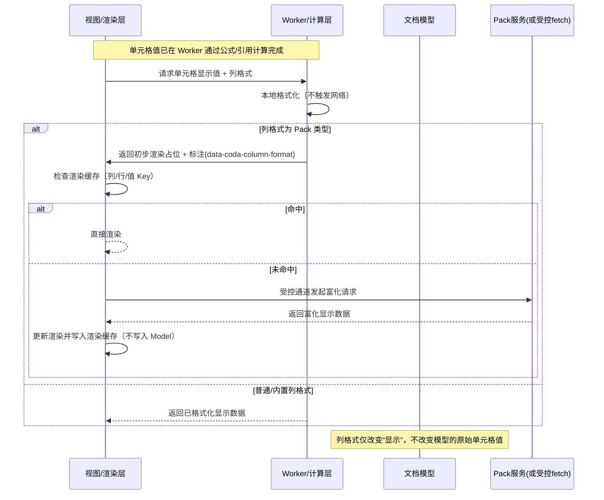

### 07 Pack 功能分析

本文综合官方文档与本仓库中压缩后的运行时代码，对 Coda 的 Pack 四大能力（Formulas / Actions / Column Formats / Pack Tables）进行技术拆解，重点说明其与引擎/模型/渲染层的衔接关系，并给出可复刻实现的关键路径与数据流。参考官方文档：[What are Packs?（Overview）](https://coda.io/packs/build/latest/guides/overview/#:~:text=A%20Pack%20is%20an%20extension,new%20powers%20to%20your%20doc)

#### 目录
- 背景与整体架构
- Formulas（Pack 公式）
- Actions（动作：UI / Model / External / System）
- Column Formats（列格式）
- Pack Tables（同步表）
- 实现要点与对标清单

---

### 背景与整体架构

- Pack 是对 Coda 内核能力的可插拔扩展，四类构件均通过统一的执行/渲染通道接入：
  - 计算：公式引擎在 Worker 内执行，Pack 公式通过受控 fetcher 与 Schema 映射对接结果。
  - 动作：统一由动作引擎分发，Pack 动作属于 External 子类；涉及数据写入时统一归并到模型合并层。
  - 列格式：明确“显示层”语义，不改动模型，只影响渲染；可通过事件 hook 通知“已应用”。
  - 同步表：本质是特殊的 Sync 公式，按 Schema 返回记录及同步元信息（continuation/completion/deletions/permissions），统一进入模型合并层。

---

### Formulas（Pack 公式）

核心机制：在定义期用“请求构造器 + 响应处理器”生成 `execute(args, ctx)`，执行期通过 `ctx.fetcher.fetch()` 发起受控请求，随后将结果按声明的 Schema 归一化；Worker 的公式引擎对 Pack/内置公式采用统一的“节点/令牌执行 + 结果包裹”路径。

关键实现：

1) TranslateObject（对象/表返回）：
```830:851:/data/workspace/codaany/source-code/webworker.bb42d3635dc7b11ff373.entry.js
t.makeTranslateObjectFormula = function({response: e, ...t}) {
  const {request: n, ...r} = t, {parameters: o} = r;
  e.schema = e.schema ? (0,S.normalizeSchema)(e.schema) : void 0;
  const {onError: i} = e, s = (_.generateRequestHandler)(n, o), a = (y.generateObjectResponseHandler)(e);
  return Object.assign({}, r, {
    execute: function(e, t) { return t.fetcher.fetch(s(e)).catch((e => { throw null == i || i(e), e })).then(a) },
    resultType: c.Type.object,
    schema: e.schema,
    validateParameters: F(t.validateParameters)
  })
}
```

2) Empty（字符串返回）：
```856:866:/data/workspace/codaany/source-code/webworker.bb42d3635dc7b11ff373.entry.js
t.makeEmptyFormula = function(e) {
  const {request: t, ...n} = e, {parameters: r} = n, o = (_.generateRequestHandler)(t, r);
  return Object.assign({}, n, {
    execute: function(e, t) { return t.fetcher.fetch(o(e)).then(( () => "")) },
    resultType: c.Type.string,
    validateParameters: F(e.validateParameters)
  })
}
```

3) 与内核公式执行衔接（节点/令牌判定、引用读取与结果包裹）：
```15284:15318:/data/workspace/codaany/source-code/webworker.bb42d3635dc7b11ff373.entry.js
function m(e, t) {
  let n;
  if ((0,c.HP)(e)) n = e.execute(t);
  else {
    const s = e;
    if (!(0,u.P2)(s)) throw new Error(`Tried to execute an unsupported token ${h().inspect(s)}`);
    switch (s.type) {
      case r.ru.REFERENCE:
        n = t.resolver.fetch((0,i.Nn)(s.ref), t), n.sourceTokenKey || (n.sourceTokenKey = o.Aj);
        break;
      case r.ru.STRING:
      case r.ru.BOOLEAN:
      case r.ru.NUMERIC:
        n = a.mO(t.context, s.value);
        break;
      case r.ru.UNDEFINED:
        n = a.mO(t.context, void 0);
        break;
      case r.ru.ATREF:
        throw new Error(`Tried to execute an unsupported token ${h().inspect(s)}`);
      default: (0,i.pL)(s)
    }
  }
  const s = t.isVolatile;
  return t.resetVolatileGuard(), p(n, (0,c.IN)(e), s ? o.Aj : void 0)
}
```

4) 是否独立执行（影响依赖收集与包裹策略）：
```16156:16160:/data/workspace/codaany/source-code/webworker.bb42d3635dc7b11ff373.entry.js
function R(e) {
  return (0,p.HP)(e) ? e.isStandalone : !(C.Wg(e) || C.$C(e) && (i.Uu.isVariableRef(e.ref) || i.Uu.isColumnRef(e.ref) && e.ref?.willExecuteAsLoopVariable))
}
```

---

### Actions（动作：UI / Model / External / System）

动作统一进入“动作引擎”，先类型分发，再进入对应处理路径；涉及表格/列的更改通过模型合并层统一入库。Pack 动作属于 External 子类。

分发总览：
```111620:111700:/data/workspace/codaany/source-code/webworker.bb42d3635dc7b11ff373.entry.js
async executeActions(e, t) { ... }
async executeActionsWithoutFlush(e, t) { ... }
async _executeSingleAction(e, t) {
  ...
  switch (r.type) {
    case Ze.X2.UI: return this._executeUiAction(e, r);
    case Ze.X2.Model: return this._modelActionEngine.executeModelAction(e, r);
    case Ze.X2.External: return this._executeExternalAction(e, r);
    case Ze.X2.System: return async function(e) { ... }(r);
    default: return (0,c.pL)(r)
  }
}
```

External（含 Pack 动作、XHR、Sync 控制）:
```111708:111744:/data/workspace/codaany/source-code/webworker.bb42d3635dc7b11ff373.entry.js
async _executeExternalAction(e, t) {
  switch (t.name) {
    case Ze.a2.Xhr: ...
    case Ze.a2.Pack: return Pa(this._document, t);
    case Ze.a2.SyncTable: return this._executeSyncTableAction(e, t);
    case Ze.a2.SyncTableUpdate: return this._executeSyncTableUpdateAction(e, t);
    case Ze.a2.StartSync:
    case Ze.a2.FinishSync: return this._executeSyncFunctionAction(e, t);
    case Ze.a2.TriggerSync: ...
  }
}
```

模型层合并（行为写入入库点）：
```136496:136513:/data/workspace/codaany/source-code/webworker.bb42d3635dc7b11ff373.entry.js
mergeRowsAndColumns({rowsToAdd: e, rowValuesToAdd: t, deletedRowIdsToAdd: n, columnsToAdd: r, columnValuesToAdd: o}, i, s) {
  const a = this.getRows({ includeHiddenSystemRows: !0 }), {items: c, deletedIds: u} = a;
  if (e) a.items = ag(c, e, { gridId: s, itemsType: sg.Rows });
  if (n) for (const e of n) u.push(e);
  const l = this.hydratedCellStorage;
  if (r) for (const e of r) l.addColumn(e.id, Boolean(e.formula));
  if (t) for (const [e,n] of Object.entries(t)) ...
}
```

四类动作的典型场景：
- UI：例如“打开对话框让用户选择目标列表，然后继续后续动作”。仅客户端可运行，自动化或服务端将报不支持。
- Model：例如“批量修改某表的多行状态字段、添加新列并填充默认值”。最终通过合并层写入模型。
- External（Pack）：例如“调用第三方任务系统 API 创建任务，然后在 Coda 中写入返回的外部任务链接”。网络通过受控代理/Pack 运行时执行。
- System：例如“占位或内部流程控制（Noop）”，用于流水线拼接或条件占位。

---

### Column Formats（列格式）

注册与标注：
```1196:1203:/data/workspace/codaany/source-code/webworker.bb42d3635dc7b11ff373.entry.js
addColumnFormat(e) { return this.formats.push(e), this }
```
```5890:5897:/data/workspace/codaany/source-code/webworker.bb42d3635dc7b11ff373.entry.js
e.ColumnFormat = "data-coda-column-format",
e.ColumnId = "data-coda-column-id",
...
```

应用 Pack 列格式时的 hook（用于 UI 跟踪/懒加载等）:
```40977:40989:/data/workspace/codaany/source-code/webworker.bb42d3635dc7b11ff373.entry.js
function G(e, t) {
  const n = { format: e };
  return t && e.type === i.o8.Pack && (n.notifyFormatApplied = (r, o) => {
    n.format === e && r.emit(s.QCO.ConnectedPackFormatApplied, {
      columnId: o, packId: e.packId, name: e.name, rowId: t
    })
  }),
  ...
}
```

渲染期自动调整列格式配置（非网络，写回“格式配置”，非单元格值）：
```41495:41501:/data/workspace/codaany/source-code/webworker.bb42d3635dc7b11ff373.entry.js
const o = ne.NZ(n.valueFormatConfig, e.context, r);
(O.Gz)(F.S8(n.valueFormatConfig), F.S8(o)) || e.changeColumnFormat(n.id, o, { parentCursor: null })
```

执行时序（显示层而非入库）：


结论：列格式富化结果不写入表格模型；仅更新列的“格式配置”或渲染缓存。

---

### Pack Tables（同步表）

客户端发起 Sync：
```1469:1479:/data/workspace/codaany/source-code/calc_client.a7f34509781620e1e7da.chunk.js
async invokeSyncFunction(..., {connectionId: o, dynamicUrl: a, schema: s, continuation: i, permissionSyncMode: c, ...}) {
  const m = new de.InvokeSyncFormulaRequest; this.addContext(e, m); this._addParameters(e, n, m); this._addConnection(o, m);
  const {packId: p, packVersion: h, name: y} = t, g = new de.SyncFormula;
  g.setPackId(p); g.setPackVersion(h); g.setName(y); m.setFormula(g);
  ...
}
```

Worker Getter 执行（错误 → Schema 映射 → 同步元信息）：
```480:524:/data/workspace/codaany/source-code/webworker.bb42d3635dc7b11ff373.entry.js
execute: async function(e, t) {
  let n; try { n = await C(e, t) || {} } catch (e) { throw null == T || T(e), e }
  const r = t.sync.schema, o = G({ body: n.result || [], status: 200, headers: {} }, r)
    , {continuation: i, completion: s, deletedItemIds: a, deletedRowIds: c, permissionsContext: u} = n
    , l = { result: o };
  return i && (l.continuation = i),
         s && (l.completion = s),
         (null != c ? c : a) && (l.deletedRowIds = null != c ? c : a, l.deletedItemIds = l.deletedRowIds),
         u && (l.permissionsContext = u),
         l
},
```

合并入模型：
```136496:136513:/data/workspace/codaany/source-code/webworker.bb42d3635dc7b11ff373.entry.js
mergeRowsAndColumns({rowsToAdd: e, rowValuesToAdd: t, deletedRowIdsToAdd: n, columnsToAdd: r, columnValuesToAdd: o}, i, s) {
  const a = this.getRows({ includeHiddenSystemRows: !0 }), {items: c, deletedIds: u} = a;
  if (e) a.items = ag(c, e, { gridId: s, itemsType: sg.Rows });
  if (n) for (const e of n) u.push(e);
  ...
}
```

端到端流程细化：
1) 触发同步（按钮/自动化/首次安装/定时）
2) 客户端构造请求（Pack 标识/版本/公式名、schema、connection、continuation、permissionSyncMode）
3) 服务端执行 Pack Sync 逻辑，返回 `result[]` + `continuation` + `completion` + `deletedItemIds/RowIds` + `permissionsContext`
4) Worker Getter 映射 Schema 与规范化同步元信息
5) 通过合并层统一写入表格（新增/更新/删除/新增列等）
6) 若有 `continuation` 继续下一轮；`completion` 可用于幂等/重试优化
7) 权限上下文限制后续读取/显示

---

### 实现要点与对标清单

- 公式
  - 定义：提供 `request builder`、`response handler`、`schema` 与 `execute(args, ctx)`
  - 执行：`ctx.fetcher.fetch`（受控网络）→ Schema 正常化 → 引擎统一包裹

- 动作
  - 统一分发：按 UI/Model/External/System 分类
  - Pack 动作：归于 External；涉及写入时通过合并层入库

- 列格式
  - 显示层语义：不写表值，只写渲染缓存/列格式配置
  - Hook：`ConnectedPackFormatApplied` 等供 UI 侧监听

- 同步表
  - 特殊 Sync 公式：返回行数组 + 同步元信息
  - 合并与删除：统一通过模型合并层处理


