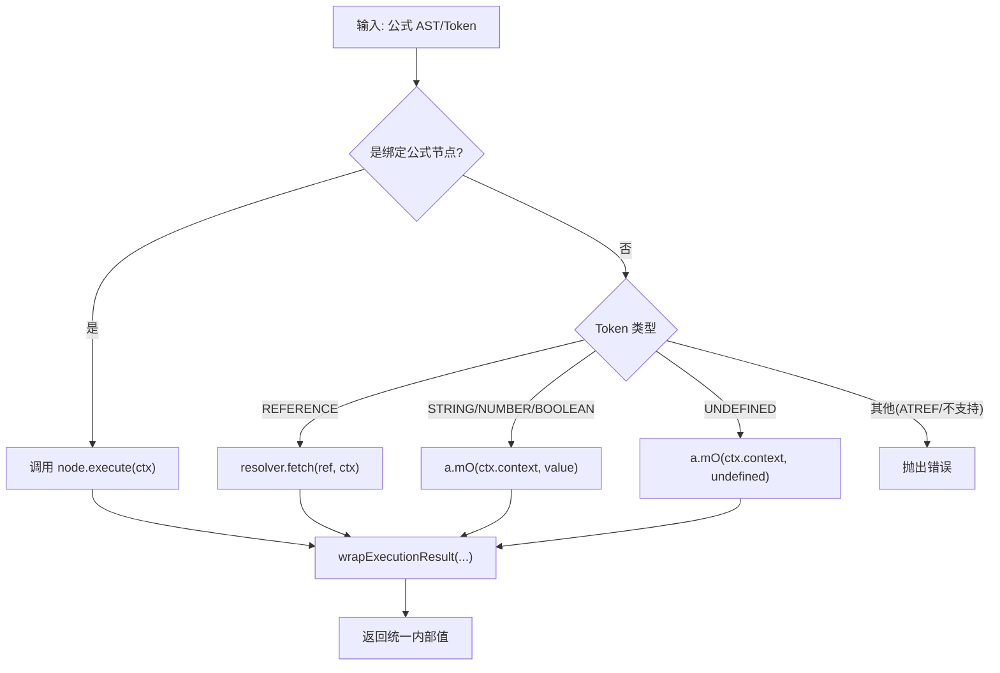
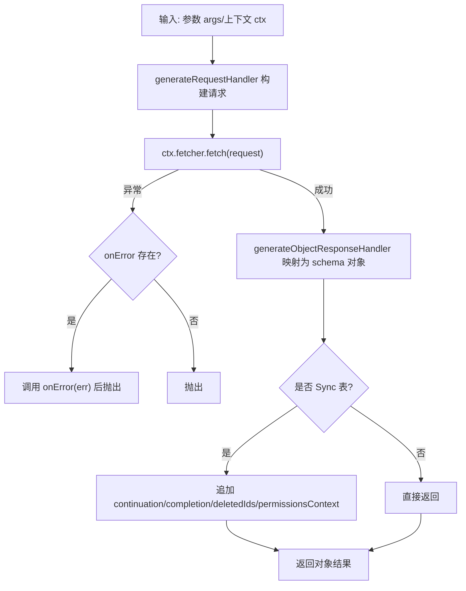
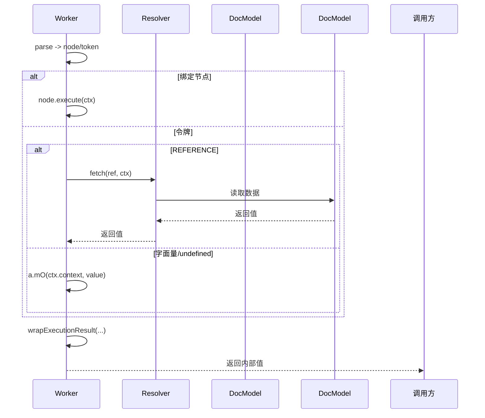
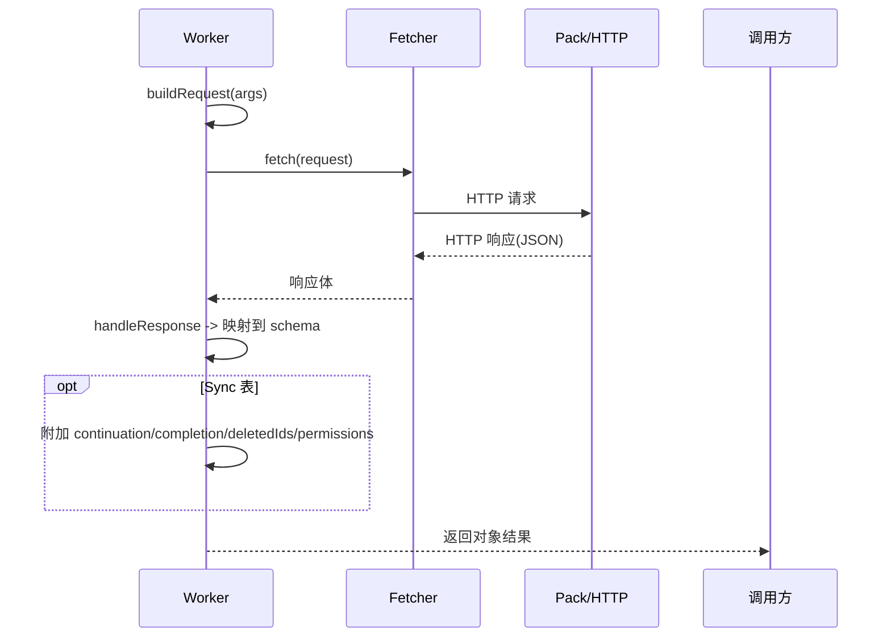

### Formula Engine 图解（Worker 侧）

本文档基于 `source-code/webworker.bb42d3635dc7b11ff373.entry.js` 的实际实现，结合已可读化的 `analysis/formula_engine_readable.js`，用图表展示 Coda 公式引擎在 Worker 中的执行路径，以及内置 formula 与 Pack formula 的差异。引用的源码片段均标注原文件行号。

### 参考文件
- 可读版实现：`analysis/formula_engine_readable.js`
- Worker 源码：`source-code/webworker.bb42d3635dc7b11ff373.entry.js`

### 内置公式执行流程（Flowchart）


关键包装与执行（引用）：
```15284:15318:source-code/webworker.bb42d3635dc7b11ff373.entry.js
let n;
if ((0,
c.HP)(e))
  n = e.execute(t);
else {
  const s = e;
  if (!(0,
  u.P2)(s))
    throw new Error(`Tried to execute an unsupported token ${h().inspect(s)}`);
  switch (s.type) {
  case r.ru.REFERENCE:
      n = t.resolver.fetch((0,
      i.Nn)(s.ref), t),
      n.sourceTokenKey || (n.sourceTokenKey = o.Aj);
      break;
  case r.ru.STRING:
  case r.ru.BOOLEAN:
  case r.ru.NUMERIC:
      n = a.mO(t.context, s.value);
      break;
  case r.ru.UNDEFINED:
      n = a.mO(t.context, void 0);
      break;
  case r.ru.ATREF:
      throw new Error(`Tried to execute an unsupported token ${h().inspect(s)}`);
  default:
      (0,
      i.pL)(s)
  }
}
const s = t.isVolatile;
return t.resetVolatileGuard(),
p(n, (0,
c.IN)(e), s ? o.Aj : void 0)
```

Standalone 判定（引用）：
```16156:16160:source-code/webworker.bb42d3635dc7b11ff373.entry.js
function R(e) {
  return (0,
  p.HP)(e) ? e.isStandalone : !(C.Wg(e) || C.$C(e) && (i.Uu.isVariableRef(e.ref) || i.Uu.isColumnRef(e.ref) && e.ref?.willExecuteAsLoopVariable))
}
```

### Pack 公式执行流程（Flowchart）


TranslateObject/Empty 执行（引用）：
```841:848:source-code/webworker.bb42d3635dc7b11ff373.entry.js
execute: function(e, t) {
  return t.fetcher.fetch(s(e)).catch((e => {
    throw null == i || i(e),
    e
  }
  )).then(a)
},
```

```861:863:source-code/webworker.bb42d3635dc7b11ff373.entry.js
execute: function(e, t) {
  return t.fetcher.fetch(o(e)).then(( () => ""))
},
```

Sync getter 封装（引用）：
```490:524:source-code/webworker.bb42d3635dc7b11ff373.entry.js
execute: async function(e, t) {
  let n;
  try {
    n = await C(e, t) || {}
  } catch (e) {
    throw null == T || T(e),
    e
  }
  const r = t.sync.schema
    , o = G({
        body: n.result || [],
        status: 200,
        headers: {}
  }, r)
    , {continuation: i, completion: s, deletedItemIds: a, deletedRowIds: c, permissionsContext: u} = n
    , l = {
        result: o
  };
  return i && (l.continuation = i),
  s && (l.completion = s),
  (null != c ? c : a) && (l.deletedRowIds = null != c ? c : a,
  l.deletedItemIds = l.deletedRowIds),
  u && (l.permissionsContext = u),
  l
},
```

### 内置 vs Pack：时序图（Sequence）

内置公式（引用/字面量为例）：


Pack 公式（TranslateObject 为例）：


### 差异要点
- 执行位置：
  - 内置：全在 Worker 内，数据访问通过 `resolver.fetch` 直接读文档模型。
  - Pack：通过 `ctx.fetcher` 发起网络请求，并用 schema 处理返回。
- 错误处理：
  - 内置：引擎内部抛错为主；对不可达分支用断言/保护。
  - Pack：`execute(...).catch(err => { onError?.(err); throw err; })` 可挂接用户可见错误映射。
- 结果包装：
  - 内置：用 `wrapExecutionResult`（源码 `p(...)`）统一添加易失性标记、`isStandalone` 等。
  - Pack：`generateObjectResponseHandler` 将响应映射为声明的 schema；Sync 模式追加同步相关字段。

### 衔接可读版实现
- `wrapExecutionResult`、`executeNodeOrToken`、`executeWithCurrentValue`、`isStandalone`：见 `analysis/formula_engine_readable.js`。
- `packTranslateObjectExecute`、`packEmptyExecute`、`packSyncGetterExecute`：对应上文引用的执行与结果封装逻辑。


