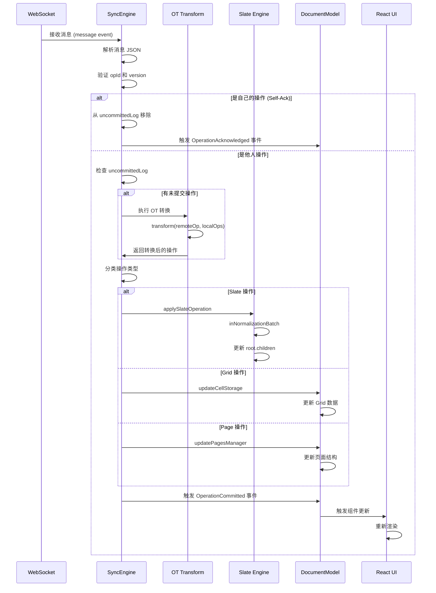

## Chrome DevTools 调试指南

### 查看 DocumentModel 数据结构

#### 1. 访问全局对象

```javascript
// 在 Console 中执行
window.coda.documentModel
```

**主要属性说明：**

```javascript
{
  id: "doc-abc123",                    // 文档 ID
  title: { getTitle: fn, ... },       // 文档标题对象
  pagesManager: { ... },               // 页面管理器
  syncEngine: { ... },                 // 同步引擎
  session: { ... },                    // 会话对象
  isDeferredHydrationComplete: true    // 是否完成水合
}
```

#### 2. 查看页面结构

```javascript
// 获取所有页面
const pages = window.coda.documentModel.pagesManager.getFlattenedPages();

// 打印页面树状结构
pages.forEach(page => {
  console.log(`📄 ${page.name}`, {
    id: page.id,
    canvasId: page.canvasId,
    parentId: page.parentId,
    icon: page.icon
  });
});

// 获取当前活动页面
const activePage = window.coda.documentModel.pagesManager.activePage;
console.log('当前页面:', activePage.name);
```

#### 3. 查看 Block Tree

```javascript
// 获取当前页面的 Slate 文档树
const canvas = window.coda.documentModel.pagesManager.activePage?.canvas;
const root = canvas?.slate.root;

// 查看所有顶层 Block
console.log('顶层 Blocks:', root.children);

// 递归打印整个树
function printBlockTree(node, depth = 0) {
  const indent = '  '.repeat(depth);
  
  if (node.type) {
    console.log(`${indent}📦 ${node.type} [id: ${node.id || 'no-id'}]`);
    
    // 显示特殊属性
    if (node.style) console.log(`${indent}   style: ${node.style}`);
    if (node.alignment) console.log(`${indent}   alignment: ${node.alignment}`);
  }
  
  if (node.children) {
    for (const child of node.children) {
      printBlockTree(child, depth + 1);
    }
  } else if (node.text !== undefined) {
    console.log(`${indent}📝 "${node.text}"`);
  }
}

printBlockTree(root);
```

#### 4. 查看表格数据

```javascript
// 获取当前页面所有表格
const grids = canvas?.getCanvasGrids();

grids?.forEach(grid => {
  console.log(`📊 表格: ${grid.name}`, {
    id: grid.id,
    columnCount: grid.columns.length,
    rowCount: grid.rows?.length || 0
  });
  
  // 查看列信息
  grid.columns.forEach((col, i) => {
    console.log(`  列 ${i + 1}: ${col.name}`, {
      type: col.valueFormatConfig.type,
      id: col.id
    });
  });
  
  // 查看行数据（前 5 行）
  const rows = grid.rows?.slice(0, 5);
  rows?.forEach((row, i) => {
    console.log(`  行 ${i + 1}:`, row.id);
    
    // 查看单元格数据
    grid.columns.forEach(col => {
      const cellValue = grid.getCellValue(row.id, col.id);
      console.log(`    ${col.name}: ${JSON.stringify(cellValue)}`);
    });
  });
});
```

#### 5. 使用 Chrome DevTools Elements 面板

在 Elements 面板中，每个 Block 元素都有特殊的 `data-*` 属性：

```html
<!-- Paragraph Block -->
<div data-editable-id="node-abc-123" 
     data-block-type="paragraph"
     class="...">
  Hello World
</div>

<!-- Table Block -->
<div data-editable-id="grid-xyz-456"
     data-block-type="table">
  ...
</div>
```

**在 Elements 面板中选中元素后，可以在 Console 中访问：**

```javascript
// 获取选中的元素
const el = $0; // Chrome DevTools 的 $0 表示当前选中元素

// 获取 Block ID
const blockId = el.getAttribute('data-editable-id');

// 通过 ID 获取 Block 节点
const [node, path] = Slate.ib.getNodeEntryForElementId(
  canvas.slate.root, 
  blockId
);

console.log('Block 节点:', node);
console.log('Path:', path);
```

### 查看协同消息

#### 1. 监听 WebSocket 消息

**方法 1：使用 Chrome DevTools Network 面板**

1. 打开 DevTools → Network 面板
2. 筛选 `WS`（WebSocket）
3. 点击 WebSocket 连接
4. 查看 Messages 标签页

**消息格式示例：**

```json
{
  "type": "operation",
  "data": {
    "opId": "op-1234567890",
    "type": "SLATE_INSERT_TEXT",
    "version": 123,
    "appInstanceId": "client-abc",
    "sequenceNumber": 456,
    "data": {
      "path": [2, 0],
      "offset": 5,
      "text": "Hello"
    }
  }
}
```

**方法 2：在代码中拦截消息**

```javascript
// 保存原始的 WebSocket send 和 onmessage
const originalSend = WebSocket.prototype.send;
const originalOnMessage = Object.getOwnPropertyDescriptor(
  WebSocket.prototype, 
  'onmessage'
);

// 拦截发送的消息
WebSocket.prototype.send = function(data) {
  console.log('📤 发送消息:', JSON.parse(data));
  return originalSend.apply(this, arguments);
};

// 拦截接收的消息
Object.defineProperty(WebSocket.prototype, 'onmessage', {
  set: function(callback) {
    const wrappedCallback = function(event) {
      console.log('📥 接收消息:', JSON.parse(event.data));
      return callback.apply(this, arguments);
    };
    originalOnMessage.set.call(this, wrappedCallback);
  }
});
```

#### 2. 查看未提交的操作日志

```javascript
// 查看本地未提交的操作
const uncommittedOps = window.coda.documentModel.syncEngine.uncommittedLog.fetchAll();

console.log(`📋 未提交操作数: ${uncommittedOps.length}`);

uncommittedOps.forEach((op, i) => {
  console.log(`操作 ${i + 1}:`, {
    opId: op.opId,
    type: op.type,
    sequenceNumber: op.sequenceNumber,
    data: op.data
  });
});
```

#### 3. 查看 IndexedDB 中的数据

**在 Chrome DevTools Application 面板：**

1. **Application** → **IndexedDB**
2. 展开 `idb_uncommitted` 数据库
3. 查看 `operations` 对象存储

**在 Console 中查询：**

```javascript
// 打开 IndexedDB 数据库
const dbRequest = indexedDB.open('idb_uncommitted');

dbRequest.onsuccess = (event) => {
  const db = event.target.result;
  const tx = db.transaction(['operations'], 'readonly');
  const store = tx.objectStore('operations');
  const getAllRequest = store.getAll();
  
  getAllRequest.onsuccess = () => {
    console.log('💾 IndexedDB 中的操作:', getAllRequest.result);
  };
};
```

#### 4. 监听 SyncEngine 事件

```javascript
// 监听协同引擎的事件
const syncEngine = window.coda.documentModel.syncEngine;

// 自定义事件监听器
const eventTypes = [
  'QCO.OperationCommitted',
  'QCO.OperationReceived',
  'QCO.SyncStateChanged'
];

// 注意：实际事件名称可能需要查看代码确认
console.log('🎧 开始监听同步事件...');

// 查看当前连接状态
console.log('WebSocket 状态:', syncEngine.connection?.readyState);
// 0: CONNECTING, 1: OPEN, 2: CLOSING, 3: CLOSED
```

#### 5. 实时监控协同消息流

```javascript
// 创建一个消息监控器
class CollaborationMonitor {
  constructor() {
    this.messages = [];
    this.maxMessages = 100;
    this.setupInterceptors();
  }
  
  setupInterceptors() {
    const originalSend = WebSocket.prototype.send;
    const self = this;
    
    WebSocket.prototype.send = function(data) {
      try {
        const parsed = JSON.parse(data);
        self.logMessage('sent', parsed);
      } catch (e) {}
      return originalSend.apply(this, arguments);
    };
  }
  
  logMessage(direction, message) {
    this.messages.push({
      timestamp: Date.now(),
      direction,
      type: message.type,
      data: message
    });
    
    if (this.messages.length > this.maxMessages) {
      this.messages.shift();
    }
    
    this.printMessage(direction, message);
  }
  
  printMessage(direction, message) {
    const icon = direction === 'sent' ? '📤' : '📥';
    const style = direction === 'sent' 
      ? 'color: blue; font-weight: bold' 
      : 'color: green; font-weight: bold';
    
    console.log(`%c${icon} ${direction.toUpperCase()}`, style, message);
  }
  
  getStats() {
    return {
      total: this.messages.length,
      sent: this.messages.filter(m => m.direction === 'sent').length,
      received: this.messages.filter(m => m.direction === 'received').length,
      types: this.messages.reduce((acc, m) => {
        acc[m.type] = (acc[m.type] || 0) + 1;
        return acc;
      }, {})
    };
  }
}

// 使用监控器
window.collabMonitor = new CollaborationMonitor();

// 查看统计
console.log('📊 协同消息统计:', window.collabMonitor.getStats());
```

---

## 协同消息应用流程详解

### 完整的消息处理链路



### 详细流程步骤

#### 步骤 1：WebSocket 消息接收

```javascript
// SyncEngine 接收消息
class SyncEngine {
  constructor() {
    this.connection = new WebSocket(wsUrl);
    this.connection.onmessage = this.handleMessage.bind(this);
  }
  
  handleMessage(event) {
    const message = JSON.parse(event.data);
    
    console.log('📥 收到消息:', {
      type: message.type,
      opId: message.data?.opId,
      version: message.data?.version
    });
    
    // 分发到不同的处理器
    switch (message.type) {
      case 'operation':
        this.handleOperation(message.data);
        break;
      case 'subscribe_ack':
        this.handleSubscribeAck(message.data);
        break;
      case 'sync_state':
        this.handleSyncState(message.data);
        break;
    }
  }
}
```

#### 步骤 2：操作验证和分类

```javascript
handleOperation(operation) {
  const { opId, version, appInstanceId, type, data } = operation;
  
  // 1. 检查是否是自己的操作（Self-Ack）
  const isSelfOp = this._checkIfSelfOperation(opId, appInstanceId);
  
  if (isSelfOp) {
    console.log('✅ Self-Ack: 确认自己的操作', opId);
    this.uncommittedLog.remove(opId);
    this._emitEvent('OperationAcknowledged', { opId });
    return;
  }
  
  // 2. 获取未提交的操作列表
  const uncommittedOps = this.uncommittedLog.fetchAll();
  
  // 3. 如果有未提交操作，需要 OT 转换
  let transformedOp = operation;
  if (uncommittedOps.length > 0) {
    transformedOp = this._transformOperation(operation, uncommittedOps);
  }
  
  // 4. 应用操作
  this._applyCommittedOperation(transformedOp);
}
```

#### 步骤 3：OT 转换算法

```javascript
_transformOperation(remoteOp, uncommittedOps) {
  console.log('🔄 执行 OT 转换:', {
    remoteOp: remoteOp.type,
    localOpsCount: uncommittedOps.length
  });
  
  let transformedRemoteOp = remoteOp;
  const transformedLocalOps = new Map();
  
  // 对每个本地操作进行转换
  for (const localOp of uncommittedOps) {
    // 调用 OT 算法核心函数
    const { 
      transformedCommittedOps,
      transformedUncommittedOpsMap 
    } = this._otTransform(
      [localOp],
      transformedRemoteOp,
      this.document
    );
    
    transformedRemoteOp = transformedCommittedOps[0];
    transformedLocalOps.set(localOp.opId, transformedUncommittedOpsMap.get(localOp.opId));
  }
  
  // 更新本地操作队列
  for (const [opId, transformedLocalOp] of transformedLocalOps) {
    this.uncommittedLog.update(opId, transformedLocalOp);
  }
  
  return transformedRemoteOp;
}
```

#### 步骤 4：应用到 DocumentModel

```javascript
_applyCommittedOperation(operation) {
  const { type, data } = operation;
  
  console.log('✍️ 应用操作:', type);
  
  // 根据操作类型分发
  switch (type) {
    // === Slate 文档操作 ===
    case 'SLATE_INSERT_TEXT':
      this._applySlateInsertText(data);
      break;
      
    case 'SLATE_REMOVE_TEXT':
      this._applySlateRemoveText(data);
      break;
      
    case 'SLATE_INSERT_NODE':
      this._applySlateInsertNode(data);
      break;
      
    case 'SLATE_REMOVE_NODE':
      this._applySlateRemoveNode(data);
      break;
      
    case 'SLATE_SET_NODE':
      this._applySlateSetNode(data);
      break;
      
    // === 表格操作 ===
    case 'BULK_MODIFY_ROW_VALUE':
      this._applyBulkModifyRowValue(data);
      break;
      
    case 'ADD_COLUMN':
      this._applyAddColumn(data);
      break;
      
    case 'REMOVE_COLUMN':
      this._applyRemoveColumn(data);
      break;
      
    // === 页面操作 ===
    case 'CHANGE_PAGE_NAME':
      this._applyChangePageName(data);
      break;
      
    case 'ADD_PAGE':
      this._applyAddPage(data);
      break;
      
    default:
      console.warn('未知操作类型:', type);
  }
  
  // 触发更新事件
  this._emitEvent('OperationCommitted', { operation });
}
```

#### 步骤 5：Slate 操作应用

```javascript
_applySlateInsertText(data) {
  const { canvasId, path, offset, text } = data;
  
  // 1. 获取目标 Canvas
  const canvas = this.document.session.resolver.typedGetters.getPageCanvas(canvasId);
  
  // 2. 在 normalization batch 中执行
  canvas.slate.inNormalizationBatch((editor) => {
    console.log('📝 插入文本:', {
      path,
      offset,
      text,
      length: text.length
    });
    
    // 3. 定位到指定位置
    const point = { path, offset };
    
    // 4. 插入文本
    Slate.ib.insertTextAtPoint(editor, text, point);
    
    // 5. Slate 会自动触发 normalization
    // 这会更新内部状态并触发 onChange 事件
  });
  
  // 6. Canvas 会触发更新事件
  canvas._emitEvent('SlateChanged');
}
```

#### 步骤 6：Grid 操作应用

```javascript
_applyBulkModifyRowValue(data) {
  const { gridId, rows } = data;
  
  // 1. 获取 Grid 对象
  const grid = this.document.session.resolver.typedGetters.getGrid(gridId);
  
  console.log('📊 批量修改行:', {
    gridId,
    rowCount: Object.keys(rows).length
  });
  
  // 2. 遍历要修改的行
  for (const [rowId, rowData] of Object.entries(rows)) {
    // 3. 遍历要修改的列
    for (const [columnId, cellData] of Object.entries(rowData.values)) {
      const { value } = cellData;
      
      // 4. 更新 CellStorage
      grid.cellStorage.setValue(rowId, columnId, value);
      
      console.log(`  更新单元格 [${rowId}, ${columnId}]:`, value);
    }
  }
  
  // 5. 触发 Grid 更新事件
  grid._emitEvent('CellsChanged', { rows: Object.keys(rows) });
  
  // 6. 如果有公式依赖，触发重算
  if (grid.hasFormulaDependencies) {
    this.document.formulaEngine.invalidate(gridId);
  }
}
```

#### 步骤 7：React 组件更新

```javascript
// React 组件监听 DocumentModel 事件
function CanvasComponent({ canvas }) {
  const [version, setVersion] = useState(0);
  
  useEffect(() => {
    // 监听 Slate 变更
    const handleSlateChanged = () => {
      console.log('🎨 Canvas 更新，触发重新渲染');
      setVersion(v => v + 1);
    };
    
    canvas.addEventListener('SlateChanged', handleSlateChanged);
    
    return () => {
      canvas.removeEventListener('SlateChanged', handleSlateChanged);
    };
  }, [canvas]);
  
  // 渲染 Slate 内容
  return <SlateRenderer canvas={canvas} key={version} />;
}
```

### 调试协同消息应用流程

#### 在关键点打断点

```javascript
// 1. 在 SyncEngine.handleOperation 打断点
window.coda.documentModel.syncEngine.handleOperation = new Proxy(
  window.coda.documentModel.syncEngine.handleOperation,
  {
    apply(target, thisArg, args) {
      debugger; // 在这里暂停
      console.log('🔍 处理操作:', args[0]);
      return target.apply(thisArg, args);
    }
  }
);

// 2. 在 Slate 更新时打断点
const canvas = window.coda.documentModel.pagesManager.activePage.canvas;
const originalInBatch = canvas.slate.inNormalizationBatch;

canvas.slate.inNormalizationBatch = function(fn) {
  console.log('⚡ Slate normalization batch 开始');
  debugger; // 在这里暂停
  return originalInBatch.call(this, fn);
};
```

#### 追踪操作生命周期

```javascript
// 创建操作追踪器
class OperationTracker {
  constructor() {
    this.operations = new Map();
  }
  
  track(opId, stage, data) {
    if (!this.operations.has(opId)) {
      this.operations.set(opId, {
        opId,
        stages: [],
        startTime: Date.now()
      });
    }
    
    const op = this.operations.get(opId);
    op.stages.push({
      stage,
      timestamp: Date.now(),
      data
    });
    
    console.log(`📍 [${opId}] ${stage}`, data);
  }
  
  getSummary(opId) {
    const op = this.operations.get(opId);
    if (!op) return null;
    
    const duration = op.stages[op.stages.length - 1].timestamp - op.startTime;
    
    return {
      opId,
      totalDuration: duration,
      stageCount: op.stages.length,
      stages: op.stages.map((s, i) => ({
        stage: s.stage,
        duration: i > 0 ? s.timestamp - op.stages[i-1].timestamp : 0
      }))
    };
  }
}

// 使用追踪器
window.opTracker = new OperationTracker();

// 在各个阶段调用
// opTracker.track(opId, 'received', { type, data });
// opTracker.track(opId, 'transformed', { ...});
// opTracker.track(opId, 'applied', { ...});
// opTracker.track(opId, 'rendered', { ...});
```

### 常见协同消息类型示例

#### 1. 插入文本消息

```json
{
  "type": "operation",
  "data": {
    "opId": "op-1234567890-abc",
    "type": "SLATE_INSERT_TEXT",
    "version": 123,
    "appInstanceId": "client-user-456",
    "sequenceNumber": 789,
    "data": {
      "canvasId": "canvas-xyz-123",
      "path": [2, 0],
      "offset": 5,
      "text": "Hello"
    },
    "timestamp": 1640000000000
  }
}
```

#### 2. 修改单元格消息

```json
{
  "type": "operation",
  "data": {
    "opId": "op-9876543210-def",
    "type": "BULK_MODIFY_ROW_VALUE",
    "version": 124,
    "data": {
      "gridId": "grid-abc-456",
      "rows": {
        "row-001": {
          "values": {
            "col-123": {
              "value": "新值",
              "type": "string"
            }
          }
        }
      }
    }
  }
}
```

#### 3. 添加页面消息

```json
{
  "type": "operation",
  "data": {
    "opId": "op-5555555555-ghi",
    "type": "ADD_PAGE",
    "version": 125,
    "data": {
      "pageId": "page-new-789",
      "name": "新页面",
      "parentId": "page-parent-123",
      "icon": "📄",
      "pageType": "MultiObjectCanvas"
    }
  }
}
```

---

*以上调试技巧基于 Coda 客户端代码的逆向分析，实际使用时可能需要根据具体版本调整。*