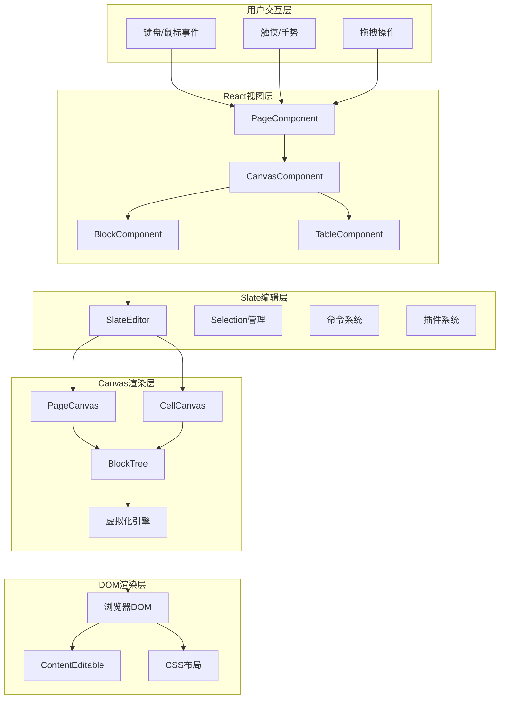
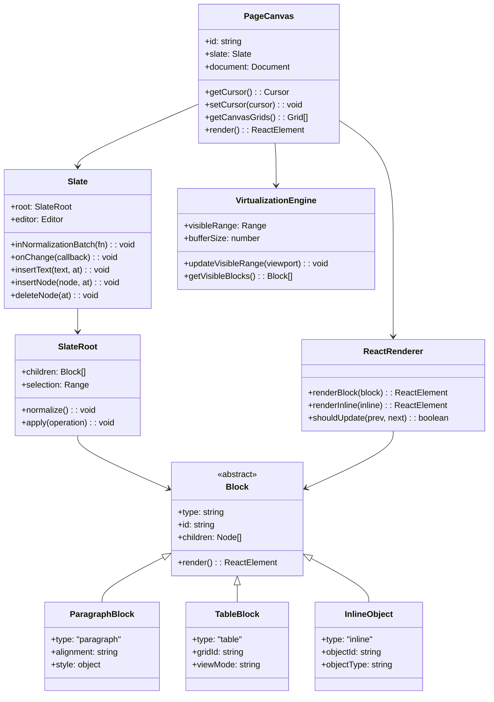
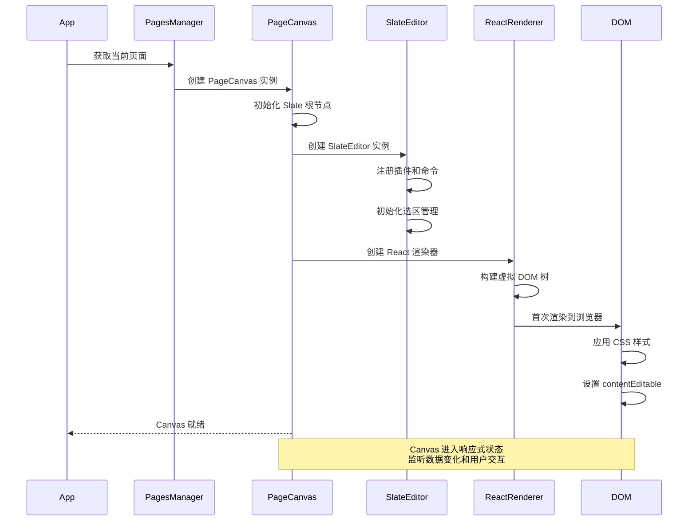
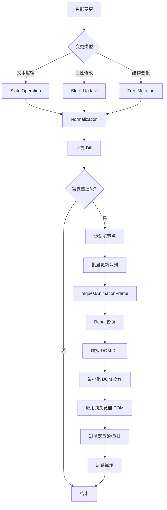
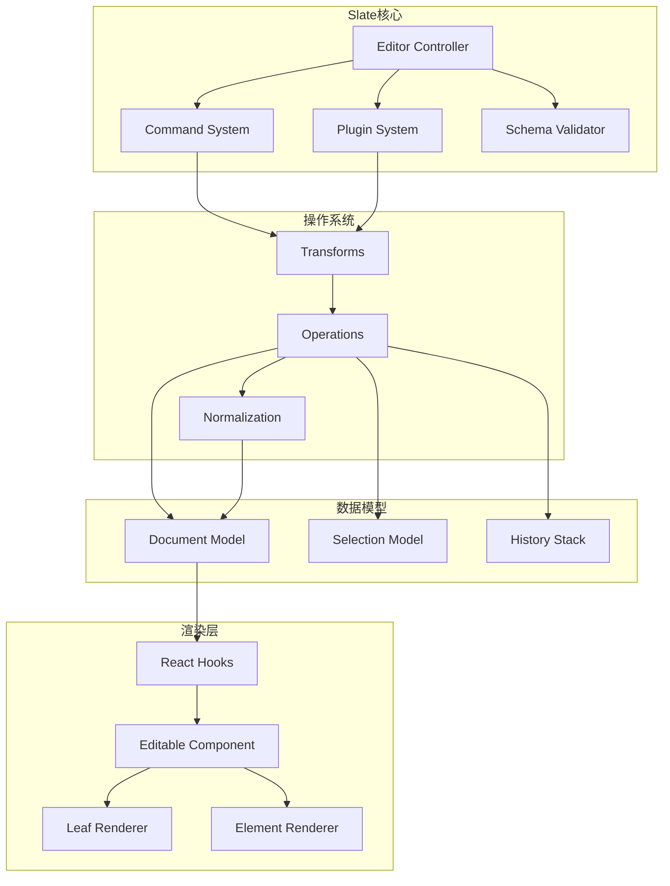
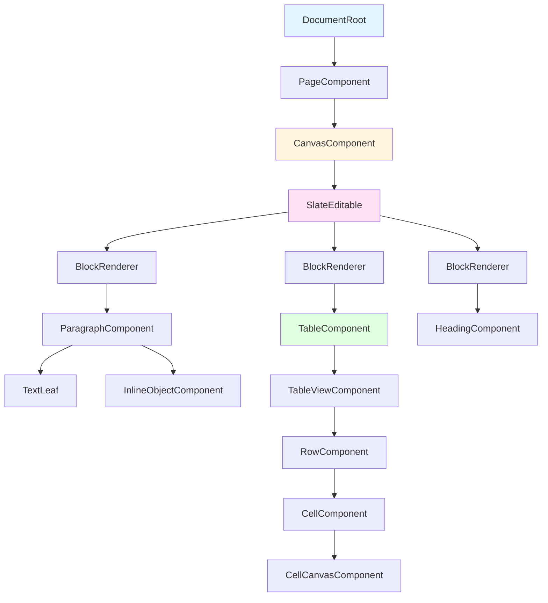
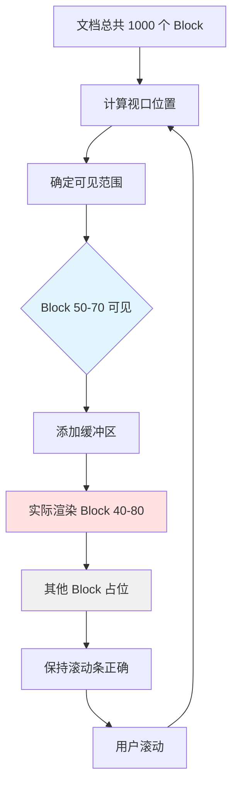
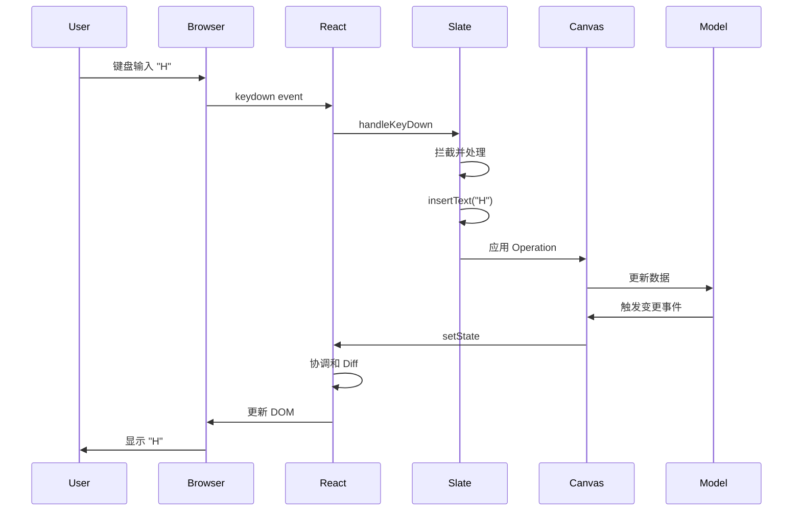

# Coda 渲染层深入分析

## 目录
- [1. 渲染层架构总览](#1-渲染层架构总览)
- [2. Canvas 渲染系统](#2-canvas-渲染系统)
- [3. Slate 富文本引擎](#3-slate-富文本引擎)
- [4. React 组件体系](#4-react-组件体系)
- [5. 虚拟化与性能优化](#5-虚拟化与性能优化)
- [6. 交互与事件处理](#6-交互与事件处理)

---

## 1. 渲染层架构总览

### 1.1 分层结构



### 1.2 核心类图



---

## 2. Canvas 渲染系统

### 2.1 Canvas 类型与职责

Coda 有两种类型的 Canvas：

1. **PageCanvas（页面画布）**
   - 代表一个完整的文档页面
   - 包含顶层的 Block Tree
   - 管理页面级别的光标和选区
   - 处理页面级别的滚动和虚拟化

2. **CellCanvas（单元格画布）**
   - 用于表格单元格内的富文本
   - 轻量级，功能受限
   - 共享部分 Slate 基础设施

### 2.2 Canvas 初始化流程



### 2.3 Canvas 数据结构

```typescript
// Canvas 的核心数据结构
interface PageCanvas {
  // 标识
  id: string;
  pageId: string;
  
  // Slate 富文本引擎
  slate: {
    root: SlateRoot;
    editor: Editor;
    selection: Range | null;
  };
  
  // 文档引用
  document: Document;
  
  // 可见性和虚拟化
  virtualization: {
    enabled: boolean;
    visibleRange: [number, number];
    bufferSize: number;
  };
  
  // 渲染状态
  renderState: {
    version: number;
    isDirty: boolean;
    pendingUpdates: Update[];
  };
  
  // 事件监听器
  listeners: Map<EventType, Callback[]>;
}

// Slate Root 数据结构
interface SlateRoot {
  // Block Tree
  children: Block[];
  
  // 选区信息
  selection: {
    anchor: { path: number[]; offset: number };
    focus: { path: number[]; offset: number };
  } | null;
  
  // 元数据
  version: number;
  timestamp: number;
}

// Block 数据结构（示例：Paragraph）
interface ParagraphBlock {
  type: "paragraph";
  id: string;
  
  // 样式属性
  alignment?: "left" | "center" | "right";
  style?: {
    fontSize?: number;
    color?: string;
    backgroundColor?: string;
  };
  
  // 子节点（文本和内联对象）
  children: (TextNode | InlineNode)[];
}
```

### 2.4 Canvas 渲染管道



### 2.5 Canvas 更新优化策略

```typescript
class CanvasOptimizer {
  // 1. 路径精确匹配 - 只更新受影响的子树
  shouldUpdateBlock(block: Block, changedPaths: Set<string>): boolean {
    const blockPath = this.getBlockPath(block);
    
    // 检查变更路径是否影响此 block
    for (const changedPath of changedPaths) {
      if (this.isPathAncestor(changedPath, blockPath)) {
        return true;
      }
    }
    
    return false;
  }
  
  // 2. 批量更新合并
  private updateQueue: Update[] = [];
  private scheduledUpdate: number | null = null;
  
  scheduleUpdate(update: Update): void {
    this.updateQueue.push(update);
    
    if (!this.scheduledUpdate) {
      this.scheduledUpdate = requestAnimationFrame(() => {
        this.flushUpdates();
      });
    }
  }
  
  private flushUpdates(): void {
    // 合并相邻的更新
    const mergedUpdates = this.mergeUpdates(this.updateQueue);
    
    // 按优先级排序
    mergedUpdates.sort((a, b) => b.priority - a.priority);
    
    // 执行更新
    for (const update of mergedUpdates) {
      this.applyUpdate(update);
    }
    
    this.updateQueue = [];
    this.scheduledUpdate = null;
  }
  
  // 3. 视口外延迟渲染
  shouldDeferRender(block: Block, viewport: Viewport): boolean {
    const blockRect = this.getBlockRect(block);
    
    // 检查是否在视口范围内（含缓冲区）
    const bufferZone = this.calculateBufferZone(viewport);
    
    return !this.intersects(blockRect, bufferZone);
  }
}
```

---

## 3. Slate 富文本引擎

### 3.1 Slate 架构概览



### 3.2 Block Tree 结构规范

Coda 的 Block Tree 有严格的层级规范：

```typescript
// 容器节点 - 可以包含其他节点
type ContainerBlock = 
  | CodeBlock          // 代码块（包含多个 CodeLine）
  | TableBlock         // 表格占位符
  | ColumnGroup        // 列布局容器
  | BlockQuote         // 引用块

// 行级节点 - 内容行
type LineBlock =
  | Paragraph          // 段落
  | Heading1 | Heading2 | Heading3  // 标题
  | BulletedList       // 无序列表项
  | NumberedList       // 有序列表项
  | CheckboxList       // 复选框列表项
  | CodeLine           // 代码行（仅在 CodeBlock 内）

// 内联节点 - 行内元素
type InlineNode =
  | TextNode                      // 纯文本
  | InlineStructuredValue         // 结构化值（@人员、链接等）
  | InlineCollaborativeObject     // 协作对象（按钮、公式、图片等）

// 树结构示例
const exampleTree: SlateRoot = {
  children: [
    {
      type: "heading1",
      id: "h1-001",
      children: [
        { text: "欢迎使用 Coda" }
      ]
    },
    {
      type: "paragraph",
      id: "p-001",
      alignment: "left",
      children: [
        { text: "这是一个 " },
        {
          type: "InlineStructuredValue",
          id: "link-001",
          structuredValueType: "Link",
          href: "https://coda.io",
          children: [{ text: "链接" }]
        },
        { text: " 示例。" }
      ]
    },
    {
      type: "table",
      id: "table-001",
      gridId: "grid-abc-123",
      children: [{ text: "" }] // 表格占位符必须有空文本子节点
    },
    {
      type: "paragraph",
      id: "p-002",
      children: [
        { text: "点击这个按钮：" },
        {
          type: "InlineCollaborativeObject",
          id: "button-001",
          children: [{ text: "" }] // 必须有空文本子节点
        }
      ]
    }
  ],
  selection: {
    anchor: { path: [1, 0], offset: 0 },
    focus: { path: [1, 0], offset: 5 }
  }
};
```

### 3.3 Normalization（归一化）机制

Normalization 是 Slate 保持树结构一致性的核心机制：

```typescript
class SlateNormalizer {
  /**
   * 归一化规则：确保文档树始终处于有效状态
   */
  normalize(editor: Editor, entry: NodeEntry): void {
    const [node, path] = entry;
    
    // 规则 1：容器节点必须有子节点
    if (Element.isElement(node) && node.children.length === 0) {
      Transforms.insertNodes(
        editor,
        { type: 'paragraph', children: [{ text: '' }] },
        { at: [...path, 0] }
      );
      return;
    }
    
    // 规则 2：行级节点不能嵌套
    if (this.isLineBlock(node) && path.length > 1) {
      const parent = Node.parent(editor, path);
      if (this.isLineBlock(parent)) {
        Transforms.unwrapNodes(editor, { at: path });
        return;
      }
    }
    
    // 规则 3：内联节点必须在行级节点内
    if (this.isInlineNode(node) && !this.isInLineBlock(Node.parent(editor, path))) {
      Transforms.wrapNodes(
        editor,
        { type: 'paragraph', children: [] },
        { at: path }
      );
      return;
    }
    
    // 规则 4：InlineCollaborativeObject 必须前后有文本节点
    if (node.type === 'InlineCollaborativeObject') {
      this.ensureTextNeighbors(editor, path);
      return;
    }
    
    // 规则 5：选区必须在有效范围内
    if (Editor.isEditor(node) && editor.selection) {
      const { anchor, focus } = editor.selection;
      if (!this.isValidPoint(editor, anchor) || !this.isValidPoint(editor, focus)) {
        Transforms.select(editor, Editor.start(editor, []));
        return;
      }
    }
  }
  
  /**
   * 归一化批次：所有修改必须在批次内完成
   */
  inNormalizationBatch(editor: Editor, fn: () => void): void {
    // 暂停归一化
    Editor.withoutNormalizing(editor, () => {
      // 执行用户操作
      fn();
    });
    
    // 恢复归一化并立即执行
    Editor.normalize(editor);
  }
}
```

### 3.4 Slate 操作类型与应用

```typescript
// Slate 操作类型枚举
enum SlateOperationType {
  // 文本操作
  INSERT_TEXT = "insert_text",
  REMOVE_TEXT = "remove_text",
  
  // 节点操作
  INSERT_NODE = "insert_node",
  REMOVE_NODE = "remove_node",
  SPLIT_NODE = "split_node",
  MERGE_NODE = "merge_node",
  
  // 属性操作
  SET_NODE = "set_node",
  
  // 选区操作
  SET_SELECTION = "set_selection"
}

// 操作应用示例
class SlateOperationApplier {
  applyInsertText(editor: Editor, op: InsertTextOperation): void {
    const { path, offset, text } = op;
    
    // 1. 定位到目标文本节点
    const [textNode] = Editor.node(editor, path);
    
    // 2. 插入文本
    const newText = 
      textNode.text.slice(0, offset) + 
      text + 
      textNode.text.slice(offset);
    
    // 3. 更新节点
    Transforms.setNodes(
      editor,
      { text: newText },
      { at: path }
    );
    
    // 4. 更新选区
    if (editor.selection) {
      const newOffset = offset + text.length;
      Transforms.select(editor, {
        anchor: { path, offset: newOffset },
        focus: { path, offset: newOffset }
      });
    }
  }
  
  applyInsertNode(editor: Editor, op: InsertNodeOperation): void {
    const { path, node } = op;
    
    // 1. 插入节点
    Transforms.insertNodes(editor, node, { at: path });
    
    // 2. 触发归一化
    Editor.normalize(editor, { force: true });
  }
  
  applyRemoveNode(editor: Editor, op: RemoveNodeOperation): void {
    const { path } = op;
    
    // 1. 移除节点
    Transforms.removeNodes(editor, { at: path });
    
    // 2. 确保选区有效
    if (editor.selection) {
      const newPath = this.getValidPathAfterRemove(editor, path);
      if (newPath) {
        Transforms.select(editor, Editor.start(editor, newPath));
      }
    }
  }
}
```

### 3.5 Slate 与 ContentEditable 集成

```typescript
/**
 * Slate 使用浏览器的 contentEditable 进行文本输入
 * 但完全接管了编辑行为的处理
 */
class SlateEditableIntegration {
  setupEventHandlers(element: HTMLElement, editor: Editor): void {
    // 1. 键盘事件
    element.addEventListener('keydown', (e) => {
      this.handleKeyDown(e, editor);
    });
    
    // 2. 输入事件（IME 支持）
    element.addEventListener('beforeinput', (e) => {
      e.preventDefault();
      this.handleBeforeInput(e, editor);
    });
    
    // 3. 选区变化
    document.addEventListener('selectionchange', () => {
      this.syncSelection(editor);
    });
    
    // 4. 剪贴板事件
    element.addEventListener('copy', (e) => {
      e.preventDefault();
      this.handleCopy(e, editor);
    });
    
    element.addEventListener('paste', (e) => {
      e.preventDefault();
      this.handlePaste(e, editor);
    });
  }
  
  handleKeyDown(e: KeyboardEvent, editor: Editor): void {
    // 拦截特殊键
    if (e.key === 'Enter') {
      e.preventDefault();
      
      if (e.shiftKey) {
        // Shift+Enter: 插入软换行
        editor.insertText('\n');
      } else {
        // Enter: 分割块
        Transforms.splitNodes(editor);
      }
      return;
    }
    
    if (e.key === 'Backspace') {
      e.preventDefault();
      
      if (Editor.isStart(editor, editor.selection!.anchor)) {
        // 在块开头删除：合并到上一块
        Transforms.mergeNodes(editor);
      } else {
        // 正常删除字符
        editor.deleteBackward('character');
      }
      return;
    }
    
    // 快捷键
    if (e.metaKey || e.ctrlKey) {
      switch (e.key) {
        case 'b':
          e.preventDefault();
          this.toggleBold(editor);
          break;
        case 'i':
          e.preventDefault();
          this.toggleItalic(editor);
          break;
        case 'z':
          e.preventDefault();
          if (e.shiftKey) {
            editor.redo();
          } else {
            editor.undo();
          }
          break;
      }
    }
  }
  
  syncSelection(editor: Editor): void {
    const domSelection = window.getSelection();
    if (!domSelection || domSelection.rangeCount === 0) {
      return;
    }
    
    const domRange = domSelection.getRangeAt(0);
    
    // 将 DOM 选区转换为 Slate 选区
    const slateRange = ReactEditor.toSlateRange(
      editor,
      domRange,
      { exactMatch: false }
    );
    
    // 更新 Slate 选区
    if (slateRange && !Range.equals(slateRange, editor.selection)) {
      Transforms.select(editor, slateRange);
    }
  }
}
```

---

## 4. React 组件体系

### 4.1 组件层次结构



### 4.2 核心 React 组件实现

```typescript
/**
 * Canvas 组件 - 渲染整个页面画布
 */
function CanvasComponent({ canvas }: { canvas: PageCanvas }) {
  const [version, setVersion] = useState(0);
  const editorRef = useRef<HTMLDivElement>(null);
  
  // 监听 Canvas 数据变化
  useEffect(() => {
    const handleSlateChange = () => {
      setVersion(v => v + 1);
    };
    
    canvas.slate.onChange(handleSlateChange);
    
    return () => {
      canvas.slate.offChange(handleSlateChange);
    };
  }, [canvas]);
  
  // 虚拟化支持
  const visibleBlocks = useVirtualization(
    canvas.slate.root.children,
    editorRef
  );
  
  return (
    <div 
      ref={editorRef}
      className="canvas-container"
      data-canvas-id={canvas.id}
    >
      <SlateEditable
        editor={canvas.slate.editor}
        value={canvas.slate.root}
        blocks={visibleBlocks}
        renderBlock={renderBlock}
        renderLeaf={renderLeaf}
      />
    </div>
  );
}

/**
 * Block 渲染器 - 根据类型渲染不同的块
 */
function renderBlock(props: RenderElementProps): ReactElement {
  const { element, attributes, children } = props;
  
  switch (element.type) {
    case 'paragraph':
      return (
        <p
          {...attributes}
          data-editable-id={element.id}
          style={{
            textAlign: element.alignment,
            ...element.style
          }}
        >
          {children}
        </p>
      );
      
    case 'heading1':
      return (
        <h1 {...attributes} data-editable-id={element.id}>
          {children}
        </h1>
      );
      
    case 'table':
      return (
        <div {...attributes} data-editable-id={element.id}>
          <TableBlock gridId={element.gridId} />
          {children} {/* 必须渲染 children，即使是空文本 */}
        </div>
      );
      
    case 'InlineCollaborativeObject':
      return (
        <span
          {...attributes}
          contentEditable={false} // 内联对象不可编辑
          data-editable-id={element.id}
        >
          <InlineObjectRenderer objectId={element.id} />
          {children}
        </span>
      );
      
    default:
      return <div {...attributes}>{children}</div>;
  }
}

/**
 * Leaf 渲染器 - 渲染文本叶子节点
 */
function renderLeaf(props: RenderLeafProps): ReactElement {
  const { leaf, attributes, children } = props;
  
  let content = children;
  
  // 应用文本样式
  if (leaf.bold) {
    content = <strong>{content}</strong>;
  }
  
  if (leaf.italic) {
    content = <em>{content}</em>;
  }
  
  if (leaf.underline) {
    content = <u>{content}</u>;
  }
  
  if (leaf.code) {
    content = <code>{content}</code>;
  }
  
  if (leaf.color) {
    content = <span style={{ color: leaf.color }}>{content}</span>;
  }
  
  return <span {...attributes}>{content}</span>;
}
```

### 4.3 React 性能优化

```typescript
/**
 * 使用 React.memo 避免不必要的重渲染
 */
const BlockComponent = React.memo(
  function BlockComponent({ block, path }: BlockProps) {
    // 渲染逻辑
    return renderBlock(block);
  },
  (prevProps, nextProps) => {
    // 自定义比较逻辑
    return (
      prevProps.block.id === nextProps.block.id &&
      prevProps.block.type === nextProps.block.type &&
      shallowEqual(prevProps.block.children, nextProps.block.children)
    );
  }
);

/**
 * 使用 Context 避免 prop drilling
 */
const CanvasContext = createContext<PageCanvas | null>(null);

function CanvasProvider({ canvas, children }) {
  return (
    <CanvasContext.Provider value={canvas}>
      {children}
    </CanvasContext.Provider>
  );
}

function useCanvas(): PageCanvas {
  const canvas = useContext(CanvasContext);
  if (!canvas) {
    throw new Error('useCanvas must be used within CanvasProvider');
  }
  return canvas;
}

/**
 * 使用 useMemo 缓存昂贵的计算
 */
function TableComponent({ gridId }: { gridId: string }) {
  const canvas = useCanvas();
  const resolver = canvas.document.session.resolver;
  
  // 缓存 Grid 对象
  const grid = useMemo(
    () => resolver.typedGetters.getGrid(gridId),
    [resolver, gridId]
  );
  
  // 缓存可见行
  const visibleRows = useMemo(
    () => grid.rows.slice(viewport.startRow, viewport.endRow),
    [grid.rows, viewport]
  );
  
  return (
    <div className="table-container">
      {visibleRows.map(row => (
        <RowComponent key={row.id} row={row} />
      ))}
    </div>
  );
}
```

---

## 5. 虚拟化与性能优化

### 5.1 虚拟化原理



### 5.2 虚拟化实现

```typescript
/**
 * 虚拟化引擎 - 只渲染可见区域的内容
 */
class VirtualizationEngine {
  private container: HTMLElement;
  private blocks: Block[];
  private viewportHeight: number;
  private scrollTop: number;
  private blockHeights: Map<string, number> = new Map();
  
  // 配置
  private config = {
    bufferRows: 5,           // 缓冲区行数
    estimatedBlockHeight: 60, // 估算的块高度
    updateThrottle: 16       // 更新节流（毫秒）
  };
  
  constructor(container: HTMLElement, blocks: Block[]) {
    this.container = container;
    this.blocks = blocks;
    this.viewportHeight = container.clientHeight;
    this.scrollTop = container.scrollTop;
    
    this.setupScrollListener();
  }
  
  /**
   * 计算可见范围
   */
  getVisibleRange(): { start: number; end: number } {
    let currentHeight = 0;
    let startIndex = 0;
    let endIndex = 0;
    
    // 找到开始索引
    for (let i = 0; i < this.blocks.length; i++) {
      const blockHeight = this.getBlockHeight(this.blocks[i]);
      
      if (currentHeight + blockHeight > this.scrollTop) {
        startIndex = i;
        break;
      }
      
      currentHeight += blockHeight;
    }
    
    // 找到结束索引
    currentHeight = this.getHeightBeforeIndex(startIndex);
    const viewportBottom = this.scrollTop + this.viewportHeight;
    
    for (let i = startIndex; i < this.blocks.length; i++) {
      const blockHeight = this.getBlockHeight(this.blocks[i]);
      currentHeight += blockHeight;
      
      if (currentHeight > viewportBottom) {
        endIndex = i;
        break;
      }
    }
    
    if (endIndex === 0) {
      endIndex = this.blocks.length - 1;
    }
    
    // 添加缓冲区
    return {
      start: Math.max(0, startIndex - this.config.bufferRows),
      end: Math.min(this.blocks.length - 1, endIndex + this.config.bufferRows)
    };
  }
  
  /**
   * 获取可见的 Block
   */
  getVisibleBlocks(): Block[] {
    const { start, end } = this.getVisibleRange();
    return this.blocks.slice(start, end + 1);
  }
  
  /**
   * 获取 Block 高度（实测或估算）
   */
  private getBlockHeight(block: Block): number {
    const measured = this.blockHeights.get(block.id);
    if (measured) {
      return measured;
    }
    
    // 根据类型估算高度
    switch (block.type) {
      case 'heading1':
        return 80;
      case 'heading2':
        return 60;
      case 'paragraph':
        return 40;
      case 'table':
        return 300; // 表格通常比较高
      default:
        return this.config.estimatedBlockHeight;
    }
  }
  
  /**
   * 测量并缓存 Block 实际高度
   */
  measureBlock(blockId: string, element: HTMLElement): void {
    const height = element.offsetHeight;
    this.blockHeights.set(blockId, height);
  }
  
  /**
   * 计算指定索引之前的总高度
   */
  private getHeightBeforeIndex(index: number): number {
    let height = 0;
    for (let i = 0; i < index; i++) {
      height += this.getBlockHeight(this.blocks[i]);
    }
    return height;
  }
  
  /**
   * 计算总高度（用于滚动条）
   */
  getTotalHeight(): number {
    return this.blocks.reduce(
      (sum, block) => sum + this.getBlockHeight(block),
      0
    );
  }
  
  /**
   * 监听滚动事件
   */
  private setupScrollListener(): void {
    let ticking = false;
    
    this.container.addEventListener('scroll', () => {
      if (!ticking) {
        requestAnimationFrame(() => {
          this.scrollTop = this.container.scrollTop;
          this.onScroll();
          ticking = false;
        });
        ticking = true;
      }
    });
  }
  
  private onScroll(): void {
    // 触发重新渲染
    this.emit('rangeChange', this.getVisibleRange());
  }
}

/**
 * React Hook 封装
 */
function useVirtualization(
  blocks: Block[],
  containerRef: RefObject<HTMLElement>
): Block[] {
  const [visibleBlocks, setVisibleBlocks] = useState<Block[]>([]);
  const engineRef = useRef<VirtualizationEngine | null>(null);
  
  useEffect(() => {
    if (!containerRef.current) return;
    
    // 创建虚拟化引擎
    const engine = new VirtualizationEngine(containerRef.current, blocks);
    engineRef.current = engine;
    
    // 初始化可见块
    setVisibleBlocks(engine.getVisibleBlocks());
    
    // 监听范围变化
    engine.on('rangeChange', () => {
      setVisibleBlocks(engine.getVisibleBlocks());
    });
    
    return () => {
      engine.destroy();
    };
  }, [blocks, containerRef]);
  
  return visibleBlocks;
}
```

### 5.3 表格虚拟化

表格需要二维虚拟化（行和列）：

```typescript
/**
 * 表格虚拟化引擎
 */
class TableVirtualization {
  private rows: Row[];
  private columns: Column[];
  private viewport: Viewport;
  
  // 配置
  private config = {
    rowHeight: 40,
    columnWidth: 150,
    bufferRows: 3,
    bufferColumns: 2
  };
  
  /**
   * 获取可见行范围
   */
  getVisibleRowRange(): { start: number; end: number } {
    const start = Math.floor(this.viewport.scrollTop / this.config.rowHeight);
    const visibleRows = Math.ceil(this.viewport.height / this.config.rowHeight);
    const end = start + visibleRows;
    
    return {
      start: Math.max(0, start - this.config.bufferRows),
      end: Math.min(this.rows.length - 1, end + this.config.bufferRows)
    };
  }
  
  /**
   * 获取可见列范围
   */
  getVisibleColumnRange(): { start: number; end: number } {
    const start = Math.floor(this.viewport.scrollLeft / this.config.columnWidth);
    const visibleCols = Math.ceil(this.viewport.width / this.config.columnWidth);
    const end = start + visibleCols;
    
    return {
      start: Math.max(0, start - this.config.bufferColumns),
      end: Math.min(this.columns.length - 1, end + this.config.bufferColumns)
    };
  }
  
  /**
   * 获取可见单元格
   */
  getVisibleCells(): CellPosition[] {
    const rowRange = this.getVisibleRowRange();
    const colRange = this.getVisibleColumnRange();
    const cells: CellPosition[] = [];
    
    for (let r = rowRange.start; r <= rowRange.end; r++) {
      for (let c = colRange.start; c <= colRange.end; c++) {
        cells.push({ row: r, column: c });
      }
    }
    
    return cells;
  }
  
  /**
   * 渲染表格（包含占位符）
   */
  render(): ReactElement {
    const rowRange = this.getVisibleRowRange();
    const colRange = this.getVisibleColumnRange();
    
    const topPlaceholderHeight = rowRange.start * this.config.rowHeight;
    const bottomPlaceholderHeight = 
      (this.rows.length - rowRange.end - 1) * this.config.rowHeight;
    
    const leftPlaceholderWidth = colRange.start * this.config.columnWidth;
    const rightPlaceholderWidth = 
      (this.columns.length - colRange.end - 1) * this.config.columnWidth;
    
    return (
      <div className="table-container">
        {/* 上方占位符 */}
        {topPlaceholderHeight > 0 && (
          <div style={{ height: topPlaceholderHeight }} />
        )}
        
        {/* 可见行 */}
        {this.rows.slice(rowRange.start, rowRange.end + 1).map(row => (
          <div key={row.id} className="table-row">
            {/* 左侧占位符 */}
            {leftPlaceholderWidth > 0 && (
              <div style={{ width: leftPlaceholderWidth }} />
            )}
            
            {/* 可见单元格 */}
            {this.columns.slice(colRange.start, colRange.end + 1).map(col => (
              <CellComponent 
                key={`${row.id}-${col.id}`}
                row={row}
                column={col}
              />
            ))}
            
            {/* 右侧占位符 */}
            {rightPlaceholderWidth > 0 && (
              <div style={{ width: rightPlaceholderWidth }} />
            )}
          </div>
        ))}
        
        {/* 下方占位符 */}
        {bottomPlaceholderHeight > 0 && (
          <div style={{ height: bottomPlaceholderHeight }} />
        )}
      </div>
    );
  }
}
```

---

## 6. 交互与事件处理

### 6.1 事件流程



### 6.2 键盘事件处理

```typescript
/**
 * 键盘事件处理器
 */
class KeyboardHandler {
  constructor(private editor: Editor) {}
  
  handleKeyDown(event: KeyboardEvent): void {
    const { key, metaKey, ctrlKey, shiftKey, altKey } = event;
    const isModKey = metaKey || ctrlKey;
    
    // 1. 特殊键处理
    if (this.handleSpecialKey(key, event)) {
      return;
    }
    
    // 2. 快捷键处理
    if (isModKey) {
      this.handleShortcut(key, { metaKey, ctrlKey, shiftKey, altKey }, event);
      return;
    }
    
    // 3. 普通输入交由浏览器处理
  }
  
  private handleSpecialKey(key: string, event: KeyboardEvent): boolean {
    switch (key) {
      case 'Enter':
        event.preventDefault();
        this.handleEnter(event.shiftKey);
        return true;
        
      case 'Backspace':
        event.preventDefault();
        this.handleBackspace();
        return true;
        
      case 'Delete':
        event.preventDefault();
        this.handleDelete();
        return true;
        
      case 'Tab':
        event.preventDefault();
        this.handleTab(event.shiftKey);
        return true;
        
      case 'ArrowUp':
      case 'ArrowDown':
      case 'ArrowLeft':
      case 'ArrowRight':
        // 让浏览器处理方向键，但可能需要特殊逻辑
        return this.handleArrowKey(key, event);
        
      default:
        return false;
    }
  }
  
  private handleShortcut(
    key: string,
    modifiers: Modifiers,
    event: KeyboardEvent
  ): void {
    event.preventDefault();
    
    switch (key.toLowerCase()) {
      case 'b':
        this.toggleFormat('bold');
        break;
        
      case 'i':
        this.toggleFormat('italic');
        break;
        
      case 'u':
        this.toggleFormat('underline');
        break;
        
      case 'z':
        if (modifiers.shiftKey) {
          this.editor.redo();
        } else {
          this.editor.undo();
        }
        break;
        
      case 'a':
        this.selectAll();
        break;
        
      case 'c':
        // 允许浏览器默认的复制行为
        event.preventDefault = () => {}; // 重新启用
        break;
        
      case 'v':
        // 粘贴会在 paste 事件中处理
        break;
        
      case 'x':
        // 剪切会在 cut 事件中处理
        break;
        
      case '/':
        // 打开命令面板
        this.openCommandPalette();
        break;
    }
  }
  
  private handleEnter(isShiftKey: boolean): void {
    if (isShiftKey) {
      // Shift+Enter: 软换行（插入换行符但不分割块）
      this.editor.insertText('\n');
    } else {
      // Enter: 分割块
      const { selection } = this.editor;
      if (!selection) return;
      
      const [block] = Editor.node(this.editor, selection);
      
      // 特殊块的处理
      if (block.type === 'code-line') {
        // 代码块中换行
        this.editor.insertBreak();
      } else if (block.type === 'heading1') {
        // 标题后换行变成段落
        Transforms.insertNodes(this.editor, {
          type: 'paragraph',
          children: [{ text: '' }]
        });
      } else {
        // 普通换行
        this.editor.insertBreak();
      }
    }
  }
  
  private handleBackspace(): void {
    const { selection } = this.editor;
    if (!selection) return;
    
    if (Range.isCollapsed(selection)) {
      // 光标折叠（没有选区）
      if (Editor.isStart(this.editor, selection.anchor, selection.anchor.path)) {
        // 在块的开头删除：合并到上一块
        const [block, path] = Editor.node(this.editor, selection);
        
        if (path[0] > 0) {
          // 不是第一个块，可以合并
          Transforms.mergeNodes(this.editor);
        } else if (block.type !== 'paragraph') {
          // 第一个块但不是段落，转换为段落
          Transforms.setNodes(this.editor, { type: 'paragraph' });
        }
      } else {
        // 正常删除字符
        this.editor.deleteBackward('character');
      }
    } else {
      // 有选区：删除选区内容
      this.editor.deleteFragment();
    }
  }
  
  private toggleFormat(format: string): void {
    const isActive = this.isFormatActive(format);
    
    if (isActive) {
      Editor.removeMark(this.editor, format);
    } else {
      Editor.addMark(this.editor, format, true);
    }
  }
}
```

### 6.3 鼠标事件处理

```typescript
/**
 * 鼠标事件处理器
 */
class MouseHandler {
  private isDragging = false;
  private dragStartPoint: Point | null = null;
  
  handleMouseDown(event: MouseEvent, editor: Editor): void {
    const target = event.target as HTMLElement;
    
    // 检查是否点击了内联对象
    const inlineObject = this.findInlineObject(target);
    if (inlineObject) {
      this.handleInlineObjectClick(inlineObject, event);
      return;
    }
    
    // 检查是否点击了拖拽手柄
    const dragHandle = this.findDragHandle(target);
    if (dragHandle) {
      this.startDrag(dragHandle, event);
      return;
    }
    
    // 普通点击：让浏览器处理选区
  }
  
  handleMouseMove(event: MouseEvent): void {
    if (this.isDragging && this.dragStartPoint) {
      this.updateDrag(event);
    }
  }
  
  handleMouseUp(event: MouseEvent): void {
    if (this.isDragging) {
      this.endDrag(event);
    }
  }
  
  private handleInlineObjectClick(
    inlineObject: InlineObjectNode,
    event: MouseEvent
  ): void {
    event.preventDefault();
    event.stopPropagation();
    
    // 触发内联对象的点击行为
    switch (inlineObject.objectType) {
      case 'Button':
        this.executeButtonAction(inlineObject.id);
        break;
        
      case 'Link':
        this.followLink(inlineObject.href);
        break;
        
      case 'Mention':
        this.showMentionCard(inlineObject.userId);
        break;
    }
  }
  
  private startDrag(handle: DragHandle, event: MouseEvent): void {
    this.isDragging = true;
    this.dragStartPoint = { x: event.clientX, y: event.clientY };
    
    // 显示拖拽预览
    this.showDragPreview(handle.blockId, event);
  }
  
  private updateDrag(event: MouseEvent): void {
    // 更新拖拽预览位置
    const deltaX = event.clientX - this.dragStartPoint!.x;
    const deltaY = event.clientY - this.dragStartPoint!.y;
    
    this.moveDragPreview(deltaX, deltaY);
    
    // 高亮放置目标
    const dropTarget = this.findDropTarget(event);
    if (dropTarget) {
      this.highlightDropTarget(dropTarget);
    }
  }
  
  private endDrag(event: MouseEvent): void {
    const dropTarget = this.findDropTarget(event);
    
    if (dropTarget) {
      // 执行移动操作
      this.moveBlock(this.draggedBlockId, dropTarget);
    }
    
    // 清理
    this.hideDragPreview();
    this.clearDropTargetHighlight();
    this.isDragging = false;
    this.dragStartPoint = null;
  }
}
```

### 6.4 触摸事件处理（移动端）

```typescript
/**
 * 触摸事件处理器（移动端支持）
 */
class TouchHandler {
  private touchStartTime = 0;
  private touchStartPoint: Point | null = null;
  private longPressTimer: number | null = null;
  
  handleTouchStart(event: TouchEvent, editor: Editor): void {
    const touch = event.touches[0];
    
    this.touchStartTime = Date.now();
    this.touchStartPoint = { x: touch.clientX, y: touch.clientY };
    
    // 启动长按计时器
    this.longPressTimer = window.setTimeout(() => {
      this.handleLongPress(event);
    }, 500);
  }
  
  handleTouchMove(event: TouchEvent): void {
    // 如果移动了，取消长按
    if (this.longPressTimer) {
      clearTimeout(this.longPressTimer);
      this.longPressTimer = null;
    }
    
    // 处理滚动或拖拽
    const touch = event.touches[0];
    const deltaX = touch.clientX - this.touchStartPoint!.x;
    const deltaY = touch.clientY - this.touchStartPoint!.y;
    
    if (Math.abs(deltaY) > 10) {
      // 垂直滚动
      this.handleScroll(deltaY);
    }
  }
  
  handleTouchEnd(event: TouchEvent): void {
    if (this.longPressTimer) {
      clearTimeout(this.longPressTimer);
      this.longPressTimer = null;
    }
    
    const touchDuration = Date.now() - this.touchStartTime;
    
    if (touchDuration < 200) {
      // 快速点击
      this.handleTap(event);
    }
  }
  
  private handleLongPress(event: TouchEvent): void {
    // 显示上下文菜单
    this.showContextMenu(event);
  }
  
  private handleTap(event: TouchEvent): void {
    const touch = event.changedTouches[0];
    const target = document.elementFromPoint(touch.clientX, touch.clientY);
    
    // 触发点击
    this.handleClick(target as HTMLElement, event);
  }
}
```

---

## 总结

渲染层是 Coda 架构中最复杂的部分之一，它需要：

1. **高性能渲染**：通过虚拟化、React.memo、批量更新等技术
2. **复杂交互**：键盘、鼠标、触摸、拖拽等多种输入方式
3. **严格规范**：Slate 的 normalization 确保数据一致性
4. **可扩展性**：插件系统支持自定义块和行为

这些设计使得 Coda 能够流畅地处理大型文档和复杂交互，同时保持代码的可维护性。
