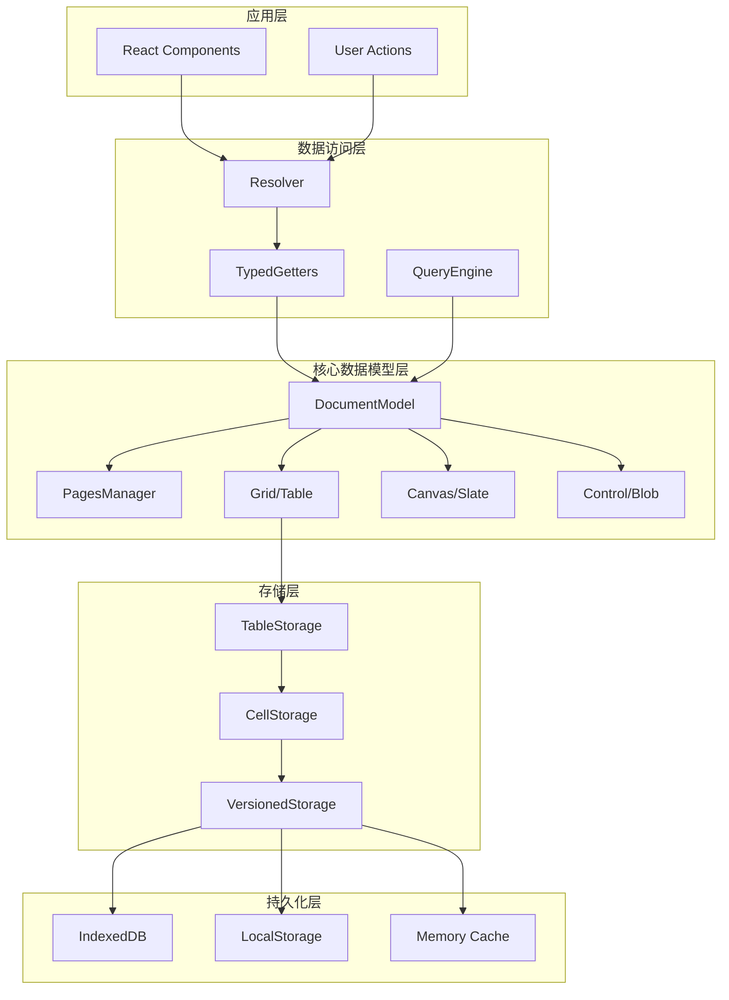
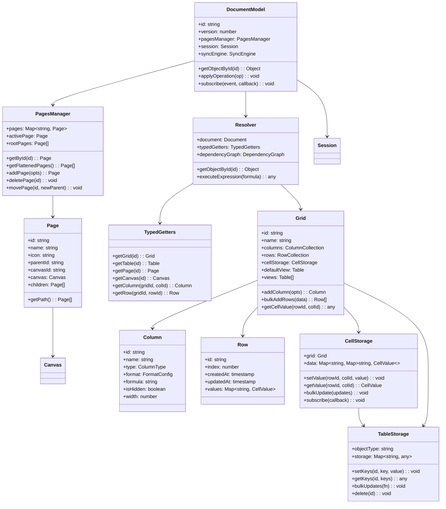
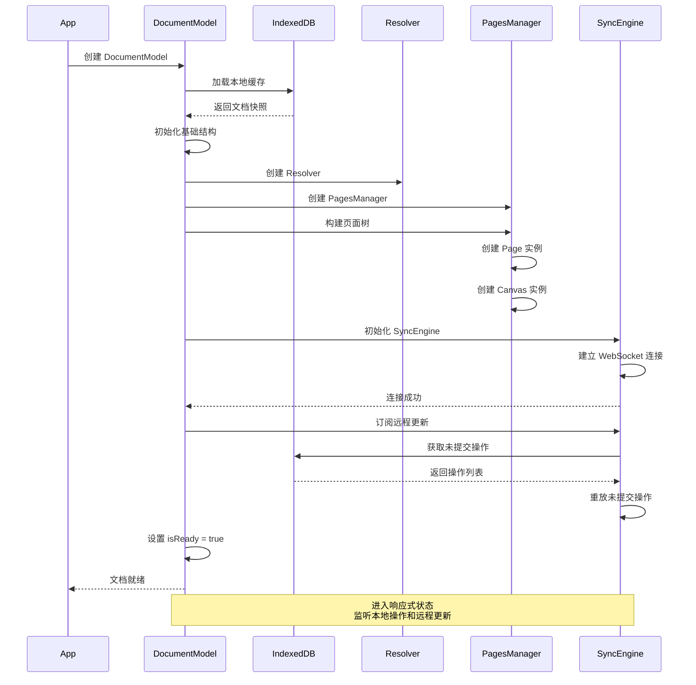
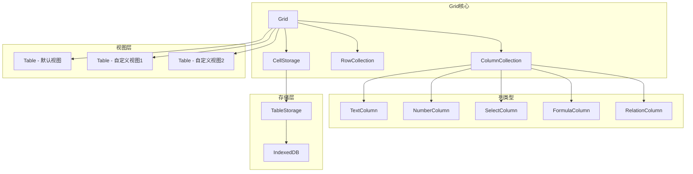
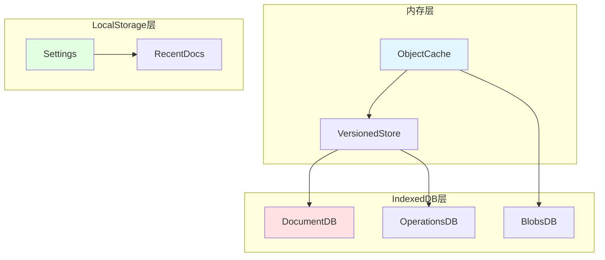

# Coda 数据层深入分析

## 目录
- [1. 数据层架构总览](#1-数据层架构总览)
- [2. DocumentModel 核心](#2-documentmodel-核心)
- [3. Grid 表格系统](#3-grid-表格系统)
- [4. Storage 存储系统](#4-storage-存储系统)
- [5. 数据同步与一致性](#5-数据同步与一致性)
- [6. 性能优化策略](#6-性能优化策略)

---

## 1. 数据层架构总览

### 1.1 分层模型



### 1.2 核心类图



---

## 2. DocumentModel 核心

### 2.1 DocumentModel 职责

DocumentModel 是整个文档的中央管理者：

1. **生命周期管理**：创建、初始化、销毁
2. **数据访问中心**：通过 Resolver 提供统一的数据访问接口
3. **事件中心**：订阅和发布文档级事件
4. **同步协调**：与 SyncEngine 协作处理协同编辑
5. **操作应用**：接收并应用本地和远程操作

### 2.2 DocumentModel 数据结构

```typescript
/**
 * DocumentModel 核心数据结构
 */
interface DocumentModel {
  // ===== 标识信息 =====
  id: string;                    // 文档唯一标识
  version: number;               // 文档版本号
  title: TitleManager;           // 文档标题管理器
  
  // ===== 核心管理器 =====
  pagesManager: PagesManager;    // 页面管理器
  session: Session;              // 会话管理器
  syncEngine: SyncEngine;        // 同步引擎
  
  // ===== 对象存储 =====
  objects: Map<string, any>;     // 所有对象的索引
  
  // ===== 状态标志 =====
  isReady: boolean;              // 是否已加载完成
  isDeferredHydrationComplete: boolean;  // 是否完成延迟水合
  isDisposed: boolean;           // 是否已销毁
  
  // ===== 事件系统 =====
  eventEmitter: EventEmitter;    // 事件发射器
  
  // ===== 操作管理 =====
  uncommittedOperationCreator: OperationCreator;  // 操作创建器
  operationHistory: OperationHistory;              // 操作历史
}

/**
 * Session 会话管理
 */
interface Session {
  // 解析器 - 提供数据访问能力
  resolver: Resolver;
  
  // 运行时配置
  runtimeConfig: {
    enableFormulas: boolean;
    enableCollaboration: boolean;
    maxUndoStackSize: number;
  };
  
  // 用户信息
  currentUser: {
    id: string;
    name: string;
    avatar: string;
    permissions: Permission[];
  };
  
  // 活跃用户列表（协作时）
  activeUsers: Map<string, ActiveUser>;
}

/**
 * PagesManager 页面管理
 */
interface PagesManager {
  // 页面存储
  pages: Map<string, Page>;      // 所有页面
  
  // 层级关系
  rootPages: Page[];             // 根页面列表
  pageTree: PageNode;            // 页面树结构
  
  // 当前状态
  activePage: Page;              // 当前活动页面
  activePageId: string;          // 当前页面 ID
  
  // 方法
  getById(id: string): Page | null;
  getFlattenedPages(): Page[];
  getPageForCanvasId(canvasId: string): Page | null;
  addPage(opts: AddPageOptions): Page;
  deletePage(id: string): void;
  movePage(id: string, newParentId: string, index: number): void;
}
```

### 2.3 DocumentModel 初始化流程



### 2.4 对象索引与访问

```typescript
/**
 * 对象索引系统 - 快速访问任意对象
 */
class ObjectIndex {
  private objects: Map<string, any> = new Map();
  private typeIndex: Map<string, Set<string>> = new Map();
  
  /**
   * 注册对象到索引
   */
  register(object: any): void {
    this.objects.set(object.id, object);
    
    // 按类型索引
    const typeName = object.constructor.name;
    if (!this.typeIndex.has(typeName)) {
      this.typeIndex.set(typeName, new Set());
    }
    this.typeIndex.get(typeName)!.add(object.id);
  }
  
  /**
   * 根据 ID 获取对象
   */
  getById(id: string): any | null {
    return this.objects.get(id) || null;
  }
  
  /**
   * 根据类型获取所有对象
   */
  getByType(typeName: string): any[] {
    const ids = this.typeIndex.get(typeName);
    if (!ids) return [];
    
    return Array.from(ids)
      .map(id => this.objects.get(id))
      .filter(obj => obj != null);
  }
  
  /**
   * 移除对象
   */
  unregister(id: string): void {
    const object = this.objects.get(id);
    if (!object) return;
    
    const typeName = object.constructor.name;
    this.typeIndex.get(typeName)?.delete(id);
    this.objects.delete(id);
  }
}

/**
 * Resolver - 类型安全的数据访问层
 */
class Resolver {
  private document: DocumentModel;
  private objectIndex: ObjectIndex;
  
  // 类型化的 Getter
  typedGetters = {
    getGrid: (id: string): Grid | null => {
      return this.objectIndex.getById(id) as Grid;
    },
    
    getTable: (id: string): Table | null => {
      return this.objectIndex.getById(id) as Table;
    },
    
    getPage: (id: string): Page | null => {
      return this.document.pagesManager.getById(id);
    },
    
    getPageCanvas: (id: string): PageCanvas | null => {
      const page = this.document.pagesManager.getPageForCanvasId(id);
      return page?.canvas || null;
    },
    
    getColumn: (gridId: string, columnId: string): Column | null => {
      const grid = this.typedGetters.getGrid(gridId);
      return grid?.columns.getById(columnId) || null;
    },
    
    getRow: (gridId: string, rowId: string): Row | null => {
      const grid = this.typedGetters.getGrid(gridId);
      return grid?.rows.getById(rowId) || null;
    }
  };
  
  /**
   * 通用对象获取（带类型推断）
   */
  getObjectById<T = any>(id: string): T | null {
    return this.objectIndex.getById(id) as T;
  }
}
```

---

## 3. Grid 表格系统

### 3.1 Grid 架构



### 3.2 Grid 数据结构

```typescript
/**
 * Grid - 数据表核心
 */
interface Grid {
  // ===== 标识 =====
  id: string;
  name: string;
  icon: string;
  
  // ===== 结构 =====
  columns: ColumnCollection;     // 列集合
  rows: RowCollection;           // 行集合
  cellStorage: CellStorage;      // 单元格存储
  
  // ===== 视图 =====
  defaultView: Table;            // 默认视图
  views: Table[];                // 所有视图
  
  // ===== 元数据 =====
  createdAt: timestamp;
  updatedAt: timestamp;
  createdBy: string;
  
  // ===== 配置 =====
  config: {
    allowAddRows: boolean;
    allowDeleteRows: boolean;
    allowAddColumns: boolean;
    allowDeleteColumns: boolean;
  };
  
  // ===== 引用 =====
  document: DocumentModel;
}

/**
 * Column - 列定义
 */
interface Column {
  // ===== 标识 =====
  id: string;
  name: string;
  
  // ===== 类型和格式 =====
  type: ColumnType;
  valueFormatConfig: FormatConfig;
  
  // ===== 公式 =====
  formula?: string;              // 公式（如果是公式列）
  isFormula: boolean;
  
  // ===== 显示 =====
  width: number;
  isHidden: boolean;
  
  // ===== 验证 =====
  validation?: ValidationRule;
  
  // ===== 关联 =====
  linkedColumnReference?: Reference;  // 关联列引用（如下拉选项）
  
  // ===== 元数据 =====
  createdAt: timestamp;
  updatedAt: timestamp;
}

/**
 * ColumnType - 列类型枚举
 */
enum ColumnType {
  Text = "Text",                 // 文本
  Number = "Number",             // 数字
  Date = "Date",                 // 日期
  DateTime = "DateTime",         // 日期时间
  Checkbox = "Checkbox",         // 复选框
  Select = "Select",             // 单选下拉
  MultiSelect = "MultiSelect",   // 多选下拉
  Relation = "Relation",         // 关联
  Formula = "Formula",           // 公式
  Button = "Button",             // 按钮
  Image = "Image",               // 图片
  File = "File",                 // 文件
  Lookup = "Lookup",             // 查找
  Person = "Person",             // 人员
  Duration = "Duration",         // 时长
  Slider = "Slider",             // 滑块
  Scale = "Scale",               // 评分
  Currency = "Currency",         // 货币
  Percent = "Percent"            // 百分比
}

/**
 * Row - 行数据
 */
interface Row {
  // ===== 标识 =====
  id: string;
  
  // ===== 位置 =====
  index: number;                 // 显示顺序
  
  // ===== 数据 =====
  values: Map<string, CellValue>; // 列ID -> 值
  
  // ===== 元数据 =====
  createdAt: timestamp;
  updatedAt: timestamp;
  createdBy: string;
  updatedBy: string;
  
  // ===== 状态 =====
  isDeleted: boolean;            // 软删除标记
}

/**
 * CellValue - 单元格值
 */
interface CellValue {
  // 实际值
  value: any;
  
  // 显示值（格式化后）
  displayValue: string;
  
  // 公式信息（如果是公式列）
  formula?: {
    expression: string;
    dependencies: Reference[];
    error?: FormulaError;
  };
  
  // 验证状态
  validation?: {
    isValid: boolean;
    error?: string;
  };
}
```

### 3.3 CellStorage 实现

```typescript
/**
 * CellStorage - 单元格存储管理器
 * 
 * 职责：
 * 1. 高效存储大量单元格数据
 * 2. 支持批量读写
 * 3. 支持订阅变更
 * 4. 自动垃圾回收
 */
class CellStorage {
  private grid: Grid;
  
  // 二维 Map: rowId -> columnId -> CellValue
  private storage: Map<string, Map<string, CellValue>> = new Map();
  
  // 变更监听器
  private listeners: Set<CellChangeListener> = new Set();
  
  /**
   * 设置单元格值
   */
  setValue(rowId: string, columnId: string, value: any): void {
    // 1. 获取或创建行存储
    if (!this.storage.has(rowId)) {
      this.storage.set(rowId, new Map());
    }
    const rowStorage = this.storage.get(rowId)!;
    
    // 2. 获取旧值
    const oldValue = rowStorage.get(columnId);
    
    // 3. 格式化新值
    const column = this.grid.columns.getById(columnId);
    const formattedValue = this.formatValue(value, column);
    
    // 4. 存储新值
    rowStorage.set(columnId, formattedValue);
    
    // 5. 通知监听器
    this.notifyChange({
      type: 'setValue',
      rowId,
      columnId,
      oldValue,
      newValue: formattedValue
    });
  }
  
  /**
   * 获取单元格值
   */
  getValue(rowId: string, columnId: string): CellValue | null {
    const rowStorage = this.storage.get(rowId);
    if (!rowStorage) return null;
    
    return rowStorage.get(columnId) || null;
  }
  
  /**
   * 批量更新
   */
  bulkUpdate(updates: CellUpdate[]): void {
    const changes: CellChange[] = [];
    
    for (const update of updates) {
      const { rowId, columnId, value } = update;
      
      // 获取旧值
      const oldValue = this.getValue(rowId, columnId);
      
      // 设置新值（不触发通知）
      this.setValueSilent(rowId, columnId, value);
      
      // 记录变更
      changes.push({
        type: 'setValue',
        rowId,
        columnId,
        oldValue,
        newValue: this.getValue(rowId, columnId)!
      });
    }
    
    // 一次性通知所有变更
    this.notifyBulkChange(changes);
  }
  
  /**
   * 获取整行数据
   */
  getRowValues(rowId: string): Map<string, CellValue> {
    return this.storage.get(rowId) || new Map();
  }
  
  /**
   * 获取整列数据
   */
  getColumnValues(columnId: string): Map<string, CellValue> {
    const result = new Map<string, CellValue>();
    
    for (const [rowId, rowStorage] of this.storage) {
      const value = rowStorage.get(columnId);
      if (value !== undefined) {
        result.set(rowId, value);
      }
    }
    
    return result;
  }
  
  /**
   * 删除行数据
   */
  deleteRow(rowId: string): void {
    this.storage.delete(rowId);
    
    this.notifyChange({
      type: 'deleteRow',
      rowId
    });
  }
  
  /**
   * 删除列数据
   */
  deleteColumn(columnId: string): void {
    for (const rowStorage of this.storage.values()) {
      rowStorage.delete(columnId);
    }
    
    this.notifyChange({
      type: 'deleteColumn',
      columnId
    });
  }
  
  /**
   * 格式化值
   */
  private formatValue(value: any, column: Column): CellValue {
    let formatted = value;
    let displayValue = String(value);
    
    switch (column.type) {
      case ColumnType.Number:
        formatted = Number(value);
        displayValue = this.formatNumber(formatted, column.valueFormatConfig);
        break;
        
      case ColumnType.Date:
        formatted = new Date(value);
        displayValue = this.formatDate(formatted, column.valueFormatConfig);
        break;
        
      case ColumnType.Currency:
        formatted = Number(value);
        displayValue = this.formatCurrency(formatted, column.valueFormatConfig);
        break;
        
      case ColumnType.Select:
        // 验证值是否在选项列表中
        const options = this.getSelectOptions(column);
        if (!options.includes(value)) {
          displayValue = `⚠️ ${value}`;
        }
        break;
    }
    
    return {
      value: formatted,
      displayValue
    };
  }
  
  /**
   * 订阅变更
   */
  subscribe(listener: CellChangeListener): () => void {
    this.listeners.add(listener);
    
    // 返回取消订阅函数
    return () => {
      this.listeners.delete(listener);
    };
  }
  
  /**
   * 通知变更
   */
  private notifyChange(change: CellChange): void {
    for (const listener of this.listeners) {
      listener(change);
    }
  }
}
```

### 3.4 Grid 视图系统

```typescript
/**
 * Table - 表格视图
 * 
 * Grid 是数据源，Table 是视图
 * 一个 Grid 可以有多个 Table 视图
 */
interface Table {
  // ===== 标识 =====
  id: string;
  name: string;
  
  // ===== 数据源 =====
  sourceObjectId: string;        // 关联的 Grid ID
  sourceObject: Grid;
  
  // ===== 视图配置 =====
  layoutMode: 'table' | 'card' | 'calendar' | 'kanban';
  
  // ===== 列配置 =====
  visibleColumns: string[];      // 可见列 ID 列表
  columnOrder: string[];         // 列顺序
  columnWidths: Map<string, number>; // 列宽
  
  // ===== 筛选和排序 =====
  filters: Filter[];             // 筛选条件
  sorts: Sort[];                 // 排序规则
  groups: Group[];               // 分组配置
  
  // ===== 分页 =====
  pagination?: {
    pageSize: number;
    currentPage: number;
  };
  
  // ===== 显示选项 =====
  showRowNumbers: boolean;
  allowAddRows: boolean;
  freezeColumns: number;         // 冻结列数
}

/**
 * Filter - 筛选条件
 */
interface Filter {
  columnId: string;
  operator: FilterOperator;
  value: any;
  
  // 复合筛选
  and?: Filter[];
  or?: Filter[];
}

enum FilterOperator {
  Equals = '=',
  NotEquals = '!=',
  Contains = 'contains',
  NotContains = 'not_contains',
  StartsWith = 'starts_with',
  EndsWith = 'ends_with',
  GreaterThan = '>',
  LessThan = '<',
  GreaterThanOrEqual = '>=',
  LessThanOrEqual = '<=',
  IsEmpty = 'is_empty',
  IsNotEmpty = 'is_not_empty'
}

/**
 * Sort - 排序规则
 */
interface Sort {
  columnId: string;
  direction: 'asc' | 'desc';
}

/**
 * TableView - 视图管理器
 */
class TableView {
  private table: Table;
  private grid: Grid;
  
  /**
   * 获取过滤后的行
   */
  getFilteredRows(): Row[] {
    let rows = Array.from(this.grid.rows.values());
    
    // 应用筛选
    for (const filter of this.table.filters) {
      rows = rows.filter(row => this.matchFilter(row, filter));
    }
    
    return rows;
  }
  
  /**
   * 获取排序后的行
   */
  getSortedRows(): Row[] {
    const rows = this.getFilteredRows();
    
    // 应用排序
    return rows.sort((a, b) => {
      for (const sort of this.table.sorts) {
        const aValue = this.grid.getCellValue(a.id, sort.columnId);
        const bValue = this.grid.getCellValue(b.id, sort.columnId);
        
        const comparison = this.compareValues(aValue, bValue);
        
        if (comparison !== 0) {
          return sort.direction === 'asc' ? comparison : -comparison;
        }
      }
      
      return 0;
    });
  }
  
  /**
   * 获取分组后的行
   */
  getGroupedRows(): GroupedRows {
    const rows = this.getSortedRows();
    
    if (this.table.groups.length === 0) {
      return { groups: [{ key: null, rows }] };
    }
    
    // 按第一个分组字段分组
    const group = this.table.groups[0];
    const grouped = new Map<any, Row[]>();
    
    for (const row of rows) {
      const value = this.grid.getCellValue(row.id, group.columnId);
      const key = value?.value ?? null;
      
      if (!grouped.has(key)) {
        grouped.set(key, []);
      }
      grouped.get(key)!.push(row);
    }
    
    return {
      groups: Array.from(grouped.entries()).map(([key, rows]) => ({
        key,
        rows
      }))
    };
  }
  
  /**
   * 匹配筛选条件
   */
  private matchFilter(row: Row, filter: Filter): boolean {
    const cellValue = this.grid.getCellValue(row.id, filter.columnId);
    const value = cellValue?.value;
    
    switch (filter.operator) {
      case FilterOperator.Equals:
        return value === filter.value;
        
      case FilterOperator.NotEquals:
        return value !== filter.value;
        
      case FilterOperator.Contains:
        return String(value).includes(String(filter.value));
        
      case FilterOperator.GreaterThan:
        return value > filter.value;
        
      case FilterOperator.IsEmpty:
        return value == null || value === '';
        
      // ... 其他操作符
    }
    
    return false;
  }
}
```

---

## 4. Storage 存储系统

### 4.1 存储架构



### 4.2 TableStorage 实现

```typescript
/**
 * TableStorage - 通用对象存储
 * 
 * 类似于 NoSQL 数据库，支持：
 * - 按对象 ID 存储任意键值对
 * - 批量操作
 * - 版本控制
 * - 订阅变更
 */
class TableStorage {
  private objectType: string;
  
  // 存储：objectId -> { key -> value }
  private storage: Map<string, Map<string, any>> = new Map();
  
  // 版本跟踪
  private versions: Map<string, number> = new Map();
  
  // 变更监听器
  private listeners: Set<StorageListener> = new Set();
  
  /**
   * 设置对象的键值对
   */
  setKeys(
    objectId: string,
    key: string,
    value: any,
    options?: SetKeysOptions
  ): void {
    // 获取或创建对象存储
    if (!this.storage.has(objectId)) {
      this.storage.set(objectId, new Map());
      this.versions.set(objectId, 0);
    }
    
    const objectStorage = this.storage.get(objectId)!;
    const oldValue = objectStorage.get(key);
    
    // 设置新值
    objectStorage.set(key, value);
    
    // 增加版本号
    const version = this.versions.get(objectId)! + 1;
    this.versions.set(objectId, version);
    
    // 通知变更
    if (!options?.bulkUpdate) {
      this.notifyChange({
        type: 'set',
        objectId,
        key,
        oldValue,
        newValue: value,
        version
      });
    }
    
    // 持久化到 IndexedDB
    this.persist(objectId);
  }
  
  /**
   * 获取对象的键值对
   */
  getKeys(objectId: string, keys: string[]): Map<string, any> {
    const objectStorage = this.storage.get(objectId);
    if (!objectStorage) return new Map();
    
    const result = new Map<string, any>();
    for (const key of keys) {
      if (objectStorage.has(key)) {
        result.set(key, objectStorage.get(key));
      }
    }
    
    return result;
  }
  
  /**
   * 批量更新
   */
  bulkUpdates(fn: (bulkUpdate: BulkUpdate) => void): void {
    const bulkUpdate: BulkUpdate = {
      setKeys: (objectId, key, value) => {
        this.setKeys(objectId, key, value, { bulkUpdate: true });
      }
    };
    
    // 执行批量操作
    fn(bulkUpdate);
    
    // 一次性通知所有变更
    this.notifyBulkChange();
  }
  
  /**
   * 删除对象
   */
  delete(objectId: string): void {
    const objectStorage = this.storage.get(objectId);
    if (!objectStorage) return;
    
    // 软删除：标记为已删除
    objectStorage.set('_deleted', true);
    
    this.notifyChange({
      type: 'delete',
      objectId
    });
    
    // 延迟清理
    setTimeout(() => {
      this.storage.delete(objectId);
      this.versions.delete(objectId);
    }, 30000); // 30秒后真正删除
  }
  
  /**
   * 持久化到 IndexedDB
   */
  private async persist(objectId: string): Promise<void> {
    const objectStorage = this.storage.get(objectId);
    if (!objectStorage) return;
    
    const data = Object.fromEntries(objectStorage);
    const version = this.versions.get(objectId)!;
    
    await IndexedDBManager.put(this.objectType, {
      id: objectId,
      data,
      version,
      updatedAt: Date.now()
    });
  }
  
  /**
   * 从 IndexedDB 加载
   */
  async load(objectId: string): Promise<void> {
    const record = await IndexedDBManager.get(this.objectType, objectId);
    
    if (record) {
      const objectStorage = new Map(Object.entries(record.data));
      this.storage.set(objectId, objectStorage);
      this.versions.set(objectId, record.version);
    }
  }
}
```

### 4.3 IndexedDB 管理

```typescript
/**
 * IndexedDB 管理器
 */
class IndexedDBManager {
  private static db: IDBDatabase | null = null;
  private static DB_NAME = 'CodaDB';
  private static VERSION = 1;
  
  /**
   * 初始化数据库
   */
  static async init(): Promise<void> {
    return new Promise((resolve, reject) => {
      const request = indexedDB.open(this.DB_NAME, this.VERSION);
      
      request.onerror = () => reject(request.error);
      request.onsuccess = () => {
        this.db = request.result;
        resolve();
      };
      
      request.onupgradeneeded = (event) => {
        const db = (event.target as IDBOpenDBRequest).result;
        
        // 创建对象存储
        if (!db.objectStoreNames.contains('documents')) {
          const documentsStore = db.createObjectStore('documents', {
            keyPath: 'id'
          });
          documentsStore.createIndex('updatedAt', 'updatedAt');
        }
        
        if (!db.objectStoreNames.contains('operations')) {
          const opsStore = db.createObjectStore('operations', {
            keyPath: 'opId'
          });
          opsStore.createIndex('documentId', 'documentId');
          opsStore.createIndex('timestamp', 'timestamp');
        }
        
        if (!db.objectStoreNames.contains('blobs')) {
          const blobsStore = db.createObjectStore('blobs', {
            keyPath: 'id'
          });
          blobsStore.createIndex('documentId', 'documentId');
        }
      };
    });
  }
  
  /**
   * 存储数据
   */
  static async put(storeName: string, data: any): Promise<void> {
    if (!this.db) await this.init();
    
    return new Promise((resolve, reject) => {
      const transaction = this.db!.transaction([storeName], 'readwrite');
      const store = transaction.objectStore(storeName);
      const request = store.put(data);
      
      request.onerror = () => reject(request.error);
      request.onsuccess = () => resolve();
    });
  }
  
  /**
   * 获取数据
   */
  static async get(storeName: string, key: string): Promise<any> {
    if (!this.db) await this.init();
    
    return new Promise((resolve, reject) => {
      const transaction = this.db!.transaction([storeName], 'readonly');
      const store = transaction.objectStore(storeName);
      const request = store.get(key);
      
      request.onerror = () => reject(request.error);
      request.onsuccess = () => resolve(request.result);
    });
  }
  
  /**
   * 批量获取
   */
  static async getAll(storeName: string, query?: IDBValidKey): Promise<any[]> {
    if (!this.db) await this.init();
    
    return new Promise((resolve, reject) => {
      const transaction = this.db!.transaction([storeName], 'readonly');
      const store = transaction.objectStore(storeName);
      const request = store.getAll(query);
      
      request.onerror = () => reject(request.error);
      request.onsuccess = () => resolve(request.result);
    });
  }
  
  /**
   * 删除数据
   */
  static async delete(storeName: string, key: string): Promise<void> {
    if (!this.db) await this.init();
    
    return new Promise((resolve, reject) => {
      const transaction = this.db!.transaction([storeName], 'readwrite');
      const store = transaction.objectStore(storeName);
      const request = store.delete(key);
      
      request.onerror = () => reject(request.error);
      request.onsuccess = () => resolve();
    });
  }
  
  /**
   * 清空存储
   */
  static async clear(storeName: string): Promise<void> {
    if (!this.db) await this.init();
    
    return new Promise((resolve, reject) => {
      const transaction = this.db!.transaction([storeName], 'readwrite');
      const store = transaction.objectStore(storeName);
      const request = store.clear();
      
      request.onerror = () => reject(request.error);
      request.onsuccess = () => resolve();
    });
  }
}
```

---

## 5. 数据同步与一致性

### 5.1 版本控制

```typescript
/**
 * VersionedStorage - 带版本控制的存储
 */
class VersionedStorage {
  private storage: Map<string, VersionedValue> = new Map();
  
  /**
   * 设置值（带版本检查）
   */
  set(key: string, value: any, expectedVersion?: number): boolean {
    const current = this.storage.get(key);
    
    // 版本检查
    if (expectedVersion !== undefined && current) {
      if (current.version !== expectedVersion) {
        // 版本冲突
        return false;
      }
    }
    
    const newVersion = current ? current.version + 1 : 1;
    
    this.storage.set(key, {
      value,
      version: newVersion,
      updatedAt: Date.now()
    });
    
    return true;
  }
  
  /**
   * 获取值（带版本）
   */
  get(key: string): VersionedValue | null {
    return this.storage.get(key) || null;
  }
  
  /**
   * 乐观锁更新
   */
  update(key: string, updater: (current: any) => any): boolean {
    const current = this.storage.get(key);
    const currentValue = current?.value;
    const currentVersion = current?.version || 0;
    
    const newValue = updater(currentValue);
    
    return this.set(key, newValue, currentVersion);
  }
}

interface VersionedValue {
  value: any;
  version: number;
  updatedAt: number;
}
```

### 5.2 缓存策略

```typescript
/**
 * CacheManager - 缓存管理器
 */
class CacheManager {
  private cache: Map<string, CacheEntry> = new Map();
  private maxSize: number = 1000;
  private ttl: number = 5 * 60 * 1000; // 5分钟
  
  /**
   * 获取缓存（如果存在且未过期）
   */
  get<T>(key: string): T | null {
    const entry = this.cache.get(key);
    
    if (!entry) return null;
    
    // 检查是否过期
    if (Date.now() - entry.timestamp > this.ttl) {
      this.cache.delete(key);
      return null;
    }
    
    // 更新访问时间
    entry.lastAccess = Date.now();
    
    return entry.value as T;
  }
  
  /**
   * 设置缓存
   */
  set(key: string, value: any): void {
    // 检查容量
    if (this.cache.size >= this.maxSize) {
      this.evict();
    }
    
    this.cache.set(key, {
      value,
      timestamp: Date.now(),
      lastAccess: Date.now()
    });
  }
  
  /**
   * 淘汰策略：LRU（最近最少使用）
   */
  private evict(): void {
    let oldest: string | null = null;
    let oldestTime = Infinity;
    
    for (const [key, entry] of this.cache) {
      if (entry.lastAccess < oldestTime) {
        oldestTime = entry.lastAccess;
        oldest = key;
      }
    }
    
    if (oldest) {
      this.cache.delete(oldest);
    }
  }
  
  /**
   * 清理过期缓存
   */
  cleanup(): void {
    const now = Date.now();
    
    for (const [key, entry] of this.cache) {
      if (now - entry.timestamp > this.ttl) {
        this.cache.delete(key);
      }
    }
  }
}

interface CacheEntry {
  value: any;
  timestamp: number;
  lastAccess: number;
}
```

---

## 6. 性能优化策略

### 6.1 延迟加载

```typescript
/**
 * LazyLoader - 延迟加载管理器
 */
class LazyLoader {
  private loadedObjects: Set<string> = new Set();
  private loadQueue: string[] = [];
  private isLoading = false;
  
  /**
   * 标记对象需要加载
   */
  markForLoad(objectId: string): void {
    if (this.loadedObjects.has(objectId)) return;
    
    if (!this.loadQueue.includes(objectId)) {
      this.loadQueue.push(objectId);
    }
    
    this.scheduleLoad();
  }
  
  /**
   * 调度加载
   */
  private scheduleLoad(): void {
    if (this.isLoading) return;
    
    requestIdleCallback(() => {
      this.processQueue();
    });
  }
  
  /**
   * 处理加载队列
   */
  private async processQueue(): Promise<void> {
    this.isLoading = true;
    
    while (this.loadQueue.length > 0) {
      const objectId = this.loadQueue.shift()!;
      
      try {
        await this.loadObject(objectId);
        this.loadedObjects.add(objectId);
      } catch (error) {
        console.error(`Failed to load object ${objectId}:`, error);
      }
    }
    
    this.isLoading = false;
  }
  
  /**
   * 加载对象
   */
  private async loadObject(objectId: string): Promise<void> {
    const data = await IndexedDBManager.get('documents', objectId);
    
    if (data) {
      // 反序列化并注册到对象索引
      const object = this.deserialize(data);
      DocumentModel.objectIndex.register(object);
    }
  }
}
```

### 6.2 批量操作优化

```typescript
/**
 * BatchProcessor - 批量操作处理器
 */
class BatchProcessor {
  private pendingOperations: Operation[] = [];
  private batchTimer: number | null = null;
  private batchSize = 100;
  private batchDelay = 50; // ms
  
  /**
   * 添加操作到批次
   */
  addOperation(operation: Operation): void {
    this.pendingOperations.push(operation);
    
    // 达到批次大小，立即处理
    if (this.pendingOperations.length >= this.batchSize) {
      this.flush();
      return;
    }
    
    // 否则延迟处理
    if (!this.batchTimer) {
      this.batchTimer = window.setTimeout(() => {
        this.flush();
      }, this.batchDelay);
    }
  }
  
  /**
   * 刷新批次
   */
  flush(): void {
    if (this.batchTimer) {
      clearTimeout(this.batchTimer);
      this.batchTimer = null;
    }
    
    if (this.pendingOperations.length === 0) return;
    
    // 合并相邻的操作
    const merged = this.mergeOperations(this.pendingOperations);
    
    // 批量应用
    this.applyBatch(merged);
    
    this.pendingOperations = [];
  }
  
  /**
   * 合并操作
   */
  private mergeOperations(operations: Operation[]): Operation[] {
    const merged: Operation[] = [];
    
    for (const op of operations) {
      const last = merged[merged.length - 1];
      
      // 尝试合并
      if (last && this.canMerge(last, op)) {
        merged[merged.length - 1] = this.merge(last, op);
      } else {
        merged.push(op);
      }
    }
    
    return merged;
  }
  
  /**
   * 判断是否可以合并
   */
  private canMerge(op1: Operation, op2: Operation): boolean {
    // 相同类型、相同对象
    if (op1.type !== op2.type) return false;
    if (op1.objectId !== op2.objectId) return false;
    
    // 连续的文本插入
    if (op1.type === 'INSERT_TEXT' && op2.type === 'INSERT_TEXT') {
      return op1.path.equals(op2.path) && 
             op1.offset + op1.text.length === op2.offset;
    }
    
    return false;
  }
}
```

---

## 总结

数据层是 Coda 的核心基础设施，它提供了：

1. **统一的数据模型**：DocumentModel 作为中心，Resolver 提供访问
2. **灵活的表格系统**：Grid + CellStorage + Table 视图
3. **高效的存储系统**：内存 + IndexedDB 多层缓存
4. **强大的一致性保证**：版本控制 + 乐观锁
5. **优秀的性能优化**：延迟加载 + 批量操作 + 缓存策略

这些设计确保了 Coda 能够处理大规模文档和复杂的数据关系，同时保持良好的性能和可靠性。
