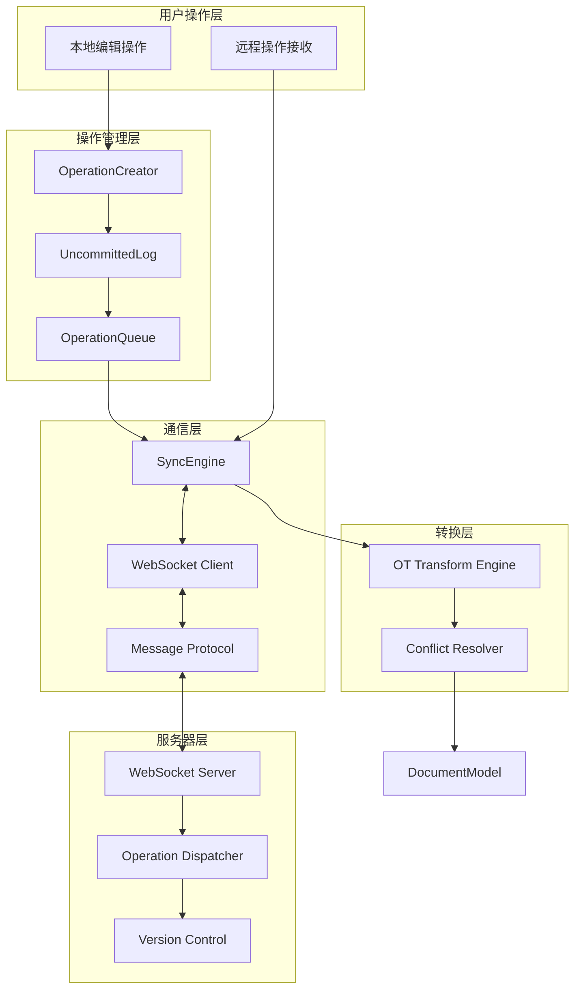
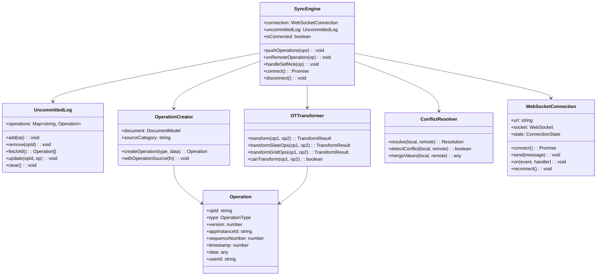
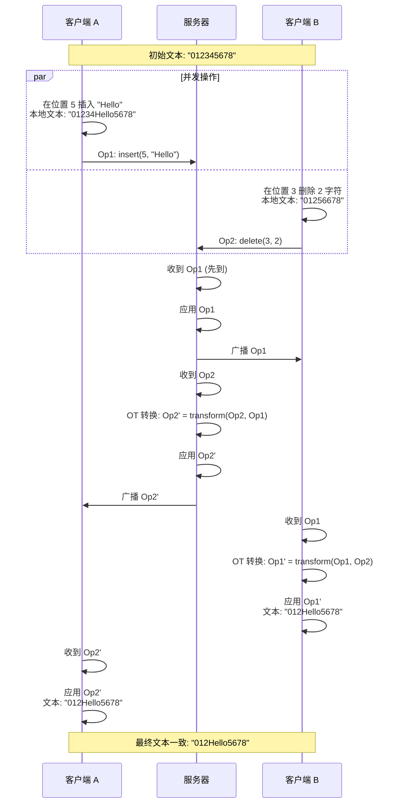
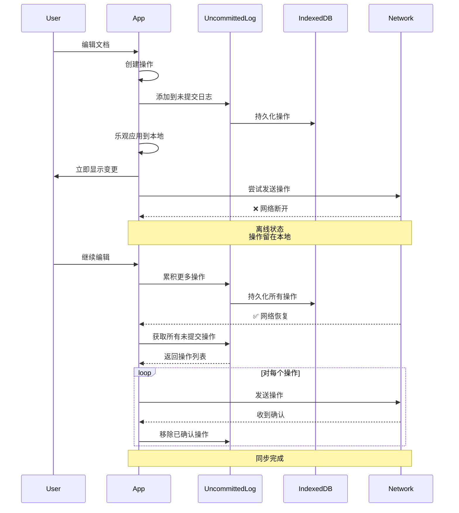

# Coda 协同层深入分析

## 目录
- [1. 协同层架构总览](#1-协同层架构总览)
- [2. 操作转换 (OT) 算法](#2-操作转换-ot-算法)
- [3. WebSocket 通信](#3-websocket-通信)
- [4. 未提交操作管理](#4-未提交操作管理)
- [5. 离线支持与同步](#5-离线支持与同步)
- [6. 冲突解决策略](#6-冲突解决策略)

---

## 1. 协同层架构总览

### 1.1 协同系统分层



### 1.2 核心类图



---

## 2. 操作转换 (OT) 算法

### 2.1 OT 基本原理

操作转换（Operational Transformation）是实现实时协作的核心算法。

**问题场景**：
- 用户 A 和用户 B 同时编辑同一段文字
- A 的操作：在位置 5 插入 "Hello"
- B 的操作：在位置 3 删除 2 个字符
- 两个操作同时发生，如何保证最终一致？



### 2.2 OT Transform 核心实现

```typescript
/**
 * OT Transform Engine - 操作转换引擎
 */
class OTTransformEngine {
  /**
   * 转换两个操作
   * 
   * @param clientOp - 客户端操作（未提交）
   * @param serverOp - 服务器操作（已提交）
   * @returns 转换后的操作
   */
  transform(
    clientOp: Operation,
    serverOp: Operation
  ): TransformResult {
    // 根据操作类型分发
    if (this.isSlateOperation(clientOp) && this.isSlateOperation(serverOp)) {
      return this.transformSlateOperations(clientOp, serverOp);
    }
    
    if (this.isGridOperation(clientOp) && this.isGridOperation(serverOp)) {
      return this.transformGridOperations(clientOp, serverOp);
    }
    
    // 不同类型的操作通常不冲突
    return {
      transformedClientOp: clientOp,
      transformedServerOp: serverOp
    };
  }
  
  /**
   * 转换 Slate 文本操作
   */
  private transformSlateOperations(
    clientOp: SlateOperation,
    serverOp: SlateOperation
  ): TransformResult {
    const { type: clientType } = clientOp;
    const { type: serverType } = serverOp;
    
    // INSERT_TEXT vs INSERT_TEXT
    if (clientType === 'INSERT_TEXT' && serverType === 'INSERT_TEXT') {
      return this.transformInsertVsInsert(clientOp, serverOp);
    }
    
    // INSERT_TEXT vs REMOVE_TEXT
    if (clientType === 'INSERT_TEXT' && serverType === 'REMOVE_TEXT') {
      return this.transformInsertVsRemove(clientOp, serverOp);
    }
    
    // REMOVE_TEXT vs INSERT_TEXT
    if (clientType === 'REMOVE_TEXT' && serverType === 'INSERT_TEXT') {
      return this.transformRemoveVsInsert(clientOp, serverOp);
    }
    
    // REMOVE_TEXT vs REMOVE_TEXT
    if (clientType === 'REMOVE_TEXT' && serverType === 'REMOVE_TEXT') {
      return this.transformRemoveVsRemove(clientOp, serverOp);
    }
    
    // INSERT_NODE vs INSERT_NODE
    if (clientType === 'INSERT_NODE' && serverType === 'INSERT_NODE') {
      return this.transformInsertNodeVsInsertNode(clientOp, serverOp);
    }
    
    // 其他组合...
    return { transformedClientOp: clientOp, transformedServerOp: serverOp };
  }
  
  /**
   * 转换：插入 vs 插入
   * 
   * 规则：
   * - 如果在同一位置插入，服务器操作优先（或按 userId 排序）
   * - 否则，调整位置偏移
   */
  private transformInsertVsInsert(
    clientOp: InsertTextOperation,
    serverOp: InsertTextOperation
  ): TransformResult {
    const { path: clientPath, offset: clientOffset, text: clientText } = clientOp;
    const { path: serverPath, offset: serverOffset, text: serverText } = serverOp;
    
    // 不在同一个节点，不冲突
    if (!this.pathEquals(clientPath, serverPath)) {
      return {
        transformedClientOp: clientOp,
        transformedServerOp: serverOp
      };
    }
    
    // 在同一个节点
    if (clientOffset < serverOffset) {
      // 客户端在服务器之前插入
      // 服务器操作需要调整位置
      return {
        transformedClientOp: clientOp,
        transformedServerOp: {
          ...serverOp,
          offset: serverOffset + clientText.length
        }
      };
    } else if (clientOffset > serverOffset) {
      // 服务器在客户端之前插入
      // 客户端操作需要调整位置
      return {
        transformedClientOp: {
          ...clientOp,
          offset: clientOffset + serverText.length
        },
        transformedServerOp: serverOp
      };
    } else {
      // 在相同位置插入
      // 按 appInstanceId 排序决定先后
      if (clientOp.appInstanceId < serverOp.appInstanceId) {
        return {
          transformedClientOp: clientOp,
          transformedServerOp: {
            ...serverOp,
            offset: serverOffset + clientText.length
          }
        };
      } else {
        return {
          transformedClientOp: {
            ...clientOp,
            offset: clientOffset + serverText.length
          },
          transformedServerOp: serverOp
        };
      }
    }
  }
  
  /**
   * 转换：插入 vs 删除
   */
  private transformInsertVsRemove(
    clientOp: InsertTextOperation,
    serverOp: RemoveTextOperation
  ): TransformResult {
    const { path: clientPath, offset: clientOffset, text: clientText } = clientOp;
    const { path: serverPath, offset: serverOffset, length: serverLength } = serverOp;
    
    // 不在同一个节点
    if (!this.pathEquals(clientPath, serverPath)) {
      return {
        transformedClientOp: clientOp,
        transformedServerOp: serverOp
      };
    }
    
    // 在同一个节点
    const serverEnd = serverOffset + serverLength;
    
    if (clientOffset <= serverOffset) {
      // 客户端插入在删除区域之前
      // 服务器删除位置需要后移
      return {
        transformedClientOp: clientOp,
        transformedServerOp: {
          ...serverOp,
          offset: serverOffset + clientText.length
        }
      };
    } else if (clientOffset >= serverEnd) {
      // 客户端插入在删除区域之后
      // 客户端位置需要前移
      return {
        transformedClientOp: {
          ...clientOp,
          offset: clientOffset - serverLength
        },
        transformedServerOp: serverOp
      };
    } else {
      // 客户端插入在删除区域内
      // 插入位置移到删除区域开始
      return {
        transformedClientOp: {
          ...clientOp,
          offset: serverOffset
        },
        transformedServerOp: serverOp
      };
    }
  }
  
  /**
   * 转换：删除 vs 删除
   */
  private transformRemoveVsRemove(
    clientOp: RemoveTextOperation,
    serverOp: RemoveTextOperation
  ): TransformResult {
    const { path: clientPath, offset: clientOffset, length: clientLength } = clientOp;
    const { path: serverPath, offset: serverOffset, length: serverLength } = serverOp;
    
    // 不在同一个节点
    if (!this.pathEquals(clientPath, serverPath)) {
      return {
        transformedClientOp: clientOp,
        transformedServerOp: serverOp
      };
    }
    
    const clientEnd = clientOffset + clientLength;
    const serverEnd = serverOffset + serverLength;
    
    // 计算重叠区域
    const overlapStart = Math.max(clientOffset, serverOffset);
    const overlapEnd = Math.min(clientEnd, serverEnd);
    const overlap = Math.max(0, overlapEnd - overlapStart);
    
    if (overlap === 0) {
      // 没有重叠
      if (clientOffset < serverOffset) {
        // 客户端删除在前
        return {
          transformedClientOp: clientOp,
          transformedServerOp: {
            ...serverOp,
            offset: serverOffset - clientLength
          }
        };
      } else {
        // 服务器删除在前
        return {
          transformedClientOp: {
            ...clientOp,
            offset: clientOffset - serverLength
          },
          transformedServerOp: serverOp
        };
      }
    } else {
      // 有重叠
      // 调整删除长度，避免重复删除
      return {
        transformedClientOp: {
          ...clientOp,
          offset: Math.min(clientOffset, serverOffset),
          length: clientLength - overlap
        },
        transformedServerOp: {
          ...serverOp,
          length: serverLength - overlap
        }
      };
    }
  }
  
  /**
   * 转换 Grid 表格操作
   */
  private transformGridOperations(
    clientOp: GridOperation,
    serverOp: GridOperation
  ): TransformResult {
    // BULK_MODIFY_ROW_VALUE vs BULK_MODIFY_ROW_VALUE
    if (clientOp.type === 'BULK_MODIFY_ROW_VALUE' && 
        serverOp.type === 'BULK_MODIFY_ROW_VALUE') {
      return this.transformCellModifyVsCellModify(clientOp, serverOp);
    }
    
    // ADD_COLUMN vs ADD_COLUMN
    if (clientOp.type === 'ADD_COLUMN' && serverOp.type === 'ADD_COLUMN') {
      return this.transformAddColumnVsAddColumn(clientOp, serverOp);
    }
    
    // 其他组合通常不冲突
    return {
      transformedClientOp: clientOp,
      transformedServerOp: serverOp
    };
  }
  
  /**
   * 转换：单元格修改 vs 单元格修改
   */
  private transformCellModifyVsCellModify(
    clientOp: BulkModifyRowValueOperation,
    serverOp: BulkModifyRowValueOperation
  ): TransformResult {
    const clientRows = clientOp.data.rows;
    const serverRows = serverOp.data.rows;
    
    // 找出冲突的单元格（相同行相同列）
    const conflicts = this.findCellConflicts(clientRows, serverRows);
    
    if (conflicts.length === 0) {
      // 没有冲突
      return {
        transformedClientOp: clientOp,
        transformedServerOp: serverOp
      };
    }
    
    // 有冲突：服务器操作优先（Last Write Wins）
    const transformedClientRows = { ...clientRows };
    
    for (const conflict of conflicts) {
      const { rowId, columnId } = conflict;
      
      // 移除客户端的冲突修改
      if (transformedClientRows[rowId]?.values[columnId]) {
        delete transformedClientRows[rowId].values[columnId];
      }
      
      // 如果整行都被移除了，删除这一行
      if (Object.keys(transformedClientRows[rowId]?.values || {}).length === 0) {
        delete transformedClientRows[rowId];
      }
    }
    
    return {
      transformedClientOp: {
        ...clientOp,
        data: {
          ...clientOp.data,
          rows: transformedClientRows
        }
      },
      transformedServerOp: serverOp
    };
  }
  
  /**
   * 路径比较
   */
  private pathEquals(path1: number[], path2: number[]): boolean {
    if (path1.length !== path2.length) return false;
    
    for (let i = 0; i < path1.length; i++) {
      if (path1[i] !== path2[i]) return false;
    }
    
    return true;
  }
}

/**
 * 转换结果
 */
interface TransformResult {
  transformedClientOp: Operation;
  transformedServerOp: Operation;
}
```

### 2.3 多操作转换

当客户端有多个未提交操作时，需要对每个操作都进行转换：

```typescript
/**
 * 多操作转换
 */
class MultiOperationTransformer {
  /**
   * 转换服务器操作对抗客户端未提交操作列表
   * 
   * @param serverOp - 服务器操作
   * @param uncommittedOps - 客户端未提交操作列表
   * @returns 转换后的操作
   */
  transformAgainstUncommitted(
    serverOp: Operation,
    uncommittedOps: Operation[]
  ): TransformResult {
    let transformedServerOp = serverOp;
    const transformedUncommittedOps = new Map<string, Operation>();
    
    // 逐个转换
    for (const uncommittedOp of uncommittedOps) {
      const result = this.otEngine.transform(
        uncommittedOp,
        transformedServerOp
      );
      
      transformedServerOp = result.transformedServerOp;
      transformedUncommittedOps.set(
        uncommittedOp.opId,
        result.transformedClientOp
      );
    }
    
    return {
      transformedServerOp,
      transformedUncommittedOps
    };
  }
}
```

---

## 3. WebSocket 通信

### 3.1 WebSocket 连接管理

```typescript
/**
 * WebSocket 连接管理器
 */
class WebSocketConnection {
  private url: string;
  private socket: WebSocket | null = null;
  private state: ConnectionState = 'disconnected';
  private reconnectAttempts = 0;
  private maxReconnectAttempts = 10;
  private reconnectDelay = 1000; // 初始延迟 1 秒
  private heartbeatInterval = 30000; // 30 秒心跳
  private heartbeatTimer: number | null = null;
  private eventHandlers = new Map<string, Set<Function>>();
  
  constructor(url: string) {
    this.url = url;
  }
  
  /**
   * 建立连接
   */
  async connect(): Promise<void> {
    return new Promise((resolve, reject) => {
      this.state = 'connecting';
      this.socket = new WebSocket(this.url);
      
      this.socket.onopen = () => {
        console.log('✅ WebSocket connected');
        this.state = 'connected';
        this.reconnectAttempts = 0;
        this.startHeartbeat();
        this.emit('connected');
        resolve();
      };
      
      this.socket.onerror = (error) => {
        console.error('❌ WebSocket error:', error);
        this.emit('error', error);
        reject(error);
      };
      
      this.socket.onclose = (event) => {
        console.log('🔌 WebSocket closed:', event.code, event.reason);
        this.state = 'disconnected';
        this.stopHeartbeat();
        this.emit('disconnected', event);
        
        // 自动重连
        if (!event.wasClean) {
          this.scheduleReconnect();
        }
      };
      
      this.socket.onmessage = (event) => {
        this.handleMessage(event.data);
      };
    });
  }
  
  /**
   * 断开连接
   */
  disconnect(): void {
    if (this.socket) {
      this.socket.close(1000, 'Client disconnected');
      this.socket = null;
    }
    this.state = 'disconnected';
    this.stopHeartbeat();
  }
  
  /**
   * 发送消息
   */
  send(message: any): void {
    if (this.state !== 'connected' || !this.socket) {
      console.warn('⚠️ Cannot send message: not connected');
      return;
    }
    
    const data = JSON.stringify(message);
    this.socket.send(data);
  }
  
  /**
   * 处理接收到的消息
   */
  private handleMessage(data: string): void {
    try {
      const message = JSON.parse(data);
      
      // 心跳响应
      if (message.type === 'pong') {
        return;
      }
      
      // 触发相应的事件处理器
      this.emit('message', message);
      this.emit(message.type, message.data);
      
    } catch (error) {
      console.error('❌ Failed to parse message:', error);
    }
  }
  
  /**
   * 启动心跳
   */
  private startHeartbeat(): void {
    this.heartbeatTimer = window.setInterval(() => {
      this.send({ type: 'ping', timestamp: Date.now() });
    }, this.heartbeatInterval);
  }
  
  /**
   * 停止心跳
   */
  private stopHeartbeat(): void {
    if (this.heartbeatTimer) {
      clearInterval(this.heartbeatTimer);
      this.heartbeatTimer = null;
    }
  }
  
  /**
   * 调度重连
   */
  private scheduleReconnect(): void {
    if (this.reconnectAttempts >= this.maxReconnectAttempts) {
      console.error('❌ Max reconnect attempts reached');
      this.emit('reconnect_failed');
      return;
    }
    
    this.reconnectAttempts++;
    
    // 指数退避
    const delay = this.reconnectDelay * Math.pow(2, this.reconnectAttempts - 1);
    const maxDelay = 30000; // 最大 30 秒
    const actualDelay = Math.min(delay, maxDelay);
    
    console.log(`🔄 Reconnecting in ${actualDelay}ms (attempt ${this.reconnectAttempts})`);
    
    setTimeout(() => {
      this.connect().catch(() => {
        // 连接失败，会自动触发下一次重连
      });
    }, actualDelay);
  }
  
  /**
   * 事件监听
   */
  on(event: string, handler: Function): void {
    if (!this.eventHandlers.has(event)) {
      this.eventHandlers.set(event, new Set());
    }
    this.eventHandlers.get(event)!.add(handler);
  }
  
  /**
   * 移除事件监听
   */
  off(event: string, handler: Function): void {
    const handlers = this.eventHandlers.get(event);
    if (handlers) {
      handlers.delete(handler);
    }
  }
  
  /**
   * 触发事件
   */
  private emit(event: string, ...args: any[]): void {
    const handlers = this.eventHandlers.get(event);
    if (handlers) {
      for (const handler of handlers) {
        handler(...args);
      }
    }
  }
}

type ConnectionState = 
  | 'disconnected' 
  | 'connecting' 
  | 'connected' 
  | 'reconnecting';
```

### 3.2 消息协议

```typescript
/**
 * 消息类型
 */
enum MessageType {
  // 订阅
  SUBSCRIBE = 'subscribe',
  SUBSCRIBE_ACK = 'subscribe_ack',
  UNSUBSCRIBE = 'unsubscribe',
  
  // 操作
  OPERATION = 'operation',
  OPERATION_ACK = 'operation_ack',
  OPERATION_BATCH = 'operation_batch',
  
  // 同步
  SYNC_REQUEST = 'sync_request',
  SYNC_RESPONSE = 'sync_response',
  
  // 状态
  USER_JOINED = 'user_joined',
  USER_LEFT = 'user_left',
  USER_CURSOR = 'user_cursor',
  
  // 心跳
  PING = 'ping',
  PONG = 'pong'
}

/**
 * 消息格式
 */
interface Message {
  type: MessageType;
  data: any;
  timestamp: number;
}

/**
 * 订阅消息
 */
interface SubscribeMessage extends Message {
  type: MessageType.SUBSCRIBE;
  data: {
    documentId: string;
    lastKnownVersion: number;
  };
}

/**
 * 操作消息
 */
interface OperationMessage extends Message {
  type: MessageType.OPERATION;
  data: Operation;
}

/**
 * 操作确认消息
 */
interface OperationAckMessage extends Message {
  type: MessageType.OPERATION_ACK;
  data: {
    opId: string;
    version: number;
    success: boolean;
    error?: string;
  };
}
```

---

## 4. 未提交操作管理

### 4.1 UncommittedLog 实现

```typescript
/**
 * 未提交操作日志
 * 
 * 职责：
 * 1. 存储本地未提交的操作
 * 2. 持久化到 IndexedDB
 * 3. 支持查询和更新
 * 4. 自动清理已确认的操作
 */
class UncommittedLog {
  private operations: Map<string, Operation> = new Map();
  private document: DocumentModel;
  
  constructor(document: DocumentModel) {
    this.document = document;
    this.loadFromStorage();
  }
  
  /**
   * 添加操作
   */
  add(operation: Operation): void {
    // 添加到内存
    this.operations.set(operation.opId, operation);
    
    // 持久化
    this.persistOperation(operation);
    
    console.log(`📝 Added uncommitted operation: ${operation.opId}`);
  }
  
  /**
   * 移除操作（收到服务器确认后）
   */
  remove(opId: string): void {
    const operation = this.operations.get(opId);
    if (!operation) return;
    
    // 从内存移除
    this.operations.delete(opId);
    
    // 从存储移除
    IndexedDBManager.delete('operations', opId);
    
    console.log(`✅ Removed uncommitted operation: ${opId}`);
  }
  
  /**
   * 更新操作（OT 转换后）
   */
  update(opId: string, updatedOperation: Operation): void {
    if (!this.operations.has(opId)) return;
    
    // 更新内存
    this.operations.set(opId, updatedOperation);
    
    // 更新存储
    this.persistOperation(updatedOperation);
    
    console.log(`🔄 Updated uncommitted operation: ${opId}`);
  }
  
  /**
   * 获取所有未提交操作
   */
  fetchAll(): Operation[] {
    return Array.from(this.operations.values())
      .sort((a, b) => a.sequenceNumber - b.sequenceNumber);
  }
  
  /**
   * 根据 ID 查找操作
   */
  findByOpId(opId: string): Operation | null {
    return this.operations.get(opId) || null;
  }
  
  /**
   * 清空所有操作
   */
  clear(): void {
    this.operations.clear();
    IndexedDBManager.clear('operations');
  }
  
  /**
   * 获取操作数量
   */
  get size(): number {
    return this.operations.size;
  }
  
  /**
   * 持久化操作到 IndexedDB
   */
  private async persistOperation(operation: Operation): Promise<void> {
    await IndexedDBManager.put('operations', {
      opId: operation.opId,
      documentId: this.document.id,
      operation: operation,
      timestamp: Date.now()
    });
  }
  
  /**
   * 从 IndexedDB 加载
   */
  private async loadFromStorage(): Promise<void> {
    const records = await IndexedDBManager.getAll('operations');
    
    for (const record of records) {
      if (record.documentId === this.document.id) {
        this.operations.set(record.opId, record.operation);
      }
    }
    
    console.log(`📂 Loaded ${this.operations.size} uncommitted operations`);
  }
}
```

### 4.2 操作创建器

```typescript
/**
 * 操作创建器
 * 
 * 统一创建操作的入口，确保操作格式正确
 */
class OperationCreator {
  private document: DocumentModel;
  private sequenceNumber = 0;
  private appInstanceId: string;
  
  constructor(document: DocumentModel) {
    this.document = document;
    this.appInstanceId = this.generateAppInstanceId();
  }
  
  /**
   * 创建操作
   */
  createOperation(
    type: OperationType,
    data: any,
    options?: CreateOperationOptions
  ): Operation {
    const operation: Operation = {
      opId: this.generateOpId(),
      type,
      version: this.document.version + 1,
      appInstanceId: this.appInstanceId,
      sequenceNumber: ++this.sequenceNumber,
      timestamp: Date.now(),
      userId: this.document.session.currentUser.id,
      data
    };
    
    // 添加到未提交日志
    this.document.syncEngine.uncommittedLog.add(operation);
    
    // 乐观应用到本地
    if (!options?.skipLocalApply) {
      this.document.applyOperation(operation, { isLocal: true });
    }
    
    return operation;
  }
  
  /**
   * 在特定操作源下创建操作
   */
  withOperationSource<T>(
    sourceCategory: string,
    fn: () => T
  ): T {
    // 设置当前操作源
    const previousSource = this.currentSource;
    this.currentSource = sourceCategory;
    
    try {
      return fn();
    } finally {
      this.currentSource = previousSource;
    }
  }
  
  /**
   * 生成操作 ID
   */
  private generateOpId(): string {
    return `op-${this.appInstanceId}-${Date.now()}-${Math.random().toString(36).substr(2, 9)}`;
  }
  
  /**
   * 生成应用实例 ID
   */
  private generateAppInstanceId(): string {
    return `client-${Date.now()}-${Math.random().toString(36).substr(2, 9)}`;
  }
}
```

---

## 5. 离线支持与同步

### 5.1 离线编辑流程



### 5.2 离线同步实现

```typescript
/**
 * 离线同步管理器
 */
class OfflineSyncManager {
  private syncEngine: SyncEngine;
  private isOnline = navigator.onLine;
  private syncQueue: Operation[] = [];
  private isSyncing = false;
  
  constructor(syncEngine: SyncEngine) {
    this.syncEngine = syncEngine;
    this.setupOnlineDetection();
  }
  
  /**
   * 设置在线状态检测
   */
  private setupOnlineDetection(): void {
    window.addEventListener('online', () => {
      console.log('🌐 Network online');
      this.isOnline = true;
      this.startSync();
    });
    
    window.addEventListener('offline', () => {
      console.log('📴 Network offline');
      this.isOnline = false;
    });
  }
  
  /**
   * 尝试发送操作
   */
  async sendOperation(operation: Operation): Promise<boolean> {
    if (!this.isOnline) {
      console.log('📴 Offline: operation queued');
      return false;
    }
    
    try {
      await this.syncEngine.connection.send({
        type: MessageType.OPERATION,
        data: operation
      });
      
      return true;
    } catch (error) {
      console.error('Failed to send operation:', error);
      return false;
    }
  }
  
  /**
   * 开始同步未提交操作
   */
  async startSync(): Promise<void> {
    if (this.isSyncing || !this.isOnline) return;
    
    this.isSyncing = true;
    
    try {
      // 获取所有未提交操作
      const uncommittedOps = this.syncEngine.uncommittedLog.fetchAll();
      
      console.log(`🔄 Syncing ${uncommittedOps.length} uncommitted operations`);
      
      // 按序号发送
      for (const op of uncommittedOps) {
        const success = await this.sendOperation(op);
        
        if (!success) {
          console.log('❌ Sync failed, will retry later');
          break;
        }
        
        // 等待服务器确认（异步）
        await this.waitForAck(op.opId, 5000); // 5 秒超时
      }
      
      console.log('✅ Sync completed');
      
    } finally {
      this.isSyncing = false;
    }
  }
  
  /**
   * 等待操作确认
   */
  private waitForAck(opId: string, timeout: number): Promise<void> {
    return new Promise((resolve, reject) => {
      const timer = setTimeout(() => {
        reject(new Error(`Timeout waiting for ack: ${opId}`));
      }, timeout);
      
      const handler = (ack: OperationAckMessage) => {
        if (ack.data.opId === opId) {
          clearTimeout(timer);
          this.syncEngine.connection.off('operation_ack', handler);
          resolve();
        }
      };
      
      this.syncEngine.connection.on('operation_ack', handler);
    });
  }
}
```

### 5.3 版本对齐

当客户端离线一段时间后重连，需要对齐版本：

```typescript
/**
 * 版本对齐管理器
 */
class VersionAlignmentManager {
  private document: DocumentModel;
  private syncEngine: SyncEngine;
  
  /**
   * 请求同步（对齐版本）
   */
  async requestSync(): Promise<void> {
    const localVersion = this.document.version;
    
    console.log(`🔄 Requesting sync from version ${localVersion}`);
    
    // 发送同步请求
    this.syncEngine.connection.send({
      type: MessageType.SYNC_REQUEST,
      data: {
        documentId: this.document.id,
        currentVersion: localVersion
      }
    });
    
    // 等待同步响应
    const response = await this.waitForSyncResponse();
    
    // 应用缺失的操作
    await this.applyMissingOperations(response.operations);
    
    console.log(`✅ Synced to version ${this.document.version}`);
  }
  
  /**
   * 应用缺失的操作
   */
  private async applyMissingOperations(
    operations: Operation[]
  ): Promise<void> {
    console.log(`📥 Applying ${operations.length} missing operations`);
    
    // 获取未提交操作
    const uncommittedOps = this.syncEngine.uncommittedLog.fetchAll();
    
    for (const serverOp of operations) {
      // 检查是否是自己的操作（Self-ACK）
      const localOp = uncommittedOps.find(op => op.opId === serverOp.opId);
      
      if (localOp) {
        // 自己的操作被确认
        console.log(`✅ Self-ACK: ${serverOp.opId}`);
        this.syncEngine.uncommittedLog.remove(serverOp.opId);
        continue;
      }
      
      // 他人的操作：需要转换
      if (uncommittedOps.length > 0) {
        const result = this.otEngine.transformAgainstUncommitted(
          serverOp,
          uncommittedOps
        );
        
        // 应用转换后的服务器操作
        this.document.applyOperation(result.transformedServerOp, {
          isLocal: false
        });
        
        // 更新未提交操作
        for (const [opId, transformedOp] of result.transformedUncommittedOps) {
          this.syncEngine.uncommittedLog.update(opId, transformedOp);
        }
      } else {
        // 没有未提交操作，直接应用
        this.document.applyOperation(serverOp, { isLocal: false });
      }
    }
  }
}
```

---

## 6. 冲突解决策略

### 6.1 冲突类型

1. **文本冲突**：同一位置的文本编辑
   - 策略：OT 转换
   
2. **单元格冲突**：同一单元格的并发修改
   - 策略：Last Write Wins (LWW)
   
3. **结构冲突**：节点的并发插入/删除
   - 策略：按 timestamp 或 userId 排序
   
4. **引用冲突**：删除了被引用的对象
   - 策略：标记为已删除，显示错误

### 6.2 冲突解决器

```typescript
/**
 * 冲突解决器
 */
class ConflictResolver {
  /**
   * 解决单元格值冲突
   */
  resolveCellValueConflict(
    localValue: CellValue,
    remoteValue: CellValue,
    localTimestamp: number,
    remoteTimestamp: number
  ): CellValue {
    // Last Write Wins
    if (remoteTimestamp > localTimestamp) {
      console.log('⚠️ Cell conflict: remote wins');
      return remoteValue;
    } else {
      console.log('⚠️ Cell conflict: local wins');
      return localValue;
    }
  }
  
  /**
   * 解决节点插入冲突
   */
  resolveNodeInsertConflict(
    localNode: Node,
    remoteNode: Node,
    path: number[]
  ): Resolution {
    // 按 ID 排序
    if (localNode.id < remoteNode.id) {
      return {
        action: 'keep_local',
        adjustedPath: path
      };
    } else {
      return {
        action: 'keep_remote',
        adjustedPath: [...path.slice(0, -1), path[path.length - 1] + 1]
      };
    }
  }
  
  /**
   * 检测引用冲突
   */
  detectReferenceConflict(
    operation: Operation,
    deletedObjects: Set<string>
  ): boolean {
    // 检查操作中的引用是否指向已删除对象
    const references = this.extractReferences(operation);
    
    for (const ref of references) {
      if (deletedObjects.has(ref.objectId)) {
        return true;
      }
    }
    
    return false;
  }
  
  /**
   * 解决引用冲突
   */
  resolveReferenceConflict(
    operation: Operation
  ): Resolution {
    // 标记操作为失败，并提供错误信息
    return {
      action: 'reject',
      error: {
        code: 'REFERENCE_NOT_FOUND',
        message: 'Referenced object has been deleted'
      }
    };
  }
}

interface Resolution {
  action: 'keep_local' | 'keep_remote' | 'merge' | 'reject';
  adjustedPath?: number[];
  mergedValue?: any;
  error?: {
    code: string;
    message: string;
  };
}
```

---

## 总结

协同层是 Coda 实时协作的核心，它实现了：

1. **OT 算法**：保证并发编辑的最终一致性
2. **WebSocket 通信**：实时双向通信，自动重连
3. **未提交日志**：离线编辑支持，持久化到 IndexedDB
4. **版本对齐**：重连后自动同步缺失的操作
5. **冲突解决**：多种策略处理不同类型的冲突

这些机制共同确保了多人协作时的流畅体验和数据一致性。
