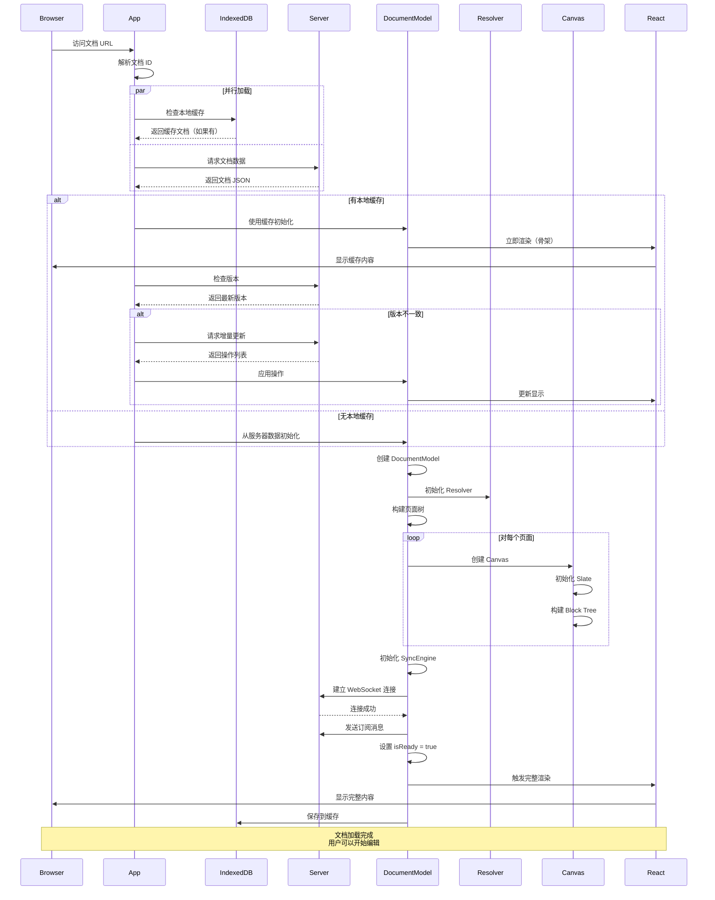
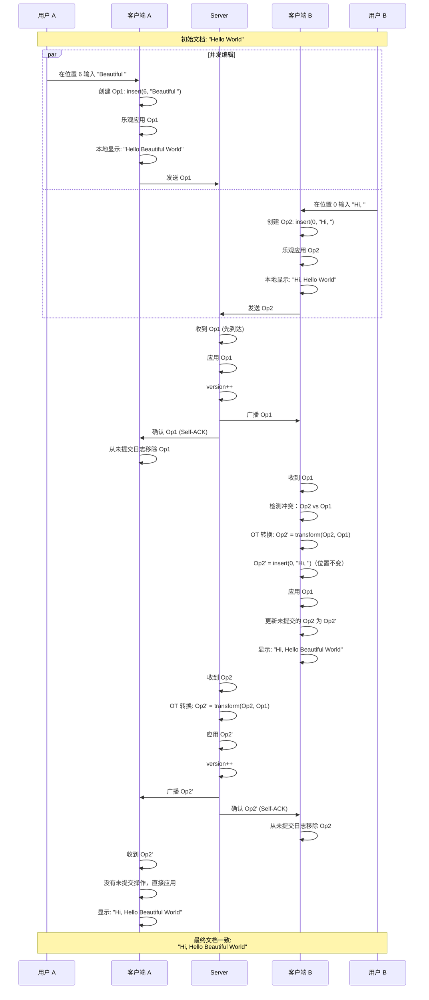
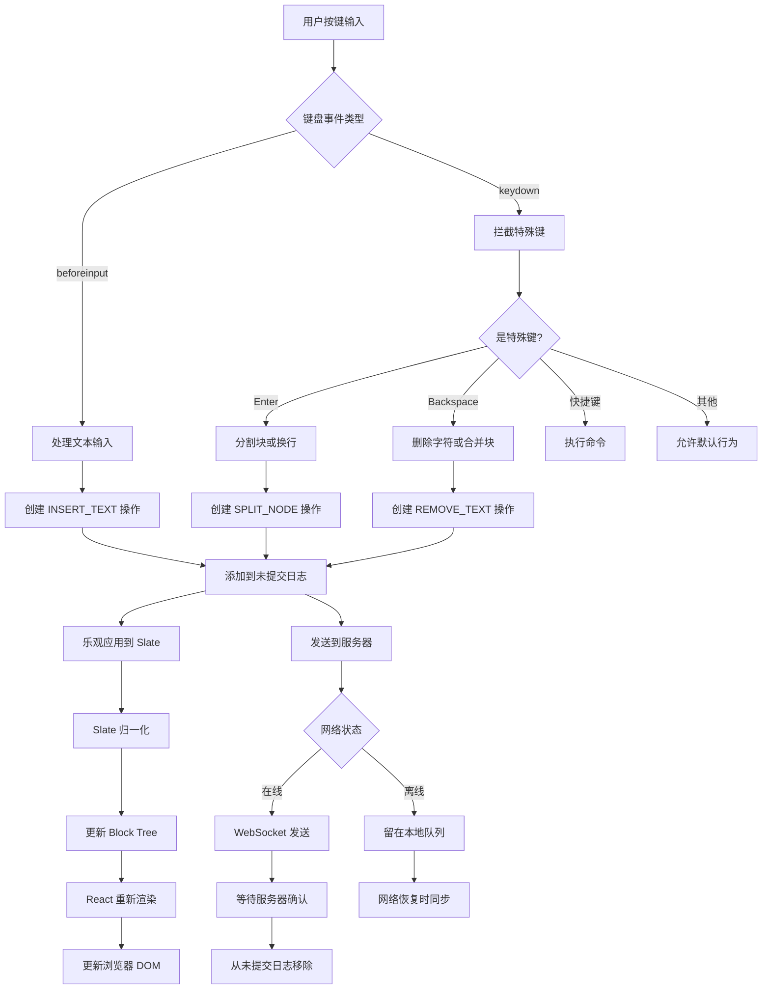
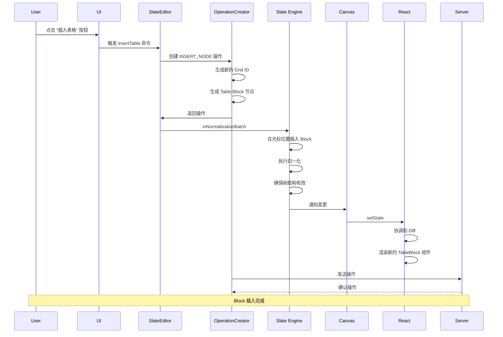
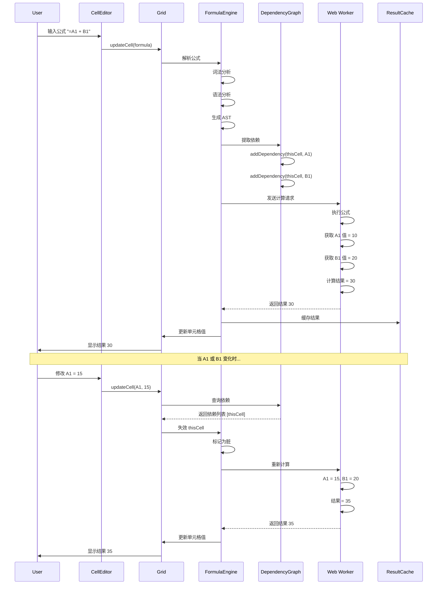

# Coda 关键用户流程深入分析

## 目录
- [1. 首次打开文档流程](#1-首次打开文档流程)
- [2. 协同编辑流程](#2-协同编辑流程)
- [3. 修改文字流程](#3-修改文字流程)
- [4. 增加 Block 流程](#4-增加-block-流程)
- [5. 表格操作流程](#5-表格操作流程)
- [6. 公式计算流程](#6-公式计算流程)

---

## 1. 首次打开文档流程

### 1.1 完整流程图



### 1.2 详细步骤说明

#### Step 1: URL 解析和路由

```typescript
// 应用启动
class Application {
  async loadDocument(documentUrl: string): Promise<void> {
    // 1. 解析 URL
    const { documentId, pageId } = this.parseDocumentUrl(documentUrl);
    
    console.log(`📄 Loading document: ${documentId}`);
    
    // 2. 显示加载骨架
    this.showLoadingSkeleton();
    
    // 3. 并行加载本地缓存和服务器数据
    const [cachedDoc, serverDoc] = await Promise.all([
      this.loadFromCache(documentId),
      this.loadFromServer(documentId)
    ]);
    
    // 4. 选择数据源
    const documentData = this.selectDataSource(cachedDoc, serverDoc);
    
    // 5. 初始化 DocumentModel
    const document = await this.initializeDocument(documentData);
    
    // 6. 建立 WebSocket 连接
    await document.syncEngine.connect();
    
    // 7. 订阅文档更新
    await document.syncEngine.subscribe(documentId);
    
    // 8. 对齐版本（如果需要）
    if (cachedDoc && cachedDoc.version < serverDoc.version) {
      await document.syncEngine.syncMissingOperations(
        cachedDoc.version,
        serverDoc.version
      );
    }
    
    // 9. 激活指定页面
    if (pageId) {
      document.pagesManager.setActivePage(pageId);
    }
    
    // 10. 渲染
    this.render(document);
    
    console.log(`✅ Document loaded successfully`);
  }
}
```

#### Step 2: DocumentModel 初始化

```typescript
/**
 * 初始化 DocumentModel
 */
async function initializeDocument(data: DocumentData): Promise<DocumentModel> {
  // 1. 创建 DocumentModel 实例
  const document = new DocumentModel(data.id);
  
  // 2. 设置基本属性
  document.version = data.version;
  document.title.setTitle(data.title);
  
  // 3. 初始化 Session
  document.session = new Session({
    resolver: new Resolver(document),
    currentUser: data.currentUser,
    runtimeConfig: data.config
  });
  
  // 4. 初始化 PagesManager
  document.pagesManager = new PagesManager(document);
  
  // 5. 构建页面树
  for (const pageData of data.pages) {
    const page = document.pagesManager.createPage(pageData);
    
    // 创建 Canvas
    page.canvas = new PageCanvas(pageData.canvas);
    
    // 初始化 Slate
    page.canvas.slate = new Slate({
      root: deserializeSlateRoot(pageData.canvas.content)
    });
  }
  
  // 6. 初始化 Grid 表格
  for (const gridData of data.grids) {
    const grid = new Grid(gridData);
    document.session.resolver.objectIndex.register(grid);
    
    // 加载列
    for (const colData of gridData.columns) {
      grid.columns.add(new Column(colData));
    }
    
    // 加载行
    for (const rowData of gridData.rows) {
      grid.rows.add(new Row(rowData));
    }
    
    // 加载单元格数据
    grid.cellStorage.loadData(gridData.cells);
  }
  
  // 7. 初始化 SyncEngine
  document.syncEngine = new SyncEngine(document);
  
  // 8. 初始化公式引擎
  if (document.session.runtimeConfig.enableFormulas) {
    document.formulaEngine = new FormulaEngine(document);
  }
  
  // 9. 设置事件监听
  setupDocumentEventListeners(document);
  
  // 10. 标记为就绪
  document.isReady = true;
  
  return document;
}
```

#### Step 3: WebSocket 订阅

```typescript
/**
 * 订阅文档更新
 */
async subscribe(documentId: string): Promise<void> {
  console.log(`📡 Subscribing to document: ${documentId}`);
  
  // 发送订阅消息
  this.connection.send({
    type: MessageType.SUBSCRIBE,
    data: {
      documentId,
      lastKnownVersion: this.document.version,
      userId: this.document.session.currentUser.id
    },
    timestamp: Date.now()
  });
  
  // 等待订阅确认
  return new Promise((resolve, reject) => {
    const timeout = setTimeout(() => {
      reject(new Error('Subscription timeout'));
    }, 10000);
    
    const handler = (ack: SubscribeAckMessage) => {
      if (ack.data.documentId === documentId) {
        clearTimeout(timeout);
        this.connection.off('subscribe_ack', handler);
        
        console.log(`✅ Subscribed to document: ${documentId}`);
        console.log(`   Version: ${ack.data.currentVersion}`);
        console.log(`   Active users: ${ack.data.activeUsers.length}`);
        
        // 更新活跃用户列表
        for (const user of ack.data.activeUsers) {
          this.document.session.activeUsers.set(user.id, user);
        }
        
        resolve();
      }
    };
    
    this.connection.on('subscribe_ack', handler);
  });
}
```

---

## 2. 协同编辑流程

### 2.1 用户 A 和用户 B 同时编辑



### 2.2 协同编辑代码实现

```typescript
/**
 * 处理远程操作
 */
async handleRemoteOperation(operation: Operation): Promise<void> {
  console.log(`📥 Received remote operation: ${operation.opId}`);
  
  // 1. 检查是否是自己的操作（Self-ACK）
  const localOp = this.uncommittedLog.findByOpId(operation.opId);
  
  if (localOp) {
    // 自己的操作被服务器确认
    console.log(`✅ Self-ACK: ${operation.opId}`);
    
    // 从未提交日志移除
    this.uncommittedLog.remove(operation.opId);
    
    // 更新版本号
    this.document.version = operation.version;
    
    return;
  }
  
  // 2. 他人的操作：需要 OT 转换
  const uncommittedOps = this.uncommittedLog.fetchAll();
  
  if (uncommittedOps.length > 0) {
    console.log(`🔄 Transforming against ${uncommittedOps.length} uncommitted operations`);
    
    // 转换远程操作对抗所有未提交操作
    const result = this.otEngine.transformAgainstUncommitted(
      operation,
      uncommittedOps
    );
    
    // 应用转换后的远程操作
    this.document.applyOperation(result.transformedServerOp, {
      isLocal: false
    });
    
    // 更新未提交操作
    for (const [opId, transformedOp] of result.transformedUncommittedOps) {
      this.uncommittedLog.update(opId, transformedOp);
    }
  } else {
    // 没有未提交操作，直接应用
    this.document.applyOperation(operation, {
      isLocal: false
    });
  }
  
  // 3. 更新版本号
  this.document.version = operation.version;
}
```

---

## 3. 修改文字流程

### 3.1 完整流程图



### 3.2 详细代码实现

#### Step 1: 键盘事件处理

```typescript
/**
 * 处理文本输入
 */
function handleBeforeInput(event: InputEvent, editor: Editor): void {
  event.preventDefault();
  
  const { inputType, data } = event;
  
  switch (inputType) {
    case 'insertText':
      // 插入文本
      if (data) {
        insertText(editor, data);
      }
      break;
      
    case 'insertLineBreak':
      // 换行
      insertBreak(editor);
      break;
      
    case 'deleteContentBackward':
      // 删除字符
      deleteBackward(editor);
      break;
      
    case 'insertFromPaste':
      // 粘贴（单独处理）
      handlePaste(event, editor);
      break;
      
    // ... 其他输入类型
  }
}

/**
 * 插入文本
 */
function insertText(editor: Editor, text: string): void {
  const { selection } = editor;
  if (!selection) return;
  
  // 1. 创建操作
  const operation = editor.document.uncommittedOperationCreator.createOperation(
    'SLATE_INSERT_TEXT',
    {
      canvasId: editor.canvas.id,
      path: selection.anchor.path,
      offset: selection.anchor.offset,
      text
    }
  );
  
  // 2. 乐观应用到本地
  Transforms.insertText(editor, text);
  
  // 3. 发送到服务器
  editor.document.syncEngine.pushOperation(operation);
}
```

#### Step 2: 操作应用到 Slate

```typescript
/**
 * 应用 INSERT_TEXT 操作到 Slate
 */
function applyInsertTextOperation(
  canvas: PageCanvas,
  operation: InsertTextOperation
): void {
  const { path, offset, text } = operation;
  
  canvas.slate.inNormalizationBatch((editor) => {
    // 1. 定位到目标位置
    const point = { path, offset };
    
    // 2. 插入文本
    Transforms.insertText(editor, text, { at: point });
    
    // 3. Slate 会自动触发归一化
    // 4. 触发 onChange 事件
  });
  
  // Canvas 触发变更事件
  canvas.emit('slate:changed');
}
```

#### Step 3: React 组件更新

```typescript
/**
 * Canvas 组件
 */
function CanvasComponent({ canvas }: { canvas: PageCanvas }) {
  const [version, setVersion] = useState(0);
  
  useEffect(() => {
    const handleChange = () => {
      // 触发重新渲染
      setVersion(v => v + 1);
    };
    
    canvas.on('slate:changed', handleChange);
    
    return () => {
      canvas.off('slate:changed', handleChange);
    };
  }, [canvas]);
  
  // 渲染 Slate 内容
  return (
    <SlateEditable
      editor={canvas.slate.editor}
      value={canvas.slate.root}
      renderElement={renderElement}
      renderLeaf={renderLeaf}
    />
  );
}
```

---

## 4. 增加 Block 流程

### 4.1 完整流程图



### 4.2 详细代码实现

#### Step 1: 插入表格命令

```typescript
/**
 * 插入表格
 */
async function insertTable(
  editor: Editor,
  options: InsertTableOptions = {}
): Promise<Grid> {
  const { rows = 3, columns = 3 } = options;
  
  // 1. 创建 Grid 对象
  const grid = new Grid({
    id: generateGridId(),
    name: 'New Table',
    columns: [],
    rows: []
  });
  
  // 2. 添加默认列
  for (let i = 0; i < columns; i++) {
    grid.columns.add(new Column({
      id: generateColumnId(),
      name: `Column ${i + 1}`,
      type: ColumnType.Text
    }));
  }
  
  // 3. 添加默认行
  for (let i = 0; i < rows; i++) {
    grid.rows.add(new Row({
      id: generateRowId(),
      index: i,
      values: new Map()
    }));
  }
  
  // 4. 注册 Grid 到对象索引
  editor.document.session.resolver.objectIndex.register(grid);
  
  // 5. 创建 Table Block 节点
  const tableBlock: TableBlock = {
    type: 'table',
    id: generateNodeId(),
    gridId: grid.id,
    children: [{ text: '' }] // 必须有空文本子节点
  };
  
  // 6. 创建操作
  const operation = editor.document.uncommittedOperationCreator.createOperation(
    'SLATE_INSERT_NODE',
    {
      canvasId: editor.canvas.id,
      path: editor.selection ? editor.selection.anchor.path : [0],
      node: tableBlock
    }
  );
  
  // 7. 应用到 Slate
  editor.slate.inNormalizationBatch((editor) => {
    Transforms.insertNodes(editor, tableBlock);
  });
  
  // 8. 发送到服务器
  editor.document.syncEngine.pushOperation(operation);
  
  return grid;
}
```

#### Step 2: 插入其他类型的 Block

```typescript
/**
 * 插入段落
 */
function insertParagraph(editor: Editor, text: string = ''): void {
  const paragraph: ParagraphBlock = {
    type: 'paragraph',
    id: generateNodeId(),
    children: [{ text }]
  };
  
  insertBlock(editor, paragraph);
}

/**
 * 插入标题
 */
function insertHeading(editor: Editor, level: number, text: string = ''): void {
  const heading: HeadingBlock = {
    type: `heading${level}` as any,
    id: generateNodeId(),
    children: [{ text }]
  };
  
  insertBlock(editor, heading);
}

/**
 * 插入代码块
 */
function insertCodeBlock(editor: Editor, code: string = ''): void {
  const codeBlock: CodeBlock = {
    type: 'code',
    id: generateNodeId(),
    language: 'javascript',
    children: code.split('\n').map(line => ({
      type: 'code-line',
      id: generateNodeId(),
      children: [{ text: line }]
    }))
  };
  
  insertBlock(editor, codeBlock);
}

/**
 * 通用插入 Block 方法
 */
function insertBlock(editor: Editor, block: Block): void {
  // 创建操作
  const operation = editor.document.uncommittedOperationCreator.createOperation(
    'SLATE_INSERT_NODE',
    {
      canvasId: editor.canvas.id,
      path: calculateInsertPath(editor),
      node: block
    }
  );
  
  // 应用到 Slate
  editor.slate.inNormalizationBatch((editor) => {
    Transforms.insertNodes(editor, block);
  });
  
  // 发送到服务器
  editor.document.syncEngine.pushOperation(operation);
}

/**
 * 计算插入路径
 */
function calculateInsertPath(editor: Editor): number[] {
  if (!editor.selection) {
    // 没有选区，插入到末尾
    return [editor.slate.root.children.length];
  }
  
  const [, path] = Editor.node(editor, editor.selection);
  
  // 在当前 block 之后插入
  return [path[0] + 1];
}
```

---

## 5. 表格操作流程

### 5.1 添加行流程

```mermaid
flowchart TB
    A[用户点击 "添加行"] --> B[调用 addRow API]
    B --> C[创建 Row 对象]
    C --> D[生成行 ID]
    D --> E[计算行索引]
    
    E --> F[创建 BULK_ADD_ROW 操作]
    F --> G[添加到未提交日志]
    
    G --> H[乐观应用到 Grid]
    H --> I[更新 Grid.rows]
    I --> J[触发 Grid 事件]
    
    J --> K[Table 视图更新]
    K --> L[React 重新渲染]
    L --> M[显示新行]
    
    G --> N[发送到服务器]
    N --> O[服务器确认]
    O --> P[从未提交日志移除]
    
    P --> Q[如果有公式依赖]
    Q --> R[触发公式重算]
    R --> S[更新依赖的单元格]
```

### 5.2 详细代码实现

```typescript
/**
 * 添加行
 */
async function addRow(
  grid: Grid,
  options: AddRowOptions = {}
): Promise<Row> {
  const { index, values = {} } = options;
  
  // 1. 创建 Row 对象
  const row = new Row({
    id: generateRowId(),
    index: index ?? grid.rows.length,
    values: new Map(Object.entries(values)),
    createdAt: Date.now(),
    createdBy: grid.document.session.currentUser.id
  });
  
  // 2. 创建操作
  const operation = grid.document.uncommittedOperationCreator.createOperation(
    'BULK_ADD_ROW',
    {
      gridId: grid.id,
      rows: {
        [row.id]: {
          rowNumber: row.index,
          values: Object.fromEntries(row.values)
        }
      }
    }
  );
  
  // 3. 乐观应用到本地
  grid.rows.add(row);
  
  // 4. 触发事件
  grid.emit('row:added', { rowId: row.id });
  
  // 5. 发送到服务器
  grid.document.syncEngine.pushOperation(operation);
  
  return row;
}

/**
 * 修改单元格
 */
async function updateCell(
  grid: Grid,
  rowId: string,
  columnId: string,
  value: any
): Promise<void> {
  // 1. 创建操作
  const operation = grid.document.uncommittedOperationCreator.createOperation(
    'BULK_MODIFY_ROW_VALUE',
    {
      gridId: grid.id,
      rows: {
        [rowId]: {
          values: {
            [columnId]: {
              value,
              format: grid.columns.getById(columnId)?.valueFormatConfig
            }
          }
        }
      }
    }
  );
  
  // 2. 乐观应用到本地
  grid.cellStorage.setValue(rowId, columnId, value);
  
  // 3. 检查是否有公式依赖
  const columnRef = { objectId: grid.id, fieldId: columnId };
  const dependents = grid.document.session.resolver.dependencyGraph
    .getBackDependencies(columnRef);
  
  if (dependents.length > 0) {
    // 触发依赖失效
    grid.document.formulaEngine.invalidate(columnRef);
  }
  
  // 4. 发送到服务器
  grid.document.syncEngine.pushOperation(operation);
}
```

---

## 6. 公式计算流程

### 6.1 完整流程图



### 6.2 详细代码实现

```typescript
/**
 * 公式引擎
 */
class FormulaEngine {
  private worker: Worker;
  private resultCache: Map<string, FormulaResult> = new Map();
  private pendingCalculations: Map<string, Promise<FormulaResult>> = new Map();
  
  /**
   * 执行公式
   */
  async executeFormula(
    cellRef: CellReference,
    formula: string
  ): Promise<FormulaResult> {
    const cacheKey = `${cellRef.objectId}:${cellRef.fieldId}:${cellRef.identifier}`;
    
    // 1. 检查缓存
    if (this.resultCache.has(cacheKey)) {
      return this.resultCache.get(cacheKey)!;
    }
    
    // 2. 检查是否正在计算
    if (this.pendingCalculations.has(cacheKey)) {
      return this.pendingCalculations.get(cacheKey)!;
    }
    
    // 3. 解析公式
    const ast = this.parse(formula);
    
    // 4. 提取依赖
    const dependencies = this.extractDependencies(ast);
    
    // 5. 注册依赖
    for (const dep of dependencies) {
      this.dependencyGraph.addDataDependency(cellRef, dep, {
        callback: () => this.invalidate(cellRef)
      });
    }
    
    // 6. 发送到 Worker 计算
    const promise = this.calculateInWorker(cellRef, ast);
    this.pendingCalculations.set(cacheKey, promise);
    
    try {
      const result = await promise;
      
      // 7. 缓存结果
      this.resultCache.set(cacheKey, result);
      
      return result;
    } finally {
      this.pendingCalculations.delete(cacheKey);
    }
  }
  
  /**
   * 在 Worker 中计算
   */
  private calculateInWorker(
    cellRef: CellReference,
    ast: FormulaAST
  ): Promise<FormulaResult> {
    return new Promise((resolve, reject) => {
      const requestId = generateRequestId();
      
      // 超时处理
      const timeout = setTimeout(() => {
        reject(new Error('Formula calculation timeout'));
      }, 30000);
      
      // 监听结果
      const handler = (event: MessageEvent) => {
        const { id, result, error } = event.data;
        
        if (id === requestId) {
          clearTimeout(timeout);
          this.worker.removeEventListener('message', handler);
          
          if (error) {
            reject(new Error(error));
          } else {
            resolve(result);
          }
        }
      };
      
      this.worker.addEventListener('message', handler);
      
      // 发送计算请求
      this.worker.postMessage({
        id: requestId,
        type: 'calculate',
        cellRef,
        ast,
        context: this.buildContext(cellRef)
      });
    });
  }
  
  /**
   * 失效公式
   */
  invalidate(cellRef: CellReference): void {
    const cacheKey = `${cellRef.objectId}:${cellRef.fieldId}:${cellRef.identifier}`;
    
    // 从缓存移除
    this.resultCache.delete(cacheKey);
    
    // 触发重算（延迟执行）
    this.scheduleRecalculation(cellRef);
  }
  
  /**
   * 调度重算
   */
  private scheduleRecalculation(cellRef: CellReference): void {
    // 加入重算队列
    this.recalcQueue.push(cellRef);
    
    // 去重
    this.recalcQueue = Array.from(new Set(this.recalcQueue));
    
    // 延迟执行（批量处理）
    if (!this.recalcTimer) {
      this.recalcTimer = setTimeout(() => {
        this.processRecalcQueue();
      }, 50);
    }
  }
}
```

---

## 总结

这些关键用户流程展示了 Coda 如何处理各种操作：

1. **首次打开文档**：并行加载、缓存优化、版本对齐
2. **协同编辑**：OT 转换、实时同步、冲突解决
3. **修改文字**：乐观更新、操作转换、React 渲染
4. **增加 Block**：Slate 归一化、操作创建、服务器同步
5. **表格操作**：Grid 更新、依赖失效、公式重算
6. **公式计算**：Worker 计算、依赖追踪、结果缓存

所有流程都遵循相同的模式：
1. 创建操作
2. 乐观应用到本地
3. 发送到服务器
4. 处理远程操作
5. 保持最终一致性
