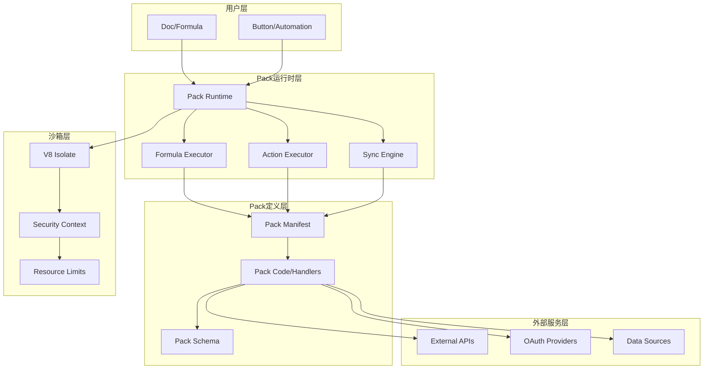
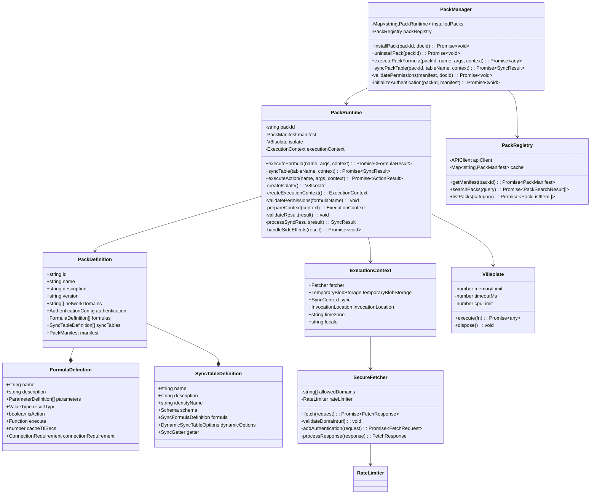
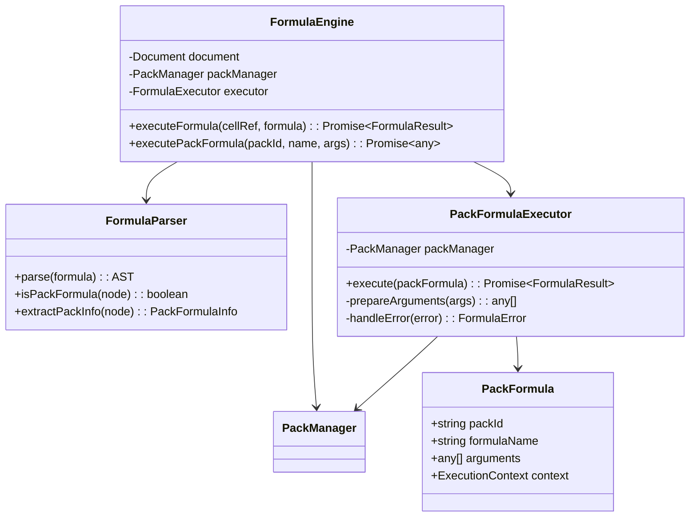
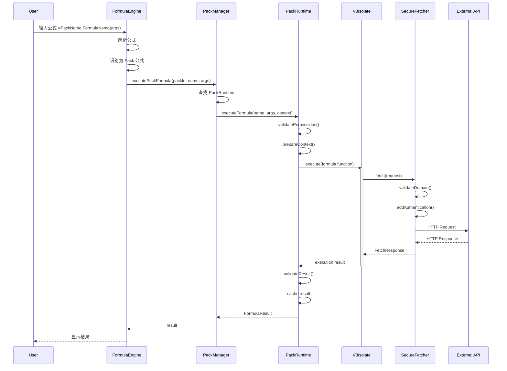
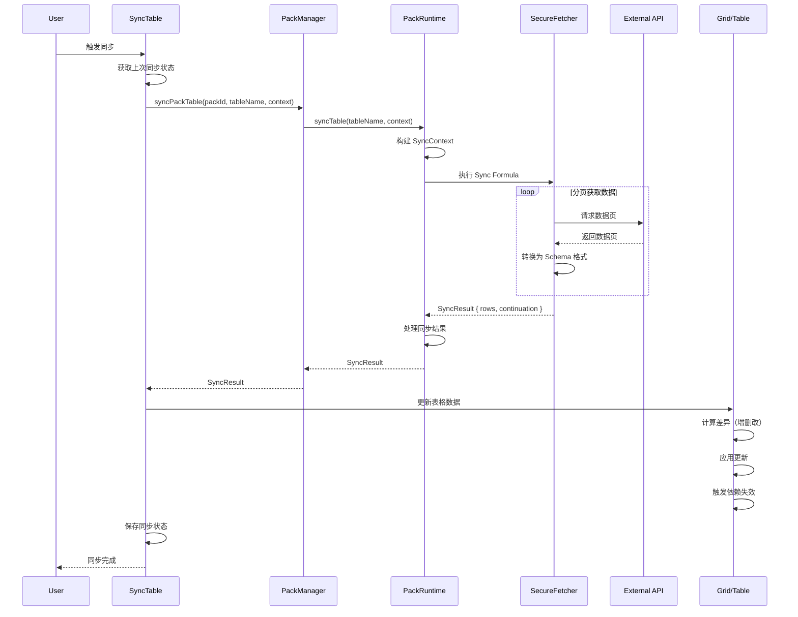
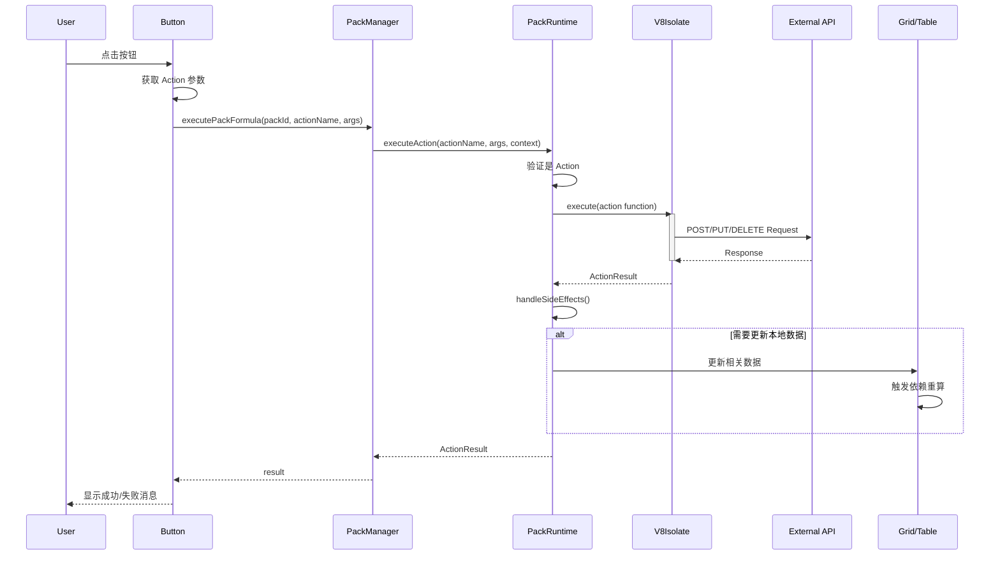
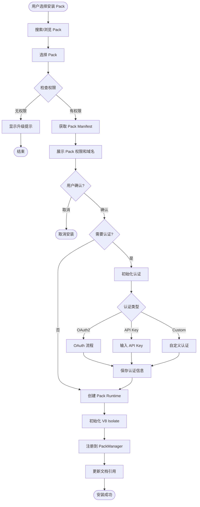
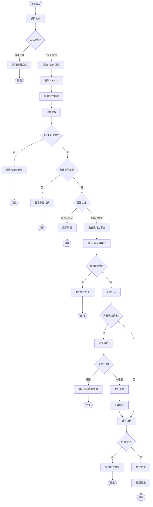
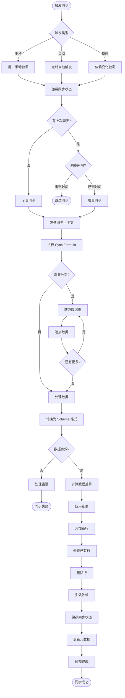

# Coda Pack 系统深入分析

## 目录
- [1. Pack 系统概览](#1-pack-系统概览)
- [2. Pack 核心能力](#2-pack-核心能力)
- [3. 主要类与架构](#3-主要类与架构)
- [4. Pack 执行流程](#4-pack-执行流程)
- [5. UML 类图](#5-uml-类图)
- [6. 时序图与流程图](#6-时序图与流程图)

---

## 1. Pack 系统概览

### 1.1 什么是 Pack

Pack 是 Coda 的扩展系统，允许开发者创建自定义的集成和功能。Pack 可以：
- 连接外部 API 和服务
- 创建自定义公式函数
- 实现数据同步表（Sync Tables）
- 执行自动化操作（Actions）

### 1.2 Pack 分层架构



---

## 2. Pack 核心能力

### 2.1 四大核心功能模块

#### 2.1.1 公式函数 (Pack Formulas)

自定义公式函数，可在 Coda 公式中调用。

**特点**：
- 支持同步和异步执行
- 可访问外部 API
- 参数类型化
- 返回值类型化

**示例**：
```typescript
pack.addFormula({
  name: "GetWeather",
  description: "Get current weather for a city",
  parameters: [
    coda.makeParameter({
      type: coda.ParameterType.String,
      name: "city",
      description: "City name"
    })
  ],
  resultType: coda.ValueType.String,
  execute: async function([city], context) {
    const response = await context.fetcher.fetch({
      method: "GET",
      url: `https://api.weather.com/v1/current?city=${city}`
    });
    return response.body.temperature;
  }
});
```

#### 2.1.2 同步表 (Sync Tables)

双向数据同步表，可以从外部数据源同步数据到 Coda。

**特点**：
- 自动同步机制
- 增量更新支持
- Schema 定义
- 双向同步（部分支持）

**示例**：
```typescript
pack.addSyncTable({
  name: "Tasks",
  description: "Sync tasks from external service",
  identityName: "Task",
  schema: TaskSchema,
  formula: {
    name: "SyncTasks",
    description: "Sync tasks",
    parameters: [],
    execute: async function([], context) {
      const response = await context.fetcher.fetch({
        method: "GET",
        url: "https://api.tasks.com/v1/tasks"
      });
      return {
        result: response.body.tasks
      };
    }
  }
});
```

#### 2.1.3 操作 (Pack Actions)

可执行的操作，通常用于按钮或自动化。

**特点**：
- 修改外部数据
- 触发外部流程
- 返回执行结果
- 支持副作用

**示例**：
```typescript
pack.addFormula({
  name: "CreateTask",
  description: "Create a new task",
  parameters: [
    coda.makeParameter({
      type: coda.ParameterType.String,
      name: "title",
      description: "Task title"
    })
  ],
  resultType: coda.ValueType.String,
  isAction: true,
  execute: async function([title], context) {
    const response = await context.fetcher.fetch({
      method: "POST",
      url: "https://api.tasks.com/v1/tasks",
      headers: {
        "Content-Type": "application/json"
      },
      body: JSON.stringify({ title })
    });
    return response.body.id;
  }
});
```

#### 2.1.4 认证 (Authentication)

处理外部服务的身份验证。

**支持的认证类型**：
- OAuth2
- API Key / Token
- Custom (自定义)
- None (无认证)

**示例**：
```typescript
pack.setUserAuthentication({
  type: coda.AuthenticationType.OAuth2,
  authorizationUrl: "https://service.com/oauth/authorize",
  tokenUrl: "https://service.com/oauth/token",
  scopes: ["read", "write"],
  additionalParams: {
    access_type: "offline"
  }
});
```

---

## 3. 主要类与架构

### 3.1 核心类结构

```typescript
/**
 * Pack Definition - Pack 定义
 */
interface PackDefinition {
  // 基本信息
  id: string;
  name: string;
  description: string;
  version: string;
  
  // 网络配置
  networkDomains: string[];
  
  // 认证配置
  authentication?: AuthenticationConfig;
  
  // 功能定义
  formulas: FormulaDefinition[];
  syncTables: SyncTableDefinition[];
  
  // 元数据
  manifest: PackManifest;
}

/**
 * Pack Runtime - Pack 运行时
 */
class PackRuntime {
  private packId: string;
  private manifest: PackManifest;
  private isolate: V8Isolate;
  private executionContext: ExecutionContext;
  
  constructor(packId: string, manifest: PackManifest) {
    this.packId = packId;
    this.manifest = manifest;
    this.isolate = this.createIsolate();
    this.executionContext = this.createExecutionContext();
  }
  
  /**
   * 执行 Pack 公式
   */
  async executeFormula(
    formulaName: string,
    args: any[],
    context: FormulaContext
  ): Promise<FormulaResult> {
    // 1. 验证权限
    this.validatePermissions(formulaName);
    
    // 2. 准备执行上下文
    const execContext = this.prepareContext(context);
    
    // 3. 在沙箱中执行
    const result = await this.isolate.execute(
      () => this.manifest.formulas[formulaName].execute(args, execContext)
    );
    
    // 4. 验证返回值
    this.validateResult(result);
    
    return result;
  }
  
  /**
   * 同步表数据
   */
  async syncTable(
    tableName: string,
    context: SyncContext
  ): Promise<SyncResult> {
    // 1. 获取上次同步状态
    const lastSync = context.sync.continuation;
    
    // 2. 执行同步公式
    const syncFormula = this.manifest.syncTables[tableName].formula;
    const result = await this.executeFormula(
      syncFormula.name,
      [],
      { ...context, sync: { continuation: lastSync } }
    );
    
    // 3. 处理返回数据
    return this.processSyncResult(result);
  }
  
  /**
   * 执行 Action
   */
  async executeAction(
    actionName: string,
    args: any[],
    context: ActionContext
  ): Promise<ActionResult> {
    // 1. 验证是 Action
    if (!this.manifest.formulas[actionName].isAction) {
      throw new Error(`${actionName} is not an action`);
    }
    
    // 2. 执行
    const result = await this.executeFormula(actionName, args, context);
    
    // 3. 触发副作用处理
    await this.handleSideEffects(result);
    
    return result;
  }
  
  /**
   * 创建 V8 隔离环境
   */
  private createIsolate(): V8Isolate {
    return new V8Isolate({
      memoryLimit: 128 * 1024 * 1024, // 128MB
      timeoutMs: 30000, // 30 seconds
      cpuLimit: 1.0
    });
  }
  
  /**
   * 创建执行上下文
   */
  private createExecutionContext(): ExecutionContext {
    return {
      fetcher: new SecureFetcher(this.manifest.networkDomains),
      temporaryBlobStorage: new TemporaryBlobStorage(),
      sync: new SyncContext(),
      invocationLocation: this.getInvocationLocation()
    };
  }
}

/**
 * Pack Formula Definition - Pack 公式定义
 */
interface FormulaDefinition {
  // 基本信息
  name: string;
  description: string;
  
  // 参数定义
  parameters: ParameterDefinition[];
  
  // 返回类型
  resultType: ValueType;
  
  // 是否为 Action
  isAction?: boolean;
  
  // 执行函数
  execute: (
    args: any[],
    context: ExecutionContext
  ) => Promise<any> | any;
  
  // 缓存配置
  cacheTtlSecs?: number;
  
  // 网络请求
  isSystem?: boolean;
  
  // 连接需求
  connectionRequirement?: ConnectionRequirement;
}

/**
 * Sync Table Definition - 同步表定义
 */
interface SyncTableDefinition {
  // 表名
  name: string;
  description: string;
  
  // 身份定义
  identityName: string;
  
  // Schema
  schema: Schema;
  
  // 同步公式
  formula: SyncFormulaDefinition;
  
  // 动态 Schema
  dynamicOptions?: DynamicSyncTableOptions;
  
  // 增量同步
  getter?: {
    // 获取数据
    getRows: (context: SyncContext) => Promise<SyncResult>;
    
    // 最大批量
    maxUpdateBatchSize?: number;
  };
}

/**
 * Execution Context - 执行上下文
 */
interface ExecutionContext {
  // 网络请求器
  fetcher: Fetcher;
  
  // 临时 Blob 存储
  temporaryBlobStorage: TemporaryBlobStorage;
  
  // 同步上下文
  sync?: SyncContext;
  
  // 调用位置
  invocationLocation: InvocationLocation;
  
  // 时区
  timezone?: string;
  
  // 用户区域设置
  locale?: string;
}

/**
 * Secure Fetcher - 安全的网络请求器
 */
class SecureFetcher {
  private allowedDomains: string[];
  private rateLimiter: RateLimiter;
  
  constructor(allowedDomains: string[]) {
    this.allowedDomains = allowedDomains;
    this.rateLimiter = new RateLimiter();
  }
  
  /**
   * 执行网络请求
   */
  async fetch(request: FetchRequest): Promise<FetchResponse> {
    // 1. 验证域名
    this.validateDomain(request.url);
    
    // 2. 速率限制
    await this.rateLimiter.checkLimit();
    
    // 3. 添加认证
    const authedRequest = await this.addAuthentication(request);
    
    // 4. 执行请求
    const response = await fetch(authedRequest.url, {
      method: authedRequest.method,
      headers: authedRequest.headers,
      body: authedRequest.body
    });
    
    // 5. 处理响应
    return this.processResponse(response);
  }
  
  /**
   * 验证域名
   */
  private validateDomain(url: string): void {
    const domain = new URL(url).hostname;
    if (!this.allowedDomains.some(allowed => domain.endsWith(allowed))) {
      throw new Error(`Domain ${domain} is not allowed`);
    }
  }
}

/**
 * Pack Manifest - Pack 清单
 */
interface PackManifest {
  // Pack 元数据
  id: string;
  name: string;
  description: string;
  version: string;
  
  // 作者信息
  author: {
    name: string;
    email?: string;
    website?: string;
  };
  
  // 网络域名白名单
  networkDomains: string[];
  
  // 公式列表
  formulas: Record<string, FormulaDefinition>;
  
  // 同步表列表
  syncTables: Record<string, SyncTableDefinition>;
  
  // 认证配置
  authentication?: AuthenticationConfig;
  
  // 系统版本要求
  systemVersionRequirement?: string;
  
  // 默认认证
  defaultAuthentication?: string;
}

/**
 * Pack Manager - Pack 管理器
 */
class PackManager {
  private installedPacks: Map<string, PackRuntime> = new Map();
  private packRegistry: PackRegistry;
  
  constructor(registry: PackRegistry) {
    this.packRegistry = registry;
  }
  
  /**
   * 安装 Pack
   */
  async installPack(packId: string, docId: string): Promise<void> {
    // 1. 从注册表获取 Pack 定义
    const manifest = await this.packRegistry.getManifest(packId);
    
    // 2. 验证权限
    await this.validatePermissions(manifest, docId);
    
    // 3. 创建运行时
    const runtime = new PackRuntime(packId, manifest);
    
    // 4. 注册到文档
    this.installedPacks.set(packId, runtime);
    
    // 5. 初始化认证
    await this.initializeAuthentication(packId, manifest);
  }
  
  /**
   * 卸载 Pack
   */
  async uninstallPack(packId: string): Promise<void> {
    const runtime = this.installedPacks.get(packId);
    if (!runtime) return;
    
    // 1. 清理资源
    await runtime.cleanup();
    
    // 2. 移除引用
    this.installedPacks.delete(packId);
  }
  
  /**
   * 执行 Pack 公式
   */
  async executePackFormula(
    packId: string,
    formulaName: string,
    args: any[],
    context: FormulaContext
  ): Promise<any> {
    const runtime = this.installedPacks.get(packId);
    if (!runtime) {
      throw new Error(`Pack ${packId} is not installed`);
    }
    
    return await runtime.executeFormula(formulaName, args, context);
  }
  
  /**
   * 同步 Pack 表
   */
  async syncPackTable(
    packId: string,
    tableName: string,
    context: SyncContext
  ): Promise<SyncResult> {
    const runtime = this.installedPacks.get(packId);
    if (!runtime) {
      throw new Error(`Pack ${packId} is not installed`);
    }
    
    return await runtime.syncTable(tableName, context);
  }
}

/**
 * Pack Registry - Pack 注册表
 */
class PackRegistry {
  private apiClient: APIClient;
  private cache: Map<string, PackManifest> = new Map();
  
  /**
   * 获取 Pack 清单
   */
  async getManifest(packId: string): Promise<PackManifest> {
    // 1. 检查缓存
    if (this.cache.has(packId)) {
      return this.cache.get(packId)!;
    }
    
    // 2. 从服务器获取
    const manifest = await this.apiClient.getPackManifest(packId);
    
    // 3. 缓存
    this.cache.set(packId, manifest);
    
    return manifest;
  }
  
  /**
   * 搜索 Pack
   */
  async searchPacks(query: string): Promise<PackSearchResult[]> {
    return await this.apiClient.searchPacks(query);
  }
  
  /**
   * 获取 Pack 列表
   */
  async listPacks(category?: string): Promise<PackListItem[]> {
    return await this.apiClient.listPacks(category);
  }
}
```

---

## 4. Pack 执行流程

### 4.1 Pack 公式执行流程

```
用户调用公式
    ↓
公式引擎识别 Pack 公式
    ↓
Pack Manager 查找对应 Pack
    ↓
验证权限和参数
    ↓
创建执行上下文
    ↓
在 V8 Isolate 中执行
    ↓
处理网络请求（如需要）
    ↓
验证返回值
    ↓
缓存结果
    ↓
返回给用户
```

### 4.2 Sync Table 同步流程

```
触发同步（手动/自动）
    ↓
获取上次同步状态
    ↓
调用 Sync Formula
    ↓
获取数据（可能分页）
    ↓
转换为 Schema 格式
    ↓
计算差异（增删改）
    ↓
更新本地数据
    ↓
保存同步状态
    ↓
触发依赖重算
```

### 4.3 Pack Action 执行流程

```
用户触发 Action（按钮/自动化）
    ↓
验证 Action 权限
    ↓
准备参数
    ↓
执行 Action 公式
    ↓
调用外部 API
    ↓
处理响应
    ↓
更新相关数据（可选）
    ↓
返回执行结果
    ↓
显示成功/失败消息
```

---

## 5. UML 类图

### 5.1 Pack 核心类图



### 5.2 Pack 公式执行相关类图



---

## 6. 时序图与流程图

### 6.1 Pack 公式执行时序图



### 6.2 Sync Table 同步时序图



### 6.3 Pack Action 执行时序图



### 6.4 Pack 安装流程图



### 6.5 Pack 公式解析流程图



### 6.6 Sync Table 同步详细流程图



---

## 7. Pack 安全机制

### 7.1 沙箱隔离

```typescript
/**
 * V8 Isolate 沙箱配置
 */
interface IsolateConfig {
  // 内存限制
  memoryLimit: number;  // 128MB
  
  // 超时限制
  timeoutMs: number;    // 30秒
  
  // CPU 限制
  cpuLimit: number;     // 1.0 (100%)
  
  // 禁止的全局对象
  disabledGlobals: string[];  // ['eval', 'Function']
  
  // 网络限制
  networkRestrictions: {
    allowedDomains: string[];
    maxConcurrentRequests: number;
    requestTimeout: number;
  };
}
```

### 7.2 权限控制

```typescript
/**
 * Pack 权限级别
 */
enum PackPermission {
  // 只读数据
  ReadData = 'READ_DATA',
  
  // 写入数据
  WriteData = 'WRITE_DATA',
  
  // 网络访问
  Network = 'NETWORK',
  
  // 执行 Actions
  ExecuteActions = 'EXECUTE_ACTIONS',
  
  // 文件存储
  FileStorage = 'FILE_STORAGE'
}

/**
 * 权限验证
 */
class PermissionValidator {
  validateFormulaExecution(
    pack: PackDefinition,
    formula: FormulaDefinition,
    context: ExecutionContext
  ): boolean {
    // 1. 检查 Pack 权限
    if (!pack.permissions.includes(PackPermission.Network) && 
        formula.requiresNetwork) {
      throw new PermissionError('Network access not allowed');
    }
    
    // 2. 检查 Action 权限
    if (formula.isAction && 
        !pack.permissions.includes(PackPermission.ExecuteActions)) {
      throw new PermissionError('Action execution not allowed');
    }
    
    // 3. 检查用户权限
    if (!context.user.canUsePack(pack.id)) {
      throw new PermissionError('User not authorized to use this Pack');
    }
    
    return true;
  }
}
```

### 7.3 速率限制

```typescript
/**
 * 速率限制器
 */
class RateLimiter {
  private requests: Map<string, Request[]> = new Map();
  
  // 限制配置
  private limits = {
    perSecond: 10,
    perMinute: 100,
    perHour: 1000
  };
  
  /**
   * 检查速率限制
   */
  async checkLimit(packId: string): Promise<boolean> {
    const now = Date.now();
    const requests = this.getRequests(packId, now);
    
    // 检查每秒限制
    const lastSecond = requests.filter(r => now - r.timestamp < 1000);
    if (lastSecond.length >= this.limits.perSecond) {
      throw new RateLimitError('Too many requests per second');
    }
    
    // 检查每分钟限制
    const lastMinute = requests.filter(r => now - r.timestamp < 60000);
    if (lastMinute.length >= this.limits.perMinute) {
      throw new RateLimitError('Too many requests per minute');
    }
    
    // 检查每小时限制
    const lastHour = requests.filter(r => now - r.timestamp < 3600000);
    if (lastHour.length >= this.limits.perHour) {
      throw new RateLimitError('Too many requests per hour');
    }
    
    // 记录请求
    this.recordRequest(packId, now);
    
    return true;
  }
}
```

---

## 8. Pack 开发最佳实践

### 8.1 公式设计

```typescript
// ✅ 好的实践
pack.addFormula({
  name: "GetUserProfile",
  description: "Get user profile by ID",
  parameters: [
    coda.makeParameter({
      type: coda.ParameterType.String,
      name: "userId",
      description: "User ID"
    })
  ],
  resultType: coda.ValueType.Object,
  schema: UserProfileSchema,
  cacheTtlSecs: 300,  // 缓存 5 分钟
  execute: async function([userId], context) {
    // 参数验证
    if (!userId) {
      throw new coda.UserVisibleError("User ID is required");
    }
    
    // 执行请求
    const response = await context.fetcher.fetch({
      method: "GET",
      url: `/users/${userId}`,
      cacheTtlSecs: 300
    });
    
    // 返回结构化数据
    return {
      id: response.body.id,
      name: response.body.name,
      email: response.body.email,
      avatar: response.body.avatar_url
    };
  }
});

// ❌ 不好的实践
pack.addFormula({
  name: "DoEverything",  // 功能过于宽泛
  parameters: [],  // 缺少参数
  resultType: coda.ValueType.String,  // 返回类型不明确
  execute: async function([], context) {
    // 没有错误处理
    // 没有缓存
    // 返回格式不一致
    const data = await context.fetcher.fetch({ url: "/api" });
    return JSON.stringify(data);  // 不应返回 JSON 字符串
  }
});
```

### 8.2 Sync Table 设计

```typescript
// ✅ 好的实践
pack.addSyncTable({
  name: "Tasks",
  description: "Sync tasks from project management tool",
  identityName: "Task",
  schema: TaskSchema,
  formula: {
    name: "SyncTasks",
    description: "Sync tasks",
    parameters: [
      coda.makeParameter({
        type: coda.ParameterType.String,
        name: "projectId",
        description: "Project ID",
        optional: false
      })
    ],
    execute: async function([projectId], context) {
      // 增量同步支持
      const continuation = context.sync.continuation;
      const url = continuation?.nextUrl || `/projects/${projectId}/tasks`;
      
      const response = await context.fetcher.fetch({
        method: "GET",
        url: url
      });
      
      const tasks = response.body.tasks.map(task => ({
        id: task.id,
        title: task.title,
        status: task.status,
        assignee: task.assignee,
        dueDate: task.due_date
      }));
      
      return {
        result: tasks,
        continuation: response.body.next_url ? {
          nextUrl: response.body.next_url
        } : undefined
      };
    }
  }
});
```

### 8.3 错误处理

```typescript
// ✅ 好的错误处理
async function execute([arg], context) {
  try {
    const response = await context.fetcher.fetch({
      method: "GET",
      url: `/api/resource/${arg}`
    });
    
    return response.body;
    
  } catch (error) {
    // 区分不同类型的错误
    if (error.statusCode === 404) {
      throw new coda.UserVisibleError(`Resource ${arg} not found`);
    } else if (error.statusCode === 401) {
      throw new coda.UserVisibleError("Authentication failed. Please reconnect your account.");
    } else if (error.statusCode === 429) {
      throw new coda.UserVisibleError("Rate limit exceeded. Please try again later.");
    } else {
      throw new coda.UserVisibleError(`Failed to fetch data: ${error.message}`);
    }
  }
}
```

---

## 9. 总结

### 9.1 Pack 系统特点

1. **模块化扩展**：通过 Pack 系统，Coda 实现了强大的可扩展性
2. **安全隔离**：V8 Isolate 提供了强大的安全保障
3. **类型安全**：Schema 和参数定义保证了数据类型安全
4. **性能优化**：缓存、速率限制等机制保证了系统性能
5. **开发友好**：清晰的 API 和丰富的功能支持

### 9.2 主要组件总结

| 组件 | 职责 | 关键类 |
|------|------|--------|
| **Pack Runtime** | Pack 执行环境 | `PackRuntime`, `V8Isolate` |
| **Pack Manager** | Pack 生命周期管理 | `PackManager`, `PackRegistry` |
| **Formula Execution** | 公式执行 | `FormulaEngine`, `PackFormulaExecutor` |
| **Sync Engine** | 数据同步 | `SyncEngine`, `SyncTableManager` |
| **Security** | 安全控制 | `SecureFetcher`, `PermissionValidator` |
| **Authentication** | 认证管理 | `AuthManager`, `OAuth2Handler` |

### 9.3 技术亮点

1. **V8 Isolate 沙箱**：完全隔离的执行环境
2. **声明式 API**：Schema-driven 的开发方式
3. **增量同步**：高效的数据同步机制
4. **智能缓存**：多层缓存策略
5. **速率限制**：保护系统资源
6. **错误恢复**：优雅的错误处理

---

## 参考资料

- [Coda Pack SDK 文档](https://coda.io/packs)
- [V8 Isolate 文档](https://v8.dev/docs/embed)
- [OAuth 2.0 规范](https://oauth.net/2/)
- Coda 源码分析

