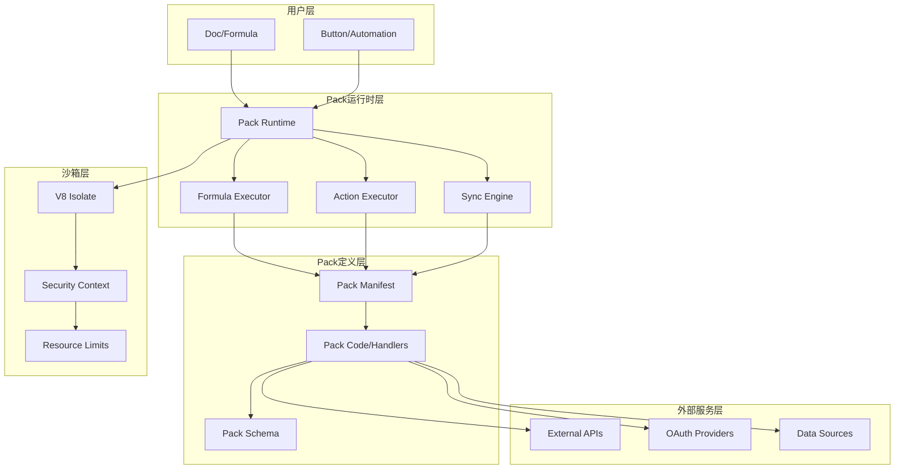
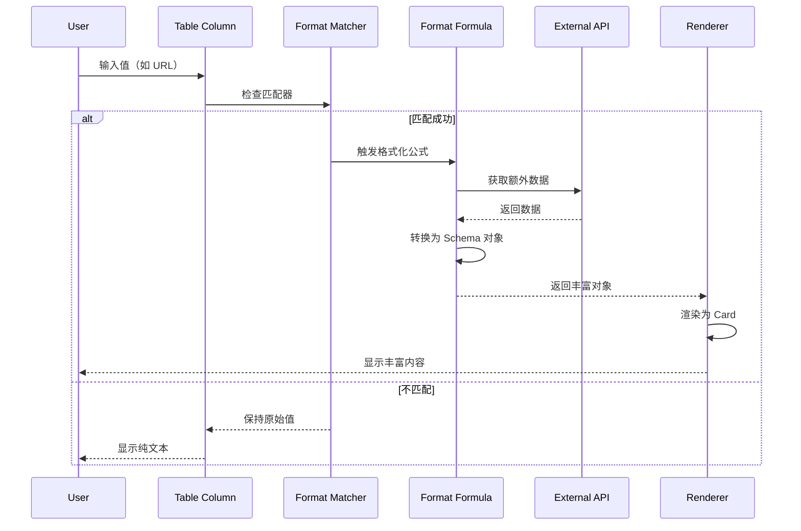
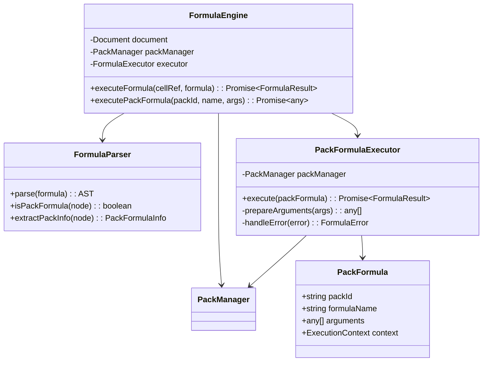
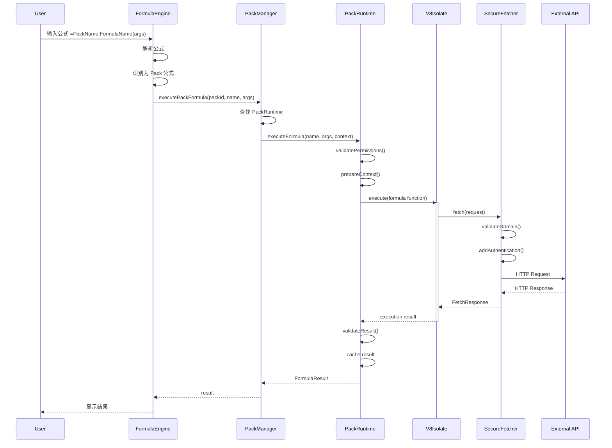
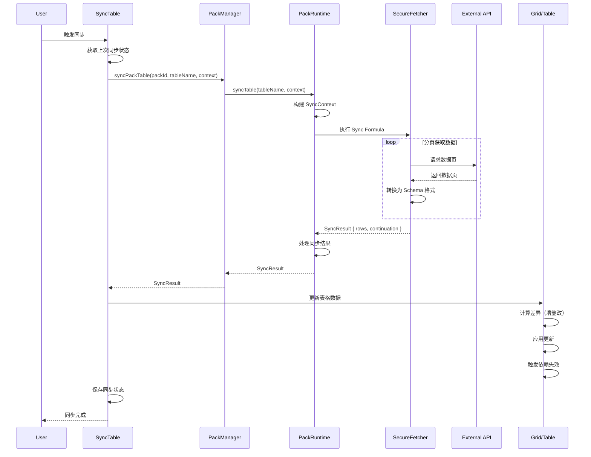
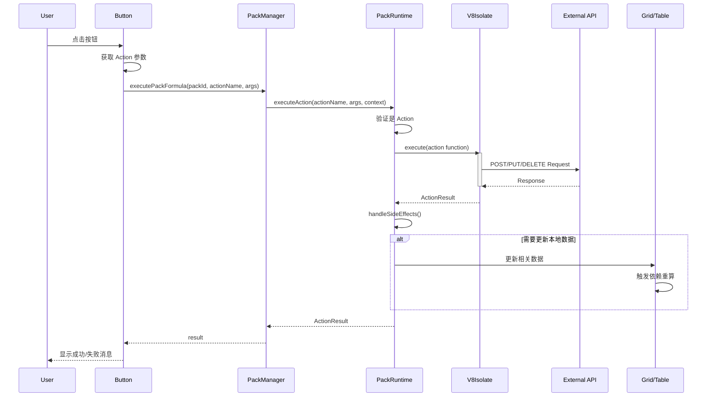

# Coda Pack 系统深入分析

## 目录
- [1. Pack 系统概览](#1-pack-系统概览)
- [2. Pack 核心能力](#2-pack-核心能力)
- [3. 主要类与架构](#3-主要类与架构)
- [4. Pack 执行流程](#4-pack-执行流程)
- [5. UML 类图](#5-uml-类图)
- [6. 时序图与流程图](#6-时序图与流程图)

---

## 1. Pack 系统概览

### 1.1 什么是 Pack

Pack 是 Coda 的扩展系统，允许开发者创建自定义的集成和功能。Pack 可以：
- 连接外部 API 和服务
- 创建自定义公式函数
- 实现数据同步表（Sync Tables）
- 执行自动化操作（Actions）

### 1.2 Pack 分层架构



---

## 2. Pack 核心能力

### 2.1 四大核心功能模块

根据 [Coda Pack 官方文档](https://coda.io/packs/build/latest/guides/overview/)，Pack 可以通过四种方式扩展 Coda：

1. **Formulas** - 公式函数
2. **Actions** - 操作
3. **Column formats** - 列格式
4. **Sync tables** - 同步表（Pack tables）

#### 2.1.1 公式函数 (Pack Formulas)

自定义公式函数，可在 Coda 公式中调用。

**特点**：
- 支持同步和异步执行
- 可访问外部 API
- 参数类型化
- 返回值类型化

**示例**：
```typescript
pack.addFormula({
  name: "GetWeather",
  description: "Get current weather for a city",
  parameters: [
    coda.makeParameter({
      type: coda.ParameterType.String,
      name: "city",
      description: "City name"
    })
  ],
  resultType: coda.ValueType.String,
  execute: async function([city], context) {
    const response = await context.fetcher.fetch({
      method: "GET",
      url: `https://api.weather.com/v1/current?city=${city}`
    });
    return response.body.temperature;
  }
});
```

#### 2.1.2 同步表 (Sync Tables)

双向数据同步表，可以从外部数据源同步数据到 Coda。

**特点**：
- 自动同步机制
- 增量更新支持
- Schema 定义
- 双向同步（部分支持）

**示例**：
```typescript
pack.addSyncTable({
  name: "Tasks",
  description: "Sync tasks from external service",
  identityName: "Task",
  schema: TaskSchema,
  formula: {
    name: "SyncTasks",
    description: "Sync tasks",
    parameters: [],
    execute: async function([], context) {
      const response = await context.fetcher.fetch({
        method: "GET",
        url: "https://api.tasks.com/v1/tasks"
      });
      return {
        result: response.body.tasks
      };
    }
  }
});
```

#### 2.1.3 操作 (Pack Actions)

可执行的操作，通常用于按钮或自动化。

**特点**：
- 修改外部数据
- 触发外部流程
- 返回执行结果
- 支持副作用

**示例**：
```typescript
pack.addFormula({
  name: "CreateTask",
  description: "Create a new task",
  parameters: [
    coda.makeParameter({
      type: coda.ParameterType.String,
      name: "title",
      description: "Task title"
    })
  ],
  resultType: coda.ValueType.String,
  isAction: true,
  execute: async function([title], context) {
    const response = await context.fetcher.fetch({
      method: "POST",
      url: "https://api.tasks.com/v1/tasks",
      headers: {
        "Content-Type": "application/json"
      },
      body: JSON.stringify({ title })
    });
    return response.body.id;
  }
});
```

#### 2.1.4 列格式 (Column Formats)

**列格式是 Pack 提供的自定义列类型**，用于控制表格列中值的显示和交互方式。这是 Pack 的一个强大但容易被忽视的功能。

**核心概念**：
- 列格式通过 `addColumnFormat()` 定义
- 将简单的输入值（如 URL）转换为丰富的结构化对象
- 可以从外部 API 获取额外数据进行展示
- 支持自定义渲染和交互

**技术实现**：

```typescript
/**
 * Column Format Definition - 列格式定义
 */
interface ColumnFormatDefinition {
  // 格式名称
  name: string;
  
  // 描述
  description?: string;
  
  // 说明文本
  instructions?: string;
  
  // 匹配器 - 判断输入值是否适用此格式
  matchers: ColumnFormatMatcher[];
  
  // 公式 - 将输入值转换为丰富对象
  formulaName: string;
  
  // 占位符文本
  placeholder?: string;
  
  // 是否允许多个值
  allowNewTopLevelValues?: boolean;
}

/**
 * Column Format Matcher - 列格式匹配器
 */
interface ColumnFormatMatcher {
  // 类型：URL 或正则表达式
  type: 'url' | 'regex';
  
  // URL 域名匹配（用于 URL 类型）
  urlDomain?: string;
  
  // 正则表达式（用于 regex 类型）
  regex?: RegExp;
}
```

**完整示例：Google Calendar 事件列格式**

```typescript
import * as coda from '@codahq/packs-sdk';

// 1. 定义事件 Schema
const EventSchema = coda.makeObjectSchema({
  properties: {
    id: { type: coda.ValueType.String },
    title: { 
      type: coda.ValueType.String,
      fromKey: 'summary'
    },
    description: { type: coda.ValueType.String },
    start: { 
      type: coda.ValueType.String, 
      codaType: coda.ValueHintType.DateTime 
    },
    end: { 
      type: coda.ValueType.String, 
      codaType: coda.ValueHintType.DateTime 
    },
    location: { type: coda.ValueType.String },
    attendees: {
      type: coda.ValueType.Array,
      items: coda.makeObjectSchema({
        properties: {
          email: { type: coda.ValueType.String },
          name: { type: coda.ValueType.String }
        }
      })
    },
    status: { type: coda.ValueType.String },
    url: { 
      type: coda.ValueType.String,
      codaType: coda.ValueHintType.Url
    }
  },
  displayProperty: 'title',
  idProperty: 'id',
  featuredProperties: ['start', 'end', 'location']
});

// 2. 定义格式化公式
pack.addFormula({
  name: "FormatEvent",
  description: "Format a calendar event URL",
  parameters: [
    coda.makeParameter({
      type: coda.ParameterType.String,
      name: "eventUrl",
      description: "URL of the calendar event"
    })
  ],
  resultType: coda.ValueType.Object,
  schema: EventSchema,
  
  execute: async function([eventUrl], context) {
    // 从 URL 中提取事件 ID
    const eventId = extractEventIdFromUrl(eventUrl);
    
    // 调用 Google Calendar API 获取事件详情
    const response = await context.fetcher.fetch({
      method: "GET",
      url: `https://www.googleapis.com/calendar/v3/calendars/primary/events/${eventId}`
    });
    
    const event = response.body;
    
    // 返回格式化的事件对象
    return {
      id: event.id,
      title: event.summary,
      description: event.description,
      start: event.start.dateTime,
      end: event.end.dateTime,
      location: event.location,
      attendees: event.attendees?.map(a => ({
        email: a.email,
        name: a.displayName
      })) || [],
      status: event.status,
      url: event.htmlLink
    };
  }
});

// 3. 添加列格式
pack.addColumnFormat({
  name: "Calendar Event",
  description: "Display rich information about a calendar event",
  instructions: "Paste a Google Calendar event URL",
  
  // 匹配器：只匹配 Google Calendar URL
  matchers: [
    {
      type: 'url',
      urlDomain: 'calendar.google.com'
    }
  ],
  
  // 使用上面定义的公式进行格式化
  formulaName: "FormatEvent",
  
  placeholder: "Paste calendar event URL..."
});

function extractEventIdFromUrl(url: string): string {
  // 从 URL 中提取事件 ID
  // 例如: https://calendar.google.com/calendar/event?eid=xyz123
  const match = url.match(/[?&]eid=([^&]+)/);
  if (!match) {
    throw new coda.UserVisibleError("Invalid calendar event URL");
  }
  return match[1];
}
```

**使用场景示例**：

```typescript
// 场景 1：GitHub Issue 列格式
pack.addColumnFormat({
  name: "GitHub Issue",
  matchers: [
    {
      type: 'url',
      urlDomain: 'github.com'
    },
    {
      type: 'regex',
      regex: /^#\d+$/  // 匹配 #123 格式
    }
  ],
  formulaName: "FormatGitHubIssue"
});

// 场景 2：Jira Ticket 列格式
pack.addColumnFormat({
  name: "Jira Ticket",
  matchers: [
    {
      type: 'regex',
      regex: /^[A-Z]+-\d+$/  // 匹配 PROJ-123 格式
    }
  ],
  formulaName: "FormatJiraTicket"
});

// 场景 3：社交媒体帖子
pack.addColumnFormat({
  name: "Twitter Tweet",
  matchers: [
    {
      type: 'url',
      urlDomain: 'twitter.com'
    }
  ],
  formulaName: "FormatTweet"
});
```

**列格式的工作流程**：



**列格式 vs 普通公式的区别**：

| 特性 | 列格式 (Column Format) | 普通公式 |
|------|----------------------|---------|
| **触发方式** | 用户输入值时自动触发 | 显式调用公式 |
| **输入** | 列中的原始值（URL/文本） | 明确的参数 |
| **输出** | 丰富的结构化对象（Card） | 计算结果 |
| **渲染** | 自动渲染为卡片视图 | 显示为单元格值 |
| **使用场景** | 增强数据显示 | 计算和转换 |
| **示例** | URL → 事件详情卡片 | 计算总和 |

**技术实现细节**：

```typescript
/**
 * Column Format Manager - 列格式管理器
 */
class ColumnFormatManager {
  private formats: Map<string, ColumnFormatDefinition> = new Map();
  private packManager: PackManager;
  
  /**
   * 注册列格式
   */
  registerFormat(packId: string, format: ColumnFormatDefinition): void {
    const key = `${packId}:${format.name}`;
    this.formats.set(key, format);
  }
  
  /**
   * 匹配列格式
   */
  matchFormat(value: string): ColumnFormatDefinition | null {
    for (const [key, format] of this.formats) {
      if (this.isMatch(value, format.matchers)) {
        return format;
      }
    }
    return null;
  }
  
  /**
   * 检查值是否匹配
   */
  private isMatch(
    value: string, 
    matchers: ColumnFormatMatcher[]
  ): boolean {
    return matchers.some(matcher => {
      if (matcher.type === 'url') {
        try {
          const url = new URL(value);
          return matcher.urlDomain 
            ? url.hostname.endsWith(matcher.urlDomain)
            : true;
        } catch {
          return false;
        }
      } else if (matcher.type === 'regex') {
        return matcher.regex?.test(value) || false;
      }
      return false;
    });
  }
  
  /**
   * 格式化值
   */
  async formatValue(
    value: string,
    format: ColumnFormatDefinition,
    context: ExecutionContext
  ): Promise<any> {
    // 找到格式化公式
    const formula = this.packManager.getFormula(
      format.packId,
      format.formulaName
    );
    
    if (!formula) {
      throw new Error(`Formula ${format.formulaName} not found`);
    }
    
    // 执行公式，传入原始值
    const result = await this.packManager.executePackFormula(
      format.packId,
      format.formulaName,
      [value],
      context
    );
    
    return result;
  }
}

/**
 * Table Column - 表格列实现
 */
class TableColumn {
  private columnFormat?: ColumnFormatDefinition;
  private formatManager: ColumnFormatManager;
  
  /**
   * 设置列格式
   */
  setFormat(formatKey: string): void {
    this.columnFormat = this.formatManager.getFormat(formatKey);
  }
  
  /**
   * 设置单元格值
   */
  async setCellValue(rowId: string, value: any): Promise<void> {
    // 1. 保存原始值
    this.setRawValue(rowId, value);
    
    // 2. 如果有列格式，尝试格式化
    if (this.columnFormat && typeof value === 'string') {
      try {
        // 执行格式化
        const formattedValue = await this.formatManager.formatValue(
          value,
          this.columnFormat,
          this.buildContext()
        );
        
        // 3. 保存格式化后的丰富对象
        this.setFormattedValue(rowId, formattedValue);
        
        // 4. 触发渲染更新
        this.invalidateCell(rowId);
        
      } catch (error) {
        console.error('Failed to format value:', error);
        // 格式化失败时保持原始值
      }
    }
  }
  
  /**
   * 获取单元格显示值
   */
  getCellDisplayValue(rowId: string): any {
    // 优先返回格式化后的值
    const formatted = this.getFormattedValue(rowId);
    if (formatted) {
      return formatted;
    }
    
    // 否则返回原始值
    return this.getRawValue(rowId);
  }
}
```

**列格式的渲染机制**：

```typescript
/**
 * Card Renderer - 卡片渲染器
 */
class CardRenderer {
  /**
   * 渲染列格式对象为卡片
   */
  renderCard(
    value: any,
    schema: ObjectSchemaDefinition
  ): React.ReactElement {
    return (
      <Card>
        {/* 标题 */}
        <CardHeader>
          {value[schema.displayProperty]}
        </CardHeader>
        
        {/* 特色属性 */}
        <CardBody>
          {schema.featuredProperties?.map(propKey => (
            <PropertyRow key={propKey}>
              <PropertyLabel>{propKey}</PropertyLabel>
              <PropertyValue>
                {this.renderValue(value[propKey], schema.properties[propKey])}
              </PropertyValue>
            </PropertyRow>
          ))}
        </CardBody>
        
        {/* 操作按钮 */}
        <CardActions>
          {value.url && (
            <Button onClick={() => window.open(value.url)}>
              Open
            </Button>
          )}
        </CardActions>
      </Card>
    );
  }
  
  /**
   * 根据类型渲染值
   */
  private renderValue(value: any, schema: PropertySchema): any {
    if (schema.codaType === ValueHintType.DateTime) {
      return formatDateTime(value);
    } else if (schema.codaType === ValueHintType.Url) {
      return <Link href={value}>{value}</Link>;
    } else if (schema.type === ValueType.Array) {
      return value.map((item, i) => 
        <Chip key={i}>{item}</Chip>
      );
    }
    return value;
  }
}
```

**性能优化**：

```typescript
/**
 * Column Format Cache - 列格式缓存
 */
class ColumnFormatCache {
  private cache: Map<string, CacheEntry> = new Map();
  
  /**
   * 缓存格式化结果
   */
  set(
    packId: string,
    formatName: string,
    rawValue: string,
    formattedValue: any,
    ttl: number
  ): void {
    const key = this.getCacheKey(packId, formatName, rawValue);
    this.cache.set(key, {
      value: formattedValue,
      timestamp: Date.now(),
      ttl
    });
  }
  
  /**
   * 获取缓存
   */
  get(
    packId: string,
    formatName: string,
    rawValue: string
  ): any | null {
    const key = this.getCacheKey(packId, formatName, rawValue);
    const entry = this.cache.get(key);
    
    if (!entry) return null;
    
    // 检查是否过期
    if (Date.now() - entry.timestamp > entry.ttl) {
      this.cache.delete(key);
      return null;
    }
    
    return entry.value;
  }
  
  private getCacheKey(
    packId: string,
    formatName: string,
    rawValue: string
  ): string {
    return `${packId}:${formatName}:${hashString(rawValue)}`;
  }
}
```

**实际应用示例**：

```typescript
// 1. Figma 设计文件格式
pack.addColumnFormat({
  name: "Figma Design",
  matchers: [
    { type: 'url', urlDomain: 'figma.com' }
  ],
  formulaName: "FormatFigmaDesign"
});

// 2. Linear Issue 格式
pack.addColumnFormat({
  name: "Linear Issue",
  matchers: [
    { type: 'regex', regex: /^[A-Z]+-\d+$/ }
  ],
  formulaName: "FormatLinearIssue"
});

// 3. Notion Page 格式
pack.addColumnFormat({
  name: "Notion Page",
  matchers: [
    { type: 'url', urlDomain: 'notion.so' }
  ],
  formulaName: "FormatNotionPage"
});

// 4. Slack Message 格式
pack.addColumnFormat({
  name: "Slack Message",
  matchers: [
    { type: 'url', urlDomain: 'slack.com' }
  ],
  formulaName: "FormatSlackMessage"
});
```

---

### 2.1.4.1 Column Format 深度解析

#### 问题 1：输入格式限制

**Column Format 的输入不仅限于 URL！** 通过 `matchers` 配置，支持多种输入格式：

**1. URL 匹配**
```typescript
// 匹配特定域名的 URL
matchers: [
  { type: 'url', urlDomain: 'github.com' }
]
// 输入示例: "https://github.com/user/repo/issues/123"
```

**2. 正则表达式匹配（文本格式）**
```typescript
// 示例 1: 匹配 Issue ID
matchers: [
  { type: 'regex', regex: /^#\d+$/ }  // #123
]

// 示例 2: 匹配 Jira Ticket
matchers: [
  { type: 'regex', regex: /^[A-Z]+-\d+$/ }  // PROJ-456
]

// 示例 3: 匹配邮箱地址
matchers: [
  { 
    type: 'regex', 
    regex: /^[a-zA-Z0-9._%+-]+@[a-zA-Z0-9.-]+\.[a-zA-Z]{2,}$/ 
  }
]

// 示例 4: 匹配电话号码
matchers: [
  { type: 'regex', regex: /^\+?1?\d{10,14}$/ }
]

// 示例 5: 匹配自定义 ID 格式
matchers: [
  { type: 'regex', regex: /^USR-[A-Z0-9]{8}$/ }  // USR-AB12CD34
]

// 示例 6: 匹配 UUID
matchers: [
  { 
    type: 'regex', 
    regex: /^[0-9a-f]{8}-[0-9a-f]{4}-[0-9a-f]{4}-[0-9a-f]{4}-[0-9a-f]{12}$/i 
  }
]
```

**3. 组合多个匹配器**
```typescript
// 同时支持 URL 和文本 ID
pack.addColumnFormat({
  name: "GitHub Issue",
  matchers: [
    { type: 'url', urlDomain: 'github.com' },  // URL 格式
    { type: 'regex', regex: /^#\d+$/ },        // #123 格式
    { type: 'regex', regex: /^GH-\d+$/ }       // GH-123 格式
  ],
  formulaName: "FormatGitHubIssue"
});
```

**4. 关于图片和二进制数据**

Column Format 本身**不直接支持二进制输入**，但可以通过以下方式处理：

```typescript
// 方案 1: 图片 URL → 增强显示
pack.addColumnFormat({
  name: "Enhanced Image",
  matchers: [
    { 
      type: 'regex', 
      regex: /\.(jpg|jpeg|png|gif|webp)$/i  // 图片 URL
    }
  ],
  formulaName: "FormatImage"
});

pack.addFormula({
  name: "FormatImage",
  parameters: [
    coda.makeParameter({
      type: coda.ParameterType.String,
      name: "imageUrl"
    })
  ],
  resultType: coda.ValueType.Object,
  schema: coda.makeObjectSchema({
    properties: {
      url: { 
        type: coda.ValueType.String,
        codaType: coda.ValueHintType.ImageReference  // 图片类型
      },
      thumbnail: {
        type: coda.ValueType.String,
        codaType: coda.ValueHintType.ImageReference
      },
      width: { type: coda.ValueType.Number },
      height: { type: coda.ValueType.Number },
      size: { type: coda.ValueType.Number },
      format: { type: coda.ValueType.String }
    },
    displayProperty: 'url'
  }),
  execute: async ([imageUrl], context) => {
    // 调用图片服务 API 获取元数据
    const response = await context.fetcher.fetch({
      method: "GET",
      url: `https://api.imageservice.com/analyze?url=${imageUrl}`
    });
    
    return {
      url: imageUrl,
      thumbnail: response.body.thumbnail,
      width: response.body.width,
      height: response.body.height,
      size: response.body.size,
      format: response.body.format
    };
  }
});

// 方案 2: Base64 图片数据 → 上传并转换
pack.addColumnFormat({
  name: "Base64 Image",
  matchers: [
    { 
      type: 'regex', 
      regex: /^data:image\/(png|jpg|jpeg|gif);base64,/  // Base64 图片
    }
  ],
  formulaName: "FormatBase64Image"
});

pack.addFormula({
  name: "FormatBase64Image",
  parameters: [
    coda.makeParameter({
      type: coda.ParameterType.String,
      name: "base64Data"
    })
  ],
  resultType: coda.ValueType.String,
  codaType: coda.ValueHintType.ImageReference,
  execute: async ([base64Data], context) => {
    // 1. 解析 Base64 数据
    const matches = base64Data.match(/^data:image\/(\w+);base64,(.+)$/);
    if (!matches) {
      throw new coda.UserVisibleError("Invalid Base64 image data");
    }
    
    const [, format, data] = matches;
    
    // 2. 上传到临时存储
    const blob = await context.temporaryBlobStorage.storeBlob(
      Buffer.from(data, 'base64'),
      `image/${format}`
    );
    
    // 3. 返回 Coda 可访问的 URL
    return blob.url;
  }
});
```

**支持的输入数据类型总结**：

| 输入类型 | Matcher 配置 | 示例 |
|---------|-------------|------|
| **URL** | `{ type: 'url', urlDomain: '...' }` | `https://example.com/item/123` |
| **文本 ID** | `{ type: 'regex', regex: /.../ }` | `#123`, `PROJ-456` |
| **邮箱** | `{ type: 'regex', regex: /.../ }` | `user@example.com` |
| **电话** | `{ type: 'regex', regex: /.../ }` | `+1-234-567-8900` |
| **UUID** | `{ type: 'regex', regex: /.../ }` | `550e8400-e29b-41d4-a716-446655440000` |
| **自定义格式** | `{ type: 'regex', regex: /.../ }` | 任意正则匹配的文本 |
| **图片 URL** | `{ type: 'regex', regex: /.../ }` | `https://img.com/photo.jpg` |
| **Base64 图片** | `{ type: 'regex', regex: /.../ }` | `data:image/png;base64,...` |

---

#### 问题 2：输出格式限制

**Column Format 的输出不仅限于卡片！** 根据返回的 Schema 类型，支持多种展示方式：

**1. 卡片视图（Object Schema）**
```typescript
// 最常见的输出格式：丰富的卡片
resultType: coda.ValueType.Object,
schema: coda.makeObjectSchema({
  properties: {
    title: { type: coda.ValueType.String },
    description: { type: coda.ValueType.String },
    status: { type: coda.ValueType.String }
  },
  displayProperty: 'title'
})
// 渲染结果: 卡片显示，可展开查看详情
```

**2. 图片展示（Image）**
```typescript
// 输出为图片
resultType: coda.ValueType.String,
codaType: coda.ValueHintType.ImageReference

// 示例：URL → 带预览的图片
pack.addFormula({
  name: "FormatProductImage",
  parameters: [
    coda.makeParameter({
      type: coda.ParameterType.String,
      name: "productUrl"
    })
  ],
  resultType: coda.ValueType.String,
  codaType: coda.ValueHintType.ImageReference,
  execute: async ([productUrl], context) => {
    // 获取产品图片 URL
    const response = await context.fetcher.fetch({
      method: "GET",
      url: productUrl
    });
    return response.body.image_url;
  }
});
// 渲染结果: 单元格直接显示图片
```

**3. 富文本链接（URL）**
```typescript
// 输出为可点击的链接
resultType: coda.ValueType.String,
codaType: coda.ValueHintType.Url

// 示例：短链接 → 完整 URL
pack.addFormula({
  name: "ExpandShortUrl",
  parameters: [
    coda.makeParameter({
      type: coda.ParameterType.String,
      name: "shortUrl"
    })
  ],
  resultType: coda.ValueType.String,
  codaType: coda.ValueHintType.Url,
  execute: async ([shortUrl], context) => {
    // 展开短链接
    const response = await context.fetcher.fetch({
      method: "GET",
      url: `https://api.unshorten.com/expand?url=${shortUrl}`,
      redirect: false
    });
    return response.headers.location || shortUrl;
  }
});
// 渲染结果: 蓝色可点击链接
```

**4. 邮箱地址（Email）**
```typescript
// 输出为邮箱（可点击发送邮件）
resultType: coda.ValueType.String,
codaType: coda.ValueHintType.Email

// 示例：用户 ID → 邮箱地址
pack.addFormula({
  name: "FormatUserEmail",
  parameters: [
    coda.makeParameter({
      type: coda.ParameterType.String,
      name: "userId"
    })
  ],
  resultType: coda.ValueType.String,
  codaType: coda.ValueHintType.Email,
  execute: async ([userId], context) => {
    const response = await context.fetcher.fetch({
      method: "GET",
      url: `/users/${userId}`
    });
    return response.body.email;
  }
});
// 渲染结果: 邮箱地址，点击打开邮件客户端
```

**5. 日期时间（DateTime）**
```typescript
// 输出为日期时间
resultType: coda.ValueType.String,
codaType: coda.ValueHintType.DateTime

// 示例：时间戳 → 格式化日期
pack.addFormula({
  name: "FormatTimestamp",
  parameters: [
    coda.makeParameter({
      type: coda.ParameterType.String,
      name: "timestamp"
    })
  ],
  resultType: coda.ValueType.String,
  codaType: coda.ValueHintType.DateTime,
  execute: async ([timestamp], context) => {
    // 将 Unix 时间戳转换为 ISO 格式
    return new Date(parseInt(timestamp) * 1000).toISOString();
  }
});
// 渲染结果: 根据用户时区格式化显示
```

**6. 货币（Currency）**
```typescript
// 输出为货币格式
resultType: coda.ValueType.Number,
codaType: coda.ValueHintType.Currency

// 示例：产品 ID → 价格
pack.addFormula({
  name: "FormatProductPrice",
  parameters: [
    coda.makeParameter({
      type: coda.ParameterType.String,
      name: "productId"
    })
  ],
  resultType: coda.ValueType.Number,
  codaType: coda.ValueHintType.Currency,
  execute: async ([productId], context) => {
    const response = await context.fetcher.fetch({
      method: "GET",
      url: `/products/${productId}`
    });
    return response.body.price;
  }
});
// 渲染结果: $123.45 格式
```

**7. 百分比（Percent）**
```typescript
// 输出为百分比
resultType: coda.ValueType.Number,
codaType: coda.ValueHintType.Percent

// 示例：任务 ID → 完成度
pack.addFormula({
  name: "FormatTaskProgress",
  parameters: [
    coda.makeParameter({
      type: coda.ParameterType.String,
      name: "taskId"
    })
  ],
  resultType: coda.ValueType.Number,
  codaType: coda.ValueHintType.Percent,
  execute: async ([taskId], context) => {
    const response = await context.fetcher.fetch({
      method: "GET",
      url: `/tasks/${taskId}`
    });
    return response.body.progress;  // 0.75 表示 75%
  }
});
// 渲染结果: 75% 格式
```

**8. 进度条（ProgressBar）**
```typescript
// 输出为进度条
resultType: coda.ValueType.Number,
schema: coda.makeSchema({
  type: coda.ValueType.Number,
  codaType: coda.ValueHintType.ProgressBar
})

// 渲染结果: 可视化进度条
```

**9. 滑块（Slider）**
```typescript
// 输出为可调节滑块
resultType: coda.ValueType.Number,
schema: coda.makeSchema({
  type: coda.ValueType.Number,
  codaType: coda.ValueHintType.Slider,
  minimum: 0,
  maximum: 100
})

// 渲染结果: 可交互的滑块
```

**10. 富文本数组（Array）**
```typescript
// 输出为标签/芯片列表
resultType: coda.ValueType.Array,
items: { type: coda.ValueType.String }

// 示例：Issue → 标签列表
pack.addFormula({
  name: "FormatIssueTags",
  parameters: [
    coda.makeParameter({
      type: coda.ParameterType.String,
      name: "issueId"
    })
  ],
  resultType: coda.ValueType.Array,
  items: { type: coda.ValueType.String },
  execute: async ([issueId], context) => {
    const response = await context.fetcher.fetch({
      method: "GET",
      url: `/issues/${issueId}`
    });
    return response.body.tags;  // ["bug", "high-priority", "ui"]
  }
});
// 渲染结果: 多个彩色标签芯片
```

**11. 嵌入内容（Embed）**
```typescript
// 输出为嵌入的外部内容
resultType: coda.ValueType.String,
codaType: coda.ValueHintType.Embed

// 示例：YouTube URL → 视频播放器
pack.addFormula({
  name: "FormatYouTubeVideo",
  parameters: [
    coda.makeParameter({
      type: coda.ParameterType.String,
      name: "videoUrl"
    })
  ],
  resultType: coda.ValueType.String,
  codaType: coda.ValueHintType.Embed,
  execute: async ([videoUrl], context) => {
    // 返回嵌入的 iframe URL
    const videoId = extractYouTubeId(videoUrl);
    return `https://www.youtube.com/embed/${videoId}`;
  }
});
// 渲染结果: 嵌入的视频播放器
```

**支持的输出类型总结**：

| 输出类型 | ValueType | ValueHintType | 渲染效果 |
|---------|-----------|---------------|---------|
| **卡片** | Object | - | 可展开的信息卡片 |
| **图片** | String | ImageReference | 图片预览 |
| **链接** | String | Url | 可点击的蓝色链接 |
| **邮箱** | String | Email | 点击打开邮件客户端 |
| **日期时间** | String | DateTime | 格式化的日期时间 |
| **货币** | Number | Currency | $123.45 格式 |
| **百分比** | Number | Percent | 75% 格式 |
| **进度条** | Number | ProgressBar | 可视化进度条 |
| **滑块** | Number | Slider | 可交互滑块 |
| **数组** | Array | - | 多个标签芯片 |
| **嵌入内容** | String | Embed | iframe 嵌入 |
| **纯文本** | String | - | 普通文本 |

**高级输出示例：组合多种类型**

```typescript
// 复杂的对象输出，包含多种类型
const TaskSchema = coda.makeObjectSchema({
  properties: {
    // 文本
    title: { type: coda.ValueType.String },
    
    // 图片
    assigneeAvatar: {
      type: coda.ValueType.String,
      codaType: coda.ValueHintType.ImageReference
    },
    
    // 日期时间
    dueDate: {
      type: coda.ValueType.String,
      codaType: coda.ValueHintType.DateTime
    },
    
    // 进度
    progress: {
      type: coda.ValueType.Number,
      codaType: coda.ValueHintType.ProgressBar
    },
    
    // 标签数组
    tags: {
      type: coda.ValueType.Array,
      items: { type: coda.ValueType.String }
    },
    
    // 链接
    url: {
      type: coda.ValueType.String,
      codaType: coda.ValueHintType.Url
    }
  },
  displayProperty: 'title',
  featuredProperties: ['assigneeAvatar', 'progress', 'dueDate']
});
// 渲染结果: 包含图片、进度条、日期的丰富卡片
```

---

#### 2.1.5 认证 (Authentication)

处理外部服务的身份验证。

**支持的认证类型**：
- OAuth2
- API Key / Token
- Custom (自定义)
- None (无认证)

**示例**：
```typescript
pack.setUserAuthentication({
  type: coda.AuthenticationType.OAuth2,
  authorizationUrl: "https://service.com/oauth/authorize",
  tokenUrl: "https://service.com/oauth/token",
  scopes: ["read", "write"],
  additionalParams: {
    access_type: "offline"
  }
});
```

---

## 2.2 Action 与普通公式的区别

### 2.2.1 核心区别

虽然 Action 在技术实现上就是一种公式（通过 `addFormula` 添加，并设置 `isAction: true`），但它们在设计理念和使用场景上有本质区别：

| 特性 | 普通公式 (Formula) | 操作 (Action) |
|------|-------------------|---------------|
| **定义** | 纯函数，无副作用 | 可以有副作用的函数 |
| **幂等性** | 幂等：相同输入总是相同输出 | 非幂等：同样输入可能不同结果 |
| **缓存** | ✅ 可以缓存（通过 `cacheTtlSecs`） | ❌ 永远不缓存 |
| **执行时机** | 依赖变化时自动重算 | 用户显式触发 |
| **使用场景** | 表格列、内联公式 | 按钮、自动化 |
| **返回值** | 用于显示和计算 | 可能只是确认消息 |
| **示例操作** | 计算、查询、格式化 | 创建、更新、删除 |

### 2.2.2 代码示例对比

```typescript
// ✅ 普通公式示例 - 纯函数，可缓存
pack.addFormula({
  name: "GetUserName",
  description: "Get user name by ID",
  parameters: [
    coda.makeParameter({
      type: coda.ParameterType.String,
      name: "userId"
    })
  ],
  resultType: coda.ValueType.String,
  cacheTtlSecs: 600,  // ✅ 可以设置缓存
  execute: async function([userId], context) {
    // 只读操作，不修改数据
    const response = await context.fetcher.fetch({
      method: "GET",  // ✅ 使用 GET，只读
      url: `/users/${userId}`
    });
    return response.body.name;  // 总是返回相同结果
  }
});

// ✅ Action 示例 - 有副作用，不缓存
pack.addFormula({
  name: "CreateUser",
  description: "Create a new user",
  parameters: [
    coda.makeParameter({
      type: coda.ParameterType.String,
      name: "name"
    }),
    coda.makeParameter({
      type: coda.ParameterType.String,
      name: "email"
    })
  ],
  resultType: coda.ValueType.String,
  isAction: true,  // ⭐ 关键：标记为 Action
  // ❌ 不能设置 cacheTtlSecs
  execute: async function([name, email], context) {
    // 修改外部系统数据
    const response = await context.fetcher.fetch({
      method: "POST",  // ✅ 使用 POST/PUT/DELETE，修改数据
      url: "/users",
      headers: {
        "Content-Type": "application/json"
      },
      body: JSON.stringify({ name, email })
    });
    
    // 每次执行都会创建新用户（非幂等）
    return `Created user: ${response.body.id}`;
  }
});
```

### 2.2.3 使用场景对比

**普通公式的使用场景：**

```typescript
// 1. 在表格列中使用
// Column: User Name
// Formula: =Users.GetUserName([User ID])
// ✅ 当 User ID 变化时自动重新计算
// ✅ 结果会被缓存

// 2. 在文本中使用
// Text: "Hello, {=Users.GetUserName("user-123")}"
// ✅ 自动显示用户名
// ✅ 用户名变化时自动更新
```

**Action 的使用场景：**

```typescript
// 1. 在按钮中使用
// Button: "Create User"
// Action: =Users.CreateUser([Name], [Email])
// ✅ 只在用户点击按钮时执行
// ❌ 不会自动执行
// ❌ 不会缓存结果

// 2. 在自动化中使用
// Automation: When row is added
// Action: =Slack.SendMessage([Channel], [Message])
// ✅ 触发条件满足时执行
// ❌ 每次都实际发送消息（非幂等）
```

### 2.2.4 执行行为差异

```typescript
/**
 * Pack Runtime 对 Action 的特殊处理
 */
class PackRuntime {
  async executeFormula(
    formulaName: string,
    args: any[],
    context: FormulaContext
  ): Promise<FormulaResult> {
    const formula = this.manifest.formulas[formulaName];
    
    // ⭐ 区分 Action 和普通公式
    if (formula.isAction) {
      // Action 执行路径
      return await this.executeAction(formulaName, args, context);
    } else {
      // 普通公式执行路径
      return await this.executeRegularFormula(formulaName, args, context);
    }
  }
  
  /**
   * 执行普通公式（可缓存）
   */
  private async executeRegularFormula(
    formulaName: string,
    args: any[],
    context: FormulaContext
  ): Promise<FormulaResult> {
    const formula = this.manifest.formulas[formulaName];
    
    // 1. ✅ 检查缓存
    if (formula.cacheTtlSecs) {
      const cacheKey = this.getCacheKey(formulaName, args);
      const cached = await this.cache.get(cacheKey);
      if (cached && !this.isCacheExpired(cached, formula.cacheTtlSecs)) {
        return cached.result;  // 返回缓存结果
      }
    }
    
    // 2. 执行公式
    const result = await this.isolate.execute(
      () => formula.execute(args, context)
    );
    
    // 3. ✅ 缓存结果
    if (formula.cacheTtlSecs) {
      const cacheKey = this.getCacheKey(formulaName, args);
      await this.cache.set(cacheKey, {
        result,
        timestamp: Date.now()
      });
    }
    
    return result;
  }
  
  /**
   * 执行 Action（不缓存）
   */
  private async executeAction(
    actionName: string,
    args: any[],
    context: ActionContext
  ): Promise<ActionResult> {
    const action = this.manifest.formulas[actionName];
    
    // 1. ❌ 不检查缓存（Action 永不缓存）
    
    // 2. 执行 Action
    const result = await this.isolate.execute(
      () => action.execute(args, context)
    );
    
    // 3. ⭐ 处理副作用
    await this.handleSideEffects(result);
    
    // 4. 📝 记录执行日志
    await this.logActionExecution(actionName, args, result);
    
    // 5. ❌ 不缓存结果
    
    return result;
  }
}
```

### 2.2.5 依赖和重算行为

```typescript
// 场景 1：普通公式 - 自动重算
// 表格设置：
// Column A: User ID
// Column B: User Name = GetUserName([User ID])

// 当用户修改 Column A（User ID）时：
// 1. ✅ Coda 检测到依赖变化
// 2. ✅ 自动重新执行 GetUserName 公式
// 3. ✅ 更新 Column B 的显示
// 4. ✅ 如果有缓存，优先使用缓存

// 场景 2：Action - 不自动执行
// Button: "Update User"
// Action: UpdateUser([User ID], [New Name])

// 当用户修改 User ID 或 New Name 时：
// 1. ❌ Coda 不会自动执行 Action
// 2. ❌ 按钮不会自动点击
// 3. ✅ 只有用户手动点击按钮时才执行
// 4. ❌ 没有缓存机制
```

### 2.2.6 为什么 Action 不缓存？

**原因分析：**

```typescript
// 问题：如果 Action 被缓存会怎样？

// ❌ 错误示例：假设 CreateUser Action 被缓存
const createUser = async (name, email) => {
  // 第一次执行
  const user1 = await CreateUser("Alice", "alice@example.com");
  // 结果: { id: "user-001", name: "Alice" }
  
  // 第二次执行（相同参数）
  const user2 = await CreateUser("Alice", "alice@example.com");
  // 如果缓存: 返回 { id: "user-001", name: "Alice" }
  // ❌ 问题：没有实际创建第二个用户！
  // ❌ 问题：两次调用应该创建两个不同的用户
  
  // ✅ 正确行为（不缓存）
  // 第二次执行应该返回: { id: "user-002", name: "Alice" }
};

// ✅ Action 必须不缓存的场景
const examples = {
  // 1. 创建操作 - 每次都应该创建新资源
  createTask: () => "CreateTask('Fix bug')",
  
  // 2. 发送操作 - 每次都应该实际发送
  sendEmail: () => "SendEmail('user@example.com', 'Hello')",
  
  // 3. 删除操作 - 每次都应该实际删除
  deleteFile: () => "DeleteFile('document.pdf')",
  
  // 4. 触发操作 - 每次都应该触发
  triggerBuild: () => "TriggerBuild('main')",
  
  // 5. 状态变更 - 每次都应该改变状态
  toggleStatus: () => "ToggleStatus('task-123')"
};
```

### 2.2.7 最佳实践

**什么时候使用普通公式？**

```typescript
// ✅ 适合普通公式的场景
const goodFormulas = [
  // 1. 纯计算
  "Calculate",
  "Format", 
  "Transform",
  
  // 2. 查询数据（只读）
  "GetUser",
  "SearchTasks",
  "FetchWeather",
  
  // 3. 数据转换
  "ParseDate",
  "ConvertCurrency",
  "ExtractDomain",
  
  // 4. 聚合计算
  "CountItems",
  "SumValues",
  "Average"
];
```

**什么时候使用 Action？**

```typescript
// ✅ 适合 Action 的场景
const goodActions = [
  // 1. 创建资源
  "CreateTask",
  "AddUser",
  "PostComment",
  
  // 2. 更新数据
  "UpdateStatus",
  "EditProfile",
  "ModifySettings",
  
  // 3. 删除操作
  "DeleteTask",
  "RemoveUser",
  "ArchiveProject",
  
  // 4. 触发流程
  "SendEmail",
  "TriggerBuild",
  "StartWorkflow",
  
  // 5. 外部交互
  "PublishToSlack",
  "CreateJiraTicket",
  "PostToTwitter"
];
```

---

## 3. 主要类与架构

### 3.1 核心类结构

```typescript
/**
 * Pack Definition - Pack 定义
 */
interface PackDefinition {
  // 基本信息
  id: string;
  name: string;
  description: string;
  version: string;
  
  // 网络配置
  networkDomains: string[];
  
  // 认证配置
  authentication?: AuthenticationConfig;
  
  // 功能定义
  formulas: FormulaDefinition[];
  syncTables: SyncTableDefinition[];
  
  // 元数据
  manifest: PackManifest;
}

/**
 * Pack Runtime - Pack 运行时
 */
class PackRuntime {
  private packId: string;
  private manifest: PackManifest;
  private isolate: V8Isolate;
  private executionContext: ExecutionContext;
  
  constructor(packId: string, manifest: PackManifest) {
    this.packId = packId;
    this.manifest = manifest;
    this.isolate = this.createIsolate();
    this.executionContext = this.createExecutionContext();
  }
  
  /**
   * 执行 Pack 公式
   */
  async executeFormula(
    formulaName: string,
    args: any[],
    context: FormulaContext
  ): Promise<FormulaResult> {
    // 1. 验证权限
    this.validatePermissions(formulaName);
    
    // 2. 准备执行上下文
    const execContext = this.prepareContext(context);
    
    // 3. 在沙箱中执行
    const result = await this.isolate.execute(
      () => this.manifest.formulas[formulaName].execute(args, execContext)
    );
    
    // 4. 验证返回值
    this.validateResult(result);
    
    return result;
  }
  
  /**
   * 同步表数据
   */
  async syncTable(
    tableName: string,
    context: SyncContext
  ): Promise<SyncResult> {
    // 1. 获取上次同步状态
    const lastSync = context.sync.continuation;
    
    // 2. 执行同步公式
    const syncFormula = this.manifest.syncTables[tableName].formula;
    const result = await this.executeFormula(
      syncFormula.name,
      [],
      { ...context, sync: { continuation: lastSync } }
    );
    
    // 3. 处理返回数据
    return this.processSyncResult(result);
  }
  
  /**
   * 执行 Action
   */
  async executeAction(
    actionName: string,
    args: any[],
    context: ActionContext
  ): Promise<ActionResult> {
    // 1. 验证是 Action
    if (!this.manifest.formulas[actionName].isAction) {
      throw new Error(`${actionName} is not an action`);
    }
    
    // 2. 执行
    const result = await this.executeFormula(actionName, args, context);
    
    // 3. 触发副作用处理
    await this.handleSideEffects(result);
    
    return result;
  }
  
  /**
   * 创建 V8 隔离环境
   */
  private createIsolate(): V8Isolate {
    return new V8Isolate({
      memoryLimit: 128 * 1024 * 1024, // 128MB
      timeoutMs: 30000, // 30 seconds
      cpuLimit: 1.0
    });
  }
  
  /**
   * 创建执行上下文
   */
  private createExecutionContext(): ExecutionContext {
    return {
      fetcher: new SecureFetcher(this.manifest.networkDomains),
      temporaryBlobStorage: new TemporaryBlobStorage(),
      sync: new SyncContext(),
      invocationLocation: this.getInvocationLocation()
    };
  }
}

/**
 * Pack Formula Definition - Pack 公式定义
 */
interface FormulaDefinition {
  // 基本信息
  name: string;
  description: string;
  
  // 参数定义
  parameters: ParameterDefinition[];
  
  // 返回类型
  resultType: ValueType;
  
  // 是否为 Action
  isAction?: boolean;
  
  // 执行函数
  execute: (
    args: any[],
    context: ExecutionContext
  ) => Promise<any> | any;
  
  // 缓存配置
  cacheTtlSecs?: number;
  
  // 网络请求
  isSystem?: boolean;
  
  // 连接需求
  connectionRequirement?: ConnectionRequirement;
}

/**
 * Sync Table Definition - 同步表定义
 */
interface SyncTableDefinition {
  // 表名
  name: string;
  description: string;
  
  // 身份定义
  identityName: string;
  
  // Schema
  schema: Schema;
  
  // 同步公式
  formula: SyncFormulaDefinition;
  
  // 动态 Schema
  dynamicOptions?: DynamicSyncTableOptions;
  
  // 增量同步
  getter?: {
    // 获取数据
    getRows: (context: SyncContext) => Promise<SyncResult>;
    
    // 最大批量
    maxUpdateBatchSize?: number;
  };
}

/**
 * Execution Context - 执行上下文
 */
interface ExecutionContext {
  // 网络请求器
  fetcher: Fetcher;
  
  // 临时 Blob 存储
  temporaryBlobStorage: TemporaryBlobStorage;
  
  // 同步上下文
  sync?: SyncContext;
  
  // 调用位置
  invocationLocation: InvocationLocation;
  
  // 时区
  timezone?: string;
  
  // 用户区域设置
  locale?: string;
}

/**
 * Secure Fetcher - 安全的网络请求器
 */
class SecureFetcher {
  private allowedDomains: string[];
  private rateLimiter: RateLimiter;
  
  constructor(allowedDomains: string[]) {
    this.allowedDomains = allowedDomains;
    this.rateLimiter = new RateLimiter();
  }
  
  /**
   * 执行网络请求
   */
  async fetch(request: FetchRequest): Promise<FetchResponse> {
    // 1. 验证域名
    this.validateDomain(request.url);
    
    // 2. 速率限制
    await this.rateLimiter.checkLimit();
    
    // 3. 添加认证
    const authedRequest = await this.addAuthentication(request);
    
    // 4. 执行请求
    const response = await fetch(authedRequest.url, {
      method: authedRequest.method,
      headers: authedRequest.headers,
      body: authedRequest.body
    });
    
    // 5. 处理响应
    return this.processResponse(response);
  }
  
  /**
   * 验证域名
   */
  private validateDomain(url: string): void {
    const domain = new URL(url).hostname;
    if (!this.allowedDomains.some(allowed => domain.endsWith(allowed))) {
      throw new Error(`Domain ${domain} is not allowed`);
    }
  }
}

/**
 * Pack Manifest - Pack 清单
 */
interface PackManifest {
  // Pack 元数据
  id: string;
  name: string;
  description: string;
  version: string;
  
  // 作者信息
  author: {
    name: string;
    email?: string;
    website?: string;
  };
  
  // 网络域名白名单
  networkDomains: string[];
  
  // 公式列表
  formulas: Record<string, FormulaDefinition>;
  
  // 同步表列表
  syncTables: Record<string, SyncTableDefinition>;
  
  // 认证配置
  authentication?: AuthenticationConfig;
  
  // 系统版本要求
  systemVersionRequirement?: string;
  
  // 默认认证
  defaultAuthentication?: string;
}

/**
 * Pack Manager - Pack 管理器
 */
class PackManager {
  private installedPacks: Map<string, PackRuntime> = new Map();
  private packRegistry: PackRegistry;
  
  constructor(registry: PackRegistry) {
    this.packRegistry = registry;
  }
  
  /**
   * 安装 Pack
   */
  async installPack(packId: string, docId: string): Promise<void> {
    // 1. 从注册表获取 Pack 定义
    const manifest = await this.packRegistry.getManifest(packId);
    
    // 2. 验证权限
    await this.validatePermissions(manifest, docId);
    
    // 3. 创建运行时
    const runtime = new PackRuntime(packId, manifest);
    
    // 4. 注册到文档
    this.installedPacks.set(packId, runtime);
    
    // 5. 初始化认证
    await this.initializeAuthentication(packId, manifest);
  }
  
  /**
   * 卸载 Pack
   */
  async uninstallPack(packId: string): Promise<void> {
    const runtime = this.installedPacks.get(packId);
    if (!runtime) return;
    
    // 1. 清理资源
    await runtime.cleanup();
    
    // 2. 移除引用
    this.installedPacks.delete(packId);
  }
  
  /**
   * 执行 Pack 公式
   */
  async executePackFormula(
    packId: string,
    formulaName: string,
    args: any[],
    context: FormulaContext
  ): Promise<any> {
    const runtime = this.installedPacks.get(packId);
    if (!runtime) {
      throw new Error(`Pack ${packId} is not installed`);
    }
    
    return await runtime.executeFormula(formulaName, args, context);
  }
  
  /**
   * 同步 Pack 表
   */
  async syncPackTable(
    packId: string,
    tableName: string,
    context: SyncContext
  ): Promise<SyncResult> {
    const runtime = this.installedPacks.get(packId);
    if (!runtime) {
      throw new Error(`Pack ${packId} is not installed`);
    }
    
    return await runtime.syncTable(tableName, context);
  }
}

/**
 * Pack Registry - Pack 注册表
 */
class PackRegistry {
  private apiClient: APIClient;
  private cache: Map<string, PackManifest> = new Map();
  
  /**
   * 获取 Pack 清单
   */
  async getManifest(packId: string): Promise<PackManifest> {
    // 1. 检查缓存
    if (this.cache.has(packId)) {
      return this.cache.get(packId)!;
    }
    
    // 2. 从服务器获取
    const manifest = await this.apiClient.getPackManifest(packId);
    
    // 3. 缓存
    this.cache.set(packId, manifest);
    
    return manifest;
  }
  
  /**
   * 搜索 Pack
   */
  async searchPacks(query: string): Promise<PackSearchResult[]> {
    return await this.apiClient.searchPacks(query);
  }
  
  /**
   * 获取 Pack 列表
   */
  async listPacks(category?: string): Promise<PackListItem[]> {
    return await this.apiClient.listPacks(category);
  }
}
```

---

## 4. Pack 执行流程

### 4.1 Pack 公式执行流程

```
用户调用公式
    ↓
公式引擎识别 Pack 公式
    ↓
Pack Manager 查找对应 Pack
    ↓
验证权限和参数
    ↓
创建执行上下文
    ↓
在 V8 Isolate 中执行
    ↓
处理网络请求（如需要）
    ↓
验证返回值
    ↓
缓存结果
    ↓
返回给用户
```

### 4.2 Sync Table 同步流程

```
触发同步（手动/自动）
    ↓
获取上次同步状态
    ↓
调用 Sync Formula
    ↓
获取数据（可能分页）
    ↓
转换为 Schema 格式
    ↓
计算差异（增删改）
    ↓
更新本地数据
    ↓
保存同步状态
    ↓
触发依赖重算
```

### 4.3 Pack Action 执行流程

```
用户触发 Action（按钮/自动化）
    ↓
验证 Action 权限
    ↓
准备参数
    ↓
执行 Action 公式
    ↓
调用外部 API
    ↓
处理响应
    ↓
更新相关数据（可选）
    ↓
返回执行结果
    ↓
显示成功/失败消息
```

---

## 5. UML 类图

### 5.1 Pack 核心类图


### 5.2 Pack 公式执行相关类图



---

## 6. 时序图与流程图

### 6.1 Pack 公式执行时序图



### 6.2 Sync Table 同步时序图



### 6.3 Pack Action 执行时序图



### 6.4 Pack 安装流程图


### 6.5 Pack 公式解析流程图


### 6.6 Sync Table 同步详细流程图


---

## 7. Pack 安全机制

### 7.1 沙箱隔离

```typescript
/**
 * V8 Isolate 沙箱配置
 */
interface IsolateConfig {
  // 内存限制
  memoryLimit: number;  // 128MB
  
  // 超时限制
  timeoutMs: number;    // 30秒
  
  // CPU 限制
  cpuLimit: number;     // 1.0 (100%)
  
  // 禁止的全局对象
  disabledGlobals: string[];  // ['eval', 'Function']
  
  // 网络限制
  networkRestrictions: {
    allowedDomains: string[];
    maxConcurrentRequests: number;
    requestTimeout: number;
  };
}
```

### 7.2 权限控制

```typescript
/**
 * Pack 权限级别
 */
enum PackPermission {
  // 只读数据
  ReadData = 'READ_DATA',
  
  // 写入数据
  WriteData = 'WRITE_DATA',
  
  // 网络访问
  Network = 'NETWORK',
  
  // 执行 Actions
  ExecuteActions = 'EXECUTE_ACTIONS',
  
  // 文件存储
  FileStorage = 'FILE_STORAGE'
}

/**
 * 权限验证
 */
class PermissionValidator {
  validateFormulaExecution(
    pack: PackDefinition,
    formula: FormulaDefinition,
    context: ExecutionContext
  ): boolean {
    // 1. 检查 Pack 权限
    if (!pack.permissions.includes(PackPermission.Network) && 
        formula.requiresNetwork) {
      throw new PermissionError('Network access not allowed');
    }
    
    // 2. 检查 Action 权限
    if (formula.isAction && 
        !pack.permissions.includes(PackPermission.ExecuteActions)) {
      throw new PermissionError('Action execution not allowed');
    }
    
    // 3. 检查用户权限
    if (!context.user.canUsePack(pack.id)) {
      throw new PermissionError('User not authorized to use this Pack');
    }
    
    return true;
  }
}
```

### 7.3 速率限制

```typescript
/**
 * 速率限制器
 */
class RateLimiter {
  private requests: Map<string, Request[]> = new Map();
  
  // 限制配置
  private limits = {
    perSecond: 10,
    perMinute: 100,
    perHour: 1000
  };
  
  /**
   * 检查速率限制
   */
  async checkLimit(packId: string): Promise<boolean> {
    const now = Date.now();
    const requests = this.getRequests(packId, now);
    
    // 检查每秒限制
    const lastSecond = requests.filter(r => now - r.timestamp < 1000);
    if (lastSecond.length >= this.limits.perSecond) {
      throw new RateLimitError('Too many requests per second');
    }
    
    // 检查每分钟限制
    const lastMinute = requests.filter(r => now - r.timestamp < 60000);
    if (lastMinute.length >= this.limits.perMinute) {
      throw new RateLimitError('Too many requests per minute');
    }
    
    // 检查每小时限制
    const lastHour = requests.filter(r => now - r.timestamp < 3600000);
    if (lastHour.length >= this.limits.perHour) {
      throw new RateLimitError('Too many requests per hour');
    }
    
    // 记录请求
    this.recordRequest(packId, now);
    
    return true;
  }
}
```

---

## 8. Pack 开发最佳实践

### 8.1 公式设计

```typescript
// ✅ 好的实践
pack.addFormula({
  name: "GetUserProfile",
  description: "Get user profile by ID",
  parameters: [
    coda.makeParameter({
      type: coda.ParameterType.String,
      name: "userId",
      description: "User ID"
    })
  ],
  resultType: coda.ValueType.Object,
  schema: UserProfileSchema,
  cacheTtlSecs: 300,  // 缓存 5 分钟
  execute: async function([userId], context) {
    // 参数验证
    if (!userId) {
      throw new coda.UserVisibleError("User ID is required");
    }
    
    // 执行请求
    const response = await context.fetcher.fetch({
      method: "GET",
      url: `/users/${userId}`,
      cacheTtlSecs: 300
    });
    
    // 返回结构化数据
    return {
      id: response.body.id,
      name: response.body.name,
      email: response.body.email,
      avatar: response.body.avatar_url
    };
  }
});

// ❌ 不好的实践
pack.addFormula({
  name: "DoEverything",  // 功能过于宽泛
  parameters: [],  // 缺少参数
  resultType: coda.ValueType.String,  // 返回类型不明确
  execute: async function([], context) {
    // 没有错误处理
    // 没有缓存
    // 返回格式不一致
    const data = await context.fetcher.fetch({ url: "/api" });
    return JSON.stringify(data);  // 不应返回 JSON 字符串
  }
});
```

### 8.2 Sync Table 设计

```typescript
// ✅ 好的实践
pack.addSyncTable({
  name: "Tasks",
  description: "Sync tasks from project management tool",
  identityName: "Task",
  schema: TaskSchema,
  formula: {
    name: "SyncTasks",
    description: "Sync tasks",
    parameters: [
      coda.makeParameter({
        type: coda.ParameterType.String,
        name: "projectId",
        description: "Project ID",
        optional: false
      })
    ],
    execute: async function([projectId], context) {
      // 增量同步支持
      const continuation = context.sync.continuation;
      const url = continuation?.nextUrl || `/projects/${projectId}/tasks`;
      
      const response = await context.fetcher.fetch({
        method: "GET",
        url: url
      });
      
      const tasks = response.body.tasks.map(task => ({
        id: task.id,
        title: task.title,
        status: task.status,
        assignee: task.assignee,
        dueDate: task.due_date
      }));
      
      return {
        result: tasks,
        continuation: response.body.next_url ? {
          nextUrl: response.body.next_url
        } : undefined
      };
    }
  }
});
```

### 8.3 错误处理

```typescript
// ✅ 好的错误处理
async function execute([arg], context) {
  try {
    const response = await context.fetcher.fetch({
      method: "GET",
      url: `/api/resource/${arg}`
    });
    
    return response.body;
    
  } catch (error) {
    // 区分不同类型的错误
    if (error.statusCode === 404) {
      throw new coda.UserVisibleError(`Resource ${arg} not found`);
    } else if (error.statusCode === 401) {
      throw new coda.UserVisibleError("Authentication failed. Please reconnect your account.");
    } else if (error.statusCode === 429) {
      throw new coda.UserVisibleError("Rate limit exceeded. Please try again later.");
    } else {
      throw new coda.UserVisibleError(`Failed to fetch data: ${error.message}`);
    }
  }
}
```

---

## 9. 总结

### 9.1 Pack 系统特点

1. **模块化扩展**：通过 Pack 系统，Coda 实现了强大的可扩展性
2. **安全隔离**：V8 Isolate 提供了强大的安全保障
3. **类型安全**：Schema 和参数定义保证了数据类型安全
4. **性能优化**：缓存、速率限制等机制保证了系统性能
5. **开发友好**：清晰的 API 和丰富的功能支持

### 9.2 主要组件总结

| 组件 | 职责 | 关键类 |
|------|------|--------|
| **Pack Runtime** | Pack 执行环境 | `PackRuntime`, `V8Isolate` |
| **Pack Manager** | Pack 生命周期管理 | `PackManager`, `PackRegistry` |
| **Formula Execution** | 公式执行 | `FormulaEngine`, `PackFormulaExecutor` |
| **Sync Engine** | 数据同步 | `SyncEngine`, `SyncTableManager` |
| **Security** | 安全控制 | `SecureFetcher`, `PermissionValidator` |
| **Authentication** | 认证管理 | `AuthManager`, `OAuth2Handler` |

### 9.3 技术亮点

1. **V8 Isolate 沙箱**：完全隔离的执行环境
2. **声明式 API**：Schema-driven 的开发方式
3. **增量同步**：高效的数据同步机制
4. **智能缓存**：多层缓存策略
5. **速率限制**：保护系统资源
6. **错误恢复**：优雅的错误处理

---

## 参考资料

- [Coda Pack SDK 文档](https://coda.io/packs)
- [V8 Isolate 文档](https://v8.dev/docs/embed)
- [OAuth 2.0 规范](https://oauth.net/2/)
- Coda 源码分析

