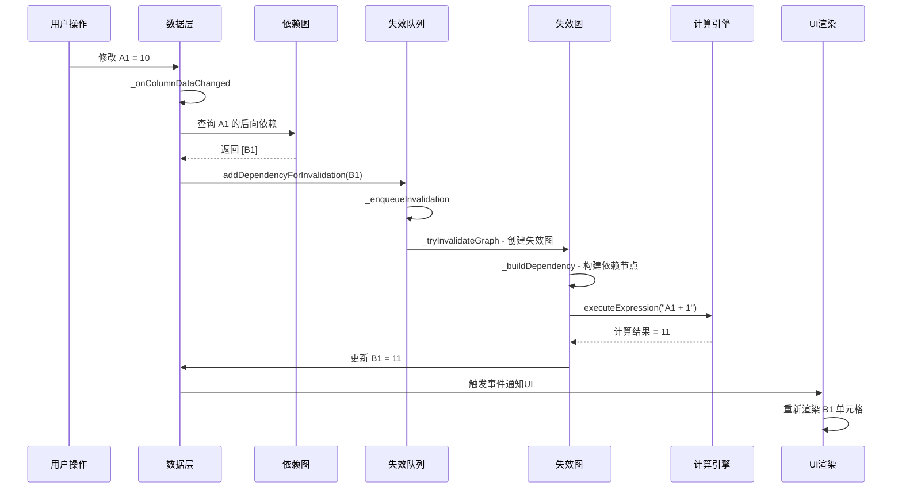

# Coda 公式标脏处理机制

## 概述

公式标脏是 Coda 中用于处理数据变更后自动更新依赖公式的核心机制。当数据发生变化时，系统会自动找出所有依赖该数据的公式，将它们标记为"脏"（需要重新计算），然后按照正确的依赖顺序重新计算这些公式。

---

## 公式标脏处理流程

公式标脏是一个多步骤的流程，主要涉及以下几个关键阶段：

### 1. 数据变更触发

当数据发生变化时（比如修改单元格的值），系统会触发相应的事件：

**文件位置：** `browser.6611b23ea80de0482abc.entry.js`

```javascript
// 列数据变更
_onColumnDataChanged(e, {colId: t}) {
    const n = new i.WA("", this.target.id, t);
    e.addDependencyForInvalidation(m.n.fromReference(n));
}

// 行数据更新
_onRowUpdated(e, {userInitiated: t}) {
    const n = new i.Sw(this.target.id, rowId);
    e.addDependencyForInvalidation(m.n.fromReference(n), {rowId: rowId});
}

// 列依赖失效事件
_onColumnDependentsInvalidated(e, {colId: t, rowIds: n, recursive: o = !1}) {
    if (n) {
        // 特定行的失效
        for (const o of n) {
            const n = new i.Qg("", this.target.id, t, o);
            e.addDependencyForInvalidation(m.n.fromReference(n), {rowId: o});
        }
        o && e.setHasNodesDueToRecursion();
    } else {
        // 整列失效
        const n = new i.WA("", this.target.id, t);
        e.addDependencyForInvalidation(m.n.fromReference(n));
    }
}
```

### 2. 依赖查找

通过**依赖图（DependencyGraph）**查找所有依赖该数据的公式：

```javascript
// 获取后向依赖（谁依赖了这个数据）
getBackDependencies(e, {excludeStrippedIdentifierDependencies: t, excludeDeletedDependencies: n} = {}) {
    const o = m.n.fromReference(e, {stripIdentifier: !0});
    const r = m.n.fromReference(e, {stripIdentifier: !1});
    // 返回依赖该引用的所有对象列表
}

// 遍历依赖关系
forEachDependency(e, t, n, {pruneDeleted: o = !0} = {}) {
    const r = this.backReferences.get(t).get(e);
    if (r) {
        for (const t of Array.from(r.keys())) {
            if (o && this._deletedReferences.has(t)) continue;
            const i = r.get(t);
            // 对每个依赖执行回调
            for (const o of i) n(t, o, e);
        }
    }
}
```

### 3. 标记失效并加入队列

将受影响的公式标记为"脏"状态，并加入失效队列：

```javascript
// 加入失效队列
_enqueueInvalidation(e) {
    this._shouldPrioritizeInInflightGraph(e) ? 
        this._addAsyncCallbackToInflightGraph(e) : 
        (this._queueForInvalidation.push(e), this._tryInvalidateGraph());
}

// 尝试处理失效图
_tryInvalidateGraph(e) {
    if (this.shouldExplicitlyPreventGraphInvalidation) return;
    if (this._queueForInvalidationProcessing || this.isPaused || this._inflightGraph) return;
    // 开始处理失效队列
}
```

### 4. 构建失效图（InvalidationGraph）

创建一个临时的失效图来规划重算的顺序和依赖关系：

```javascript
// 构建依赖关系
_buildDependency({parentNode: e, affectedRef: t, dependencyBackRefData: n, sourceRef: o, invalidationRowId: r}) {
    const i = "row" === n.scope;
    const s = o.objectId === t.objectId || n.context.eventType;
    // 构建具体的依赖节点
}
```

### 5. 按顺序重算公式

根据失效图中的依赖关系，按照正确的顺序重新计算公式：

```javascript
// 执行公式表达式
async executeExpression(e, t, {
    bindFormulaBeforeExecute: n = !1,
    colId: o,
    currentValue: r,
    isAction: i,
    preventUIThreadFallback: s = !0,
    rowId: a,
    rowIds: l,
    variableMap: u
} = {}) {
    if (this._formulaEngine) {
        return this._formulaEngine.executeExpression(e, t, {
            colId: o,
            currentValue: r,
            isAction: i,
            rowId: a,
            rowIds: l,
            variableMap: u
        });
    }
    // 回退到UI线程执行
}
```

### 6. 更新结果并通知UI

计算完成后，更新结果并触发UI重新渲染。触发相关事件通知订阅者：

```javascript
// 失效图完成事件
[a.QCO.InvalidationGraphFinished]: (data) => {
    // 通知UI更新
    this._forceUpdate();
}
```

---

## 核心数据结构

### 依赖图（DependencyGraph）- 静态结构

**用途**: 记录整个文档中所有对象之间的依赖关系
**生命周期**: 持久存在，随着公式绑定/解绑而更新

**数据结构**:

```javascript
class DependencyGraph {
    constructor(resolver) {
        this._resolver = resolver;
        this.forwardReferences = new y.O;  // 前向依赖: A依赖B，记录A→B
        this.backReferences = new Map;     // 后向依赖: A依赖B，记录B←A
        this._deletedReferences = new Set; // 已删除的引用
    }
}
```

**依赖类型**:
- `DATA` - 数据依赖（公式引用单元格值）
- `LIFECYCLE` - 生命周期依赖（对象创建/删除）
- `SCHEMA` - 模式依赖（表结构变化）

**关键方法**:
- `addDataDependency(fromRef, toRef, context)` - 添加数据依赖关系
- `getBackDependencies(reference)` - 获取后向依赖（谁依赖了这个对象）
- `forEachDependency(callback)` - 遍历所有依赖关系

### 失效图（InvalidationGraph）- 动态结构

**用途**: 规划和执行具体的重算任务
**生命周期**: 临时创建，计算完成后销毁

**数据结构**:

```json
{
  "invalidationGraph": {
    "graphSize": 15,
    "nodeIds": [
      "grid-123:column-A:row-1",
      "grid-123:column-B:row-1", 
      "grid-456:formula-sum"
    ],
    "rootNodes": [
      {
        "id": "grid-123:column-A:row-1",
        "type": "CellReference",
        "dependencies": [...],
        "executionTime": 0,
        "state": "pending"
      }
    ],
    "nodeMap": {
      "grid-123:column-A:row-1": {
        "parentNodes": [],
        "childNodes": ["grid-123:column-B:row-1"],
        "state": "pending"
      }
    },
    "deferredNodes": [],
    "hasNodesDueToRecursion": false,
    "totalExecutionTime": 145
  }
}
```

**节点状态**:
- `pending` - 等待计算
- `in_progress` - 正在计算
- `completed` - 计算完成
- `deferred` - 延迟计算（大数据集）

---

## 完整示例流程

假设有公式 `B1 = A1 + 1`，当 A1 的值从 5 改为 10 时：

### 步骤详解



### 执行日志示例

```
1. [数据变更] A1 单元格值更新: 5 → 10
2. [触发事件] _onColumnDataChanged(colId: "column-A")
3. [查找依赖] getBackDependencies(A1) → 找到 B1
4. [加入队列] addDependencyForInvalidation(B1_reference)
5. [处理队列] _tryInvalidateGraph() 开始处理
6. [构建失效图] 创建失效图，graphSize: 1, nodeIds: ["B1"]
7. [执行公式] executeExpression("A1 + 1")
8. [计算完成] B1 新值 = 11, executionTime: 2ms
9. [更新结果] B1 值更新为 11
10. [通知UI] InvalidationGraphFinished 事件触发
11. [UI渲染] 重新渲染 B1 单元格
```

---

## 性能优化机制

### 1. 批量处理

```javascript
// 批量处理失效，避免频繁重算
this._queueForInvalidation.push(e);
// 只有在队列空闲时才开始处理
this._tryInvalidateGraph();
```

多个数据变更会被收集到队列中，然后一次性处理，避免重复计算。

### 2. 优先级处理

```javascript
// 优先处理正在进行的计算图
this._shouldPrioritizeInInflightGraph(e) ? 
    this._addAsyncCallbackToInflightGraph(e) : 
    this._queueForInvalidation.push(e);
```

根据优先级决定计算顺序：
- **视区内的公式** - 最高优先级，立即计算
- **用户交互触发** - 高优先级
- **后台计算** - 低优先级，异步处理

### 3. 递归检测

```javascript
// 检测递归依赖，防止无限循环
o && e.setHasNodesDueToRecursion();
```

如果检测到循环依赖，会标记并采取特殊处理，避免无限计算。

### 4. 延迟节点（Deferred Nodes）

对于大数据集或复杂计算，会被标记为延迟节点，在后台低优先级处理：

```json
{
  "deferredNodes": [
    {
      "id": "canvas-789:block-chart",
      "reason": "LargeDataset",
      "context": {
        "rowCount": 10000,
        "threshold": 5000
      }
    }
  ]
}
```

### 5. 增量更新

只重算真正受影响的公式，而不是重算整个文档：

```javascript
// 只处理受影响的特定行
if (n) {
    // 特定行的失效
    for (const o of n) {
        const n = new i.Qg("", this.target.id, t, o);
        e.addDependencyForInvalidation(m.n.fromReference(n), {rowId: o});
    }
} else {
    // 整列失效
    const n = new i.WA("", this.target.id, t);
    e.addDependencyForInvalidation(m.n.fromReference(n));
}
```

---

## 调试方法

### 1. 浏览器控制台监控

```javascript
// 查看当前失效队列状态
const resolver = window.coda.documentModel.session.resolver;
console.log({
    queueLength: resolver._queueForInvalidation?.length || 0,
    isPaused: resolver.isPaused,
    isCalculating: resolver.isCalculating,
    hasInflightGraph: !!resolver._inflightGraph
});

// 查看依赖图状态
const depGraph = resolver.dependencyGraph;
console.log({
    forwardReferences: depGraph.forwardReferences,
    backReferences: depGraph.backReferences,
    deletedReferences: depGraph._deletedReferences
});
```

### 2. 监听失效图事件

```javascript
// 监听失效图开始事件
resolver.on('InvalidationGraphStarting', (data) => {
    console.log('🔄 失效图开始:', {
        graphSize: data.graphSize,
        nodeIds: data.nodeIds
    });
});

// 监听失效图进度事件
resolver.on('InvalidationGraphProgressed', (data) => {
    console.log('⏳ 失效图进度:', {
        completedNodeIds: data.completedNodeIds,
        totalNodes: data.totalNodes,
        completedNodes: data.completedNodes
    });
});

// 监听失效图完成事件
resolver.on('InvalidationGraphFinished', (data) => {
    console.log('✅ 失效图完成:', {
        totalTime: data.timingGraph.totalTime,
        hasDeferredNodes: data.hasDeferredNodes,
        nodeCount: Object.keys(data.timingGraph.seenNodes).length
    });
});

// 监听列依赖失效事件
resolver.on('ColumnDependentsInvalidated', (data) => {
    console.log('❌ 列依赖失效:', {
        colId: data.colId,
        rowIds: data.rowIds,
        recursive: data.recursive
    });
});
```

### 3. 查询特定对象的依赖关系

```javascript
// 查询某个对象的依赖关系
function analyzeDependencies(objectId, fieldId) {
    const resolver = window.coda.documentModel.session.resolver;
    const reference = {objectId, fieldId};
    
    const backDeps = resolver.dependencyGraph.getBackDependencies(reference);
    
    return {
        reference: `${objectId}:${fieldId}`,
        dependents: backDeps.map(dep => ({
            id: `${dep.objectId}:${dep.fieldId}`,
            type: dep.dependencyType,
            hasIdentifier: !!dep.identifier
        })),
        totalDependents: backDeps.length
    };
}

// 使用示例
const analysis = analyzeDependencies('grid-123', 'column-A');
console.table(analysis.dependents);
```

### 4. 监控失效队列实时状态

```javascript
// 定期检查队列状态
function monitorInvalidationQueue() {
    const resolver = window.coda.documentModel.session.resolver;
    
    setInterval(() => {
        const queueLength = resolver._queueForInvalidation?.length || 0;
        if (queueLength > 0) {
            console.log('📋 失效队列状态:', {
                queueLength: queueLength,
                isPaused: resolver.isPaused,
                isCalculating: resolver.isCalculating,
                hasInflightGraph: !!resolver._inflightGraph
            });
        }
    }, 1000);
}

// 启动监控
monitorInvalidationQueue();
```

### 5. 性能分析

```javascript
// 查看公式相关的性能指标
function getFormulaPerformanceMetrics() {
    const measures = performance.getEntriesByType('measure')
        .filter(e => /Recalc|Formula|Invalidation/.test(e.name));
    
    console.table(measures.map(m => ({
        name: m.name,
        duration: `${m.duration.toFixed(2)}ms`,
        startTime: `${m.startTime.toFixed(2)}ms`
    })));
    
    return measures;
}

// 查看最近的公式计算性能
getFormulaPerformanceMetrics();
```

### 6. 断点调试关键位置

在以下位置设置断点可以深入了解标脏过程：

1. **数据变更检测**: `_onColumnDataChanged`, `_onRowUpdated`
2. **失效队列管理**: `_enqueueInvalidation`, `_tryInvalidateGraph`
3. **依赖查找**: `getBackDependencies`, `forEachDependency`
4. **失效图构建**: `_buildDependency`
5. **公式执行**: `executeExpression`

---

## 依赖图 vs 失效图对比

| 特性 | 依赖图 (DependencyGraph) | 失效图 (InvalidationGraph) |
|------|-------------------------|---------------------------|
| **性质** | 静态数据结构 | 动态计算图 |
| **生命周期** | 持久存在 | 临时创建，计算完成后销毁 |
| **用途** | 记录依赖关系 | 规划和执行重算 |
| **数据内容** | 前向/后向依赖映射 | 节点状态、执行顺序、性能数据 |
| **更新时机** | 公式绑定/解绑时 | 数据变更时 |
| **存储位置** | resolver.dependencyGraph | resolver._inflightGraph |
| **主要操作** | 查询依赖关系 | 执行计算任务 |

**形象比喻**:
- **依赖图**是"地图" - 告诉你整个城市的路网结构
- **失效图**是"导航路线" - 告诉你从A到B具体怎么走

---

## 特殊场景处理

### 1. 循环依赖

当检测到 A→B→C→A 这样的循环依赖时：

```javascript
// 标记有递归节点
e.setHasNodesDueToRecursion();

// 系统会：
// 1. 停止继续扩展依赖链
// 2. 标记为错误状态
// 3. 在UI上显示循环依赖警告
```

### 2. 大规模数据变更

当一次性修改大量数据（如批量导入）时：

```javascript
// 批量添加失效节点
for (const rowId of affectedRowIds) {
    e.addDependencyForInvalidation(reference, {rowId});
}

// 系统会：
// 1. 收集所有变更到队列
// 2. 去重处理（同一个公式只计算一次）
// 3. 按优先级分批处理
// 4. 显示进度条（如果计算时间较长）
```

### 3. 异步计算

对于耗时的计算（如调用外部API）：

```javascript
// 在 Web Worker 中异步执行
this._formulaEngine.executeExpression(formula, context);

// 系统会：
// 1. 在 Worker 线程中执行，不阻塞主线程
// 2. 显示"计算中"的加载状态
// 3. 计算完成后异步更新结果
// 4. 如果超时，显示错误信息
```

### 4. 跨表依赖

当公式引用其他表格的数据时：

```javascript
// 建立跨表依赖链接
this.addDataDependency(
    fromRef,  // 当前表的公式
    toRef,    // 其他表的数据
    {
        dependencyType: o.QN.DATA,
        context: crossTableContext
    }
);

// 当被引用表的数据变更时，会触发所有引用它的公式重算
```

---

## 最佳实践

### 开发建议

1. **避免深层嵌套**: 公式依赖链不要太深，建议不超过 10 层
2. **减少循环依赖**: 设计数据结构时避免循环引用
3. **合理使用缓存**: 对于耗时计算，利用公式引擎的缓存机制
4. **批量操作**: 多个数据变更应该批量提交，而不是逐个提交

### 性能优化建议

1. **限制依赖数量**: 单个数据不要被太多公式依赖（建议 < 100）
2. **异步计算**: 耗时操作使用异步公式或 Pack
3. **延迟计算**: 对于视区外的公式，允许延迟计算
4. **增量更新**: 修改特定行时，只失效相关行的公式，而不是整列

---

## 总结

Coda 的公式标脏机制是一个精心设计的系统，通过以下关键特性实现高效的依赖管理：

1. **精确的依赖追踪**: 通过依赖图准确记录所有依赖关系
2. **智能的失效传播**: 只标记真正受影响的公式
3. **优化的计算调度**: 按优先级和依赖顺序合理安排计算
4. **完善的性能优化**: 批量处理、异步计算、延迟执行等机制
5. **可靠的错误处理**: 循环依赖检测、超时保护、错误恢复

这个机制确保了在大规模文档中，数据变更能够快速、准确地触发相关公式的更新，同时保持良好的用户体验。
